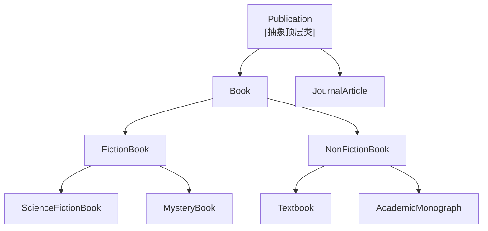
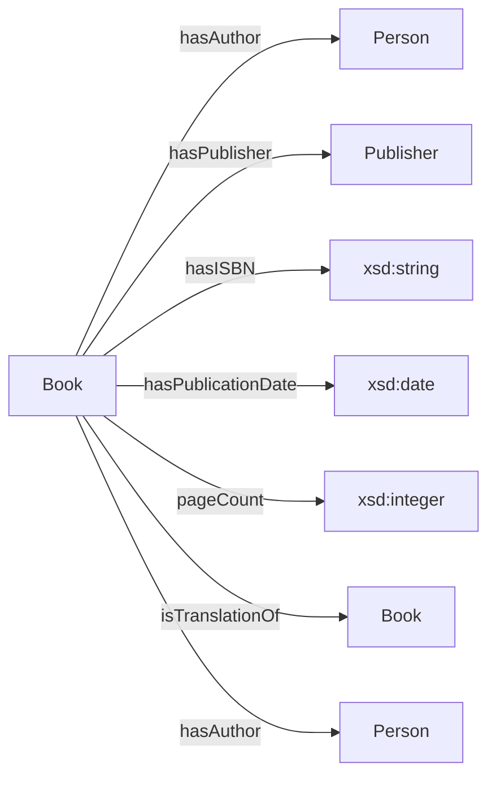

# 16.3 练习：构建图书本体

> **本节要点**：通过从零设计"图书分类与元数据本体（Book Classification & Metadata Ontology）"，整合前五阶段的完整流程。涵盖需求分析 → 概念化 → Protégé 建模 → SPARQL 查询验证 → SHACL 校验的全栈演练。

---

## 1. 场景介绍

我们将为一个**数字图书馆系统**构建一个本体，用来：

1. **分类**图书（小说、教材、学术著作等）
2. **记录**元数据（作者、ISBN、出版日期、出版社）
3. **表达**复杂关系（合著、翻译、系列关联）
4. **支持**推理（某本书是否"可引用"、某作者是否是" prolific author"）

### 1.1 用例列表（Use Cases）

| 用例编号 | 描述 | SPARQL 目标 |
|----------|------|-------------|
| UC01 | 查询指定出版社的所有图书 | `SELECT` by publisher |
| UC02 | 查找合著图书（≥2 作者） | `COUNT(?author) >= 2` |
| UC03 | 判断某本书是否属于"科幻小说"类别 | 推理 + `CLASS` 分类 |
| UC04 | 找出 prolific author（发表 ≥5 本书的学者） | `GROUP BY + HAVING` |
| UC05 | 查找某段时间内出版的图书 | `FILTER` on date range |

---

## 2. Step 1：需求分析（Requirements Analysis）

### 2.1 核心问题清单

在开始建模之前，先定义"**问题列表（Issue-Based Acquisition）**"方法——用问题描述驱动需求：

| 序号 | 问题 | 推导出的概念 |
|------|------|-------------|
| Q1 | "这本书的作者是谁？" | 需要 `:hasAuthor` 属性（对象属性） |
| Q2 | "这本书的 ISBN 是多少？" | 需要 `:hasISBN` 属性（数据属性） |
| Q3 | "这本书是虚构类还是非虚构类？" | 需要 `:FictionBook` 和 `:NonFictionBook` 子类 |
| Q4 | "谁写出了超过 5 本书？" | 需要推理或 SPARQL `COUNT` |
| Q5 | "同一本书可以有几个 ISBN？" | `:hasISBN` cardinality 约束 |
| Q6 | "翻译书如何关联原作？" | 需要 `:isTranslationOf` 属性 |

### 2.2 核心概念清单

基于问题推导：

| 层级 | 概念 | 类别 |
|------|------|------|
| **顶层类** | `Publication` | 抽象父类 |
| | `Book` | 直接子类 |
| | `JournalArticle` | 直接子类（未来扩展） |
| **子类** | `FictionBook` | `:Book` 子类 |
| | `NonFictionBook` | `:Book` 子类 |
| | `ScienceFictionBook` | `:FictionBook` 子类 |
| | `Textbook` | `:NonFictionBook` 子类 |
| **对象属性** | `hasAuthor` | Book → Person |
| | `hasPublisher` | Book → Publisher |
| | `isTranslationOf` | Book → Book |
| **数据属性** | `hasISBN` | Book → xsd:string |
| | `hasPublicationDate` | Book → xsd:date |
| | `pageCount` | Book → xsd:integer |

---

## 3. Step 2：概念化（Conceptualization）

### 3.1 类层次结构图



### 3.2 属性设计图



### 3.3 约束条件

| 实体 | 约束 | 表达形式 |
|------|------|----------|
| `:hasISBN` | 每本书恰好一个 ISBN | `owl:exactCardinality 1` on `xsd:string` |
| `:hasAuthor` | 至少一个作者 | `owl:minCardinality 1` on `:Person` |
| `:hasAuthor` | 作者必须是 `:Person` 类型 | `rdfs:range :Person` |
| `:isTranslationOf` | 一本书不能翻译自己 | `owl:inverseOf` + 不相交公理 |
| `:FictionBook` 与 `:NonFictionBook` | 互不相交 | `owl:disjointWith` |
| `:ScienceFictionBook` | 必须至少有一位作者 | `rdfs:subClassOf :Book min 1 :hasAuthor :Person` |

---

## 4. Step 3：Protégé 建模（Implementation）

### 4.1 本体骨架（OWL 2 Turtle）

```turtle
@prefix :      <http://example.org/book#> .
@prefix owl:    <http://www.w3.org/2002/07/owl#> .
@prefix rdf:    <http://www.w3.org/1999/02/22-rdf-syntax-ns#> .
@prefix rdfs:   <http://www.w3.org/2000/01/rdf-schema#> .
@prefix xsd:    <http://www.w3.org/2001/XMLSchema#> .
@prefix foaf:   <http://xmlns.com/foaf/0.1/> .
@prefix dcterms: <http://purl.org/dc/terms/> .

<http://example.org/book#> a owl:Ontology ;
    dcterms:title "Book Classification & Metadata Ontology"@en ;
    owl:versionInfo "1.0.0" .

# ═══════════════════════════════════════════
# 类层次（Class Hierarchy）
# ═══════════════════════════════════════════

:Publication a owl:Class ;
    rdfs:label "Publication"@en ;
    rdfs:comment "任何已出版的文献作品"@en .

:Book a owl:Class ;
    rdfs:subClassOf :Publication ;
    rdfs:label "Book"@en .

:FictionBook a owl:Class ;
    rdfs:subClassOf :Book ;
    rdfs:label "Fiction Book"@en .

:NonFictionBook a owl:Class ;
    rdfs:subClassOf :Book ;
    rdfs:label "Non-Fiction Book"@en .

# FictionBook 与 NonFictionBook 互不相交
:FictionBook owl:disjointWith :NonFictionBook .

:ScienceFictionBook a owl:Class ;
    rdfs:subClassOf :FictionBook ;
    rdfs:label "Science Fiction Book"@en ;
    rdfs:comment "科幻小说类图书"@en .

:Textbook a owl:Class ;
    rdfs:subClassOf :NonFictionBook ;
    rdfs:label "Textbook"@en .

:AcademicMonograph a owl:Class ;
    rdfs:subClassOf :NonFictionBook ;
    rdfs:label "Academic Monograph"@en .

:Person a owl:Class ;
    rdfs:label "Person"@en ;
    rdfs:comment "作者、编辑等人类个体；复用 FOAF 命名空间"@en .
    rdfs:subClassOf foaf:Person .

:Publisher a owl:Class ;
    rdfs:label "Publisher"@en .

# ═══════════════════════════════════════════
# 对象属性（Object Properties）
# ═══════════════════════════════════════════

:hasAuthor a owl:ObjectProperty ;
    rdfs:label "hasAuthor"@en ;
    rdfs:domain :Book ;
    rdfs:range :Person .

:hasPublisher a owl:ObjectProperty ;
    rdfs:label "hasPublisher"@en ;
    rdfs:domain :Book ;
    rdfs:range :Publisher .

:isTranslationOf a owl:ObjectProperty ;
    rdfs:label "isTranslationOf"@en ;
    rdfs:domain :Book ;
    rdfs:range :Book ;
    rdfs:comment "表示翻译关系——若 B1 isTranslationOf B2，则 B1 是 B2 的译本"@en .

# ═══════════════════════════════════════════
# 数据属性（Data Properties）
# ═══════════════════════════════════════════

:hasISBN a owl:DataProperty ;
    rdfs:label "hasISBN"@en ;
    rdfs:domain :Book ;
    rdfs:range xsd:string ;
    rdfs:comment "国际标准书号。每本书恰好一个 ISBN。"@en .

:hasPublicationDate a owl:DataProperty ;
    rdfs:label "publicationDate"@en ;
    rdfs:domain :Book ;
    rdfs:range xsd:date .

:pageCount a owl:DataProperty ;
    rdfs:label "pageCount"@en ;
    rdfs:domain :Book ;
    rdfs:range xsd:integer .
```

### 4.2 公理约束（Axioms）

```turtle
# ─── Book 至少需要一位作者 ───
:Book rdfs:subClassOf [
    a owl:Restriction ;
    owl:onProperty :hasAuthor ;
    owl:minQualifiedCardinality 1 ;
    owl:onClass :Person
] .

# ─── 每本书恰好一个 ISBN ───
:Book rdfs:subClassOf [
    a owl:Restriction ;
    owl:onProperty :hasISBN ;
    owl:qualifiedCardinality 1 ;
    owl:onDataRange xsd:string
] .

# ─── ScienceFictionBook 必须有至少一位作者（强化约束）──
:ScienceFictionBook rdfs:subClassOf [
    a owl:Restriction ;
    owl:onProperty :hasAuthor ;
    owl:minQualifiedCardularity 1 ;
    owl:onClass :Person
] .
```

### 4.3 示例数据（ABox Instances）

```turtle
# ─── 示例图书数据 ───

:Aurelius a :Book ;
    a :NonFictionBook ;
    rdfs:label "Meditations"@en ;
    :hasAuthor :MarcusAurelius ;
    :hasPublisher :PenguinClassics ;
    :hasISBN "978-0141411685"^^xsd:string ;
    :hasPublicationDate "2006-06-22"^^xsd:date ;
    :pageCount 254^^xsd:integer .

:Dune a :Book ;
    a :ScienceFictionBook ;
    rdfs:label "Dune"@en ;
    :hasAuthor :FrankHerbert ;
    :hasPublisher :ChiltonBooks ;
    :hasISBN "978-0441172719"^^xsd:string ;
    :hasPublicationDate "1965-08-01"^^xsd:date ;
    :pageCount 412^^xsd:integer .

:DuneSon a :Book ;
    a :ScienceFictionBook ;
    rdfs:label "Dune Messiah"@en ;
    :hasAuthor :FrankHerbert ;
    :hasPublisher :ChiltonBooks ;
    :hasISBN "978-0441364002"^^xsd:string ;
    :hasPublicationDate "1969-10-21"^^xsd:date ;
    :pageCount 224^^xsd:integer ;
    :isTranslationOf :Dune .

# ─── 示例合著图书 ───

:CodeComplete a :Book ;
    a :NonFictionBook ;
    a :Textbook ;
    rdfs:label "The Complete Staff"^^en ;
    :hasAuthor :SteveMcConnell ;
    :hasAuthor :PaulCzajkowski ;
    :hasPublisher :Microsoft Press ;
    :hasISBN "978-0735606416"^^xsd:string ;
    :hasPublicationDate "1999-10-28"^^xsd:date ;
    :pageCount 960^^xsd:integer .

# ─── 示例作者 ───

:FrankHerbert a :Person ;
    foaf:name "Frank Herbert" .

:MarcusAurelius a :Person ;
    foaf:name "Marcus Aurelius" .

:SteveMcConnell a :Person ;
    foaf:name "Steve McConnell" .
```

### 4.4 Protégé 界面操作导航

在 Protégé GUI 中操作的路径：

```
Protégé Editor
├── Class:
│   ├── 在 "All Individuals" 下点击 "+" 创建新概念
│   ├── 在 Class Expression Editor 中输入子类公理
│   └── 使用 "Equivalent To", "Disjoint With" 编辑器
├── Object Properties:
│   ├── 定义 property chain（如果需要）
│   └── 设置 domain 和 range
├── Data Properties:
│   ├── 设置 datatype range
│   └── 添加 value constraint
└── Individuals:
    ├── 为每个类创建实例
    ├── 为个体赋值属性
    └── 设置个体类别（a :Class）
```

---

## 5. Step 4：SPARQL 查询验证

### 5.1 UC01：查询指定出版社的所有图书

```sparql
PREFIX : <http://example.org/book#>
PREFIX foaf: <http://xmlns.com/foaf/0.1/>

# 查找 "ChiltonBooks" 出版社的所有图书
SELECT ?book ?bookTitle ?title
WHERE {
    ?book a :Book ;
          :hasPublisher :ChiltonBooks ;
          rdfs:label ?label ;
          foaf:name ?title .
}
ORDER BY ?title
```

### 5.2 UC02：查找合著图书（≥2 作者）

```sparql
PREFIX : <http://example.org/book#>
PREFIX foaf: <http://xmlns.com/foaf/0.1/>

# 查找所有拥有 2 位或以上作者的图书
SELECT ?book ?bookTitle (COUNT(?author) AS ?authorCount)
WHERE {
    ?book a :Book ;
          rdfs:label ?label ;
          :hasAuthor ?author .
    BIND(CONCAT(UCASE(SUBSTR(str(?label), LAST_INDEX_OF(str(?label), "/") + 1)), AS ?bookTitle) .
}
GROUP BY ?book ?bookTitle
HAVING (COUNT(?author) >= 2)
ORDER BY DESC(?authorCount)
```

### 5.3 UC04：找出 prolific author（发表 ≥5 本书）

```sparql
PREFIX : <http://example.org/book#>
PREFIX foaf: <http://xmlns.com/foaf/0.1/>

# Prolific Author: ≥5 books
SELECT ?authorName (COUNT(?book) AS ?bookCount)
WHERE {
    ?book a :Book ;
          :hasAuthor ?author .
    ?author foaf:name ?authorName .
}
GROUP BY ?authorName
HAVING (COUNT(?book) >= 5)
ORDER BY DESC(?bookCount)
```

### 5.4 UC05：查找某段时间内出版的图书

```sparql
PREFIX : <http://example.org/book#>
PREFIX xsd: <http://www.w3.org/2001/XMLSchema#>

# 查找 1960 年到 1970 年间出版的图书
SELECT ?book ?title ?date
WHERE {
    ?book a :Book ;
          rdfs:label ?label ;
          :hasPublicationDate ?date .
    FILTER(?date >= "1960-01-01"^^xsd:date && ?date <= "1970-12-31"^^xsd:date)
}
ORDER BY ?date
```

---

## 6. Step 5：SHACL 校验

### 6.1 验证形状定义

为 Books 定义 SHACL 形状，确保 ABox 数据符合约束：

```turtle
@prefix :      <http://example.org/book#> .
@prefix sh:    <http://www.w3.org/ns/shacl#> .
@prefix xsd:   <http://www.w3.org/2001/XMLSchema#> .
@prefix rdf:   <http://www.w3.org/1999/02/22-rdf-syntax-ns#> .

# 图书的 SHACL 形状——验证所有约束
:BookShape
    a sh:NodeShape ;
    sh:targetClass :Book ;
    sh:property [
        sh:path :hasAuthor ;
        sh:minCount 1 ;           # 至少一位作者
        sh:maxCount 30 ;          # 最多 30 位作者
        sh:class :Person ;        # 作者必须是 Person 类型
    ] ;
    sh:property [
        sh:path :hasISBN ;
        sh:minCount 1 ;           # 必须有 ISBN
        sh:maxCount 1 ;           # 只能有一个 ISBN
        sh:datatype xsd:string ;
        sh:pattern "^[0-9-]{10}$|^[0-9-]{13}$" ; # ISBN 格式
    ] ;
    sh:property [
        sh:path :hasPublisher ;
        sh:minCount 1 ;           # 必须有出版社
        sh:maxCount 1 ;
        sh:class :Publisher ;
    ] ;
    sh:property [
        sh:path :hasPublicationDate ;
        sh:datatype xsd:date ;
    ] .

:PersonShape
    a sh:NodeShape ;
    sh:targetClass :Person ;
    sh:property [
        sh:path foaf:name ;
        sh:minCount 1 ;
        sh:datatype xsd:string ;
    ] .
```

### 6.2 校验结果解释

运行 SHACL 校验后，输出 `rdf:ValidationReport`：

```turtle
# 校验通过的报告示例
[]
    a sh:ValidationReport ;
    sh:conforms "true^^xsd:boolean ;
    sh:result [
        a sh: ValidationResult ;
        sh:severity sh:Violation ;
        sh:focusNode :SomeBook ;
        sh:sourceResult [
            sh:sourceShape :BookShape ;
            sh:resultMessage "每本书必须有恰好一个 ISBN"@zh .
        ]
    ] .
```

> **关键原则**：每个 SHACL **违反项（Violation）都是一个具体的修改指示器——不是"格式错误"而是"领域规则"。

---

## 7. 交付物清单总览

| 阶段 | 交付物 | 文件 |
|------|--------|------|
| 1. 需求分析 | 问题列表 + 用例集 | `use-cases.md` |
| 2. 概念化 | 类层次图 + 属性图 | 本节 Mermaid 图 |
| 3. 实现 | `.owl` 本体 + 实例 | `book-ontology.ttl` |
| 4. 验证 | SPARQL 查询脚本 | `queries/*.sparql` |
| 5. 验证 | SHACL 校验 + 报告 | `shacl/book-shapes.ttl` |
| 全阶段 | Git commit + PR | CI pipeline 通过 |

---

## 8. 进阶挑战

完成基本本体后，可以尝试：

1. **添加 `owl:sameAs` 关联**：将本体的作者与 DBPedia / Wikidata 中的对应条目连接
2. **添加 `owl:InverseFunctionalProperty`**：让 ISBN 具有反功能约束（相同 ISBN → 同一图书）
3. **添加推理测试**：验证 `ScienceFictionBook` 的实例能否被推理机正确分类
4. **添加属性链公理**：`isTranslationOf o isTranslationOf rdfs:subPropertyOf :hasRelatedWork`
5. **部署**：将本体加载到 Apache Jena Fuseki，发布 SPARQL Endpoint

---

## 9. 延伸阅读

- Noy, N.F. & McGuinness, D.L. (2001). "Ontology Development 101." Stanford KSL.
- Studer, T., Benjamins, V.R., Fensel, D. (1998). "Knowledge Engineering: Principles and Methods." Data & Knowledge Engineering.
- Gruber, T.R. (1993). "A Translation Approach to Portable Ontology Specifications." Knowledge Acquisition.
- SPARQL 1.1 Query Language (W3C Recommendation): <https://www.w3.org/TR/sparql11-query/>