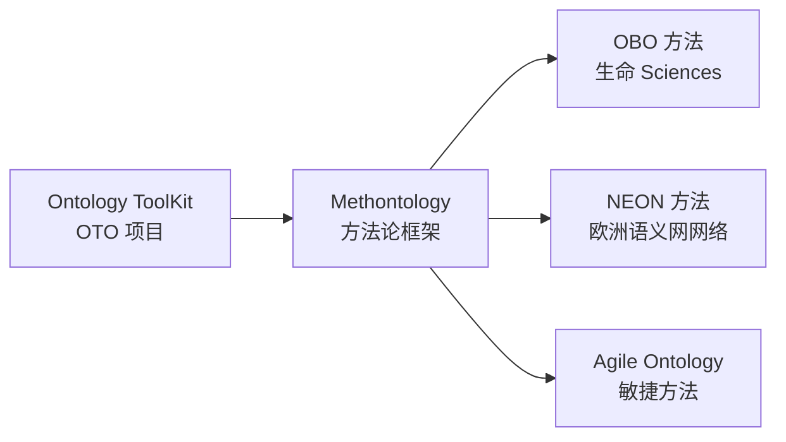
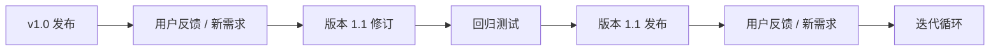

# 17.1 Methontology 方法论

> **本节要点**：Methontology（方法学本体论，Methodology for Ontology Development）是最具影响力的本体开发方法论之一，由 Marcos Raia Fernandez 等人在 1990 年代末提出。该方法论采用 **瀑布模型与迭代验证相结合** 的方式，将整个开发过程划分为七个阶段，每个阶段都有明确的输入和输出。**掌握 Methontology，就掌握了本体工程化的标准范式。**

---

## 1. Methontology 框架背景与发展

### 1.1 起源与理论根基

Methontology（中文："方法学本体论"或"本体开发方法论"）是在 **Ontoin 工程本体库（Ontology ToolKit，OTO）项目** 过程中发展而来。OTO 项目由西班牙阿尔卡拉大学（Universidad de Alcalá）的知识工程实验室主持，旨在为知识工程社区提供一套完整的本体开发生态系统。

在研究了大量本体开发实践后，研究人员发现 **缺乏系统化的方法论指导** 导致许多本体项目在开发后期出现逻辑矛盾、可扩展性差、无法维护等问题。基于此，Fernandez 等人在 1997 年发表了经典论文 *An ontological methodology for building semantic interoperability repositories*（《面向构建语义互操作性存储库的本体方法论》），首次系统性地提出了 Methontology 框架。



> **关键概念澄清**：
> - **Methodology（方法论）** ≠ **Ontology（本体论）**
> - **Methodology** = 开发本体的"方法论"或"方法论体系"—— 如何建一个本体
> - **Ontology** = 知识的形式化表征—— 本体所表达的内容本身。
> - 虽然名字里都有"Onto-"前缀，但 Methontology 的 focus 是 "How to build ontology（如何构成本体工程化方法）"，而 ontology 本身是 "What we build（我们构建出来的东西）"。

### 1.2 核心设计理念

Methontology 的设计理念植根于知识工程（Knowledge Engineering）和软件工程的交叉领域：

| 设计理念 | 具体内涵 |
|----------|----------|
| **阶段性（Phased Approach）** | 将整个开发生命周期划分七阶段，逐阶段递进，每阶段有明确的输入输出文档 |
| **可迭代（Iterative Feedback）** | 任何阶段发现问题均可回溯到先前的任意阶段，允许迭代修正 |
| **文档驱动（Documentation-Driven）** | 每一阶段都必须产出文档——术语表、设计决策、需求规格等，确保项目可审计、可追溯 |
| **质量导向（Quality-Focused）** | 专门的评估阶段通过 6 大维度来检验本体质量：完整性（Completeness）、一致性（Consistency）、可扩展性（Extensibility）等 |
| **复用优先（Reusability-First）** | 集成阶段强制要求先检查已有本体，而非从零构建 |

---

## 2. Methology 七个核心阶段详解

以下展示 Methontology 整体流程：

```mermaid
flowchart TB
    S1["阶段 1: 规格说明<br/>Specification"] --> S2["阶段 2: 概念化<br/>Conceptualization"]
    S2 --> S3["阶段 3: 形式化<br/>Formalization"]
    S3 --> S4["阶段 4: 集成<br/>Integration"]
    S4 --> S5["阶段 5: 实施<br/>Implementation"]
    S5 --> S6["阶段 6: 评估<br/>Evaluation"]
    S6 --> S7["阶段 7: 维护<br/>Maintenance"]
    S6 -. "反馈循环\nFeedback Loop" -. S1
    S7 -. "持续更新" -. S2
```

### 2.1 阶段一：规格说明（Specification）

**规格说明（Specification）** 是最关键也最常被忽视的阶段。很多开发者在此跳过调研直接开始建模，导致后期返工。

**目标**：明确本体的范围和用途，界定**本要解决什么问题、为谁解决。

**输入**：
- 项目提案（Project Proposal）
- 干系人（Stakeholders）访谈纪要

**核心活动**：

| 活动 | 描述 | 产出 |
|------|------|------|
| 范围界定 | 明确本体覆盖领域的边界 | 范围声明（Scope Statement） |
| 知识来源识别 | 确定领域信息来源（文献、数据库、专家） | 信息来源列表（Sources List） |
| 需求分析 | 定义本体的功能性和非功能性需求 | 需求文档（Requirements Document） |

**规格说明书模板**：

```markdown
## Specification Document
- **本体名称**：
- **版本**：
- **领域描述**：（1-2 段落描述）
- **目标用户**：（列出主要用户角色）
- **核心用途**：（数据集成? 推理? 知识管理?）
- **假设前提**：建模时做出的前提设定
- **术语标准**：优先采用的外部标准术语（如 LOV，vocab.ontoworld.org）
```

### 2.2 阶段二：概念化（Conceptualization）

**概念化** 是 Methonology 方法论中**最核心的阶段**——它将人类对领域的理解抽象为一个概念模型。这一阶段完全 **不考虑** 任何特定语言（如 OWL、RDF），而是用自然语言和图表（如 UML 类图、思维导图、知识图谱草图）来描述领域知识。

> **关键区别**：
> - 概念化 = "我们在理解什么"
> - 形式化 = "如何用语言 X 来表达这种理解"

**输入**：规格说明书、用户需求文档

**核心活动**：

| 活动 | 描述 | 产出 |
|------|------|------|
| 领域专家访谈 | 与 SME（Subject Matter Experts, Subject-Matter Experts, SME）访谈 | 访谈纪要 |
| 概念提取 | 从领域文献提取核心概念 | 领域概念列表 |
| 关系识别 | 识别概念之间的关系（IS-A、part-of、has-part 等） | 语义关系清单 |
| 术语规范化 | 为每个概念给出自然语言定义 | 领域术语表（Domain Glossary） |
| 概念分类 | 按层级归类概念 | 概念层次草图 |

**概念模型示例（自然语言描述）**：

```markdown
### 医学影像本体 - 概念模型
- 顶层类：医疗实体（Medical Entity）
  - 患者（Patient）：接受医疗服务的个体
  - 检查（Exam）：医生执行的诊断流程
  - 影像（Imaging）：通过医疗仪器捕获的数据

关系：
- Patient has_exam Exam (一对多)
- Exam produces Imaging (一对多)
- Imaging has_modality Modalities (如 CT, MRI, X-ray)
```

### 2.3 阶段三：形式化（Formalization）

**形式化（Formalization）** 是将概念模型映射到一个 **形式化的知识表示语言**——如描述逻辑（Description Logic）——中的阶段。

**输入**：概念化阶段的输出文档（领域概念列表、概念层次图）
**目标**：选择最适合的语言、确定逻辑约束。

**核心活动**：

| 活动 | 描述 | 产出 |
|------|------|------|
| 语言选择 | 选择合适 OWL 版本（OWL2-Lite/EL/ Full）、RDF(RDF/XML/TTL) | 语言选型文档 |
| 类映射 | 将概念列表和描述语言类（owl:Class） | 类草图 |
| 属性映射 | 用对象属性（Object Property）和数据属性（Data Property 表达关系 | 属性映射文档 |
| 公理设计 | 添加约束（DisjointUnion、 cardinality、domain/range） | 公理列表 |

**设计决策记录示例**：

| 决策点 | 选项 A | 选项 B | 选择 | 理由 |
|--------|--------|--------|------|------|
| "患者"类是否 disjoint with "医生"？ | 显式声明 owl:disjointWith | 不声明 | 显式声明 | 防止同一个体既是患者又是医生 |
| "检查"的数量约束 | 每个患者至少有一个 check  | 不设约束 | 不设约束 | 实际临床中患者可能无任何检查 |
| 影像数据属性表示 | 用字符串表示影像 ID | 用 URI 表示 | URI | 支持链接数据（Linked Data） |

### 2.4 阶段四：集成（Integration）

**集成（Integration）** 是最容易被忽视的关键阶段——它要求建模者在正式构建之前，**先检查现有本体**，看是否有可复用的部分。Methontology 强烈提倡 **避免 Not Invented Here（NIH，"非我发明"）** 综合征陷阱。

**核心活动**：

| 活动 | 描述 | 产出 |
|------|------|------|
| 本体搜索 | 在 ProtBench, OBO Foundry, LoV 等查找现有本体 | 本体搜索结果报告 |
| 术语复用性分析 | 评估现有本体术语与当前需求的契合度 | 复用语用分析 |
| 导入决策 | 确定哪些外部本体应被 `owl:import` | 导入决策矩阵 |
| 对齐设计 | 设计与已有本体的映射/对齐（owl:equivalentClass 等） | 映射文档 |

> ⚠️ **常见错误**：直接从头开始建模"Medical Procedure"、"Drug"、"Disease"等已有现成本体（如 SNOMED CT, MedDRA, RxNorm）涵盖的概念，导致重复工作和术语不一致。

### 2.5 阶段五：实施（Implementation）

**实施（Implementation）** 是将前面的设计决策转化为正式的 **本体源文件**（`ontology.owl`）。这一阶段直接使用 Protégé 等工具。

**输入**：
- 形式化阶段的概念模型和公理列表
- 集成的导入决策

**核心活动**：

| 活动 | 描述 | 产出 |
|------|------|------|
| 本体框架搭建 | 命名空间定义（Namespace）、导入外部本体 | 骨架本体文件 |
| 类层次构建 | 逐层构建类树（Class Hierarchy） | `classes.ttl` |
| 属性建模 | 定义对象属性与数据属性，并标注其特征（对称、传递等） | `properties.ttl` |
| 公理编码 | 编码约束、基数限制、类表达式 | `axioms.ttl` |
| 实例建模 | 添加具体实例（owl:NamedIndividual）数据 | `instances.ttl` |
| 多格式导出 | 导出 Turtle、JSON-LD、RDF/XML | `ontology.ttl`, `ontology.jsonld` |

### 2.6 阶段六：评估（Evaluation）

**评估（Evaluation）** 阶段对最终本体的质量和合理性进行全面检查。Methonology 提出了一套系统化的评估框架，包含 **六个质量维度：

| 质量维度 | 描述 | 验证方式 |
|----------|------|----------|
| 完整性（Completeness） | 是否覆盖了规格说明中的需求？是否有漏掉的核心类或属性？ | 需求覆盖矩阵 |
| 一致性（Consistency） | 本体逻辑是否一致？无矛盾？ | 使用 Pellet、HermiT 推理器自动检测 |
| 可扩展性（Extensibility） | 新增需求或类是否会引发大规模重构？ | 扩展场景模拟 |
| 正确推理（Correct Encoding） | 编码与设计意图是否一致？ | 推理测试用例 |
| 清晰度（Clarity） | 术语是否清晰定义？用户能否理解本体含义？ | 用户验收测试 |
| 最小化（Minimality） | 是否有不必要的复杂结构？是否存在可简化的地方？ | 代码审查（Peer Review） |

**本体检查单（Methonolgy Evaluation Checklist）**：

```markdown
## 本体评估检查单
### 完整性检查
- [ ] 所有需求条目都有对应的本体元素
- [ ] 每个概念都有定义（rdfs:comment）
- [ ] 顶层类层级覆盖完整

### 一致性检查
- [ ] 无 Top Class 是不自相矛盾（Inconsistent）
- [ ] 无 owl:thing 类的隐式推理
- [ ] 推理器输出：0 个矛盾

### 可推理检查
- [ ] 属性特征正确设置（owl:TransitiveProperty 等）
- [ ] 基数约束符合语义
- [ ] Disjoint 声明正确

### 用户体验检查
- [ ] 中文标签（rdfs:label）
- [ ] 文档链接或使用说明
- [ ] 遵循外部词汇表 (如 FOAF, Schema.org)
```

### 2.7 阶段七：维护（Maintenance）

本体不是一次性的作品——它是一个 **活文档（Living Document）需要随着时间的推移不断迭代和进化。



**核心活动**：
- **变更管理**：使用 SemVer（语义化版本控制如 v1.0.0 → v1.1.0 → v2.0.0）
- **版本控制**：Git + `.owl` 文件的 diff 管理（建议使用 `.ttl` 格式以获得可读的 diff 输出
- **长期维护策略**：归档旧版本（OBO Foundry 存档策略）
- **发布**：提交到 BioPortal、LOV、DataL 等本体仓库
---
## 3. 核心交付物一览

每个阶段都必须有对应的输出文档（Deliverables），这些共同构成了本体的全生命周期资产管理。

| 阶段 | 核心交付物 | 格式 | 维护者 |
|------|-----------|------|--------|
| 规格说明 | Scope Statement、Requirements Doc | `.md`, `.docx` | PM |
| 概念化 | 领域术语表（Domain Glossary）、概念层次图 | `.md`, `.png` | 建模者 |
| 形式化 | 设计决策日志、类草图 | `.xlsx`, `.pdf` | 建模者 |
| 集成 | 复用分析报告、本体映射矩阵 | `.md` | 建模者 |
| 实施 | 本体源文件（`.owl`/`.ttl`）、导出文件（`.jsonld`） | `.owl`, `.ttl`, `.jsonld` | 建模者 |
| 评估 | 评估报告、一致性检测结果 | `.md`, `.json` (reasoner output) | QA Team |
| 维护 | 变更日志、Release 说明 | `CHANGELOG.md` | DevOps |

### 总结

- Methonology 是一种 **七阶段、迭代、文档驱动** 本体开发方法论
- 七个阶段环环相扣：规格说明 → 概念化 → 形式化 → 集成 → 实施 → 评估 → 维护
- 核心交付物涵盖规格说明书 → 设计决策、 → 本体源码、 → 评估报告、 → 维护文档
- **最佳实践**：即使是小型本体项目，至少完成"规格说明 → 概念化 → 实施 → 评估"四个核心阶段，即可确保 80% 以上的工程质量。