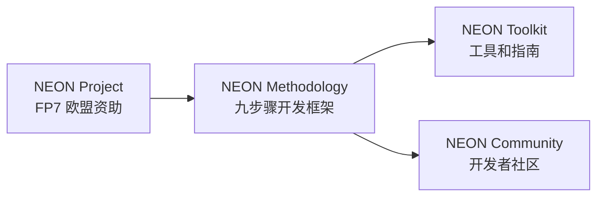

# 17.2 NEON 方法论

> **本节要点**：NEON（Networked European Ontology Network，欧洲本体网络）方法论是专为欧盟语义网（Semantic Web）项目而开发的系统性本体开发框架。它将本体开发划分为 **九步骤流程**，从需求分析到治理部署形成了完整闭环，特别适合 **大型企业级知识图谱和跨语言/跨域本体**。掌握 NEON 方法论，就能理解欧盟框架下本体的工程化标准。

---

## 1. NEON 框架概述

### 1.1 背景与目标

**NEON** 全称 **Networked European Ontology Network**，是一个由欧盟第七框架计划（FP7）资助的项目，旨在建立一个欧洲范围内的本体开发协作网络和社区。NEON 方法论（NEON Methodology）的核心目标是：

1. **标准化本体开发生命周期**：为欧盟各类项目提供统一的本体开发和评估标准。
2. **支持多语言与跨域复用**：在 SKOS/XHTML 格式下支持多语言标签。
3. **提供工具和社区支持**：NEON 不仅是一套方法论，还包括本体开发工具链（NEON Toolkit）和开发者社区。



### 1.2 核心设计理念

NEON 方法论融合了 Methontology 阶段化和 Agile 迭代的核心理念，特别强调 **治理（Governance）** 和 **部署（Deployment）阶段**：

| 设计理念 | 具体内涵 |
|----------|----------|
| **需求驱动（Requirements-Driven）** | 每个设计决策都追溯到用户需求，使用需求矩阵来确保覆盖 |
| **分离三层架构（Three-Layer Architecture）** | 严格区分概念设计（Conceptual）、逻辑设计（Logical）和物理设计（Physical），这与 Peter 的"概念-逻辑-物理"知识建模方法一致 |
| **治理先行（Governance-First）** | 将本体治理（版本、变更审批、发布流程）作为独立阶段，而非附加品 |
| **工具友好（Tool-Friendly）** | 每个步骤都有对应的工具支持指南（推荐使用 Protégé, VocabTool, ODK 等） |

---

## 2. NEON 九步骤开发流程详解

NEON 方法论将本体开发生命周期划分为以下 **九个步骤**：

```mermaid
flowchart TB
    S1["Step 1: 需求分析<br/>Requirements Analysis"] --> S2["Step 2: 概念设计<br/>Conceptual Design"]
    S2 --> S3["Step 3: 逻辑设计<br/>Logical Design"]
    S3 --> S4["Step 4: 物理设计<br/>Physical Design"]
    S4 --> S5["Step 5: 评估<br/>Evaluation"]
    S5 --> S6["Step 6: 发布<br/>Publication"]
    S6 --> S7["Step 7: 维护<br/>Maintenance"]
    S7 --> S8["Step 8: 治理<br/>Governance"]
    S8 --> S9["Step 9: 部署<br/>Deployment"]
    S5 -. "反馈" -. S1
    S7 -. "迭代" -. S2
```

### 2.1 Step 1：需求分析（Requirements Analysis）

**需求分析（Requirements Analysis）** 是 NEON 方法论的起点，它要求在本体设计开始之前，以结构化方式收集和分析利益相关者的需求。

**核心活动**：

| 活动 | 描述 | 产出 |
|------|------|------|
| 干系人映射 | 识别并列出所有相关方（领域专家、数据工程师、最终用户） | 干系人列表（Stakeholder Map） |
| 用例分析（Use Case Analysis） | 定义本体将用于的五个核心应用场景（如数据集成、语义搜索、问答系统等） | 用例文档 |
| 信息需求提取 | 从用例中提取本体的关键查询需求 | 查询需求集（Query Requirements） |
| 枚举（Instance Enumeration） | 列出本体中预期的示例个体 | 示例清单（Instance List） |
| 继承表定义（Inheritance List） | 列出本体中预期的类层级结构 | 类层级草图 |

**需求文档结构模板**：

```markdown
# 本体需求文档模板
## 1. 本体范围
- 领域：
- 目标用户：
- 应用场景：

## 2. 用例（Use Cases）
### UC-01: xxx
- 描述：
- 输入：
- 输出：

## 3. 查询需求（Query Requirements）
- UR-01: "查询所有 XX 的 YY" → 需要哪些类/属性？
- UR-02: ...

## 4. 实例枚举（Instance Enumeration）
- 需要表示的具体个体列表
```

> **为什么 NEON 将需求分析独立为一整步？** Methonology 虽然也强调规格说明，但 NEON 认为 **用例驱动的查询需求提取** 是确保本体"有用而非仅形式上正确"的关键——它强制建模者在编码之前，先想清楚"这个本体要能回答哪些问题"。

### 2.2 Step 2：概念设计（Conceptual Design）

**概念设计** 阶段与 Methonology 的"概念化"类似——它用 **自然语言和简单图表** 来表达领域知识，不涉及任何特定形式化语言的语法。

**核心活动**：

| 活动 | 描述 | 产出 |
|------|------|------|
| 领域概念提取 | 从文献、数据源、专家提取关键概念 | 概念列表 |
| 概念关系识别 | 识别类之间的关系（IS-A、part-of、has-property 等） | 关系矩阵 |
| 层级结构设计 | 设计类层级结构（Class Hierarchy 树状结构） | 概念草图 |
| 属性设计 | 设计对象属性和数据属性的使用场景 | 属性草案 |

> **NEON 特色**：此阶段鼓励使用 **可视化建模工具**（如 UML Class Diagram 或简单绘图工具）来与领域专家沟通——因为领域专家通常不懂 OWL 语法。

### 2.3 Step 3：逻辑设计（Logical Design）

**逻辑设计（Logical Design）** 是 NEON 方法论的 **核心创新点**——它明确地将概念模型映射到 **OWL 2 DL 的描述逻辑** 表达中，并在此阶段设计类的公理（Axioms）关系。

**核心活动**：

| 活动 | 描述 | OWL 2 映射示例 |
|------|------|-----------------|
| 类映射 | 概念 → `owl:Class` | `MedicalCondition` |
| 对象属性映射 | 概念间关系 → `owl:ObjectProperty` | `hasSymptom` |
| 数据属性映射 | 属性值 → `owl:DatatypeProperty` | `hasSeverity` → `xsd:integer` |
| 类公理设计 | 等价、不相交、限制 → `owl:equivalentTo`, `owl:disjointWith`, `owl:allValuesFrom` | `Cancer ≡ Disease ⊓ hasType.Oncological` |
| 属性公理设计 | 传递性、对称性、逆属性等 → `owl:TransitiveProperty`, `owl:inverseOf` | `hasPart ⊑ PartOf⁻` |
| 公理一致性检查 | 使用推理器（Pellet, HermiT）在逻辑层验证 | 推理输出 |

**OWL 逻辑设计示例片段**：

```turtle
# 逻辑设计层 ——定义类和属性的语义约束
@prefix onto: <http://example.org/medical#> .
@prefix owl: <http://www.w3.org/2002/07/owl#> .
@prefix rdf: <http://www.w3.org/1999/02/22-rdf-syntax-ns#> .
@prefix rdfs: <http://www.w3.org/2000/01/rdf-schema#> .
@prefix xsd: <http://www.w3.org/2001/XMLSchema#> .

## 类设计
onto:Cancer a owl:Class ;
    rdfs:label "Cancer"@en ;
    rdfs:subClassOf onto:Disease ;
    rdfs:comment "A class of diseases characterized by uncontrolled cell division."@en .

onto:hasSymptom a owl:ObjectProperty ;
    rdfs:label "hasSymptom"@en ;
    rdfs:domain onto:MedicalCondition ;
    rdfs:range onto:Symptom .

onto:hasSeverity a owl:DatatypeProperty ;
    rdfs:label "hasSeverity"@en ;
    rdfs:domain onto:Symptom ;
    rdfs:range xsd:integer ;
    owl:qualifiedCardinality "3"^^xsd:nonNegativeInteger .
```

### 2.4 Step 4：物理设计（Physical Design）

**物理设计（Physical Design）** 将逻辑层的设计映射到具体的 **序列化格式** 和 **存储方案**——即"本体如何以文件形式存在、如何在系统中被加载"。

**核心活动**：

| 活动 | 描述 | 产出 |
|------|------|------|
| 序列化选择 | 选择 RDF 序列化格式（TTL、RDF/XML、JSON-LD 等） | 格式选型文档 |
| 命名空间设计 | 设计本体 URIs 和命名空间 | `@prefix onto: <http://purl.org/onto/medical#> .` |
| 模块化拆分 | 如本体过大，设计模块分割（OWLAN Modules） | 模块定义文档 |
| 存储方案选择 | 决定本体存储在 Triplestore 还是 File System | 存储架构设计 |
| SHACL 校验设计 | 为本体数据添加 SHACL Shapes 进行校验 | `shapes.ttl` |

> **关键原则**：NEON 推荐在生产和交换中使用 **Turtle（`.ttl`）** 格式——因为它对人类可读性强，且 git diff 易于审查。

### 2.5 Step 5：评估（Evaluation）

NEON 的评估阶段与 Methonology 的六维度类似，但增加 **基于用例的评估**（Case-Based Evaluation）——即通过实际用例来检验本体是否满足需求。

**评估维度**：

| 维度 | NEON 评估方法 |
|------|--------------|
| 需求覆盖（Requirements Coverage） | 用 **需求追踪矩阵** 检查每个需求是否有对应的本体元素 |
| 逻辑一致性（Logical Consistency） | 推理器检测矛盾（Pellet / HermiT / Fact++） |
| 查询满足度（Query Satisfaction） | 运行 Step 1 中定义的查询用例 |
| 用户满意度（User Satisfaction） | 领域专家评审术语和定义 |
| 复 usability（Reusability） | 是否依赖最小、是否遵循外部标准 |
| 文档完整性（Documentation Completeness） | rdfs:comment 覆盖率是否 ≥ 80% |

### 2.6 Step 6：发布（Publication）

**发布** 阶段将本体部署到公共或内部的 **本体仓库 /知识网格平台** 供外部消费。

**核心活动**：

| 活动 | 描述 | 平台示例 |
|------|------|----------|
| 元数据标注 | 添加 DCMI Terms 元数据（title, creator, license, versionInfo 等） | — |
| 格式转换 | 确保本体以多格式发布（OWL/XML, TTL, JSON-LD） | — |
| 仓库注册 | 注册到本体验门户 | OBO Foundry, BioPortal, LoV, DataPortal |
| DOI 获取 | 为本体版本获取 DOI 以引用 | Zenodo, DataCite |

### 2.7 Step 7：维护（Maintenance）

本体发布后，需要 **持续维护**。NEON 方法论要求维护包括版本控制、缺陷修复和依赖跟踪。

**核心活动**：

| 活动 | 描述 |
|------|------|
| 版本管理 | 使用 SemVer（语义化版本控制如 `v1.0.0` → `v1.1.0` → `v2.0.0`） |
| 变更日志 | 使用 CHANGELOG.md 或 OWL 的 `dcterms:modified` 属性跟踪 |
| 依赖更新 | 跟踪被导入外部本体（如 FOAF, Schema.org）的版本变化并评估是否需要同步 |

### 2.8 Step 8：治理（Governance）

**治理（Governance）** 是 NEON 方法论中 **最具特色的阶段**。它明确将本体治理——包括决策、审批流程和发布标准——作为独立步骤处理。

**治理核心要素**：

| 要素 | 说明 |
|------|------|
| 治理委员会（Governance Board） | 由领域专家、数据工程师、方法专家组成的决策团队 |
| 变更审批流程（Change Approval Process） | 定义何种变更需要全组投票，何种可由单建模者执行 |
| 贡献指南（Contribution Guide） | 规范外部贡献者的提交方式（Issue Template、PR Template） |
| 行为准则（Code of Conduct） | 社区协作规范 |

> **为什么 NEON 将治理独立为一步？** 在企业级或开放社区场景中，本体的变更可能影响多个下游系统。缺乏治理框架会导致 **术语漂移（Term Drift）**——即同一概念在不同版本中有不同含义，严重破坏知识一致性。

### 2.9 Step 9：部署（Deployment）

**部署** 是本体的"最后一公里"——它将本体集成到 **生产系统** 中，如知识图谱后端、搜索引擎索引、或应用 API。

**核心活动**：

| 活动 | 描述 | 技术栈 |
|------|------|--------|
| 本体加载 | 在应用代码或框架中加载本体文件 | Apache Jena, RDFLib, Owlready2 |
| 推理集成 | 将本体与推理引擎集成以实现智能查询 | Jena Rule Reasoner,OWL-RT |
| API 构建 | 为本体提供 SPARQL Endpoint 或 GraphQL API | Apache Jena Fuseki, GraphDB, Blazegraph |
| 监控告警 | 监控本体加载时间和推理延迟 | Prometheus + Grafana |

---

## 3. NEON vs Methonology：关键区别

虽然两者都是系统化的本体开发方法论，但在几个关键方面存在差异：

| 对比维度 | Methonology | NEON |
|----------|-------------|------|
| 阶段数 | 7 个阶段 | 9 个步骤 |
| 需求建模 | 包含在"规格说明"阶段 | 独立为 Step 1（更细化，包含用例和查询需求提取） |
| 架构分层 | 隐含在"概念化→形式化"转换中 | 显式区分概念、逻辑、物理三层 |
| 治理（Governance） | 融入维护阶段 | 独立为 Step 8 |
| 部署（Deployment） | 未单独强调 | 独立为 Step 9 |
| 应用场景 | 通用、适用于小型到中型项目 | 更针对大型企业 / 欧盟项目 |
| 社区支持 | 主要基于 OTO 工具包 | NEON Toolkit + NEON Community + NEON Events |

---

## 4. NEON 方法论总结

- NEON 方法论是一套 **九步骤系统化框架**：需求分析 → 概念设计 → 逻辑设计 → 物理设计 → 评估 → 发布 → 维护 → 治理 → 部署
- 核心创新：显式区分 **概念/逻辑/物理** 三层架构，以及将 **治理** 作为独立步骤
- **适用场景**：跨语言多语、企业知识图谱、欧盟框架下项目
- 工具推荐：Protégé + NEON Toolkit + VocaTool + OWL API