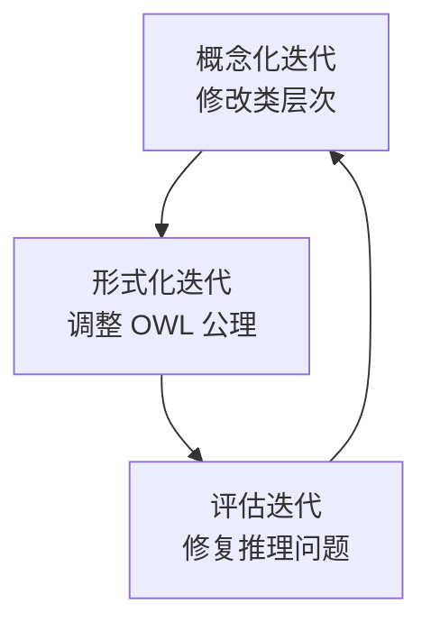
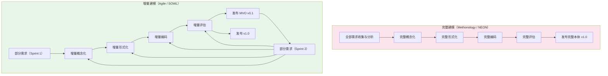
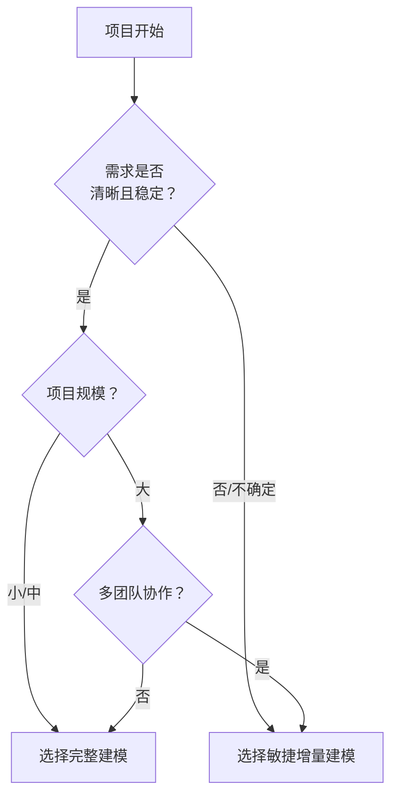

# 17.3 敏捷本体建模

> **本节要点**：随着项目规模和复杂度的增长，传统的瀑布式本体开发方法（如 Methonology、NEON）在应对快速变化的需求时显得有些力不从心。**敏捷本体建模（Agile Ontology Modeling, AOM）** 将敏捷软件开发的最佳实践引入本体工程领域，特别适用于 **大型、需求不稳定的本体项目**。SOWL（Scalable Ontology Development with Loops）框架和 User Story 驱动方法代表了这一方向的前沿。

---

## 1. 为什么需要敏捷本体建模？

### 1.1 传统方法论的挑战

Methonology、NEON 等经典方法论基于瀑布模型假设—— **需求在项目初期就能被充分理解并固定下来**。然而，真实世界中的本体项目常常面临以下挑战：

| 挑战 | 描述 | 传统方法的不足 |
|------|------|----------------|
| 需求蔓延（Scope Creep） | 项目进行中不断发现新需求 | 瀑布模型需要反复回溯到阶段 1，导致巨大返工 |
| 领域知识渐进（Incremental Domain Understanding） | 领域专家自身也在不断学习 | 无法在开始前完成"完美的"概念化 |
| 快速原型需求 | 利益相关者希望尽早看到可用原型 | 瀑布模型需要完成全部阶段才交付 |
| 协作开发 | 多个建模者并行工作 | 严格阶段划分导致依赖冲突 |

### 1.2 敏捷宣言在本体工程的映射

2001 年发布的《敏捷软件开发宣言》（Agile Manifesto）提出了四大价值观：

```
- 个体和互动 高于 流程和工具
- 可工作的软件 高于 详尽的文档
- 客户协作 高于 合同谈判
- 响应变化 高于 遵循计划
```

这四大价值观在本体建模中的对应：

| 敏捷价值观 | 本体建模的对应实践 |
|-----------|------------------|
| 个体和互动 > 流程和工具 | 建模者与领域专家的持续对话 > 详尽的需求文档 |
| 可工作的本体 > 详尽的文档 | 可推理、可查询的本体原型 > 完整的设计规格说明书 |
| 客户协作 > 合同谈判 | 持续与领域专家验收迭代 > 严格的需求冻结 |
| 响应变化 > 遵循计划 | 根据新发现快速调整本体设计 > 严格按前期设计执行 |

---

## 2. SOWL 框架：可扩展本体开发与循坏

**SOWL**（Scalable Ontology Development with Loops）是由 Granizo-Mackinson 等人在 2010 年提出的敏捷本体建模框架。SOWL 的核心思想是：**通过"循环"（Loop）机制来管理复杂性并支持增量开发**。

### 2.1 SOWL 的核心概念

SOWL 保留了 Methonology 的七个阶段，但重新定义了它们的关系：

```mermaid
flowchart TB
    subgraph Sprint ["Sprint 1: 核心功能"]
        A1["规格说明<br/>Specification"] --> B1["概念化<br/>Conceptualization"]
        B1 --> C1["形式化<br/>Formalization"]
        C1 --> D1["评估<br/>Evaluation"]
    end

    subgraph Sprint2 ["Sprint 2: 扩展功能"]
        A2["规格说明<br/>（更新）"] --> B2["概念化<br/>（扩展）"]
        B2 --> C2["形式化<br/>（扩展）"]
        C2 --> D2["评估<br/>（回归测试）"]
    end

    subgraph Sprint3 ["Sprint N: 最终打磨"]
        A3["规格说明<br/>（最终更新）"] --> B3["概念化<br/>（最终扩展）"]
        B3 --> C3["形式化<br/>（最终扩展）"]
        C3 --> D3["评估<br/>（完整验证）"]
    end

    D1 -. "反馈循环" -. A2
    D2 -. "反馈循环" -. A3

    style Sprint fill:#e1f5fe
    style Sprint2 fill:#fff3e0
    style Sprint3 fill:#e8f5e9
```

> **SOWL 命名空间解析**：
> - **S**calable = 可扩展：支持从小到大规模的本体
> - **O**ntology = 本体开发
> - **W**ith = 带有
> - **L**oops = 循环（Feedback Loops / Iterative Cycles, 通过反馈循环来实现持续改进
> - **Sprint**：每个循环对应一个"冲刺"（Iteration），每个 Sprint 产出一个 **可用的最小本体增量（Minimum Viable Ontology, MVO）

### 2.2 SOWL 的核心机制

SOWL 通过以下 **三种循环机制** 来驱动开发：

#### （1）水平循环（Horizontal Loops）—— 范围扩展


**核心机制**：每个 Sprint 都向本体添加新的领域概念和功能，逐步扩展本体覆盖范围。

#### （2）垂直循环（Vertical Loops）—— 深度迭代



**核心机制**：在同一 Sprint 内，概念化和形式化之间反复迭代。例如："这个概念是否需要用对象属性表示，还是用值约束？"

#### （3）跨 Sprint 反馈（Cross-Sprint Feedback）


**核心机制**：每次 Sprint 结束后执行 **回归评估**，确保新增功能不破坏已有功能。

---

## 3. User Story 驱动的本体开发

**User Story（用户故事）** 是敏捷开发中记录需求的核心方式，格式为：

```markdown
作为 [某种角色]，
我希望 [执行某个操作]，
以便 [获得某种价值]。
```

### 3.1 User Story 在本体建模中的应用

将敏捷 User Story 映射到本体需求，每个 Story 对应一个具体的本体构建任务。

**User Story 在本体开发中的映射表示**：

| User Story | 对应的本体元素 | 验收标准（Acceptance Criteria） |
|-----------|---------------|-------------------------------|
| 作为** librarian**，我希望能够**查询某位作者所有出版的书籍** | 定义 `:hasAuthor` 属性，域为 `:Book`，值域为 `:Author` | 1. `sparql` 查询能返回作者所有书籍列表 2. 推理验证属性定义 |
| 作为**研究者**，我希望系统能**识别哪些书籍是论文集中的章节** | 创建 `:BookChapter` 类，作为 `:Publication` 的子类 | 1. `:BookChapter` 能被推理为 `:Publication` 的实例 2. 不相交断言正确 |
| 作为**数据集成工程师**，我希望本体能**与 FOAF 命名空间互操作** | 复用 `foaf:Person` 而非创建新的 `:Person` 类 | 1. `:Author rdfs:subClassOf foaf:Person` 2. 数据能通过 SPARQL 连接 |

### 3.2 用户故事卡（User Story Card）模板

```markdown
## User Story: xxx
- **编号**：US-001
- **故事**：作为 [角色]，我希望 [操作]，以便 [价值]
- **优先级**：P0（最高）/ P1 / P2 / P3（最低）
- **预估复杂度**：S / M / L / XL
- **验收标准**：
  1. [ ] 条件一
  2. [ ] 条件二

### 实现检查清单
- [ ] 相关类/属性已定义
- [ ] rdfs:label 和 rdfs:comment 已添加
- [ ] 公理逻辑检查通过（推理器无警告）
- [ ] 对应的 User Story 的测试用例
```

### 3.3 User Story 排序与优先级

| 优先级等级 | 定义 | 对应开发顺序 |
|-----------|------|-------------|
| P0（Must Have） | 本体的核心功能，不可缺失 | Sprint 1 必做 |
| P1（Should Have） | 重要但非核心，可在 P0 完成后添加 | Sprint 2-3 |
| P2（Could Have） | 锦上添花的增强功能 | Sprint 4+（如有时间） |
| P3（Won't Have Now） | 本期不实现，但记录下来以备将来 | Backlog（需求池） |

---

## 4. 增量建模 vs 完整建模：对比分析

**增量建模（Incremental Modeling）** 是敏捷本体建模的核心特征——与 Methonology、NEON 所代表的完整建模（Big Up-Front Design）形成鲜明对比。



### 4.1 维度对比表

| 对比维度 | 完整建模 | 增量建模 |
|----------|---------|---------|
| 前期分析 | 大量（可能数月） | 少量（仅需 Sprint 1 需求） |
| 首次可交付时间 | 长（数月 - 数年） | 短（数周即可交付 MVO） |
| 需求变更成本 | 极高（需回溯到阶段 1 全面重写） | 低（纳入 Backlog，后续 Sprint 处理） |
| 领域专家参与 | 主要在期初和期末 | 每个 Sprint 持续参与验收 |
| 工具使用 | Protégé 等大型工具 | 轻量级工具 + 命令行（RDFLib, OWL API） |
| 文档 | 完整 TBD 文档，详尽 | 精简 User Story + 设计决策记录 |
| 风险分布 | 风险集中在期末（可能发现需求理解偏差） | 风险分散到每个 Sprint（及早暴露问题） |
| 适用项目规模 | 小型 - 中型、范围明确 | 大型、范围不确定或跨学科 |
| 适用团队 | 小型团队或独立建模者 | 跨学科或多团队并行协作 |

### 4.2 增量建模的实用建议

- **MVO（Minimum Viable Ontology, 最小可行本体）定义**：
  MVO 是能回答至少一个核心领域问题的最小子集。
  例如：一个"出版本体"的 MVO 可能只包含 `:Book`, `:Author`, `:hasAuthor` 三个元素。虽然简单，但能立即用于数据标注或查询。

- **Sprint 长度**：建议每个 Sprint 为 **1-2 周**。短 Sprint 适合快速变化的项目，长 Sprint 适合需要深入研究的领域。

- **回归测试策略**：每次 Sprint 结束后，必须对前序 Sprint 的已有功能进行推理测试，确保新加入的内容不破坏旧内容的逻辑正确性。

- **何时选择增量 vs 完整**：



---

## 5. 敏捷本体建模实践建议

### 5.1 团队角色

与敏捷开发类似，敏捷本体项目需要明确以下角色：

| 角色 | 职责 | 示例 |
|------|------|------|
| 产品负责人（Product Owner） | 定义优先级，管理 User Story 优先级排序 | 领域专家 / 项目负责人 |
| 建模团队（Modeling Team） | 实现本体，负责编码和公理设计 | 知识工程师、语义网开发者 |
| 利益相关者（Stakeholders） | 参与每个 Sprint 末的验收评审 | 数据科学家、业务分析师 |

### 5.2 Sprint 评审会议流程

```
每 Sprint 末评审会流程（30-60 分钟）：
1. 回顾上一 Sprint 完成的 User Story ✅
2. 演示本体新增功能的推理和查询能力 🎯
3. 收集领域专家对新增内容的反馈 📝
4. 更新 Product Backlog（新增、优先级调整） 🔄
5. 规划下一 Sprint 的 User Story 清单 📋
```

### 5.3 工具支持

| 工具 | 敏捷建模用途 |
|------|-------------|
| Protégé | 核心编辑 |
| OWL API | 自动化推理回归测试 |
| SPARQL Endpoint (Fuseki) | Sprint 末演示 |
| GitHub Projects / Trello | User Story 看板管理 |
| Git | Sprint 级版本管理（非每行改动都提交） |

---

## 6. 总结

- SOWL（Scalable Ontology Development with Loops）通过 **Sprint 循环** 机制实现可扩展本体开发
- User Story 驱动方法将本体建模任务分解为 **可验收的用户价值单元**
- 增量建模 vs 完整建模各有适用场景—— **大型/不确定需求适合增量，小型/明确需求适合完整**
- 敏捷本体建模特别适用于 **需要快速原型演示、持续领域专家反馈、跨团队协作的大型知识图谱项目**