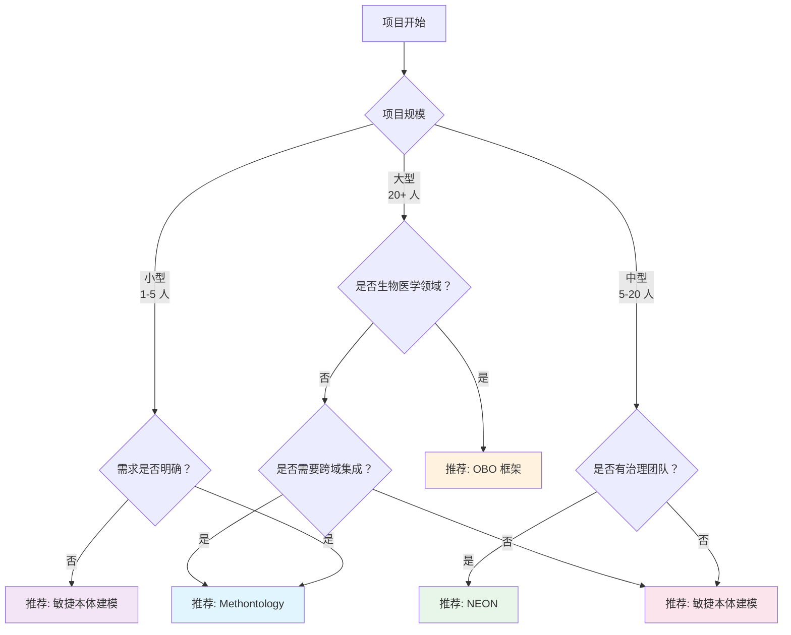
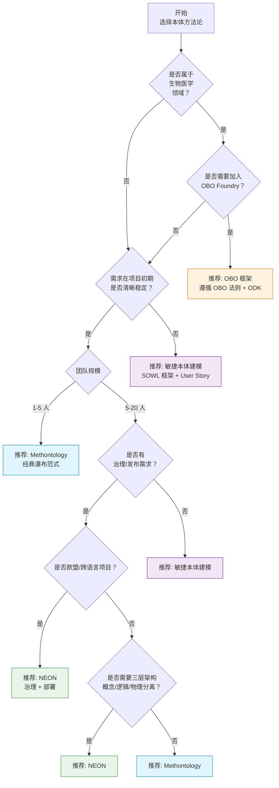
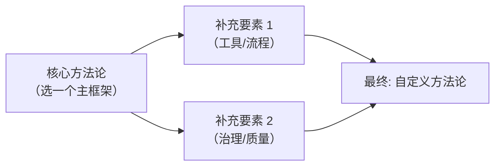

# 17.4 方法论比较表

> **本节要点**：没有一种本体开发方法论在所有场景下都是"最优"的。**Methontology** 适合教学和中小型学术项目；**NEON** 适合欧盟企业级、跨域协作场景；**敏捷本体建模** 适合需求不确定、快速迭代的大型工程；**OBO 框架** 是生物医学领域的标杆。**选择的关键在于匹配场景**——了解自身项目的规模、团队结构、需求稳定度，以及发布渠道。

---

## 1. 四大方法论总览

在深入对比之前，先快速回顾四种方法论的核心定位：

| 方法论 | 全称 | 阶段数 | 核心特征 | 起源领域 |
|--------|------|--------|---------|---------|
| **Methontology** | 方法学本体论 | 7 阶段 | 瀑布模型、文档驱动、经典教学 | 知识工程 / 西班牙阿尔卡拉大学 |
| **NEON** | Networked European Ontology Network | 9 步骤 | 三层架构（概念/逻辑/物理）、治理、部署 | 欧盟语义网项目 / FP7 |
| **敏捷本体建模** | Agile OM / SOWL | Sprint 循环 | 增量开发、User Story 驱动、迭代循环 | 敏捷软件开发生态 |
| **OBO** | Open Biology Ontology | 10+ 规则集 | 社区协作、标准化术语、质量门禁 | 生物医学 / OBO 基金会 |

---

## 2. 四维度深度对比

### 2.1 流程结构对比

### 2.2 核心特性对比表

| 对比维度 | Methontology | NEON | 敏捷本体建模 | OBO 框架 |
|----------|-------------|------|-------------|---------|
| **方法论类型** | 过程方法论 | 过程方法论 | 敏捷方法论 | 框架/指南 |
| **核心驱动** | 文档驱动 | 需求 + 用例驱动 | User Story 驱动 | 社区治理驱动 |
| **阶段数量** | 7 个 | 9 个 | 无限 Sprint（灵活） | 10+ 规则 + ODK 流程 |
| **是否要求完整前期分析** | 是（规格说明阶段） | 是（Step 1 详细需求） | 否（仅 Sprint 1 范围） | 部分（遵循 OBO 法则） |
| **三层架构（概念/逻辑/物理）** | 隐含 | 显式独立 | 隐含在 Sprint 内迭代 | 通过 ODK 自动化 |
| **治理流程** | 融入维护 | 独立 Step 8 | 通过 Product Owner 实现 | 通过 OBO Foundry 审查 |
| **发布渠道** | BioPortal, LoV | BioPortal, LoV, DataPortal | 自定（Git 仓库、API） | OBO 仓库（强制） |
| **工具生态** | OTO, Protégé | NEON Toolkit, VocaTool | Protégé, OWL API, RDFLib | ODK, Uberon, Edit 工具 |
| **学习曲线** | 中等 | 较高（步骤多） | 低（如果熟悉敏捷开发） | 高（需遵循 OBO 法则） |

### 2.3 质量保证对比

| 质量评估方式 | Methontology | NEON | 敏捷本体建模 | OBO 框架 |
|-------------|-------------|------|-------------|---------|
| **逻辑一致性检验** | 是（推理器） | 是（推理器） | 是（推理器） | 是（自动 + 手动） |
| **需求覆盖验证** | 需求覆盖矩阵 | 需求追踪矩阵 | Sprint 验收 | OBO 法则检查 |
| **同行评审** | 建议 | 建议 | Sprint 评审会 | OBO 审查流程（强制） |
| **术语复用过审** | 是（集成阶段） | 是（Step 4 物理设计） | 随 Sprint 评估 | 是（OBO 法则） |
| **文档质量标准** | TBD + MOD | TBD 强制 | 精简（User Story + 决策记录） | OBO 文档规范 |

### 2.4 成本与资源对比

| 资源维度 | Methontology | NEON | 敏捷本体建模 | OBO 框架 |
|---------|-------------|------|-------------|---------|
| **适合团队规模** | 1-5 人 | 5-20 人 | 3-50 人（弹性大） | 10+ 人（社区规模） |
| **最小可用交付时间** | 2-4 周 | 4-8 周 | 1-2 周（MVO） | 数月（需完成法则审查） |
| **文档投入** | 高 | 极高 | 低 - 中 | 高 |
| **培训需求** | 1-2 天 | 3-5 天 | 1-2 天（如果已熟悉 Scrum） | 1 周以上 |
| **工具许可成本** | 低（Protégé 免费） | 低（NEON Toolkit 开源） | 低（Protégé + OWL API 免费） | 低（ODK + 自有工具） |

---

## 3. 适用场景矩阵

### 3.1 场景分类与推荐

| 场景分类 | 推荐方法论 | 理由 |
|---------|-----------|------|
| **学术教学 / 课程项目** | Methontology | 结构清晰、教学资料丰富、经典范式 |
| **学术科研（发表论文）** | Methontology 或 NEON | 严谨方法论 + 完整文档，方便论文写作引用 |
| **企业知识图谱** | NEON 或 敏捷本体 | NEON 的治理框架适合企业内部管控；敏捷适合快速原型 |
| **商业 SaaS 产品** | 敏捷本体建模 | 快速原型演示、迭代开发符合产品发布节奏 |
| **跨机构/跨境协作** | NEON | 多语言、标准化流程、EU 治理框架天然支持 |
| **生物医学领域本体** | OBO 框架 | 领域标准工具链（ODK）、OBO 仓库、社区治理 |
| **开源社区本体** | OBO 框架 或 敏捷 | OBO 适合有治理委员会的成熟社区；敏捷适合初期 |
| **个人实验 / 原型验证** | 敏捷本体建模（简化版） | 只需最小 Sprint，快速看到成果 |
| **数据集成项目** | Methontology | 集成阶段强调复用现有本体（Not Invented Here） |

### 3.2 项目规模与复杂度推荐

---

## 4. 选择方法论的决策树

以下是综合多个维度后的 **本体方法论选择决策树**：

---

## 5. 混合方法论实践

在实践中，**纯单一方法论往往不够**——大多数组织会根据自身情况 **混合使用多种方法论的精华**。

### 5.1 常见混合模式

| 混合模式 | 描述 | 实践示例 |
|---------|------|---------|
| **Methontology + 敏捷 Sprint** | 保留 Methontology 七阶段框架，但每个阶段内部按 Sprint 迭代执行 | 先用 2 周做"完整规格说明"，然后概念化分 3 个 Sprint 完成 |
| **NEON + User Story** | 使用 NEON 九步骤，但在需求分析阶段采用 User Story 格式 | NEON Step 1 中的用例用 User Story 卡管理 |
| **OBO + 敏捷治理** | 使用 OBO 法则和质量门禁，但用 Scrum Sprint 节奏管理开发 | OBO Foundry 审查 + 2 周 Sprint |
| **Methontology + NEON 治理** | 采用 Methonolgy 的七个阶段，但引入 NEON 的治理阶段独立化 | 企业本体项目，用 Methonology 开发、NEON 治理 |

### 5.2 混合方法选择建议

> **关键建议**：选择方法论时，**不必执着于"纯"框架**——混合方法论往往比单一方法论更符合实际项目需求。重要的是理解每种方法论解决什么 **问题**，然后把最佳实践组合在一起。

---

## 6. 本章总结

| 方法论 | 最佳适用场景 | 核心优势 | 主要局限 |
|--------|------------|---------|---------|
| **Methonology** | 教学、学术、中小型项目 | 经典范式、文档丰富、学习成本低 | 需求变更成本高 |
| **NEON** | 企业、欧盟项目、跨领域 | 完整治理、三层架构、部署支持 | 步骤多、文档负担重 |
| **敏捷本体建模** | 大型项目、需求不确定 | 灵活迭代、快速交付、反馈及时 | 文档可能不充分 |
| **OBO 框架** | 生物医学、开源社区 | 领域标准、高质量门禁 | 仅适合特定领域 |

> **最终建议**：
> - **新手入门** → 从 **Methonology** 开始学习，掌握本体工程化的基础范式
> - **企业知识图谱** → **NEON + 敏捷 Sprint** 混合模式
> - **生物医学研究** → **OBO 框架**（遵循社区标准）
> - **初创产品 / MVP** → **敏捷本体建模**，快速交付 MVO