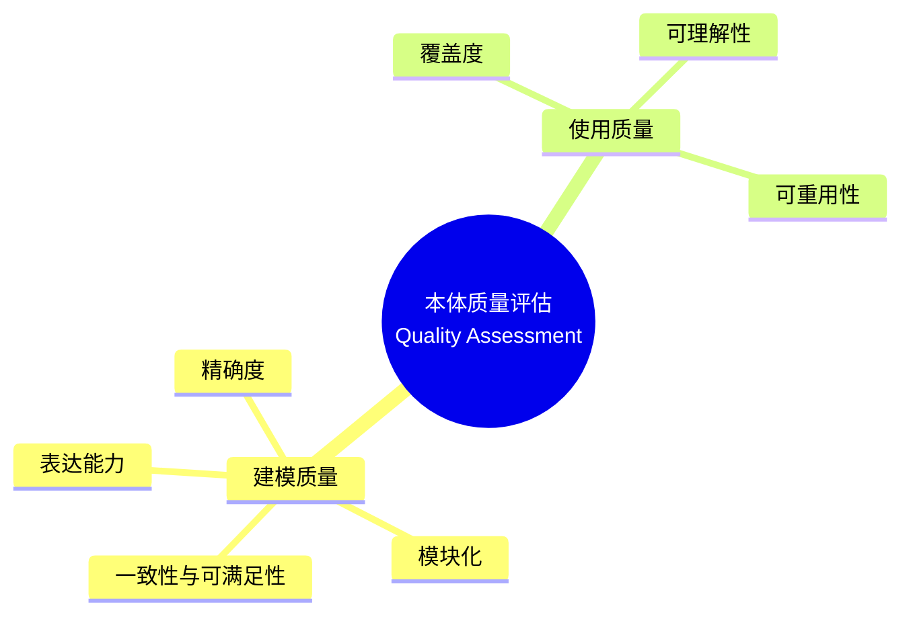
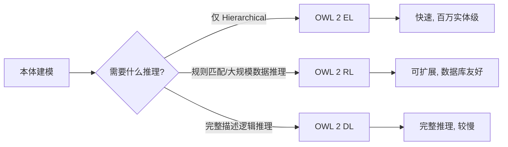
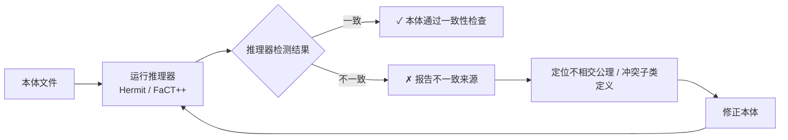
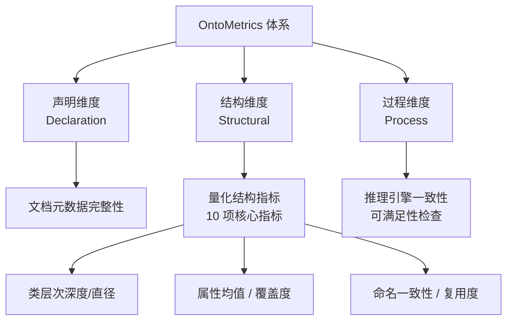

# 18.1 评估维度详解

> **本节要点**：本体质量评估（Quality Assessment）是确保本体可用、可信、可复用的关键环节。评估维度分为两大类别：**建模质量（Modeling Quality）**和**使用质量（Usage Quality）**。掌握这些维度及其对应的量化指标，是开展后续自动化工具实践的基础。

---

## 1. 为什么需要质量评估

本体开发（Ontology Development）完成后，如何判断一个本体是否"好"？答案并非显然——一个本体可以在语义上正确但对特定应用毫无价值，或在某个领域覆盖全面但难以复用。

本体质量评估的核心价值：

| 评估目的 | 具体收益 |
|----------|----------|
| 可靠性保证 | 确保本体的逻辑一致性（Consistency），避免推理产生矛盾结论 |
| 复用决策 | 量化复用潜力，避免"重新发明车轮" |
| 维护优先级 | 通过指标变化判断哪些模块最需要关注或重写 |
| 标准化对标 | 与同类本体比较（如同领域比对），找出差距 |

Staab & Studer（2000）在其经典论文 *"Handbook on Ontologies"* 中首次系统化提出了本体质量的两大评估维度体系：

---

## 2. 建模质量（Modeling Quality）

**建模质量（Modeling Quality）**关注本体作为形式化知识表示 artifact 的**内部质量特性（Internal Quality Attributes）**。它回答的问题是："这个本体本身建模得好不好？"

建模质量的六个维度：

### 2.1 表达能力（Expressivity）

**表达能力（Expressivity）**衡量一个本体中使用的 OWL 构造（Construct）集合，以及其所属的描述逻辑（Description Logic）子逻辑（Subset）层级。

OWL 2 的三个 Profiles 代表了不同表达能力的层级：

| Profile | 表达能力级别 | 支持构造（Constructs） | 推理决策（Decision Procedure） |
|---------|-------------|------------------------|-------------------------------|
| **OWL 2 RL** | 最低 | 子类、对象属性链、数据属性、基数约束（基数≥1）、函数属性 | 基于规则推理（Rule-based），可扩展到超大规模本体 |
| **OWL 2 EL** | 中等 | 类交集（Intersection）、属性限制（Property Restrictions）、自反性 | 多项式时间复杂度，适合大规模生物医学本体（如 SNOMED CT） |
| **OWL 2 DL** | 最高 | 所有 OWL 2 构造，保证 Termination 和 Decidability | 指数时间复杂度，适用于需要完整推理的小/中型本体 |

**表达能力评估原则**：

> **关键原则**："用最简单的语言表达足够的知识"（Occam's Razor for Ontology）。过度使用 Expressivity 导致推理效率低甚至不可判，不足则丧失建模能力。**选择 Profile 应与推理需求匹配**。

### 2.2 精确度（Precision）

**精确度（Precision）**衡量本体建模结果与领域专家概念化（Conceptualization）的吻合程度。

> **核心定义**：Precision =（准确建模的概念数 / 实际建模的概念总数）

**评估方法**：
- **人工评审（Human Review）**：领域专家对本体进行抽样检查
- **自动化测试**：通过测试用例（Test Cases）来验证特定建模断言

| 测试类型 | 示例 | 验证内容 |
|----------|------|----------|
| 实例正确分类 | `ex:James a ex:Professor` 应被推断为 `ex:Person` | 子类和属性传递正确 |
| 不相交验证 | 某实例不应同时属于 `ex:Book` 和 `ex:Movie` | Disjoint 公理有效 |
| 值约束验证 | 某书的 `:numberOfPages` = -5 应触发不一致 | 数据属性约束有效 |
| 枚举完整性 | `owl:oneOf` 中列出所有必需常量 | 枚举建模完整 |

### 2.3 模块化（Modularity）

**模块化（Modularity）**衡量本体被分解为可重用子模块的程度，以及模块间的耦合度（Coupling）。

高质量的模块化带来以下好处：
- **维护性提升**：修改一个模块不影响其他模块
- **复用性增强**：模块可作为独立单元被其他本体导入
- **开发分工**：不同团队可以同时开发不同模块

**模块耦合指标**：

| 耦合类型 | 定义 | 理想状态 |
|----------|------|----------|
| 入度耦合（Efferent Coupling） | 本体内引用外部模块的类/属性数量 | 低（< 总声明量的 20%） |
| 出度耦合（Afferent Coupling） | 外部模块引用本体的类/属性数量 | 高（表明模块有复用价值） |
| 模块内部凝聚度（Cohesion） | 模块内部元素间语义关联性 | 高（模块内语义紧密相关） |

### 2.4 一致性与可满足性（Consistency & Satisfiability）

**一致性（Consistency）**是本体最基本的质量要求：本体中不应存在导致逻辑矛盾（Contradiction）的公理。

- **本体一致（Ontology Consistent）**：推理器（Reasoner）无法推导出 `owl:Nothing` 的子类
- **类可满足（Class Satisfiable）**：类非空——存在至少一个可能的实例

**一致性检查流程**：

常见导致不一致的建模错误：

| 错误类型 | 示例（OWL 2 语法） | 问题说明 |
|----------|-------------------|----------|
| 声明为不相交的子类又被赋予共同实例 | `<Person> disjointWith <NonPerson>`，但某个实例被分类为二者子类 | 公理与数据矛盾 |
| 类的等价定义互相排斥 | `A equivalentTo B and C`，但 `B disjointWith C` | 等价类永空 |
| 基数约束与实例数据冲突 | `:hasExactly1Parent owl:cardinality 2`，但某个实例只有 1 个父实例 | 数据违反公理 |

---

## 3. 使用质量（Usage Quality）

**使用质量（Usage Quality）**关注**使用者（Consumer）视角**的本体质量。它回答的问题是："对本体的用户来说，这个本体好不好用？"

使用质量的三个核心维度：

### 3.1 覆盖度（Coverage）

**覆盖度（Coverage）**衡量本体对目标领域知识的覆盖全面程度。

覆盖度包含两层含义：
- **概念覆盖度**：领域内的核心概念是否在本体中被建模
- **实例覆盖度**：领域中的数据/实例是否能在本体框架下被表示和关联

**覆盖度度量指标**：

| 指标 | 计算方式 | 说明 |
|------|---------|------|
| 类数（Classes） | 本体中声明的 owl:Class 数量 | 基本规模指标 |
| 属性数（Properties） | 对象属性 + 数据属性总数 | 关系建模丰富度 |
| 属性均值（Avg Property per Class） | 总属性数 / 有属性的类数 | 类-属性关联密度 |
| 实例数（Instances） | RDF 图中的 owl:NamedIndividual 数量 | 数据填充水平 |
| 属性填充率（Property Fill Rate） | 有填充值的个体-属性对 / 总可能属性对 | 实际数据密度 |

### 3.2 可理解性（Understandability）

**可理解性（Understandability）**衡量一个陌生用户在无需领域专家指导的情况下理解本体的难易程度。

可理解性影响因素：

| 因素 | 低可理解性表现 | 高可理解性建议 |
|------|---------------|----------------|
| 标签与标签（Label） | 无 rdfs:label / 仅有技术缩写如 "cls_001" | 每个元素提供多语言 label |
| 文档注释（Comment） | 无 rdfs:comment 或注释为空白 | 每个核心元素附有语义解释 |
| 命名约定（Naming Convention） | 大小写混用、匈牙利命名法混乱 | 遵循驼峰式或下划线的统一规范 |
| 层次深度（Hierarchy Depth） | 层次过深（> 8 层）或过浅（< 2 层） | 平衡：3-6 层最佳 |
| 可视化友好度 | 类/属性图过于密集无法阅读 | 通过模块化拆分减少单图复杂度 |

### 3.3 可重用性（Reusability）

**可重用性（Reusability）**衡量本体在不经过大幅修改的情况下被其他项目或本体直接利用的可能性。

可重用性评价要素（依据 OntoMetrics 体系）：

| 要素 | 说明 | 评价方法 |
|------|------|----------|
| 文档完整性 | 是否包含版本信息、作者、许可证、使用示例 | 静态检查 |
| 导入良好本体 | 是否导入了标准本体（如 schema.org、foaf、dublin terms）而非"造轮子" | 分析 imports 声明 |
| 命名空间规范 | 是否使用独特且规范的 IRI 前缀 | IRISchema 检查 |
| 跨本体对齐（Alignment） | 是否与同类本体建立了映射关系（如 owl:equivalentClass） | 分析 owlMap |

> **最佳实践提示**：高可重用性的本体（如 DBpedia Ontology、Schema.org）通常同时满足：**开放许可（Open License）+ 机器可读 API + 丰富的使用示例 + 活跃的社区生态**。

---

## 4. OntoMetrics 评估框架

**OntoMetrics**（Pérez-López 等人，2006）是目前最广泛使用的本体质量评估框架之一，它将质量定义为：

> **质量 = 本体的功能 + 技术特性 ≥ 需求（Needs + Expectations）+ 标准（Standards + Conventions）**

### 4.1 三大评估维度

OntoMetrics 提出了三个结构化维度来系统化评估：

| 维度（Dimension） | 希腊语词源 | 评估内容 |
|-----------------|-----------|----------|
| **声明维度**（Declaration） | `deklaroutai` - "说明、宣布" | 本体元数据是否完整（作者、版本、许可等文档级信息） |
| **结构维度**（Structural） | `stuktoura` - "组成、构建" | 量化结构指标——类数、属性深度、继承链数等 |
| **过程维度**（Process） | `kataskenuein` - "驻留、运行" | 推理一致性检查、可满足性验证等动态任务执行结果 |

### 4.2 OntoMetrics 体系化质量模型

> **关键原则**：一个高质量的本体需要 **三个维度均达标**——仅文档完整（声明）不够，仅逻辑一致（过程）不够，必须有充分的结构质量（量化指标）支撑。

---

## 5. 评估维度总结

以下表格综合比较建模质量与使用质量各维度之间的关系：

| 质量类别 | 维度 | 关键问题 | 量化指标 | 工具支持 |
|----------|------|---------|---------|---------|
| **建模质量** | 表达能力（Expressivity） | 本体使用了哪些 OWL 构造，属于哪个 Profile | Profile 匹配度 | OWL API profile checking |
| **建模质量** | 精确度（Precision） | 建模是否符合领域专家意图 | 测试用例通过率 | Protege 插件测试 |
| **建模质量** | 模块化（Modularity） | 本体是否被合理拆分为低耦合模块 | 模块入度/出度耦合数 | MOQUA 评估工具 |
| **建模质量** | 一致性与可满足性 | 推理器能否推导出矛盾 | 不一致类数量 | Hermit / ELK / FaCT++ |
| **使用质量** | 覆盖度（Coverage） | 领域知识是否覆盖全面 | 类/属性/实例计数 | OntoMetrics |
| **使用质量** | 可理解性（Understandability） | 新用户理解本体是否容易 | label/comment 填充率 | 静态分析脚本 |
| **使用质量** | 可重用性（Reusability） | 其他项目能否直接复用 | 导入外部本体数、映射数 | OntoMetrics / MOQUA |