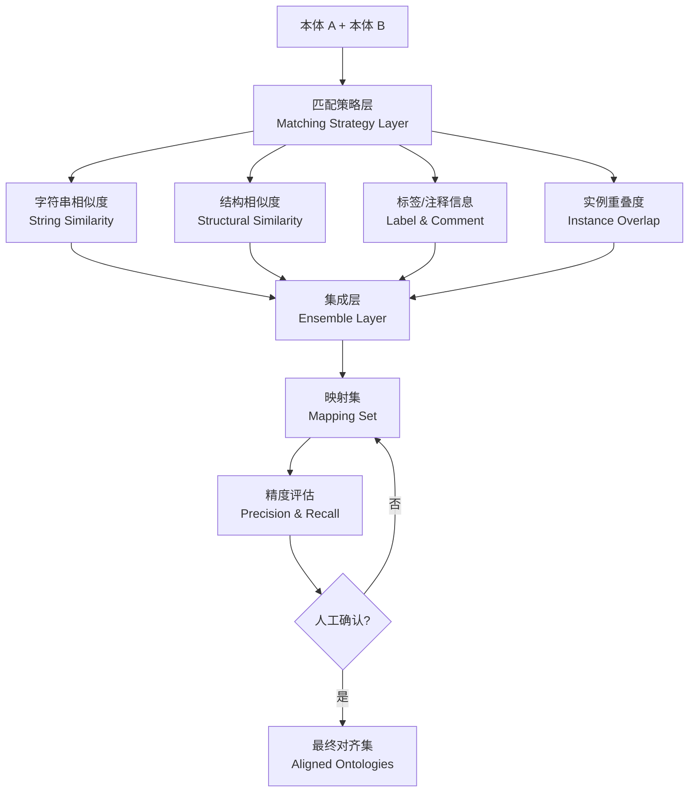
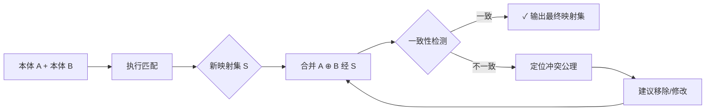
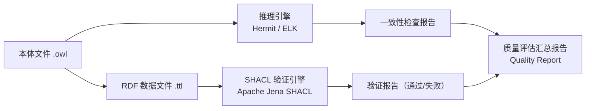
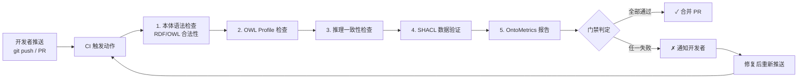

# 18.2 自动化工具

> **本节要点**：手动检查本体质量效率低且易遗漏。本章介绍**本体匹配工具（Ontology Matching Tools）**（如 AMIE+、AML、LogMap）、**OWL API 与 Protégé 插件**、**SHACL 验证框架**，以及如何搭建 **CI/CD 集成的质量检查流水线**，将质量评估从"事后检验"推进为"持续保障"。

---

## 1. 本体匹配与评估工具

本体匹配（Ontology Matching）是质量评估的核心场景之一——当需要复用现有本体或集成多源数据时，识别两个本体间的语义对应关系是关键前提。以下三款工具是目前学界与工业界使用最广泛的匹配与评估解决方案。

### 1.1 AMIE+：不完备数据下的关联规则挖掘

**AMIE+**（Association Rule Mining for Incomplete Data）是曼彻斯特大学开发的工具，专注于从部分观测数据中**挖掘OWL 2属性约束（Axioms）**，评估和增强本体的完整性。

| 特性 | 说明 |
|------|------|
| 核心算法 | Association Rule Mining（关联规则挖掘） + 乐观缺失假设（OMH） |
| 支持挖掘 | `owl:subPropertyOf`、`rdfs:domain`、`rdfs:range`、`owl:ObjectProperty` |
| 质量提升 | 自动补全缺失的 domain/range 声明，提升领域建模精确度 |

**典型使用流程**：

```
输入: RDF 数据文件（.ttl / .xml）
        ↓
AMIE+ 关联规则挖掘
        ↓ (confidence ≥ 0.95)
输出: 推荐添加的 owl:subPropertyOf / rdfs:domain / rdfs:range 公理
        ↓
人工审核后并入本体
```

> **应用场景**：DBpedia 本体（DBpedia Ontology）的开发过程中大量使用 AMIE+ 从自由文本数据中自动提取和推荐约束公理，显著提升了属性 Domain/Range 覆盖率。

### 1.2 AML：多策略本体匹配框架

**AML**（Automated Multi-level Ontology Matching）由西班牙知识工程实验室开发，是一个多层次、多策略的本体匹配框架。它能从类名、属性、实例三个不同粒度自动比对两个本体的对应关系。

**AML 匹配策略架构**：



**AML 核心特性**：

| 特性 | 具体表现 |
|------|----------|
| 多层匹配 | 同时从语法层（名字）、语义层（结构/上下文）、数据层（实例）综合判断 |
| 相似度融合 | 内置 8+ 字符串度量（Levenshtein、Jaccard、cosine 等），自动加权聚合 |
| 质量评估 | 直接输出 Precision（精度）、Recall（召回率）、F1-Score |
| 可视化 | 在 Protégé 插件中以颜色高亮显示匹配的实体 |

### 1.3 LogMap：大规模本体匹配与一致性修复

**LogMap** 由瓦伦西亚大学（Universitat de València）开发，是专为**超大规模本体**（如 UMLS、YAGO）设计的匹配工具，其最大特色是**在匹配同时检测并修复因新映射导致的不一致性（Inconsistency）**。

**LogMap 核心组件**：

| 组件 | 功能 |
|------|------|
| **LogMap-it**（Integration Tool） | 将两个本体对齐并合并，同时检测冲突 |
| **LogMap-ns**（Namespace-based） | 仅基于命名空间和本体标识信息进行快速匹配 |
| **LogMap-ne**（Node-based） | 深入节点内容（类名、属性名、层次结构）进行精细化匹配 |
| **In consistency Manager** | 当新增匹配映射导致本体不一致时，自动定位并建议移除冲突的已有公理 |

**LogMap 不一致性管理流程**：



---

## 2. OWL API 与 Protégé 插件在质量检查中的应用

**OWL API** 是目前 Java/Scala/Java/Kotlin 生态中使用最广泛的 OWL 2 编程接口。绝大多数质量评估工具（包括上述 AMIE+、AML、LogMap）的内部核心均基于或兼容 OWL API。

### 2.1 OWL API 质量检查 API 使用

以下代码展示了如何使用 OWL API 进行**推理一致性检查**和**类可满足性检查**：

```java
// 质量评估示例代码: 使用 OWL API 进行本体质量检查
import org.semanticweb.owlapi.apibinding.OWLManager;
import org.semanticweb.owlapi.model.*;
import org.semanticweb.owlapi.reasoner.*;

import java.io.File;
import java.util.Set;

public class QualityCheckExample {

    public static void main(String[] args) throws Exception {
        // 1. 加载本体
        OWLOntologyManager manager = OWLManager.createOWLOntologyManager();
        OWLOntology ontology = manager.loadOntologyFromOntologyDocument(
            new File("movie-ontology.owl")
        );

        // 2. 创建推理器 (使用 Hermit 推理器)
        OWLReasonerFactory reasonerFactory = new ReasonerReasonerFactory();
        OWLReasoner reasoner = reasonerFactory.createReasoner(ontology);

        // 3. 一致性检查 (Consistency Check)
        boolean isConsistent = reasoner.isConsistent();
        System.out.println("本体一致性状态: " + (isConsistent ? "✓ 一致" : "✗ 不一致"));

        // 4. 如果发现不一致，定位原因
        if (!isConsistent) {
            Set<InferenceFailureInfo> failures = reasoner.getInferenceFailures();
            System.out.println("冲突公理数: " + failures.size());
            for (InferenceFailureInfo failure : failures) {
                System.out.println("  冲突类型: " + failure.getFailureReason());
            }
        }

        // 5. 可满足性检查: 查找未可满足的类 (Unsatisfiable Classes)
        Set<OWLClass> unsatisfiableClasses = reasoner.getUnsatisfiableClasses()
                .getNamedClasses();
        if (unsatisfiableClasses.isEmpty()) {
            System.out.println("✓ 所有类均满足 (Satisfiable)");
        } else {
            System.out.println("发现 " + unsatisfiableClasses.size() + " 个未可满足类:");
            for (OWLClass c : unsatisfiableClasses) {
                System.out.println("  - " + c.getIRI());
            }
        }

        // 6. 计算继承深度（衡量模块化质量）
        int maxDepth = reasoner.getSuperClasses(ontology.getOWLDataFactory().getOWLThing())
                .getEdges().stream()
                .mapToInt(e -> 1).max().orElse(0);
        System.out.println("类层次最大深度: " + maxDepth);

        reasoner.dispose();
    }
}
```

**Maven 依赖（pom.xml）**：

```xml
<dependency>
    <groupId>org.semanticweb</groupId>
    <artifactId>owlapi-distribution</artifactId>
    <version>5.5.0</version>
</dependency>
<dependency>
    <groupId>uk.ac.man.cs</groupId>
    <artifactId>hermit</artifactId>
    <version>1.4.3</version>
</dependency>
```

### 2.2 Protégé 质量评估插件

Protégé 拥有丰富的插件生态用于质量评估：

| 插件名称 | 功能 | 安装方式 |
|----------|------|----------|
| **OntoMATICA** | 本体质量多维度自动报告（包含 OntoMetrics 所有指标） | 通过 Plugins 菜单在线安装 |
| **MOQUA** | 基于模块化的本体质量量化分析 | 通过 Plugins 菜单安装 |
| **Onto-Baker** | 基于模板的本体文档自动补全与检查 | 通过 Plugins 菜单安装 |
| **OWL Profile Checker** | 检查本体当前公理集合属于 OWL 2 的哪个 Profile（EL/DL/RL） | Protégé 内置（Help → Check OWL Profile） |

> **操作提示**：在 Protégé 中打开本体 → 菜单栏 `Help → Check OWL Profile`，即可实时查看当前本体使用的构造分布在 OWL 2 EL/DL/RL 中的覆盖情况。

---

## 3. SHACL 验证与推理结合的质量评估实践

如果说 **OWL 推理**确保本体的"内部逻辑自洽"，那么 **SHACL 验证**确保本体的"数据符合期望约束"。二者结合构成了完整的质量保障闭环。

### 3.1 SHACL vs OWL 约束对比

| 对比维度 | OWL 公理 | SHACL 形状（Shape） |
|----------|----------|-------------------|
| **主要用途** | 本体模式层的语义定义 | 数据层的实例验证 |
| **逻辑基础** | 描述逻辑（Description Logic）+ OWA | 闭世界约束 + SPARQL 生成规则 |
| **最小值约束** | `owl:minQualifiedCardinality`（需指定类别） | `sh:minCount = 1`（直接表达） |
| **最大值约束** | `owl:maxQualifiedCardinality` | `sh:maxCount = 1` |
| **自定义逻辑** | 有限，需要复杂建模 | 可通过 SPARQL SELECT 形状实现任意逻辑 |
| **可逆约束** | `owl:hasValue` 只能正向约束 | `sh:closed = true` 可声明"仅允许这些属性" |

### 3.2 电影本体 SHACL 验证示例

结合第 9 章的电影本体练习，编写 SHACL 验证规则：

```turtle
@prefix ex: <http://example.com/movie#> .
@prefix sh:  <http://www.w3.org/ns/shacl#> .
@prefix xsd: <http://www.w3.org/2001/XMLSchema#> .
@prefix rdf: <http://www.w3.org/1999/02/22-rdf-syntax-ns#> .

# 形状定义 1: Movie 节点必须至少有一个标题
ex:MovieShape
    a sh:NodeShape ;
    sh:targetClass ex:Movie ;
    sh:property [
        sh:path ex:title ;
        sh:minCount 1 ;
        sh:datatype xsd:string ;
        sh:message "每部电影 (Movie) 必须至少有一个标题 (title)."
    ] ;
    sh:property [
        sh:path ex:releaseYear ;
        sh:minCount 1 ;
        sh:maxCount 1 ;
        sh:datatype xsd:integer ;
        sh:message "每部电影必须有且仅有一个上映年份 (releaseYear)，且为整数。"
    ] ;
    sh:property [
        sh:path ex:director ;
        sh:minCount 1 ;
        sh:message "每部电影必须至少有一位导演 (director)。"
    ] .

# 形状定义 2: Person 的出生年份必须在合理范围内
ex:PersonShape
    a sh:NodeShape ;
    sh:targetClass ex:Person ;
    sh:property [
        sh:path ex:birthYear ;
        sh:minInclusive 1850 ;
        sh:maxInclusive 2010 ;
        sh:message "人物出生年份应在 1850-2010 年之间。"
    ] .

# 形状定义 3: Actor 出演的电影数量验证
ex:ActorShape
    a sh:NodeShape ;
    sh:targetClass ex:Actor ;
    sh:property [
        sh:path ex:actedIn ;
        sh:minCount 1 ;
        sh:message "演员 (Actor) 至少参演过一部电影。"
    ] .
```

**SHACL 验证与推理联合质量检查流程**：



### 3.3 使用 Apache Jena 执行 SHACL 验证

```bash
# 使用 Jena Shape Validator 进行命令行验证
java -cp jena-shacl.jar org.apache.jena.shacl.validation \
    --data=movie-data.ttl \
    --shapes=movie-shapes.ttl \
    --report=validation-report.ttl

# 输出示例：
# ✓ movie-1: OK (所有属性符合要求)
# ✗ movie-2: FAILED - "每部电影必须有上映年份"
# ✗ person-1: WARNING - "出生年份 1840 超出 [1850-2010] 范围"
```

---

## 4. CI/CD 集成质量检查流水线设计

将本体质量检查集成到 **持续集成（Continuous Integration, CI）** 流程中，实现代码级别的自动化质量门禁（Quality Gate）。

### 4.1 流水线架构设计



### 4.2 GitHub Actions 流水线配置示例

```yaml
# .github/workflows/ontology-quality-check.yml
name: Ontology Quality Check

on:
  pull_request:
    branches: [main]
    paths:
      - 'ontologies/**/*.owl'
      - 'ontologies/**/*.ttl'

jobs:
  quality-check:
    runs-on: ubuntu-latest
    steps:
      - name: Checkout repository
        uses: actions/checkout@v4

      - name: Set up Python
        uses: actions/setup-python@v5
        with:
          python-version: '3.11'

      - name: Install dependencies
        run: |
          pip install rdflib owlready2 pySHACL ontoprics

      - name: Step 1 - OWL syntax check
        run: |
          python scripts/check_owl_syntax.py ontologies/

      - name: Step 2 - Inconsistency check (owlready2)
        run: |
          python scripts/check_consistency.py ontologies/

      - name: Step 3 - SHACL validation
        run: |
          pyshacl --shacl ontologies/shapes/movie-shapes.ttl \
                  -i ontologies/data/movie-data.ttl \
                  -f tabular \
                  --report validation-report.ttl

      - name: Step 4 - OntoMetrics metrics report
        run: |
          python scripts/generate_ontometrics.py \
              --input ontologies/ \
              --output metrics-report.json

      - name: Step 5 - Quality gate
        run: |
          python scripts/quality_gate.py \
              --metrics metrics-report.json \
              --threshold precision=0.95 \
              --threshold min_classes=5 \
              --threshold consistency=true
```

### 4.3 质量门禁判定规则

质量门禁（Quality Gate）定义本体合并到主干前**必须达到的最低质量标准**：

| 质量维度 | 门禁条件（Threshold） | 失败处理 |
|----------|----------------------|----------|
| 一致性 | 推理引擎报告无冲突 | 阻止合并，通知修改 |
| Precision（精确度） | 核心类/属性 ≥ 95% 通过测试 | 需补充测试或修正公理 |
| 最小类数 | `len(classes) ≥ 10` | 要求扩展本体范围 |
| label 覆盖率 | 100% 元素有 rdfs:label | 警告而非阻断 |
| SHACL 验证 | 0 个 FAIL 结果 | 阻止合并 |
| OntoMetrics 总分 | ≥ 60 / 100 | 警告，需评审 |

> **最佳实践**：质量门禁规则应按项目阶段灵活调整——**开发阶段**保持宽松，**发布前**提升至生产级标准（Production-grade）。