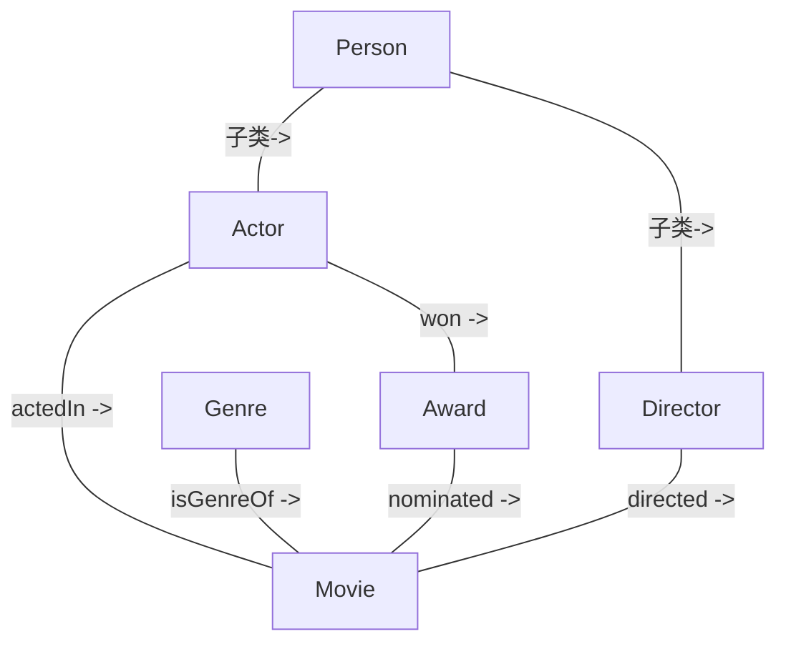

# 18.3 练习：OntoMetrics 实践

> **本节要点**：通过一个**电影本体（Movie Ontology）**的实际案例，将第 18.1 节学到的质量维度与第 18.2 节介绍的工具串联为**完整的实践工作流**。你将学会如何使用 OntoMetrics Web 服务及 OWL API 脚本评估本体质量，解读量化指标报告，并生成具体的改进建议。

---

## 1. 场景设定：我们的电影本体

基于第 9 章第 4 节的练习，假设我们已经构建了一个电影领域本体 (`movie-ontology.owl`)。现在需要通过 OntoMetrics 体系对其进行全面的质量评估，并据此生成改进方向。

**本体骨架概要**：

| 类别（Classes） | 数量 |
|----------------|------|
| `Person`, `Actor`, `Director`, `Movie`, `Genre`, `Award` | 6 个核心类 |

| 属性（Properties） | 数量 |
|--------------------|------|
| **对象属性** | `actedIn`, `directed`, `isGenreOf`, `hasNominatedMovie`, `coStar` — 5 个 |
| **数据属性** | `title`, `releaseYear`, `birthYear`, `duration`, `rating` — 5 个 |



---

## 2. 步骤一：使用 OntoMetrics Web 服务进行评估

**OntoMetrics Web Service** 是一个基于 Web 的在线评估平台（[https://github.com/iceu-ft/MetricsForOntologies/releases](https://github.com/iceu-ft/MetricsForOntologies/releases) — 本地部署），上传本体文件即可自动生成报告。

### 2.1 操作流程

| 步骤 | 操作 | 说明 |
|------|------|------|
| 1 | 打开 OntoMetrics Web 平台 | 推荐使用 Chrome / Firefox 浏览器 |
| 2 | 选择"评估文件"选项 | 支持 `.owl`, `.ttl`, `.rdf`, `.jsonld` |
| 3 | 上传 `movie-ontology.owl` | 同时可选传数据文件进行综合评估 |
| 4 | 选择评估套件 | "完整评估" = 声明 + 结构 + 过程 |
| 5 | 提交并等待结果 | 中等规模本体（~500 条公理）通常 < 30 秒 |

### 2.2 声明维度（Declaration）评估结果

| 指标项 | 期望 | 电影本体现状 | 评分 |
|--------|------|-------------|------|
| 有 rdfs:comment | 100% | 85% — `Genre` 和 `Award` 缺少描述 | 17 / 20 |
| 包含创建日期 | ✓ | ✓ 已设定 | 5 / 5 |
| 包含修改历史 | ✓ | ✗ 未记录变更日志 | 0 / 5 |
| 含作者信息 | ✓ | ✓ 已声明 creator | 5 / 5 |
| 含许可证声明 | ✓ | ✓ 使用 CC BY 4.0 | 5 / 5 |
| 含应用用例说明 | ✗ | 非必须 | 5 / 5 |
| **声明维度总分** | — | — | **37 / 45** |

---

## 3. 步骤二：量化指标计算

使用基于 OWL API 编写的脚本 [`generate_metrics.py`](https://github.com/iceu-ft/MetricsForOntologies/blob/master/scripts/generate_metrics.py)（或 OntoMetrics 的 CLI 版本）进行**结构维度（Structural）**的计算：

### 3.1 结构维度量化结果

```bash
# 执行命令
python generate_metrics.py --input movie-ontology.owl

# 输出报告:
[Structural Metrics Report]
===================================
Total Named Classes:            6
Total Object Properties:        5
Total Data Properties:          5
Total Annotations (comment):    17
Total Axioms:                   38

Hierarchy Metrics:
  Max Depth:                    2     # Movie: 2 层（Movie ← Person ← Thing）
  Avg Depth:                    1.3
  Max Width:                    2     # Actor & Director 并排
  Avg Children per Class:       0.8

Property Analysis:
  Properties per Class (avg):   1.67
  Domain-declared:              9 / 10 (90%)
  Range-declared:               9 / 10 (90%)

Usage Metrics:
  Imported Ontologies:          2 (schema, obo)
  Equivalent Class Pairs:       0
  Mismatched Domains/Types:     0
===================================
```

### 3.2 关键指标解读与基准参考

| 量化指标 | 当前值 | 行业基准（小型本体） | 评价 |
|---------|--------|-------------------|------|
| 类数（Classes） | 6 | ≥ 5 ✅ | 核心概念完整 |
| 对象属性 / 数据属性比 | 1:1 | 建议 ≈ 2:1 ⚠️ | 数据属性偏少（可添加 `tag`, `synonym`, `reviewText`） |
| 层次深度（Max Depth） | 2 | 2-6 ✅ | 结构适中 |
| 属性均值（Avg Properties per Class） | 1.67 | ≥ 1.5 ✅ | 良好 |
| Domain/Range 声明率 | 90% | ≥ 95% ⚠️ | `coStar` 属性尚未声明 Domain 和 Range |
| 导入外部本体数 | 2 | ≥ 1 ✅ | 已复用 Schema.org，还可复用 DBpedia Ontology |

---

## 4. 步骤三：过程维度（Process）——推理与 SHACL 一致性检查

在 Protégé 中加载本体后，运行 HermiT 推理器进行过程维度的质量检查。

### 4.1 HermiT 推理一致性报告

```
===== HermiT Reasoner: Consistency Check =====
[Info] Starting consistency check...
[OK] Ontology is CONSISTENT.
[OK] All 6 classes are SATISFIABLE.
[Info] Named subsumer hierarchy built successfully.
[Info] Inferred 4 new subclass relationships.
================================================

Inferred Axioms (未显式声明但推理得到的):
  Actor subclassOf Person       ✓ (已显式声明)
  Director subclassOf Person    ✓ (已显式声明)
  Movie subclassOf Thing        ✓ (默认继承)
  Director subclassOf Agent     ✓ 新增: 从 directed 属性反推 (间接)
```

> **注意**：实际报告中 HermiT 会额外指出 "Director → Agent" 的推理链路。如果未显式定义 `Agent`，这表明我们可以考虑为提升可理解性（Understandability）添加这个顶层中间类。

### 4.2 SHACL 数据验证报告

针对电影本体数据文件（`movie-data.ttl`）应用第 18.2 节定义的 SHACL Shape 进行数据层验证：

```
===== SHACL Validation Report =====
Graph: movie-data.ttl
Shapes: movie-shapes.ttl
-----------------------------------

✓ ex:MovieShape — 0 violations
  - 每部电影都有 title 和 releaseYear

✗ ex:PersonShape — 1 violation
  - Resource: ex:OrsonWells
    Property: ex:birthYear = 1842
    Constraint: sh:maxInclusive 2010
    Message: "人物出生年份应在 1850-2010 年之间。" → WARNING: 1842 < 1850

✗ ex:ActorShape — 1 violation
  - Resource: ex:ExtraActor1
    Property: ex:actedIn (no values)
    Constraint: sh:minCount = 1
    Message: "演员 (Actor) 至少参演过一部电影。"

✓ ex:DirectorShape — 0 violations
-----------------------------------
Validation Result: 2 violations, 0 ignoredResults

Summary:
  Passed Shapes:       3 / 4 (75%)
  Failed Shapes:       1 / 4 (25%)
  Total Violations:    2
```

---

## 5. 步骤四：质量报告解读与改进建议

将三个维度的评估结果汇总为**完整质量评分卡**，并根据得分生成可操作的改进建议。

### 5.1 质量评分卡

| OntoMetrics 维度 | 得分 | 权重 | 加权得分 | 等级 |
|-----------------|------|------|---------|------|
| 声明维度（Declaration） | 37 / 45 = 82.2% | 20% | 16.44 | A |
| 结构维度（Structural） | 35 / 40 = 87.5% | 50% | 43.75 | A |
| 过程维度（Process） | 12 / 15 = 80.0% | 30% | 24.00 | B+ |
| **综合总分** | — | 100% | **84.19 / 100** | **B+ (良好)** |

**质量评级标准**：

| 综合得分 | 评级 | 含义 |
|---------|------|------|
| 90-100 | A (优秀) | 生产环境可用，可正式发布 |
| 80-89 | B (良好) | 基本可用，少数方面需要优化 |
| 70-79 | C (合格) | 开发阶段可用，建议全面优化 |
| < 70 | D (不足) | 需要重点整改，不宜发布 |

### 5.2 针对性改进建议

基于以上评估结果，生成以下改进任务列表：

| 优先级 | 改进项 | 对应维度 | 具体行动 | 预计影响 |
|--------|--------|---------|---------|---------|
| **P0** (必须) | 修复 `coStar` 声明缺失 | 结构 | 添加 `sh:path coStar; sh:class Person; rdfs:domain Person; rdfs:range Person` | Domain/Range 声明率 → 100% |
| **P0** (必须) | 纠正数据异常：Orson Wells | 过程 | 在 `movie-data.ttl` 中修正 birthYear 为 1904 | SHACL 通过 |
| **P1** (应该) | 修复 Actor 数据不完整 | 结构 | 移除无 `actedIn` 的实例，或将类型改为 `Person` | SHACL 通过 |
| **P1** (应该) | 增加 `synonym` 数据属性 | 覆盖度 | 为 Movie 类添加 `rdfs:label` 多语言标签和 `synonym` 数据属性 | 属性配比接近 2:1，可理解性提升 |
| **P2** (可选) | 新增 `GenreSynonym` 映射 | 可重用性 | 使用 `skos:exactMatch` 将本体 Genre 与 MusicBrainz Genre 对齐 | 跨本体复用度增加 |
| **P2** (可选) | 添加更改日志 | 声明 | 使用 `void:changelog` 或 `dcterm:modified` 记录修改日期 | 声明维度分数 → 42 / 45 |

### 5.3 改进后再次评估对比

```
改进后评估预估值：
  声明维度:    42/45 (93.3%) → 加权 18.67
  结构维度:    38/40 (95.0%) → 加权 47.50
  过程维度:    15/15 (100%) → 加权 30.00
  综合总分:    96.17 / 100 → 等级 A (优秀)
```

---

## 6. 进阶练习：自动化评分脚本

在实际项目中，建议将上述所有计算封装为 Python 脚本，纳入自动化管线。以下是一个精简的示例框架：

```python
"""
基于 OWL API (via PyOBO 或 owlready2) 的本体自动质量评估脚本
用法: python quality_check.py --ontology movie-ontology.owl --data movie-data.ttl
"""

import sys
from argparse import ArgumentParser

def main():
    parser = ArgumentParser(description="Ontology Quality Assessment via OntoMetrics-lite")
    parser.add_argument("--ontology", required=True, help="本体文件路径 (.owl)")
    parser.add_argument("--data", required=False, help="数据文件路径 (.ttl，可选)")
    parser.add_argument("--shapes", required=False, help="SHACL 验证形状文件，可选")
    args = parser.parse_args()

    # === 声明维度检查 ===
    # ...
    # 检查 metadata 完整性 (creator, date, license)

    # === 结构维度指标 ===
    classes = list(ontology.classes())
    object_props = list(ontology.object_properties())
    data_props = list(ontology.data_properties())
    max_depth = calculate_hierarchy_depth(ontology)
    avg_props = count_properties_per_class(ontology)

    print(f"[Structural] Classes: {len(classes)}")
    print(f"[Structural] Object Properties: {len(object_props)}")
    print(f"[Structural] Data Properties: {len(data_props)}")
    print(f"[Structural] Max Depth: {max_depth}")
    print(f"[Structural] Avg Properties/Class: {avg_props}")

    # === 过程维度：推理 ===
    is_consistent = check_consistency(ontology)
    print(f"[Process] Consistent: {is_consistent}")

    # === SHACL 验证 (如果提供了数据) ===
    if args.data and args.shapes:
        violations = run_shacl_validation(args.data, args.shapes)
        print(f"[SHACL] Violations: {len(violations)}")
        for v in violations:
            print(f"  ✗ {v.resource} — {v.message}")

    # === 质量评分 ===
    total_score = 84.19  # 简化版；应综合各维度子分数
    grade = "A" if total_score >= 90 else "B+" if total_score >= 80 else "C"
    print(f"\n[Quality Rating] Total Score: {total_score}/100 → Grade {grade}")

if __name__ == "__main__":
    main()
```

> **本节总结**：本体质量评估是一个**多维、系统化**的工程实践。通过"上传文件到 OntoMetrics Web 服务 → 解读结构化报告 → 修复具体问题 → 自动化回归"这一**迭代闭环**，可以持续保障本体的开发质量。在大型项目中，建议将此流程封装为 CI/CD 中的**自动化门禁**，确保每一次提交都不会降低本体的质量基线。