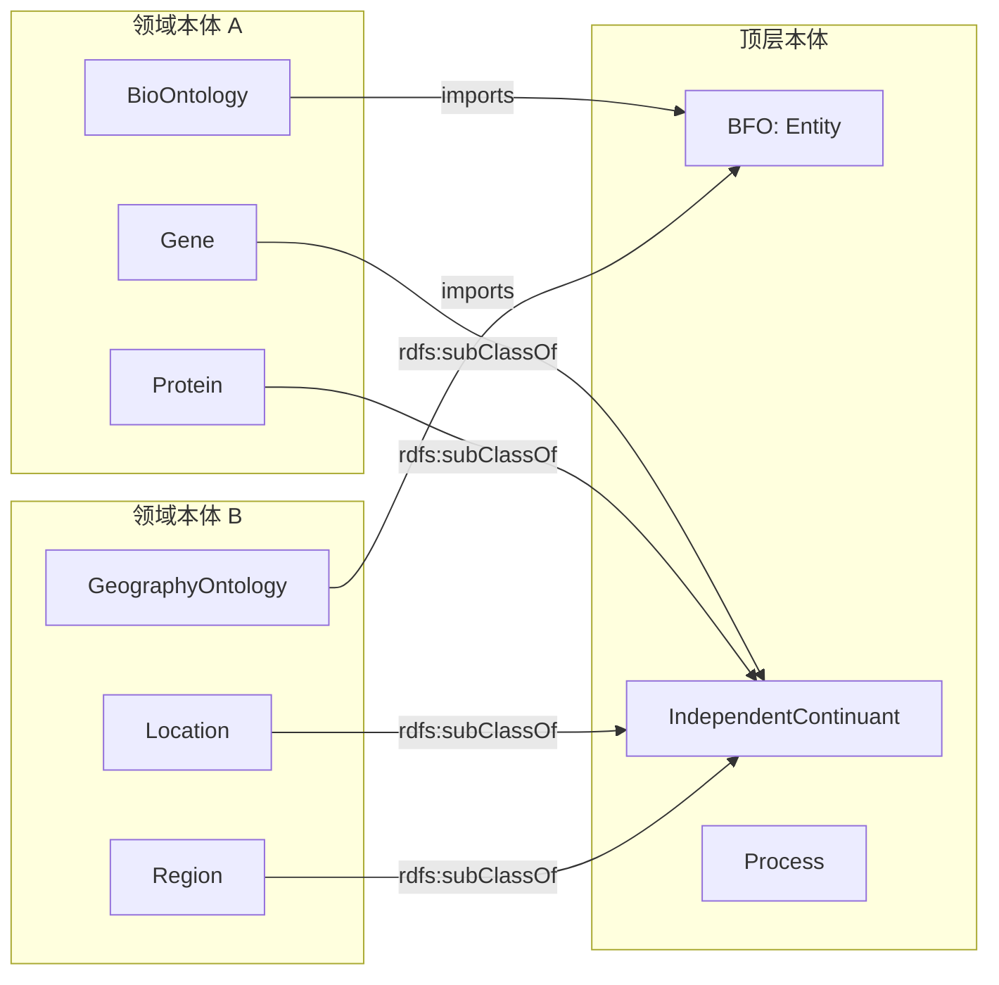
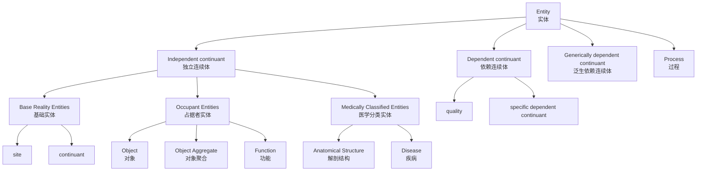
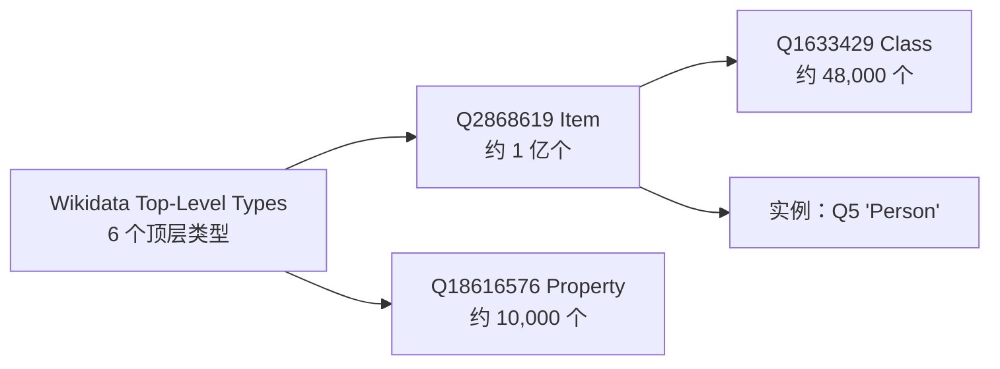

# 19.1 顶层本体（Upper Ontologies）

> **本节要点**：顶层本体（Upper Ontology）是对最一般概念（如 `实体`、`属性`、`关系`）的形式化规范，旨在实现跨领域知识表示的统一。本章将介绍 BFO、SUMO、UCO 三大主流顶层本体，并讨论它们在大型知识图谱项目中的应用。

---

## 1. 什么是顶层本体

**顶层本体**（Upper Ontology）也称为通用本体（Generic Ontology），旨在对涵盖所有领域共有的元概念（Meta-concepts）进行建模。与专注于特定领域（如生物医学、法律）的**领域本体**（Domain Ontology）不同，顶层本体关注的是"万物之通用描述"。

### 1.1 核心特征

| 特征 | 说明 |
|------|------|
| **高度抽象性** | 概念如 `实体`（Entity）、`属性`（Attribute）、`关系`（Relation）不依赖特定应用领域 |
| **跨领域互操作性** | 为不同领域本体提供统一词汇表，实现语义对齐 |
| **模块化设计** | 支持被其他本体按需导入和扩展 |
| **形式化语义** | 基于描述逻辑（Description Logic）或一阶逻辑，支持自动推理 |

### 1.2 顶层本体的作用



| 作用 | 场景说明 |
|------|----------|
| **统一词汇表** | 解决不同领域对同一概念的命名冲突（如"位置"在地形学与生理学中的不同含义） |
| **跨领域整合** | 支持将生物医学数据与地理空间数据在统一框架下进行关联分析 |
| **知识图谱基础设施** | 作为 Wikidata、DBpedia 等超大规模知识图谱的顶层/schema 基础 |
| **本体对齐参考** | 为不同领域本体之间的语义映射提供锚点 |

---

## 2. Basic Formal Ontology（BFO）

**基础形式本体**（Basic Formal Ontology, BFO）是当前最广泛使用的顶层本体之一，遵循 OBO 术语（Open Biomedical Ontology）的规范，被生物医学信息学领域广泛采用。

### 2.1 OBCS 分类体系

BFO 的核心层级基于 **OBCS** 分类（Entity Typology），将 `实体`（Entity）分为三大类别：



| 层级 | BFO 类 | 中文名称 | 示例 |
|------|--------|----------|------|
| **顶层** | `Entity` | 实体 | 一切存在的事物 |
| **独立连续体** | `Independent continuant` | 独立连续体 | 在某时刻独立存在的事物 |
| ↳ 基础 | `site` | 位点 | 细胞的质膜区域 |
| ↳ 基础 | `continuant` | 连续体 | 质量、形状等 |
| ↳ **BC（基础层）** | `Object` | 对象 | `atom`（原子）、`molecule`（分子） |
| ↳ **OC（占据层）** | `Object` | 对象 | `car`（汽车）、`tree`（树）— 随时间变化组成部分 |
| ↳ **OC** | `Function` | 功能 | `heart function`（心脏功能）— 依赖于对象的存在 |
| ↳ **MC（医学层）** | `Anatomical Structure` | 解剖结构 | `heart`（心脏）、`liver`（肝脏） |
| ↳ **MC** | `Disease or Syndrom` | 疾病或综合征 | `diabetes`（糖尿病）、`Alzheimer`（阿尔茨海默病） |
| **依赖连续体** | `Dependent continuant` | 依赖连续体 | 必须依附于独立连续体存在（如质量、角色） |
| **泛生依赖连续体** | `Generically dependent continuant` | 泛生依赖连续体 | 信息内容依赖（如书籍的内容、标签） |
| **过程** | `Process` | 过程 | 随时间展开的事件，如代谢、生长 |

### 2.2 BFO 在生物医学中的应用

BFO 是 **OBO  Foundry**（[obofoundry.org](https://obofoundry.org)）的强制顶层约束。所有 OBO 领域本体（如 `GO`、`DPO`、`UBERON`）都必须与 BFO 对齐。

| 领域本体 | BFO 对齐示例 |
|----------|-------------|
| **GO**（Gene Ontology，基因本体） | `GO:0008150` `biological_process` → `BFO:process` |
| **UBERON**（多物种解剖本体） | `UBERON:0002107` `heart` → `BFO:Anatomical Structure` |
| **DPO**（Disease Ontology，疾病本体） | `DPO:0000001` `diabetes` → `BFO:Disease or Syndrom` |

### 2.3 BFO 的 OWL 2 片段

```turtle
@prefix bfo: <http://purl.obolibrary.org/obo/BFO_> .
@prefix owl: <http://www.w3.org/2002/07/owl#> .
@prefix rdfs: <http://www.w3.org/2000/01/rdf-schema#> .

# BFO 顶层类定义
bfo:Entity a owl:Class ;
    rdfs:label "Entity" ;
    rdfs:comment "BFO 顶层类：一切存在的实体" .

# 独立连续体：不随时间变化的存在
bfo:IndependentContinuant a owl:Class ;
    rdfs:subClassOf bfo:Entity ;
    rdfs:label "Independent Continuant" .

# 解剖结构（医学分类层）
bfo:AnatomicalStructure a owl:Class ;
    rdfs:subClassOf bfo:IndependentContinuant ;
    rdfs:label "Anatomical Structure" .
```

---

## 3. Suggested Upper Merged Ontology（SUMO）

**建议上层合并本体**（Suggested Upper Merged Ontology, SUMO）由 Isaac Niles 和 Christopher Welther 在 2003 年开发，是一个基于一阶逻辑的形式化顶层本体，包含约 14,000 个类。

### 3.1 SUMO 的设计理念

SUMO 采用"合并"（Merging）策略，尝试整合来自 **WordNet**、**UML**、**DREME** 等不同源的本体元素，形成一个广泛的通用词汇表。

| 维度 | SUMO | BFO |
|------|------|-----|
| **逻辑基础** | 一阶逻辑（First-order Logic） | 基于描述逻辑 |
| **概念数量** | ~14,000 | ~300 |
| **目标领域** | 通用语义互操作 | 生物医学为主 |
| **工具支持** | SCoTL, SUMO 2 OWL 转换 | OBO 工具链完整 |

### 3.2 SUMO 的核心分类结构

```mermaid
graph TD
    SUMI["SUMI<br/>Summit"] --> Thing["Thing<br/>事物"]
    Thing --> Physical["Physical<br/>物理实体"]
    Thing >> Role["Role<br/>角色"]
    Thing >> Event["Event<br/>事件"]
    Thing >> Relational["Relational<br/>关系性实体"]
    Physical >> Object["Object<br/>对象"]
    Physical >> Region["Region<br/>区域"]
    Object >> MaterialObject["Material Object<br/>物质对象"]
    Event >> Process["Process<br/>过程"]
    Role >> Function["Function<br/>功能"]
```

### 3.3 SUMO 的衍生本体

SUMO 催生了多个衍生本体和社区贡献：

| 衍生本体 | 缩写 | 说明 |
|----------|------|------|
| **SIOC** | — | Social Information Exchange — 社交网络与信息交换本体 |
| **FOAF** | Friend of a Friend — 个人信息与社会关系本体 |
| **SUMO-WordNet** | — | SUMO 与 WordNet 的映射集，支持 NLP 应用 |

---

## 4. Unified Cover Ontology（UCO）

**统一覆盖本体**（Unified Cover Ontology, UCO）是一个较新的顶层本体框架，旨在提供一个统一的覆盖层，支持跨本体对齐和互操作。UCO 的设计原则是"足够简单以至于不会被反驳，足够复杂以至于是有用的"。

### 4.1 UCO 框架

UCO 的核心思想是使用"**核心**"（Core）→ "**扩展**"（Extensions）的模块化架构：

| UCO 层级 | 概念 | 说明 |
|----------|------|------|
| **UCO Core** | `Thing`, `Role`, `Event` | 最简顶层分类，约 40 个类 |
| **UCO Actor-Product-Process** | 角色-产品-过程扩展 | 扩展以描述参与者、产品和服务的关系 |
| **UCO Knowledge Model** | 知识建模扩展 | 描述代理者的知识状态和信念 |
| **UCO Provenance** | 来源/溯源扩展 | 描述数据或实体的来源链 |

### 4.2 UCO 与其他顶层本体的映射

| UCO Core 类 | BFO 对应 | SUMO 对应 |
|-------------|----------|-----------|
| `Thing` | `Entity` | `Thing` |
| `Agent` | 部分 → `IndependentContinuant` | `Agent` |
| `SocialAgent` | — | `SocialAgent` |
| `Artifact` | `Object` | `Artifact` |
| `Process` | `Process` | `Process` |

---

## 5. 顶层本体在大型知识图谱中的应用

### 5.1 Wikidata

**Wikidata** 的顶层分类结构直接映射到 BFO 概念：

| Wikidata 层级 | BFO 顶层 | 示例 |
|---------------|----------|------|
| `Q3978437` "top-level type" | `bfo:Entity` | — |
| `Q28174` "class" | `bfo:IndependentContinuant` | 抽象概念 |
| `Q5` "item" | `bfo:IndependentContinuant` / `Process` | `Q1904` "bird" (类), `Q16521` "dawn chorus" (过程) |



### 5.2 DBpedia

**DBpedia** 使用其自身的 **DBpedia Ontology** 作为顶层分类：

| DBpedia 类 | OWL 等效 | 说明 |
|------------|----------|------|
| `dbo:Place` | `owl:Class` | 所有地点类（城市、山脉、河流）的顶层 |
| `dbo:Place` → `dbo:Settlement` | `rdfs:subClassOf` | 人类定居点 |
| `dbo:Person` | `owl:Class` | 人类人物 |

### 5.3 选择顶层本体的考量因素

| 因素 | BFO | SUMO | UCO |
|------|-----|------|-----|
| 生物医学项目 | ✅ **强烈推荐**（OBO 标准） | ⚠️ 可选 | ❌ 未广泛采用 |
| NLP / WordNet | ❌ | ✅ **推荐** | ⚠️ |
| 本体对齐 / 元建模 | ⚠️ | ⚠️ | ✅ **推荐** |
| 简单性 | ✅ **核心约 300 类** | ❌ ~14,000 类 | ✅ **Core 约 40 类** |

---

## 6. 小结

顶层本体构成了语义网络和知识图谱的"基础设施"。它们提供了最抽象的概念层，使得不同领域本体可以在统一框架下进行整合和推理。在本体工程的实践中，根据项目领域（如生物医学、通用语义、本体对齐）选择合适的顶层本体，是构建高质量知识系统的重要步骤。

| 关键概念 | 术语对照 |
|----------|----------|
| Upper Ontology | 顶层本体 |
| Entity Typology | 实体类型学 |
| BFO | 基础形式本体 |
| OBCS | 基础/占据/医学分类 |
| SUMO | 建议上层合并本体 |
| UCO | 统一覆盖本体 |