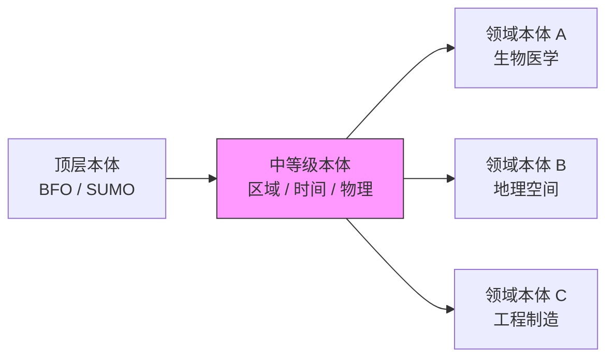
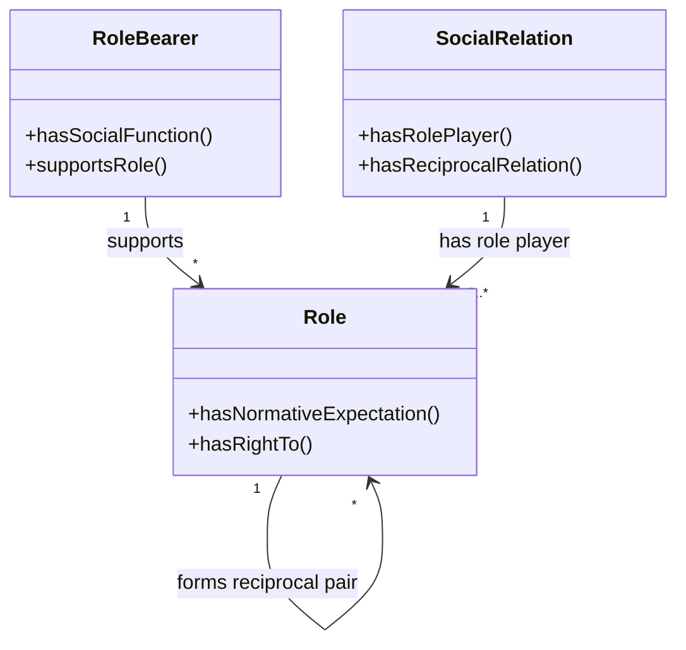
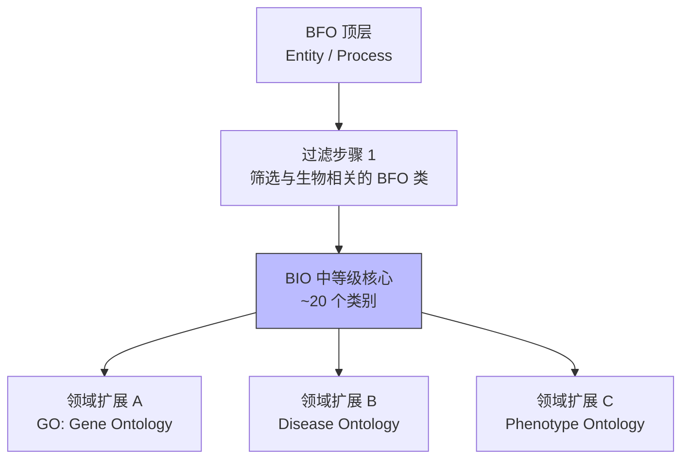

# 19.2 中等级本体（Mid-level Ontologies）

> **本节要点**：中等级本体（Mid-level Ontology）是介于顶层本体与领域本体之间的"桥接"抽象层。本章将介绍 GFO（General Formal Ontology）的层级体系，并以 BIO（Biological Process Ontology）为例，展示如何从 BFO 等顶层本体衍生出中等级体系，用于领域适配。

---

## 1. 中等级本体的定位

**中等级本体**（Mid-level Ontology）填补了顶层本体（过度抽象）和领域本体（过度具体）之间的语义鸿沟，提供特定上下文下足够具体的通用范畴，使领域本体能够高效映射和复用。

| 层级 | 抽象程度 | 概念数 | 典型代表 |
|------|----------|--------|----------|
| 顶层（Upper） | 极高——"一切存在" | ~30–300 | BFO, SUMO, GFO |
| **中等级（Mid-level）** | 中等——跨多个领域通用 | ~100–1,000 | BFO-Mid, GFO, SWEET |
| 领域（Domain） | 低——特定学科领域 | 数百–数万 | GO, UBERON, DPO, FOAF |

### 1.1 中等级本体的核心功能



| 功能 | 说明 |
|------|------|
| **范畴实例化** | 将顶层的 `Entity` 实例化为更具约束力的中间范畴（如 `Spatial Region`、`Temporal Duration`） |
| **跨领域桥接** | 允许地理数据与生物医学数据共享 `Spatial Region` 这一中间范畴，而非直接在 BFO 顶层做映射 |
| **渐进抽象** | 使领域专家可以从自己领域所需的抽象层级出发，而非从零面对顶层本体中数百个极抽象的范畴 |

### 1.2 何时需要中等级本体？

| 场景 | 顶层本体直接映射 | 通过中等级本体 |
|------|-----------------|---------------|
| 3 个独立领域，共 15 个本体 | 15 个本体各自对齐顶层（15 对 N） | 15 个本体各自对齐中等级（15 对 M），中等级对顶层（M 对 N） |
| 新增领域扩展 | 每新增一个本体都要理解全套顶层范畴 | 只需理解中等级中与领域相关的范畴 |
| 语义歧义 | BFO 的 `Object` 可以指汽车、细胞、器官 | 引入 `Physical Object` 中等级类后，"汽车" 映射到 `Physical Object`，"细胞" 映射到 `Cellular Entity` |

---

## 2. General Formal Ontology（GFO）

**一般形式本体**（General Formal Ontology, GFO）由 Bernt Lang 开发，既是一个完整的顶层本体，又被广泛用作中等级本体的框架。GFO 在德语区学术界影响尤为显著。

### 2.1 GFO 的层级体系

GFO 的核心分类体系包含三层抽象：

| 层级 | GFO 类 | 说明 |
|------|--------|------|
| **顶层** | `Entity` | 一切存在的事物 |
| **中等级（一级分类）** | `NaturalEntity` | 自然实体——具有内在本质的物理事物 |
| | `SocialEntity` | 社会实体——由群体约定俗成赋意的事物 |
| | `Process` | 过程——展开于时间中的事件流 |
| **中等级（二级分类：NaturalEntity）** | `PhysicalThing` | 物理事物——基本单元，如原子、电子 |
| | `PhysicalObject` | 物理对象——由物理事物复合而成，如石头、树 |
| | `PhysicalSystem` | 物理系统——由物体构成并具有特定功能，如钟表、引擎 |
| **中等级（二级分类：SocialEntity）** | `Artifact` | 人工制品——社会赋意的物理对象，如货币、汽车（社会角色） |
| | `Institution` | 制度——社会规范和规则的聚合 |
| | `Role` | 角色——社会实体在关系网络中的位置 |

### 2.2 GFO 的独特公理

GFO 以其严谨的形式化公理著称，以下是几个代表性示例：

#### 2.2.1 同一性公理（Identity Axiom）

GFO 严格区分了**物理同一性**与**社会同一性**：

```turtle
# GFO 中 Artifact 的定义
@gfo: <http://www.gnu.org/proper/gfo#> .
@prefix owl: <http://www.w3.org/2002/07/owl#> .
@prefix rdfs: <http://www.w3.org/2000/01/rdf-schema#> .

gfo:Artifact
    a owl:Class ;
    rdfs:subClassOf gfo:SocialEntity ;
    rdfs:subClassOf [
        a owl:Restriction ;
        owl:onProperty gfo:supportsRole ;
        owl:someValuesFrom gfo:PhysicalObject
    ] ;
    rdfs:comment "人工制品是由物理对象支撑的社会实体——一枚硬币同时也是 PhysicalObject，但作为 Artifact 它具有社会约定的 '货币' 角色" .
```

| 概念 | 含义 | 示例 |
|------|------|------|
| `PhysicalThing` | 最基本的物理单元，由其物理属性定义 | 一个金原子 |
| `PhysicalObject` | 由物理事物复合而成 | 一枚金币 |
| `Artifact` | 同一物理对象承载的社会角色 | 作为"一盎司黄金"的金币 |
| **分离原则** | 同一物理对象可在不同时刻失去/获得社会角色 | 金币被熔化后不再作为 Artifact 存在，但其 PhysicalObject 仍在 |

#### 2.2.2 关系与角色公理



| GFO 关系 | 方向 | 说明 |
|----------|------|------|
| `supportsRole` | `SocialEntity` → `Role` | 社会实体（人/组织/物品）承载某个角色 |
| `hasNormativeExpectation` | `Role` → `Norm` | 角色附带规范性期望 |
| `hasReciprocalRelation` | `Role` ↔ `Role` | 角色通常成对出现（"雇主" ↔ "雇员"） |

---

## 3. 从顶层到领域：BFO 到 BIO 的衍生路径

以 **BIO（Biological Process Ontology）** 为例，展示如何从 BFO 顶层本体派生出一个专门面向生物学过程的**中等级体系**。

### 3.1 衍生步骤



| 步骤 | 操作 | 输出 |
|------|------|------|
| **1. 过滤** | 从 BFO 中挑选与生物学相关的顶层类 | `Process`, `IndependentContinuant`, `Quality` |
| **2. 扩展** | 在这些顶层类下方创建中等级子类 | `BiologicalProcess` → `CellularProcess` → `MetabolicProcess` |
| **3. 对齐** | 确保新类与现有领域本体一致 | 复用 GO、UBERON 中已定义的类 |

### 3.2 BIO 中等级体系示例

```mermaid
graph TD
    BFO_Process["BFO:Process"] --> BioProcess["BIO: BiologicalProcess"]
    BioProcess --> CellularProc["CellularProcess"]
    BioProcess --> OrganismalProc["OrganismalProcess"]
    
    CellularProc --> Metabolism["MetabolicProcess"]
    CellularProc --> Signaling["SignalTransduction"]
    CellularProc --> Division["CellDivision"]
    
    OrganismalProc --> Development["DevelopmentalProcess"]
    OrganismalProc --> Homeostasis["HomeostaticProcess"]
    
    BioProcess --> ~includes~ Response["StressResponse"]
```

| BIO 中等级类 | rdfs:subClassOf | 说明 |
|--------------|-----------------|------|
| `BiologicalProcess` | `bfo:Process` | 所有生物过程的顶层 |
| `CellularProcess` | `Bio:BiologicalProcess` | 发生在细胞内部的过程 |
| `MetabolicProcess` | `Bio:CellularProcess` | 代谢过程（如糖酵解、柠檬酸循环） |
| `OrganismalProcess` | `Bio:BiologicalProcess` | 发生在有机体水平的过程 |
| `StressResponse` | `Bio:BiologicalProcess` | 生物体对压力刺激的响应过程 |

### 3.3 与 GO（Gene Ontology）的对齐

BIO 的中等级体系最终服务于 GO 的"生物学过程"（Biological Process）分支的**父范畴消解**（Parent Term Resolution）：

| GO 节点 | GO Term | BIO 中等级映射 | BFO 顶层映射 |
|---------|---------|---------------|-------------|
| `GO:0008150` | `biological_process` | `BIO:BiologicalProcess` | `bfo:Process` |
| `GO:0006355` | `regulation of gene expression` | `BIO:Regulation` → `BIO:GeneExpression` | `bfo:Process` |
| `GO:0007049` | `cell cycle` | `BIO:CellularProcess` → `BIO:CellDivision` | `bfo:Process` |

---

## 4. 构建中等级本体的实践建议

### 4.1 何时自建中等级本体？

| 条件 | 建议 |
|------|------|
| 领域本体数量 ≥ 5 个且有共同词汇重叠 | ✅ 强烈建议建设中等级本体以归一化这些概念 |
| 需要对接不同顶层本体（如同时使用 BFO 和 SUMO） | ✅ 中等级可作为适配层，减少映射数量 |
| 仅有单个领域本体 | ❌ 可能不需要——直接使用顶层 + 领域本体即可 |
| 团队无法理解中等级层面的抽象 | ❌ 过度抽象反而会降低可用性 |

### 4.2 中等级本体设计检查清单

| 检查项 | 说明 |
|--------|------|
| ✅ 是否与顶层本体严格对齐 | 每一层中等级类都应最终追踪到顶层类的 `rdfs:subClassOf` 链 |
| ✅ 是否避免了领域特异性过强的概念 | "血糖浓度"不应进入中等级，但"生物指标"可以 |
| ✅ 是否经过领域专家评审 | 中等级分类需要来自相关领域的学科专家认可 |
| ✅ 是否有明确的命名规范 | 例如统一使用 Latinized English（拉丁化英语）作为类名 |

---

## 5. 小结

中等级本体在本体工程实践中扮演了**承上启下**的关键角色。它们使领域本体设计者不必直接面对顶层本体中数百个高度抽象的范畴，同时也避免了每个领域本体各自发明一套通用范畴导致的互操作性问题。GFO 和中等级 BFO 衍生（如 BIO）是这方面的代表性实践。

| 关键概念 | 术语对照 |
|----------|----------|
| Mid-level Ontology | 中等级本体 |
| Semantic Gap | 语义鸿沟 |
| GFO | 一般形式本体 |
| Role-Bearer / Role 分离 | 承载者/角色分离 |
| Biological Process Ontology | 生物过程本体（BIO） |
| Parent Term Resolution | 父范畴消解 |