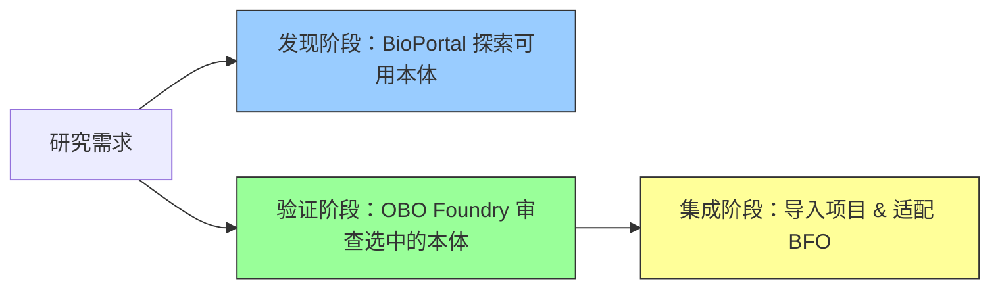
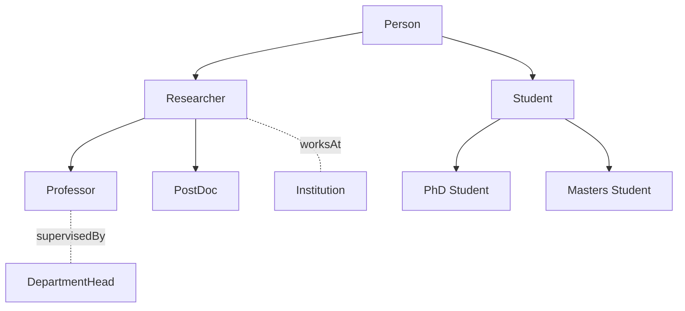
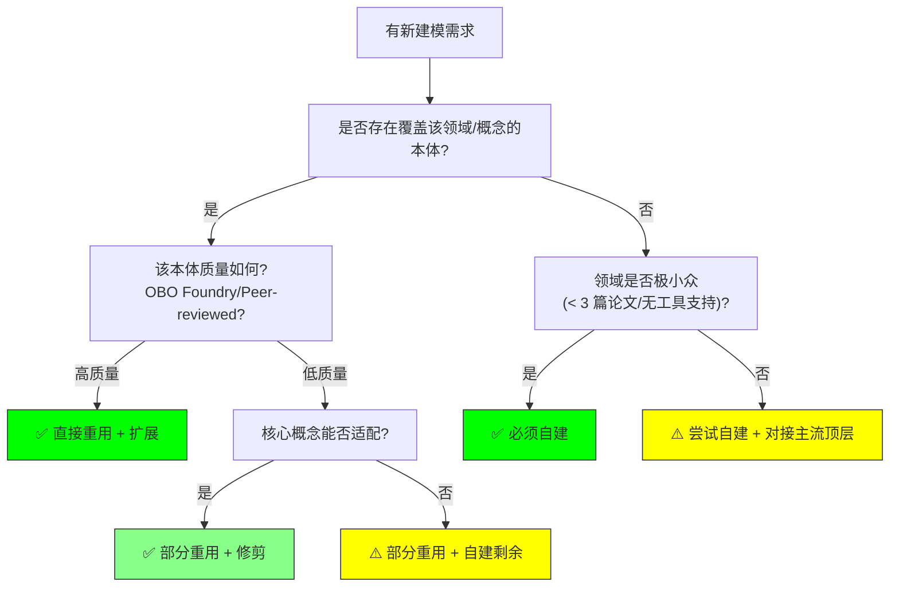

# 19.3 领域本体（Domain Ontologies）

> **本节要点**：领域本体（Domain Ontology）是针对特定知识领域（如生物医学、地理学、法律等）的概念体系建模。本章将介绍本体仓库与注册表生态、深入分析 OWL 2 参考本体与 Protégé 本体生态，并提供"自建 vs 重用"本体的实践决策框架。

---

## 1. 本体仓库与注册表

本体并非闭门造车的产物——整个语义网社区建立了多个仓库和注册表，用于存储、发现、版本管理和评审领域本体。

### 1.1 主流本体仓库

| 仓库名称 | 缩写 | 维护机构 | 本体数量 | 特点 |
|----------|------|----------|----------|------|
| **Open Biomedical Ontology Foundry** | OBO Foundry | 社区协作 | ~300+ | 质量审查严格，强制顶层对齐（BFO） |
| **NCBO BioPortal** | — | 美国国立医学图书馆 | ~2,000+ | 收录广泛，无需质量审查 |
| **LOV** | LOV (Linked Open Vocabularies) | 英国开放数据研究所 | ~600+ | 专注于 Linked Data 友好的词汇表 |
| **KGX / Semantic Scholar** | — | AI2 (Allen Institute) | ~500+ | 面向知识图谱构建的本体集合 |
| **EuroVoc** | — | 欧盟官方出版局 | ~7,600 | 欧洲政策和文献的主题词表 |

### 1.2 OBO Foundry 与 BioPortal 的对比

| 维度 | OBO Foundry | NCBO BioPortal |
|------|-------------|---------------|
| **收录标准** | 强制性审查：唯一性、BFO 对齐、同行评审 | 开放性收录：任何提交的本体均可 |
| **版本控制** | 强制使用 Git | 支持 |
| **顶层本体约束** | 必须映射到 BFO | 无强制要求 |
| **适用场景** | 需要高质量、可互操作本体时 | 广泛探索某个领域的可用资源 |
| **检索方式** | OBO Graph (obo.dev) | BioPortal API + 可视化 |



### 1.3 LOV（Linked Open Vocabularies）

LOV 专注于将本体词汇表暴露为 **Linked Data**：

| 特色 | 说明 |
|------|------|
| **SPARQL 端点** | 可直接查询 [lov.linkeddata.org/dataset/lov](http://lov.linkeddata.org/dataset/lov) |
| **命名空间发现** | 输入 `schema.org` 即返回其所有命名空间 URI 和对应前缀声明 |
| **跨词表映射** | 自动检测 `owl:sameAs`、`rdfs:subClassOf` 关系（如 FOAF ≈ DBpedia 属性） |

---

## 2. OWL 2 参考本体（OWL 2 Reference Ontologies）

**OWL 2 Pro 规范**（[W3C Recommendation, 附录 E](https://www.w3.org/TR/owl2-profiles/#Profiling_of_OWL_2_Pro)）列出了一系列参考本体，用于展示和验证不同 Profile（DL、 EL、 QL）的表达能力和推理能力。

### 2.1 Pizza 本体 —— EL Profile 的明星案例

虽然 Pizza 本体（Pizza Ontology）主要是作为教学工具在 Protégé 编辑器中自带，但它也是 OWL 2 EL Profile 的典型参考实现：

```mermaid
classDiagram
    class CannedPizza {
        +CheesyPizza
        +PepperoniPizza
        +FourCheesesPizza
    }
    class RegionalPizza {
        +Margherita
        +QuattroFormaggi
    }
    class Base {
        +ThinCrustPizza
        +ThickCrustPizza
    }
    
    CannedPizza --> RegionalPizza : rdfs:subClassOf
    RegionalPizza --> Base : rdfs:subClassOf
```

| Pizza 本体类 | OWL 2 EL 公理表达 | 说明 |
|-------------|-------------------|------|
| `ThinAndCrustPizza` | `rdfs:subClassOf (ThinBase and Crusty)` | 使用类表达式交集 |
| `ThinCrustCheesyPizza` | `rdfs:subClassOf (ThinBase and Crusty and (hasTopping some Cheese))` | 限制 + 存在量化 |
| `PepperoniPizza` | `rdfs:subClassOf (Pizza and (hasTopping only (Pepperoni or Cheese)))` | 完全限制 |

### 2.2 OWL 2 DL 参考本体：Swanes

**Swan-E**（Semantic Web in Aerospace）是航空航天领域参考本体，展示了 OWL 2 DL Profile 的表达能力：

| 类层次 | 示例 |
|--------|------|
| `SwanThing` → `Physical` → `Device` | `Engine`, `Propeller` |
| `SwanThing` → `Event` → `FlightOperation` | `Takeoff`, `Landing`, `Cruise` |
| `SwanThing` → `Role` | `Pilot`, `Controller` |

### 2.3 OWL 2 QL 参考本体：Lubm

**Lehigh University Benchmark (LUBM)** 是最著名的 OWL 2 QL Profile 参考数据集：

| 本体规模 | 数值 |
|----------|------|
| 类数量 | 26 个（Faculty, Student, Course, Department 等） |
| 数据属性 | ~10 个 |
| 对象属性 | ~5 个（takesCourse, advisor, subFieldOf） |
| 典型实例数 | University → 1, Student → ~40,000, Course → ~30,000 |

```mermaid
graph TD
    Univ["University"] --> Dept["Department"]
    Dept --> Fac["Faculty"]
    Dept --> GradStud["GraduateStudent"]
    Dept --> UnderGradStud["UndergraduateStudent"]
    Fac --> Course["Course"]
    GradStud --> Course
    UnderGradStud --> Course
    
    Dept2["Department"] --> "subDepartmentOf" Dept
```

| LUBM 核心类 | 关系（对象属性） | 说明 |
|-------------|------------------|------|
| `University` | hasDepartment | 大学包含院系 |
| `Faculty` | teaches | 教授授课 |
| `GraduateStudent` | takesCourse | 研究生选课 |
| `Course` | hasPrerequisite | 课程先修要求 |

---

## 3. PROTO (Protégé) 用户贡献的本体生态

**Protégé**（斯坦福大学开发的本体编辑工具）拥有全球最活跃的本体社区，大量用户贡献的本体可下载到社区本体库（Community Ontologies）中。

### 3.1 Protégé Community Ontologies 统计

截至 2025 年，Protégé 平台收录的社区本体超过 **2,500 个**，覆盖多个领域：

| 领域 | 示例本体 | 本体规模（类） |
|------|----------|---------------|
| **通用/描述** | `Person-Ontology` | 15–30 |
| **电影** | `Movie-Ontology` | 10–20 |
| **生物医学** | `FoodBite`（食品）, `SkinDisease`（皮肤病） | 50–500 |
| **环境/气候** | `EnvironO`（环境） | 100–300 |
| **建筑** | `BuildingSMART` | 500–2,000 |
| **法律** | `JurisParty`（司法党争）, `Italian Law` | 50–200 |

### 3.2 代表性社区本体示例

#### 3.2.1 Person-Ontology（人物本体）

一个小型通用人物描述本体：



| Person-Ontology 类 | 说明 |
|-------------------|------|
| `Person` | 顶层人物类 |
| `Researcher` | 从事研究的人员 |
| `Professor` | 教授 |
| `PostDoc` | 博士后研究员 |
| `Student` | 学生 |
| `PhDStudent` | 博士研究生 |

#### 3.2.2 Food Ontology（食品本体）

| 食物层级 | 类 |
|----------|-----|
| `Food` | 顶级类 |
| ↳ `Fruit` | 水果 |
| ↳ `Vegetable` | 蔬菜 |
| ↳ `DairyProduct` | 乳制品 |
| ↳ `Beverage` | 饮品 |

---

## 4. 本体选择原则：自建 vs 重用

在选择或开发本体时，领域专家面临的核心问题是：**我应该从零开始自建本体，还是重用现有的领域本体？**

### 4.1 决策框架



| 决策节点 | 判断标准 | 建议 |
|----------|----------|------|
| **存在覆盖的本体？** | 在 BioPortal / LOV / OBO 搜索后 | 若找到 ≥ 70% 覆盖 → 重用 |
| **质量可接受？** | 有明确维护者、发布版本、引用文献 | 是 → 选择重用；否 → 寻找替代 |
| **概念可适配？** | 本体类名和关系方向与需求一致 | 是 → 部分扩展；否 → 自建该部分 |
| **小众领域？** | 仅 1–2 篇论文、无可复用资源 | 自建，并尝试映射到 BFO / GFO |

### 4.2 重用本体的最佳实践

| 实践 | 说明 |
|------|------|
| **明确来源和许可证** | 在 `owl:versionInfo` 和 `dct:bibliographicCitation` 中记录重用信息 |
| **使用前缀声明（Prefix Declaration）** | `prefix obo: <http://purl.obolibrary.org/obo/>` |
| **按需导入（Just-in-Time Import）** | 不要直接 import 整个大型本体，提取需要的类（Use the `owl:imports` 的变通：在 SPARQL 查询中远程访问） |
| **扩展而非重写** | 使用 `rdfs:subClassOf` 扩展而非重新建模 |

### 4.3 自建本体时的建议

| 建议 | 说明 |
|------|------|
| **从顶层本体开始** | 优先使用 BFO 或 UCO Core，不要从零发明分类 |
| **定义范围声明（Scope Statement）** | 在每个类的 `rdfs:comment` 中编写明确的自然语言定义 |
| **逐步迭代** | 先用 10–20 个核心类验证领域专家的认可度，再逐步扩展 |
| **使用自动化质量检查** | 每完成一个版本运行 OntoMetrics 检查 |

---

## 5. 小结

主流领域本体生态由**仓库注册表**（OBO Foundry、BioPortal、LOV）支撑，为知识工作者提供了丰富的可重用资源。OWL 2 参考本体系列（从教学性的 Pizza 到工业性的 LUBM）展示了不同 OWL 2 Profile 的表达能力边界。在实际项目中，**"重用最少的、自建必要的"** 原则是本体工程的主流范式。

| 关键概念 | 术语对照 |
|----------|----------|
| Domain Ontology | 领域本体 |
| OBO Foundry | 开放生物医学本体工厂 |
| BioPortal | 国家生物医学本体门户 |
| LOV | 链接开放词汇表 |
| OWL 2 Reference Ontology | OWL 2 参考本体 |
| Pizza Ontology | 比萨本体（教学参考） |
| LUBM | 列日大学基准（本体评测基准） |
| Protégé Community Ontologies | Protégé 社区本体库 |
| Reuse vs Build | 重用 vs 自建原则 |