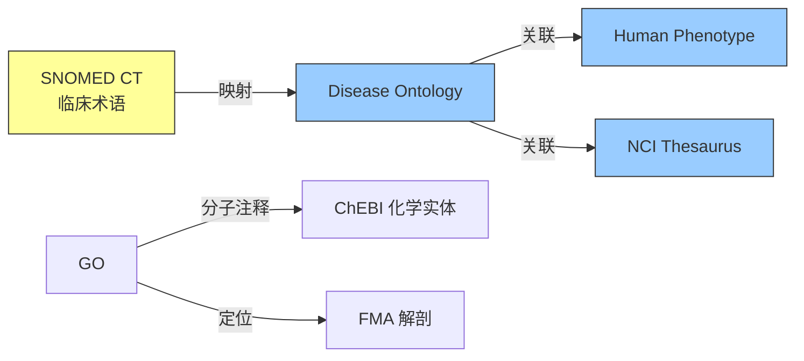
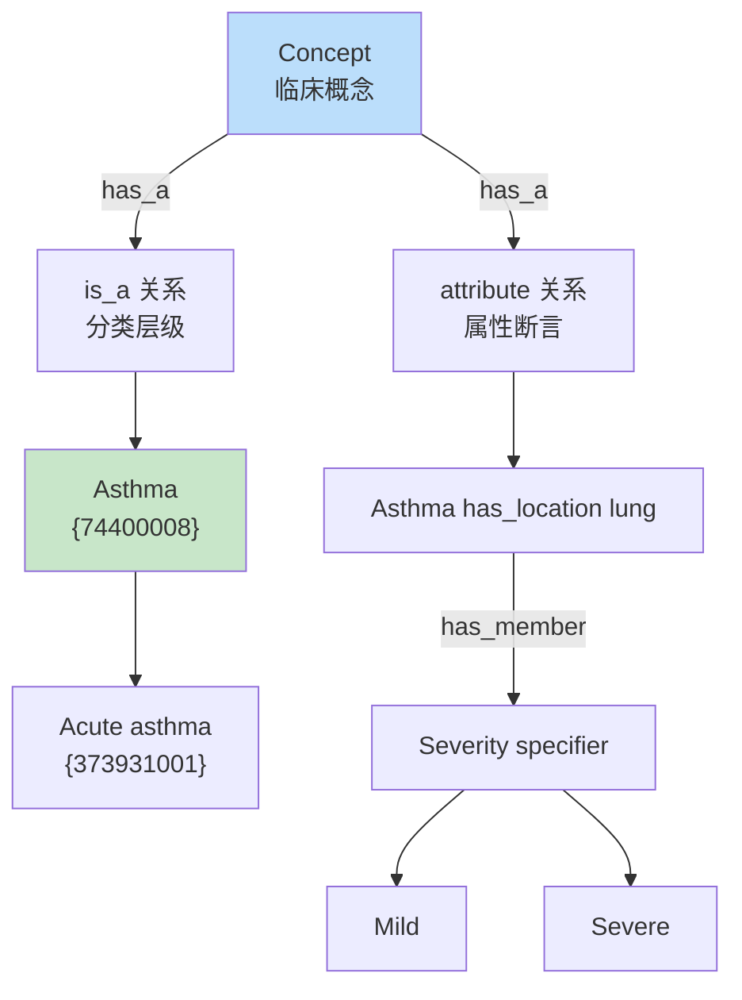
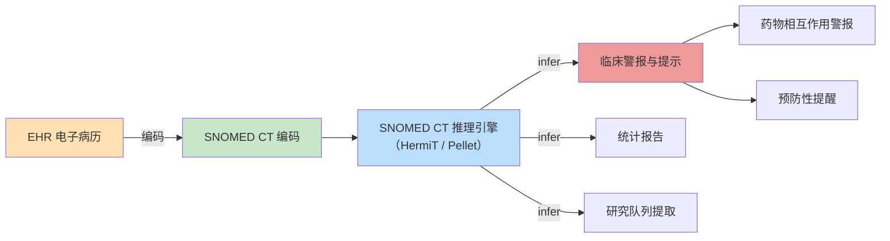
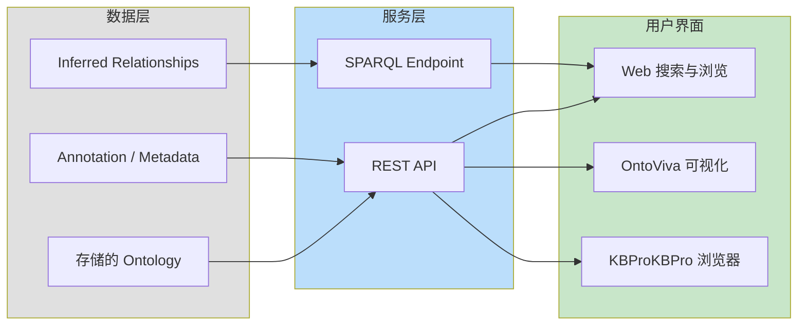

# 20.1 生物医学领域

> **本节要点**：生物医学领域是本体和语义网技术最早落地、也是应用最深入的领域之一。本章将介绍生物本体学（Bio Ontology）的核心资源、SNOMED CT 在临床决策支持中的实战应用、FMA 对人体结构的标准化建模，以及 BioPortal 平台的案例分析。

---

## 1. 生物本体学的起源与发展

生物本体学（Bio Ontology）是本体工程在生物学和生物信息学交叉领域的专门分支，其核心目标是为生命科学中的概念、实体和关系建立形式化的、机器可读的描述。

### 1.1 发展里程碑

| 年份 | 事件 | 意义 |
|------|------|------|
| 1998 | Gene Ontology（GO）项目启动 | 首个大规模生物本体，统一基因产物描述 |
| 2000 | OBO 格式发布（OBO Foundry 前身） | 定义生物本体交换的标准格式 |
| 2004 | OBO Foundry 正式成立 | 建立本体互操作的哲学原则与最佳实践 |
| 2010 | Disease Ontology（DO）发布 1.0 | 系统化疾病分类的本体建模 |
| 2015 | UBERON 多物种解剖本体完成 | 跨物种解剖结构的映射统一 |
| 2022 | GO 包含超过 43,000 个概念 | 生物本体规模持续指数增长 |

### 1.2 Gene Ontology（GO）

Gene Ontology 是目前应用最广泛的生物本体，为基因和基因产物提供统一的分类框架。GO 由三个独立的词汇表（Ontologies）组成：

| GO 分支 | 英文全称 | 描述 | 概念数量 |
|---------|----------|------|----------|
| **细胞组分** | Cellular Component（CC） | 细胞的物理位置 | ~4,400 |
| **分子功能** | Molecular Function（MF） | 分子水平的活性 | ~11,000 |
| **生物学过程** | Biological Process（BP） | 分子事件组成的更大目标 | ~27,000 |

```mermaid
graph TB
    subgraph GO["Gene Ontology"]
        CC["Cellular Component<br/>细胞组分"]
        MF["Molecular Function<br/>分子功能"]
        BP["Biological Process<br/>生物学过程"]
    end
    
    subgraph CC_Example["CC 示例层级"]
        cell["cell"] --> membrane["membrane"]
        membrane --> nucleus["nucleus"]
        nucleus ["nucleus"] --> nucleolus["nucleolus"]
    end
    
    subgraph MF_Example["MF 示例层级"]
        binding["binding"] --> nucleic_acid_binding["nucleic acid binding"]
        nucleic_acid_binding --> rna_binding["rna binding"]
    end
    
    subgraph BP_Example["BP 示例层级"]
        cellular_process["cellular process"] --> metabolic_process["metabolic process"]
        metabolic_process --> gene_expression["gene expression"]
        gene_expression --> transcription["transcription"]
    end
    
    style GO fill:#e1f5fe
    style CC fill:#b3e5fc
    style MF fill:#b3e5fc
    style BP fill:#b3e5fc
```

**GO 本体声明示例（Turtle 格式）**：

```turtle
@prefix GO: <http://purl.obolibrary.org/obo/GO_> .
@prefix rdfs: <http://www.w3.org/2000/01/rdf-s#> .
@prefix owl: <http://www.w3.org/2002/07/owl#> .

# 生物学过程分支
GO:0008150 a owl:Class ;
    rdfs:label "biological_process" ;
    rdfs:subClassOf GO:0003674 ;  # molecular_function
    rdfs:definition "A biological process is a biological process is a biological phenomenon manifested at the level of processes and aims." .

# 转录过程
GO:0006351 a owl:Class ;
    rdfs:label "transcription" ;
    rdfs:subClassOf GO:0010556 ;  # regulation of biological process
    rdfs:definition "The cellular metabolic process of synthesis of RNA from a template." .

# RNA 结合分子功能
GO:0003676 a owl:Class ;
    rdfs:label "nucleic acid binding" ;
    rdfs:subClassOf GO:0005488 ;  # binding
    rdfs:definition "Any interaction of a protein with a nucleic acid or portion thereof." .
```

### 1.3 其他核心生物本体

| 本体名称 | 缩写 | 主题领域 | 维护组织 |
|---------|------|----------|----------|
| **Disease Ontology** | DO | 人类疾病的系统化分类 | 杜克大学 |
| **NCBI Thesaurus** | NCIT | 癌症和毒性生物学 | 美国国立医学图书馆 |
| **Human Phenotype Ontology** | HPO | 人类表型异常 | 柏林夏里医院 |
| **Chemical Entities of Biological Interest** | ChEBI | 化学小分子 | 澳大利亚国立大学 |
| **Sequence Ontology** | SO | 序列特征 | 社区协作 |
| **Pathway Ontology** | PAO | 代谢与信号通路 | 社区协作 |

**SNOMED CT、GO 与其他生物本体的关系**：



---

## 2. SNOMED CT 在临床决策支持中的应用

Systematized Nomenclature of Medicine — Clinical Terms（SNOMED CT）是全球最大的生物医学临床术语集，由美国国家医学图书馆（NLM）下属的 SNOWMAP 组织维护。

### 2.1 SNOMED CT 的规模与结构

| 统计维度 | 数值（截至 2024） |
|----------|------------------|
| 概念总数 | ~350,000 |
| 描述（ synonym ）总数 | ~4,000,000 |
| 关系（关系断言） | ~42,000,000 |
| 支持语言 | 50+ 种语言版本 |
| 采用国家 | 70+ 个国家和地区 |

SNOMED CT 采用**层级结构（Hierarchy）**和**定义性关系（Defining Relationships）**两层建模：



**SNOMED CT 关系示例（OWL2 表示）**：

```turtle
@prefix sct: <http://snomed.info/sct/> .
@prefix owl: <http://www.w3.org/2002/07/owl#> .
@prefix rdf: <http://www.w3.org/1999/02/22-rdf-syntax-ns#> .

# Acute asthma 是 asthma 的子类
sct:373931001 a owl:Class ;
    rdfs:label "Acute asthma" ;
    owl:annotatedSource sct:373931001 ;
    owl:annotatedProperty owl:rdfs=subClassOf ;
    owl:annotatedTarget sct:74400008 .  # Asthma

# Asthma 有解剖位置：肺
sct:74400008 a owl:Class ;
    rdfs:label "Asthma" ;
    owl:annotatedProperty sct:116680003 ;  # has_interpretation
    owl:annotatedTarget <http://snomed.info/sct/74984009> .  # lung
```

### 2.2 临床决策支持（CDS）

SNOMED CT 在临床决策支持系统（Clinical Decision Support System, CDS）中的应用核心在于**推理（Reasoning）**：



**典型推理规则示例**：

如果某患者的诊断包含 `Pneumonia (disorder)`，且 `Pneumonia` 的定义性关系表明它 **only\_related\_to** `Lung`，则 CDS 系统可以自动推断病变位于肺部，进而：
- 触发针对肺部感染的抗生素推荐（Drug-Drug Interaction Check）
- 生成流行病学统计报表（Reporting）
- 自动纳入呼吸研究队列（Clinical Trial Matching）

---

## 3. FMA（Foundational Model of Anatomy）与人體标准化

Foundational Model of Anatomy（FMA）是一个形式化的、多层级的解剖学本体，描述了人体结构之间的拓扑关系。它是 OBO Foundry 的核心本体之一，并以 Basic Formal Ontology（BFO）作为顶层。

### 3.1 FMA 的核心特征

| 特征 | 描述 |
|------|------|
| **拓扑优先** | 强调组成部分之间的空间关系（如 part\_of） |
| **分层编号系统** | 每个解剖实体有唯一数字标识 |
| **形式化公理** | 基于描述逻辑，支持自动化推理 |
| **跨物种扩展** | 与 Uberon 本体对齐，支持比较解剖学 |

### 3.2 FMA 概念结构

```mermaid
graph TD
    body["Body (12566008)"] --> trunk["Trunk (8914008)"]
    body --> upper_extremity["Upper extremity (51254003)"]
    body --> lower_extremity["Lower extremity (52548007)"]
    
    trunk --> thorax["Thorax (102937003)"]
    thorax --> lung["Lung (32382002)"]
    
    lung --> right_lung["Right lung (45748007)"]
    lung --> left_lung ["Left lung (13942009)"]
    
    right_lung --> upper_lobe["Right upper lobe (59974005)"]
    
    style body fill:#bbdefb
    style thorax fill:#c8e6c9
    style lung fill:#ffcc80
    style right_lung fill:#ef9a9a
    style upper_lobe fill:#ff9e80
```

**FMA Turtle 示例**：

```turtle
@prefix fma: <http://purl.org/umdicl/ontologies/fma-large#> .
@prefix owl: <http://www.w3.org/2002/07/owl#> .

# 右肺是肺的 part_of
<http://purl.org/fma/45748007> a owl:Class ;
    rdfs:label "Right lung" ;
    owl:equivalentClass [
        owl:intersectionOf (
            [ a owl:Class ; owl:withRestrictions ( [ rdf:value "3360.0"^^xsd:string ] ) ]
        )
    ] ;
    fma:5588 <http://purl.org/fma/32382002> .  # part_of lung
```

---

## 4. BioPortal 平台案例分析

NCBO BioPortal（[bioportal.ucsf.edu](https://bioportal.ucsf.edu)）是世界上最大的生物医学本体仓库，由加利福尼亚大学旧金山分校维护，获美国国立医学图书馆（NLM）资助。

### 4.1 BioPortal 的架构与功能



### 4.2 BioPortal 核心数据统计

| 指标 | 数据 |
|------|------|
| 收录本体数量 | ~2,000+ |
| 总概念数 | ~8,800,000 |
| API 月请求量 | ~100,000+ |
| 支持的数据格式 | OWL 2, OBO Graph, RDF, JSON-LD |
| 映射对数量 | ~200,000+ 跨本体映射 |

### 4.3 BioPortal API 使用示例

BioPortal 提供了丰富的 REST API 端点：

| API 端点 | 功能 |
|----------|------|
| `https://data.bioontology.org/ontologies` | 列出所有本体 |
| `https://data.bioportal.org/ontologies/{acronym}` | 查询指定本体的元数据 |
| `https://data.bioportal.org/terms?query=knee&ontology=MSKCC` | 搜索术语 |
| `https://data.bioportal.org/ontologies/GO/classes` | 获取本体的所有类 |
| `https://data.bioportal.org/ontologies/GO/classes/{IRI}/annotations` | 获取类的元数据注释 |

**curl 示例**：

```bash
# 搜索包含"knee"的术语，仅在 MSKCC musculoskeletal ontology 中查询
curl "https://data.bioportal.org/terms?query=knee&ontology=MSKCC" \
  -H "apikey: YOUR_API_KEY" | jq .
```

**响应（精简）**：

```json
{
  "collections": [
    {
      "id": "MSKCC",
      "inferredAncestry": [
        {"id": "MSKCC:41378", "label": "Skeleton"},
        {"id": "MSKCC:53060", "label": "Lower extremity"}
      ],
      "iri": "http://purl.org/mskcc/2023/MSKCC#40288",
      "label": "Knee joint",
      "properties": {
        "altLabel": ["articulatio genus", "joint of knee"],
        "definition": "The knee joint connects the thigh to the lower leg."
      }
    }
  ],
  "totalResults": 1
}
```

### 4.4 BioPortal 的技术栈

| 组件 | 技术选型 | 说明 |
|------|----------|------|
| **框架** | Java + Ruby on Rails | 后端主体 |
| **本体存储** | Virtuoso / OpenRDF | 三元组存储 |
| **推理** | HermiT, ELK, Pellet | 多推理器支持 |
| **全文搜索** | Apache Solr | 支持大规模术语搜索 |
| **映射发现** | Ontology Lookup Service | 自动提取本体引用关系 |

### 4.5 BioPortal 的实际应用场景

| 应用案例 | 描述 |
|----------|------|
| **临床注释挖掘** | 用 BioPortal 的本体注解临床笔记，实现结构化 |
| **基因组学注释** | GO 本体的 API 自动化集成到基因组注释管线 |
| **药物研发管线** | ChEBI + NCIT 本体映射用于药物-靶点关系分析 |
| **精确医疗** | HPO + DO 联合分析用于罕见病诊断 |

---

## 5. 小结

生物医学是本体和语义网技术的**标杆应用领域**，其成功原因可归结为：
1. 早期投入：GO 项目比其他领域早十年开始本体工程实践；
2. 互操作性：OBO Foundry 和 BFO 顶层奠定了跨本体推理的基础；
3. 社区生态：从学术研究到临床试验，庞大的用户群体推动了工具链发展；
4. 临床落地：SNOMED CT 已在全球 70 多个国家和地区用于电子病历的标准编码。

> **下一步**：在 [`20.2 搜索与问答`](./02-search-qa.md) 中，我们将探索本体技术如何赋能语义搜索与知识图谱问答（KBQA）。