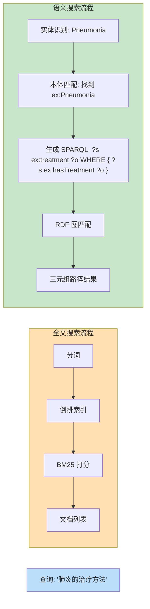

# 20.2 搜索与问答

> **本节要点**：本体和语义网技术在搜索增强与知识图谱问答（KBQA）中发挥着核心作用。本章将剖析语义搜索的原理——RDF 三元组匹配与全文关键词匹配的区别，阐述本体在 KBQA 中承担的模式匹配、路径查询和推理角色，介绍主流评测集 SQuAREBench / WebQuestionsSP，并通过 SPARQL over Wikidata 的完整示例演示实体消歧与关系推理。

---

## 1. 语义搜索（Semantic Search）原理

语义搜索的目标是让搜索结果不仅基于**关键词的共现**（Lexical Co-occurrence），而是理解**查询意图和语义关系**。本体作为结构化的知识库，是实现语义搜索的核心基础设施。

### 1.1 传统搜索 vs 语义搜索对比

| 维度 | 传统全文搜索（TF-IDF / BM25） | 语义搜索（基于本体） |
|------|------------------------------|---------------------|
| **匹配方式** | 关键词表面形式匹配 | 实体（URI）级别的语义匹配 |
| **同义词处理** | 需要手动维护同义词字典 | 本体中 `owl:sameAs` / `skos:exactMatch` 自动处理 |
| **关系推理** | 无法理解"治疗"与"疗法"的关系 | 可通过属性链（Property Chain）推理 |
| **查询表达** | 自由文本 | SPARQL / 自然语言查询 → 语义映射 |
| **结果排序** | 基于词频、逆文档频率 | 基于路径长度、语义相似度 |

### 1.2 RDF 三元组匹配 vs 全文关键词匹配

**关键词匹配（Inverted Index）**：搜索"肺炎的治疗方法"，匹配文档中包含这些词的页面。

**RDF 三元组匹配**：搜索转化为结构化的模式查询（Pattern Query），在 RDF 图中匹配路径：



**技术实现对比**：

| 层面 | 全文搜索 | 语义搜索 |
|------|----------|----------|
| **索引结构** | 倒排索引（Inverted Index） | 三元组存储（Triplestore）、图数据库 |
| **查询语言** | DSL（如 Elasticsearch Query DSL） | SPARQL、Cypher |
| **匹配粒度** | Token / N-gram | 图子图同构（Subgraph Isomorphism） |
| **支持推理** | 否 | 是（通过 OWL / RDFS 推理引擎） |

---

## 2. 本体在知识图谱问答（KBQA）中的角色

知识图谱问答（Knowledge Base Question Answering, KBQA）系统将自然语言问题转换为形式化查询，从知识图谱中提取结构化答案。本体在其中承担三重角色。

### 2.1 三重角色总览

```mermaid
graph TB
    NL["自然语言问题<br/>'谁发现了青霉素？'"]
    
    subgraph KBQA["KBQA 管线"]
        Parse["解析层: 实体链接 + 类型推断"]
        Schema["模式匹配: 查询本体找到相关 schema"]
        Generate["查询生成: SPARQL 生成"]
        Reason["推理增强: 利用本体公理补充路径"]
        Exec["执行与答案提取"]
        
        Parse --> Schema
        Schema --> Generate
        Generate --> Reason
        Reason --> Exec
    end
    
    NL --> Parse
    Exec --> Answer["Answer: Alexander Fleming"]
    
    KB Ontology["KG-Bio Ontology<br/>(schema.org + ChEBI + UMLS)"]
    
    Schema -. 提供 schema 信息 .-> KB Ontology
    Reason -. 提供推理规则 .-> KB Ontology
    
    style KBQA fill:#e3f2fd
    style Answer fill:#a5d6a7
    style KB Ontology fill:#fff9c4
```

### 2.2 角色详解

#### 角色一：模式匹配（Schema Matching）

本体为 KBQA 系统提供了**模式（Schema）索引**：

- **类型推断**：如果问题中的 "Apple" 被链接到 `dbpedia:Apple_Inc`，本体中的 `rdfs:subClassOf` 关系可推断其类型是 `dbo:Company`
- **相关属性发现**：通过 `rdfs:domain` 和 `rdfs:range`，系统知道对公司实体应该查找 `dbo:foundedBy` 和 `dbo:headquarter`
- **属性层次**：`rdfs:subPropertyOf` 允许系统使用 `dbo:birthPlace` 查询时，同时也命中其子属性

#### 角色二：路径查询（Path Query）

本体定义的**属性约束**支持多跳路径查询：

```sparql
# 查询：找到所有与"SARS-CoV-2"有间接关联的疾病
# 本体路径：virus --> causes --> disease --> has_symptom --> symptom
PREFIX dbr: <http://dbpedia.org/resource/>
PREFIX dbo: <http://dbpedia.org/ontology/>
PREFIX rdfs: <http://www.w3.org/2000/01/rdf-schema#>

SELECT DISTINCT ?disease ?symptom
WHERE {
  dbr:SARS-CoV-2 dbo:causes ?disease .
  ?disease dbo:hasSymptom ?symptom .
}
```

#### 角色三：推理（Reasoning）

基于本体公理的推理可以扩展查询的覆盖范围：

| 推理类型 | OWL 公理示例 | KBQA 应用 |
|----------|-------------|----------|
| **传递性** | ` owl:TransitiveProperty on:precedes` | "A  precedes B" + "B precedes C" → "A precedes C" |
| **对称性** | `owl:SymmetricProperty foaf:knows` | "A knows B" → "B knows A" |
| **属性链** | `objectComplementOf` + 属性链公理 | 通过关系组合推理隐含链接 |
| **类包含** | `SubClassOf` 推理 | 将实例匹配到子类时，也返回父类知识 |

---

## 3. 评测集：SQuAREBench 与 WebQuestionsSP

KBQA 系统的评估需要标准数据集。以下是两个核心评测基准。

### 3.1 WebQuestionsSP

WebQuestionsSP 是 WebQuestions 的结构化版本，专门用于语义解析（Semantic Parsing）研究。

| 特性 | 描述 |
|------|------|
| **来源** | Freebase 知识图谱 |
| **问题数量** | ~6,600 个自然语言问题 |
| **格式** | (NL\_question, SPARQL\_query) 配对 |
| **评测指标** | Execution Accuracy（执行准确率） |
| **难度分级** | 单层关系 / 多跳 / 聚合查询 / 过滤条件 |

**WebQuestionsSP 样本示例**：

| 自然语言问题 | 转换后的 SPARQL |
|-------------|----------------|
| "What is the capital of USA?" | `SELECT ?o WHERE { dbr:United_States dbo:capital ?o . }` |
| "Which actor plays the role of Spider-Man?" | `SELECT ?s WHERE { ?s dbo:actor dbr:Andrew_Garfield . ?s dbo:character dbr:Spider-Man . }` |
| "What films were directed by Christopher Nolan that starred Tom Hanks?" | 多跳 + 交集查询 |

### 3.2 SQuAREBench

SQuAREBench 是一个专为 RDF 知识图谱设计的问答评测集。

| 特性 | 描述 |
|------|------|
| **来源** | DBpedia、Wikidata 等 RDF 知识图谱 |
| **问题数量** | ~5,000 个 RDF-native 问题 |
| **格式** | 自然语言问题 → SPARQL 查询 |
| **评测指标** | Exact Match / Partial Match |
| **难度分级** | 单属性查询 / 多属性查询 / 聚合运算 / 过滤 / 排序 + 限制 |

**SQuAREBench vs WebQuestionsSP 对比**：

| 维度 | WebQuestionsSP | SQuAREBench |
|------|---------------|-------------|
| **知识图谱格式** | Freebase（类关系模型） | RDF / SPARQL（三元组模型） |
| **实体链接** | Freebase ID | URI 消歧 |
| **Schema 对齐** | Freebase Type → Property | 本体 Class → Property |
| **典型应用** | Google Knowledge Graph | Linked Open Data 查询 |

---

## 4. 实战示例：SPARQL over Wikidata

Wikidata 是最大的通用知识图谱，拥有超过 100M 实体和 1B+ 关系断言。本节通过实际 SPARQL 查询演示**实体消歧**和**关系推理**。

### 4.1 实体消歧（Entity Disambiguation）

当用户输入 "Python" 时，存在歧义——可能指编程语言或生物物种。通过本体信息消歧：

```sparql
# 查询：找出 Wikidata 中所有标签含"Python"的实体及其类型
SELECT ?item ?itemLabel ?typeLabel
WHERE {
  ?item rdfs:label "Python"@en .
  ?item rdf:type ?type .
}
LIMIT 10
```

**可能的结果（消歧前）**：

| ?item | ?itemLabel | ?typeLabel |
|-------|-----------|-----------|
| wd:Q3137 | Python (programming language) | Q9254 (Programming Language) |
| wd:Q7173 | Python (snake) | Q37274 (Snake Species) |
| wd:Q23503821 | Python (franchise) | Q11033 (Media Franchise) |

**消歧决策**：通过 `wdt:P31`（实例类型）中的本体信息，系统可以结合用户上下文（如"我想了解编程语言"）选择 `wd:Q3137`。

### 4.2 关系推理：多跳路径查询

**任务**：查找 Python 语言创始人及其教育背景。

```sparql
# 查询 Python 编程语言的创始人及其毕业大学
SELECT ?creator ?creatorLabel ?university ?universityLabel
WHERE {
  wd:Q3137 wdt:P175 ?creator .                    # Python 创作者
  ?creator wdt:P69 ?university .                   # 创作者的教育背景
  SERVICE wikibase:label { bd:serviceParam wikibase:language "en" }
}
```

**结果**：

| ?creator | ?creatorLabel | ?university | ?universityLabel |
|----------|--------------|-------------|-----------------|
| wd:Q170910 | Guido van Rossum | wd:Q975 | University of Amsterdam |

### 4.3 本体推理增强查询

利用 Wikidata 的本体关系（`P279` = subclass of），可以实现自动扩展：

```sparmaid
# 使用 Wikidata 的属性类别属性 (P279 = subclass of) 进行传递推理
# 查询所有类型为 "computer language" 或其子类别的语言
SELECT DISTINCT ?language ?languageLabel
WHERE {
  ?language rdf:type/wdt:P279* wd:Q9143 .         # computer language 及其子类
  FILTER(?language != wd:Q9143)                    # 排除类别本身
  SERVICE wikibase:label { bd:serviceParam wikibase:language "en" }
}
ORDER BY DESC(YEAR(?created))
LIMIT 20
```

这里 `wdt:P279*` 表示**传递闭包（Transitive Closure）**——即"是...的子类"的递归关系，这是本体推理能力在搜索中的应用。

### 4.4 基于本体相似度的排序

当搜索结果有多条候选时，可以基于本体距离排序：

```sparql
# 计算两个实体在本体层次中的距离
# 方法：找到它们的最近共同祖先（LCA, Least Common Ancestor）
SELECT ?entity1 ?entity2 ?lca ?lcaLabel (COUNT(?path) AS ?distance)
WHERE {
  VALUES (?entity1 ?entity2) { (wd:Q3137 wd:Q44271) }
  # Q3137 = Python (programming language)
  # Q44271 = JavaScript (programming language)
  
  ?entity1 wd:P31*/wd:P279? ?lca .
  ?entity2 wd:P31*/wd:P279? ?lca .
  
  SERVICE wikibase:label { bd:serviceParam wikibase:language "en" }
}
GROUP BY ?entity1 ?entity2 ?lca
```

| ?entity1 | ?entity2 | ?lca | ?distance |
|----------|----------|------|-----------|
| Python | JavaScript | Q33031 | 3 (都归到 `Q9143: programming language`) |

---

## 5. KBQA 系统架构参考

典型的基于本体的 KBQA 系统包含以下组件：

```mermaid
flowchart LR
    subgraph Frontend["用户前端"]
        Input["自然语言输入"]
    end
    
    subgraph NL["自然语言处理"]
        NER["命名实体识别 NER"]
        REL["关系抽取 Relation Extraction"]
        LEM["词形归一化"]
    end
    
    subgraph Linking["实体链接"]
        DIS["消歧 Disambiguation"]
        Mapping["本体映射 Alignment"]
    end
    
    subgraph QueryGen["查询生成"]
        Schema["本体 Schema 查找"]
        Parser["SPARQL 解析器"]
        Reasoner["推理引擎"]
    end
    
    subgraph Execution["查询执行"]
        Triplestore["三元组存储<br/>(Virtuoso / Blazegraph)"]
        Result["结果集"]
    end
    
    Input --> NER
    NER --> REL
    REL --> LEM
    LEM --> DIS
    DIS --> Mapping
    Mapping --> Schema
    Schema --> Parser
    Parser --> Reasoner
    Reasoner --> Triplestore
    Triplestore --> Result
    
    style Frontend fill:#e1f5fe
    subgraph NL fill:#f3e5f5
    subgraph Linking fill:#fff3e0
    subgraph QueryGen fill:#e8f5e9
    subgraph Execution fill:#fce4ec
```

---

## 6. 小结

本章展示了本体技术如何从两个维度增强搜索和问答系统：
1. **语义搜索**：通过 RDF 三元组匹配替代关键词匹配，实现语义级检索；
2. **KBQA**：通过模式匹配、路径查询和推理能力，将自然语言问题结构化转化为 SPARQL 查询。

> **下一步**：在 [`20.3 企业管理`](./03-enterprise-management.md) 中，我们将探讨知识图谱在企业环境中的数据集成、知识组织和业务流程管理中的应用。