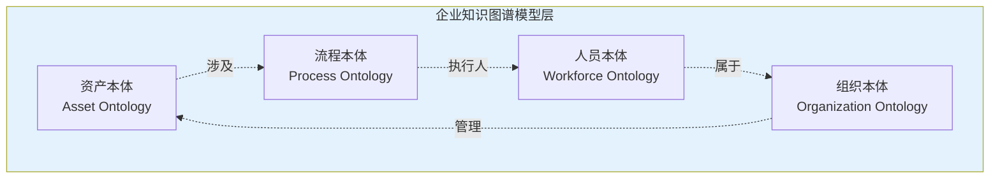
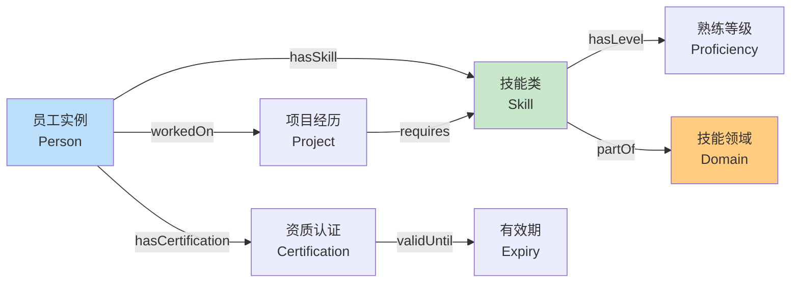
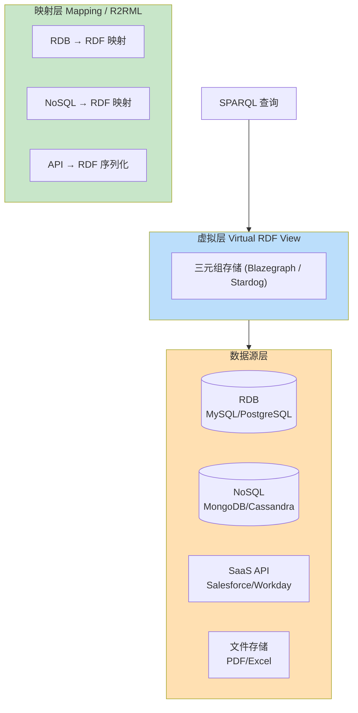
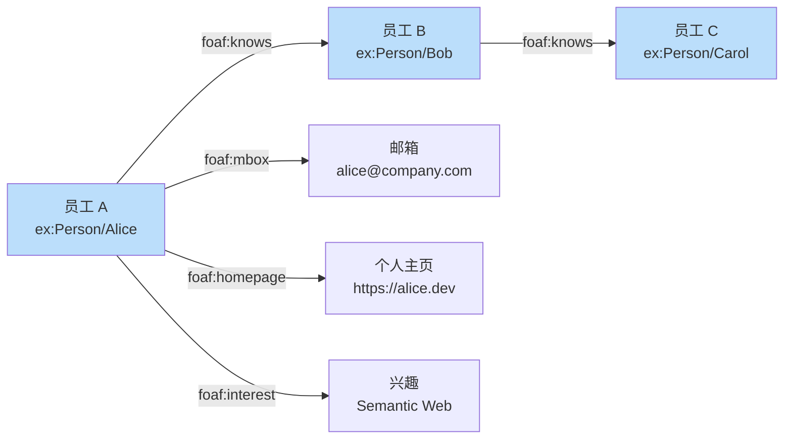
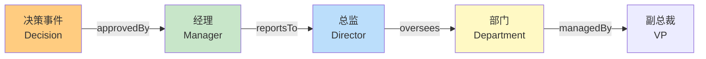

# 20.3 企业管理

> **本节要点**：企业在知识管理中面临数据孤岛、语义歧义和信息过载三大挑战。本章将阐述本体和企业知识图谱（Enterprise Knowledge Graph）如何赋能资产管理、组织关系建模、人员能力追踪和业务流程优化。同时介绍 RDF 视图技术如何实现企业级数据集成，以及 FOAF / SIOC / Dublin Core 等标准在本体集成中的实践。

---

## 1. 企业知识图谱构建

企业知识图谱（Enterprise Knowledge Graph, EKG）是将企业内部分散的结构化与非结构化数据，通过统一的**本体模型（Ontology Model）**整合为一个可查询、可推理的语义网络。

### 1.1 四大核心建模维度

| 维度 | 英文术语 | 关键实体 | 核心关系 |
|------|----------|----------|----------|
| **资产** | Asset Modeling | 设备、产品、原材料、文档 | part\_of, has\_property, replaces |
| **组织** | Organization Modeling | 部门、团队、职位、流程 | has\_member, reports\_to, oversees |
| **人员** | Workforce Modeling | 员工、技能、资质、经验 | has\_skill, certified\_in, worked\_on |
| **流程** | Process Modeling | 业务活动、决策点、输入输出 | precedes, triggers, consumes |



### 1.2 资产建模示例

在制造业或 IT 管理中，资产本体需要描述物理和逻辑资产之间的关系：

```turtle
@prefix ex: <http://example.com/ontology/enterprise#> .
@prefix owl: <http://www.w3.org/2002/07/owl#> .
@prefix rdfs: <http://www.w3.org/2000/01/rdf-schema#> .
@prefix xsd: <http://www.w3.org/2001/XMLSchema#> .

# 资产类定义
ex:Asset a owl:Class ;
    rdfs:label "企业资产"@zh , "Enterprise Asset"@en ;
    rdfs:comment "任何企业拥有或管理的物理或逻辑资源" .

ex:Equipment a owl:Class ;
    rdfs:subClassOf ex:Asset ;
    rdfs:label "设备" .

ex:Software a owl:Class ;
    rdfs:subClassOf ex:Asset ;
    rdfs:label "软件资产" .

# 具体资产实例
ex:Server-001 a ex:Equipment ;
    rdfs:label "Production Server 001"@en ;
    ex:serialNumber "SN-2024-00001"^^xsd:string ;
    ex:location <http://dbpedia.org/resource/Shanghai> ;
    ex:installedDate "2024-01-15"^^xsd:date ;
    ex:partOf ex:DataCenter-East .

ex:DataCenter-East a ex:Facility ;
    rdfs:label "华东数据中心" .
```

### 1.3 人员能力图谱（Skills Ontology）

人员能力建模帮助企业识别技能缺口、优化团队配置：



**Skills Ontology 示例**：

```turtle
@prefix schema: <http://schema.org/> .
@prefix ex: <http://example.com/ontology/enterprise#> .
@prefix owl: <http://www.w3.org/2002/07/owl#> .

# 熟练等级枚举
ex:ProficiencyLevel a owl:Class ;
    rdfs:subClassOf [
        owl:oneOf (
            ex:Novice ;   # 初学者
            ex:Intermediate ;   # 中级
            ex:Advanced ;   # 高级
            ex:Expert   # 专家
        )
    ] .

# 员工实例
ex:Employee-Zhang a ex:Person ;
    schema:givenName "伟"@zh ;
    schema:familyName "张"@zh ;
    ex:hasSkill [
        a ex:SkillAssertion ;
        ex:hasSkill <http://dbpedia.org/resource/Java_(programming_language)> ;
        ex:proficiencyLevel ex:Advanced ;
        ex:since "2018-06-01"^^xsd:date
    ] ;
    ex:hasSkill [
        a ex:SkillAssertion ;
        ex:hasSkill <http://dbpedia.org/resource/Machine_learning> ;
        ex:proficiencyLevel ex:Intermediate ;
        ex:since "2022-03-15"^^xsd:date
    ] .

# 推理：张具有 Java 相关技能的经验超过 5 年
# （通过数据属性与日期推理，可在本体推理器中实现）
```

---

## 2. 企业级数据集成：RDF 视图映射

企业通常同时使用多种数据存储系统（关系数据库 RDB、NoSQL、SaaS API）。RDF 视图技术（RDF View / Virtual Integration）为这些异构数据源提供统一的查询接口。

### 2.1 数据集成架构



### 2.2 R2RML 映射技术

R2RML（RDF Mapping Language）是 W3C 推荐标准，用于将关系数据库表映射为 RDF：

```turtle
@prefix rr: <http://www.w3.org/ns/r2rml#> .
@prefix ex: <http://example.com/ontology/enterprise#> .
@prefix foaf: <http://xmlns.com/foaf/0.1/> .
@prefix xsd: <http://www.w3.org/2001/XMLSchema#> .

# 员工表 → RDF 映射
EmployeeMap a rr:LogicalTable ;
    rr:tableName "EMPLOYEES" .

TripMap a rr:TriplesMap ;
    rr:logicalTable [ rr:tableName "EMPLOYEES" ] ;
    rr:schema [ rr:class ex:Person ] ;
    rr:predicateObjectMap [
        rr:predicate foaf:givenName ;
        rr:objectMap [ rr:column "FIRST_NAME" ]
    ] ;
    rr:predicateObjectMap [
        rr:predicate foaf:familyName ;
        rr:objectMap [ rr:column "LAST_NAME" ]
    ] ;
    rr:predicateObjectMap [
        rr:predicate ex:hasSkill ;
        rr:objectMap [
            rr:parentTriple "SELECT DISTINCT skill_id FROM EMPLOYEE_SKILLS WHERE employee_id = EMPLOYEES.ID"
        ]
    ] ;
    rr:termMap [
        rr:termType rr:IRI ;
        rr:template "http://example.com/person/{ID}"
    ] .
```

### 2.3 企业数据集成决策矩阵

| 场景 | 方案 | 理由 |
|------|------|------|
| 全量数据迁移 | ETL → 加载至 RDF 三元组存储 | 数据质量可控，查询性能高 |
| 实时一致性要求低 | 虚拟视图（Virtual View） | 零数据冗余，避免数据不一致 |
| 混合场景 | RML Mapping 预索引热数据 | 热点数据缓存 + 冷数据虚拟查询 |
| SaaS 集成 | 连接器 + JSON-LD 上下文 | 标准化 JSON 序列化格式 |

---

## 3. FOAF / SIOC / Dublin Core 等标准在企业场景的集成实践

企业知识图谱的互操作性不仅依赖于内部本体设计，还深度依赖行业标准词汇表的集成。以下是最常用的三大标准词汇表。

### 3.1 三大标准对比

| 标准 | 全称 | 核心用途 | 关键类 / 属性 |
|------|------|----------|--------------|
| **FOAF** | Friend of a Friend | 人物关系与个人信息 | `foaf:Person`, `foaf:name`, `foaf:knows`, `foaf:mbox` |
| **SIOC** | Semantically-Linked Online Communities & Interactions | 在线社区与对话 | `sioc:User`, `sioc:Post`, `sioc:Forum`, `sioc:container_of` |
| **Dublin Core** | DCMI Metadata Terms | 元数据资源描述 | `dcterms:title`, `dcterms:creator`, `dcterms:subject`, `dcterms:issued` |

### 3.2 FOAF 在企业社交图谱中的应用



**FOAF 在企业内部的集成示例**：

```turtle
@prefix foaf: <http://xmlns.com/foaf/0.1/> .
@prefix ex: <http://example.com/ontology/enterprise#> .
@prefix schema: <http://schema.org/> .

ex:Person/Alice a foaf:Person, ex:Employee ;
    foaf:name "Alice Chen"@en ;
    foaf:mbox <mailto:alice@company.com> ;
    foaf:knows ex:Person/Bob ;
    foaf:knows ex:Person/Carol ;
    schema:affiliation ex:DataScienceDept ;
    ex:department ex:DataScienceDept .

ex:Person/Bob a foaf:Person, ex:Employee ;
    foaf:name "Bob Liu"@en ;
    foaf:mbox <mailto:bob@company.com> ;
    schema:affiliation ex:DataScienceDept ;
    foaf:interest <http://dbpedia.org/resource/Machine_learning> .
```

### 3.3 SIOC 在企业内容管理中的应用

SIOC 可用于对企业内部论坛、问题跟踪系统和协作工具的语义集成：

```turtle
@prefix sioc: <http://rdfs.org/sioc/ns#> .
@prefix ex: <http://example.com/ontology/enterprise#> .

ex:forum-issues a sioc:Forum ;
    sioc:name "Issue Tracking Forum" ;
    sioc:has_modex <http://example.com/ontology/enterprise#moderator-team> .

ex:post-1234 a sioc:Post ;
    sioc:has_creator ex:Person/Bob ;
    sioc:title "Bug in authentication service"@en ;
    sioc:content "The OAuth2 token refresh endpoint is returning expired tokens..."@en ;
    sioc:belongs_to ex:forum-issues ;
    dcterms:issued "2024-03-15"^^xsd:date .
```

### 3.4 Dublin Core 在企业文档管理中的应用

```turtle
@prefix dcterms: <http://purl.org/dc/terms/> .
@prefix ex: <http://example.com/ontology/enterprise#> .

ex:doc-2024-annual-report a dcterms:BibliographicResource ;
    dcterms:title "2024 Annual Report"@en ;
    dcterms:creator ex:CorpCommunications ;
    dcterms:subject "annual report", "financial disclosure" ;
    dcterms:issued "2024-01-10"^^xsd:date ;
    dcterms:format "application/pdf" ;
    dcterms:language "en" ;
    dcterms:identifier "DOC-2024-AR" .
```

### 3.5 标准集成最佳实践

| 实践要点 | 说明 |
|----------|------|
| **混合词汇表** | 同时使用标准词汇（FOAF、DC）和本企业内部命名空间（`ex:`），标准词汇处理通用概念，`ex:` 处理专有概念 |
| **链接数据友好** | 为标准词汇中的属性使用 HTTP 端点，使外部服务可通过 URI 发现 RDF 描述 |
| **本体对齐（Alignment）** | 用 `skos:exactMatch` 链接内部概念与外部标准（DBpedia、schema.org） |
| **渐进式采用** | 从关键实体开始（Person、Organization、Document），逐步扩展到其他域 |

---

## 4. 企业应用场景案例

### 4.1 案例一：技能缺口分析（Skills Gap Analysis）

企业通过知识图谱整合员工技能、项目需求和行业趋势，自动识别团队技能缺口：

```sparql
# 查询：找出当前项目所需的、但团队成员技能未达到"高级"水平的技能
PREFIX ex: <http://example.com/ontology/enterprise#>
PREFIX foaf: <http://xmlns.com/foaf/0.1/>

SELECT DISTINCT ?skillLabel
WHERE {
  # 项目所需的技能
  ex:Project-X ex:requiresSkill ?skill .
  
  # 团队现有成员的该技能等级
  OPTIONAL {
      ex:Team-Y ex:hasMember ?member .
      ?member ex:hasSkill [
          ex:hasSkill ?skill ;
          ex:proficiencyLevel ?level
      ] .
  }
  
  # 过滤：没有"Expert"级别的成员
  FILTER (!EXISTS {
      ex:Team-Y ex:hasMember ?expertMember .
      ?expertMember ex:hasSkill [
          ex:hasSkill ?skill ;
          ex:proficiencyLevel ex:Expert
      ] .
  })
  
  SERVICE wikibase:label { bd:serviceParam wikibase:language "en,zh" }
}
```

### 4.2 案例二：组织决策链路追踪



### 4.3 案例三：文档与知识检索增强

将 Dublin Core 描述的文档元数据与知识图谱整合后，支持语义文档检索：

| 传统搜索 | 语义增强搜索 |
|----------|-------------|
| 关键词："API 认证" | 意图理解："API authentication" |
| 返回包含这些词的所有文档 | 返回与 `ex:Authentication` 相关的所有文档 |
| 不受文档类型和标签影响 | 通过 `dcterms:subject` 和 `dcterms:type` 精准匹配 |
| 无法跨文档聚合 | 可按 `dcterms:creator` 聚合作者的产出 |

---

## 5. 小结

企业知识图谱和 RDF 本体集成的价值体现在三个层面：
1. **数据层**：通过 RDF 视图映射，打通 RDB、NoSQL 和 SaaS 的数据孤岛；
2. **语义层**：FOAF、SIOC、Dublin Core 为标准概念提供互操作词汇表，降低本体开发成本；
3. **应用层**：从技能分析到决策追踪，知识图谱为企业管理提供结构化智能。

> **下一步**：在 [`20.4 知识图谱 vs 本体论`](./04-kg-vs-ontology.md) 中，我们将深入探讨知识图谱（KG）与本体论（Ontology）的区分与联系，包括 ABox 与 TBox 的关系、RDFS/OWL 与 RDF Star 的决策矩阵，以及 Neo4j 与三元组存储的选择指南。