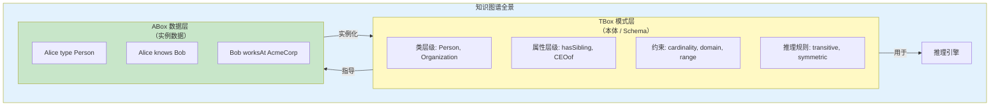
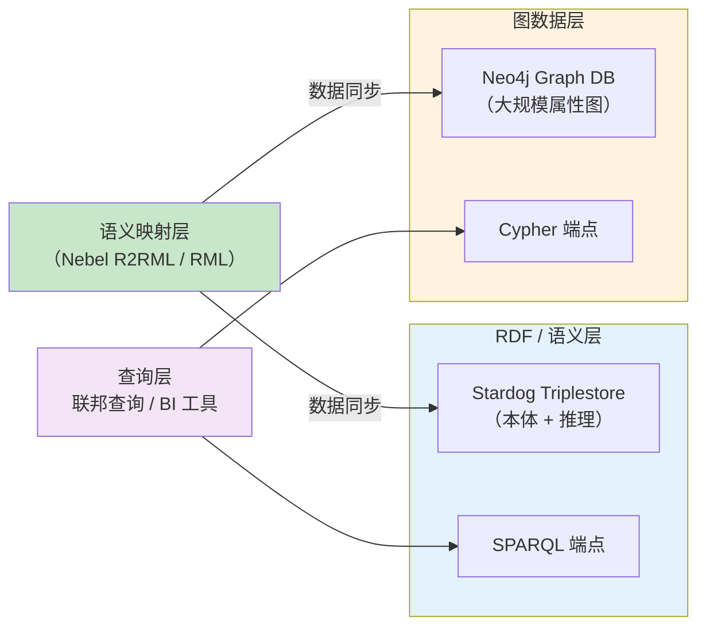

# 20.4 知识图谱 vs 本体论

> **本节要点**：知识图谱（Knowledge Graph）和本体论（Ontology）在语义网生态中经常被混淆，但二者有明确的层次关系和技术边界。本章将阐明 KG 与本体的区别与联系，分析 ABox / TBox 的对应关系，提供 RDFS/OWL vs RDF(RDF*) 的决策矩阵，并对比 Neo4j（图数据库）与三元组存储（Triplestore）的选择指南。

---

## 1. 知识图谱与本体论的关系

### 1.1 定义对比

| 概念 | 定义 | 层次 | 核心关注 |
|------|------|------|----------|
| **本体（Ontology）** | 对特定领域概念的**形式化、明确规范和共享**描述 | 模式层（Schema / MDDL） | 类、属性、约束、公理 |
| **知识图谱（Knowledge Graph）** | 本体 + 大量数据实例组成的**语义化网络** | 数据层 + 模式层 | 实体、关系、三元组（实例数据） |

**核心公式**：

> **知识图谱（Knowledge Graph） = 本体（本体/TBox） + 数据（ABox） + 应用层工具**

### 1.2 Description Logic 视角：TBox 与 ABox

在描述逻辑（Description Logic, DL）中，本体被分为两个子理论：

| 理论 | Description Logic 名称 | 对应本体成分 | 语义网标准 |
|------|----------------------|-------------|-----------|
| **TBox** | Terminological Box | 类（Class）、属性（Property）、关系约束 | `rdfs:Class`, `owl:ObjectType`, `owl:DatatypeProperty`, `rdfs:subClassOf`, `owl:propertyAssertion` |
| **ABox** | Assertional Box | 实例（Instance）、具体事实断言 | RDF 三元组：`ex:Alice rdf:type ex:Person` |



### 1.3 知识图谱中的 TBox / ABox 示例

假设我们有一个简单的电影知识图谱（Movie KG）：

| 数据层（ABox） | 语义 |
|----------------|------|
| `ex:Alice role Director` | Alice 的职位是导演 |
| `ex:Bob role Actor` | Bob 的职位是演员 |
| `ex:Movie-X director ex:Alice` | 电影 X 的导演是 Alice |
| `ex:Movie-X starring ex:Bob` | 电影 X 的演员是 Bob |
| `ex:Alice rdf:type ex:Person` | Alice 是人 |

| 模式层（TBox） | 语义 |
|----------------|------|
| `ex:Director rdfs:subClassOf ex:Person` | 导演是人 |
| `ex:director rdfs:domain ex:Movie` | director 属性的域是 Movie |
| `ex:director rdfs:range ex:Person` | director 属性的目标是人 |
| `owl:TransitiveProperty ex:partOf` | partOf 属性是传递的 |

**基于 TBox 的推理**：从 ABox 数据 `ex:Alice ex:director ex:Movie-X` 和 TBox 规则 `ex:director rdfs:range ex:Person`，推理器可自动推导：
- `ex:Alice rdfs:type ex:Person`（即使这条事实未被显式声明）

---

## 2. RDFS/OWL vs 直接使用 RDF（含 RDF\*）的决策矩阵

在许多项目中，开发者面临的核心问题是：**何时使用简单 RDF/RDF*（仅三元组），何时升级到 RDFS/OWL（模式推理）？**

### 2.1 技术对比

| 维度 | RDF（纯三元组） | RDF\*（RDF-Star） | RDFS（Resource Description Schema） | OWL 2（Web Ontology Language） |
|------|----------------|-------------------|-------------------------------------|--------------------------------|
| **表达力** | 原子三元组 | 可嵌套三元组作为三元组 | subClassOf, subPropertyOf, domain, range | Class expressions, property properties, cardinality, sameAs |
| **推理能力** | 无推理 | 有限推理（Reification） | 传递 closure 推理（domain/range） | 描述逻辑推理（分类、一致性、实例分类） |
| **存储需求** | 小 | 小（与 RDF 相当） | 中等 | 较大（需存储约束和推理结果） |
| **查询性能** | 高 | 高 | 中等 | 取决于推理复杂度和规模 |
| **工具链** | 任何 RDF 工具 | Apache Jena / Blazegraph 支持 | Virtuoso / Stardog / Blazegraph | Protégé + HermiT / Pellet / ELK |

### 2.2 决策矩阵

以下矩阵帮助项目决策者选择正确的技术层级：

| 场景 | 推荐技术 | 理由 |
|------|----------|------|
| **简单标签和元数据** | RDF + JSON-LD | 不需要复杂推理，关注数据序列化互操作性 |
| **需要实体去重（reification）** | RDF\* 或 bnodes | 用 RDF\* 对三元组本身做断言（e.g., "Alice 被说是 30 岁"—关于事实的事实） |
| **基本的分类和继承** | RDFS | `subClassOf` / `domain` / `range` 已足够 |
| **需要自动一致性和分类检查** | OWL 2 EL（如 SNOMED CT） | 线性推理时间，适合大规模 |
| **复杂的公理和推理需求** | OWL 2 DL / Full | 描述逻辑最大表达力，支持 EL, QL, Profile DL |
| **知识图谱 + AI 搜索（embedding）** | RDF/OWL schema + graph embedding | 需要本体约束 + 表示学习的结合 |

### 2.3 RDF\* 与 RDFS/OWL 的互补关系

RDF\* 与本体**不是替代品**，而是互补方案：

```mermaid
flowchart LR
    RDF["RDF 原子三元组"] -->|扩展| RDFStar["RDF\* 嵌套断言"]
    RDFStar -->|加约束| RDFS["RDFS 模式（subClassOf, domain, range）"]
    RDFS -->|加公理| OWL["OWL 2（cardinality, equivalence）"]
    
    RDFStar -. 支持 .| 来源追踪 / 置信度断言 | RDFS
    OWL -. 与 .| RDF 数据互操作 | RDF
    
    style RDF fill:#e0e0e0
    style RDFStar fill:#bbdefb
    style RDFS fill:#c8e6c9
    style OWL fill:#f3e5f5
```

**RDF\* 的典型用例——事实溯源（Provenance Tracking）**：

传统 RDF 中，无法直接对一条三元组做出断言：
```turtle
# RDF\* 写法（可表示"有人声称这条关系成立"）
(<ex:Alice ex:age 30> <ex:source> <ex:patient-record-123>) .
(<ex:Alice ex:age 30> <ex:confidence> "0.85"^^xsd:decimal) .
```

而在纯 RDFS/OWL 体系下，这需要使用 `bNode` 或 `Blank Node Reification`，但 W3C 不推荐使用这种模式。RDF\* 正是为了解决这一痛点。

---

## 3. Neo4j（图数据库） vs 三元组存储（Triplestore）的选择指南

在实际部署中，知识图谱和数据本体的存储层有两种主流方案：**图数据库（Graph Database，以 Neo4j 为代表）**和**三元组存储（Triplestore，以 Virtuoso、Stardog、Blazegraph 为代表）**。

### 3.1 技术架构对比

| 维度 | Neo4j（图数据库） | RDF Triplestore（Virtuoso / Stardog / Blazegraph） |
|------|-------------------|---------------------------------------------------|
| **存储模型** | 属性图（Property Graph） | RDF 三元组（N-Triples） |
| **数据查询语言** | Cypher | SPARQL 1.1 |
| **推理支持** | 无原生推理（APOC / plugins 有限） | 原生 RDFS/OWL 推理（Stardog, Jena） |
| **ACID 事务** | 完全 ACID | Stardog: ACID; Virtuoso: 部分 ACID; Blazegraph: 近似 ACID |
| **SPARQL / Cypher** | 只支持 Cypher | 只支持 SPARQL |
| **嵌入能力** | Neo4j Graph Data Science 库 | 需外部工具（如 RDF4J, Jena） |
| **导入协议** | APOC / Import Tool | RDF Serialization、N-Triples |
| **许可** | GPL + Apache 2.0（Community）; Enterprise 需付费 | Virtuoso: GPL / BSD; Stardog: 商业; Blazegraph: Apache 2.0 |

### 3.2 决策因素详解

#### 因素一：是否需要 SPARQL / RDF

| 需求 | 推荐 |
|------|------|
| 使用 SPARQL、Linked Data | Triplestore |
| 使用 Cypher、Gremlin | Neo4j |
| 需要原生 RDF 数据互操作（Linked Data 集成） | Triplestore |
| 已有属性图模型或需要与 NoSQL 工具（如 MongoDB）兼容 | Neo4j |

#### 因素二：推理需求

| 场景 | 推荐 |
|------|------|
| 不需要推理或仅需要简单的路径查询 | Neo4j |
| 需要 RDFS 推理（domain/range） | Stardog / Jena / Sesame |
| 需要 OWL 推理（subClassOf, 一致性检查, 分类） | Stardog / Pellet / HermiT |
| 实时推理 + 大规模数据 | Stardog（有缓存推理机制） |

#### 因素三：数据规模与性能

| 规模/需求 | 推荐 |
|-----------|------|
| 百万~ 千万级节点，低延迟查询 | Neo4j |
| 亿级三元组以上，批量 SPARQL | Virtuoso |
| 实时推理（推理缓存） | Stardog |
| 快速 Prototyping | Blazegraph（轻量、快速启动） |

### 3.3 Neo4j 与 Triplestore 的数据映射对比

相同语义在两种技术中的表示差异：

**场景：表示"Bob 是 Alice 的同事"**

```turtle
-- RDF / Triplestore (SPARQL) --
ex:Alice foaf:knows ex:Bob .
```

```cypher
-- Neo4j (Cypher) --
MATCH (a:Person {name: "Alice"})-[r:KNOWS]-(b:Person {name: "Bob"}) RETURN b;
```

如果要在 Neo4j 中添加约束（如 "KNOWS 关系只允许在 Person 类型之间"），需要手动管理逻辑或依赖应用层实现——而在 Triplestore 中，只需：

```turtle
ex:knows rdfs:domain foaf:Person ;
    rdfs:range foaf:Person .
```

### 3.4 混合方案：Neo4j + Triplestore

对于大型企业的知识图谱项目，常采用**混合方案**：



| 混合方案优势 | 说明 |
|-------------|------|
| 语义完整性 | RDF/Triplestore 层保证本体推理和标准互操作性 |
| 可扩展查询 | Neo4j 层处理大规模属性图和邻域遍历 |
| 双向同步 | 利用映射工具（如 RML 映射）或事件驱动管线实现双写 |

---

## 4. 选型速查表

| 优先级 | 关键问题 | 推荐选择 |
|--------|---------|---------|
| **第一步** | 是否需要与 Linked Data 生态集成？（如 dbpedia, Wikidata） | 是 → Triplestore |
| **第二步** | 是否需要 RDFS/OWL 推理？ | 是 → Stardog / Jena |
| **第三步** | 如果不需要 RDF 互操作，但有图结构？ | Neo4j |
| **补充** | 如果需要 RDF*（来源断言）能力？ | Jena + SHACL + RDF\* 扩展 |
| **企业级** | 需要同时满足以上所有条件？ | 混合方案（Stardog + Neo4j） |

---

## 5. 小结

理解知识图谱与本体论的关系，是选择合适技术栈的基础：
1. **知识图谱 = 本体 + 实例数据**，TBox 指导 ABox 的结构，ABox 实例化 TBox；
2. **RDF\*** 补充了 RDF 的表达能力（断言的事实本身可作为三元组使用），与 RDFS/OWL 形成互补关系；
3. **Neo4j vs Triplestore**的选择取决于：是否需要 SPARQL、推理能力需求，以及数据规模和应用场景。

> **下一步**：在 [`21.1 编辑器和 IDE`](../ch21-tool-ecosystem/01-editors.md) 中，我们将探索工具生态链，开始第 21 章——本体工具生态系统的内容。