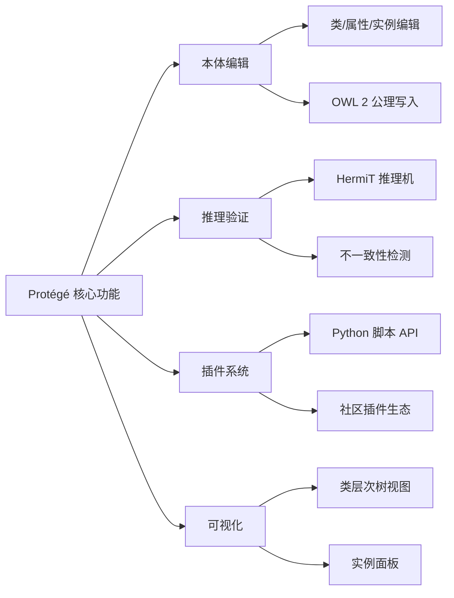
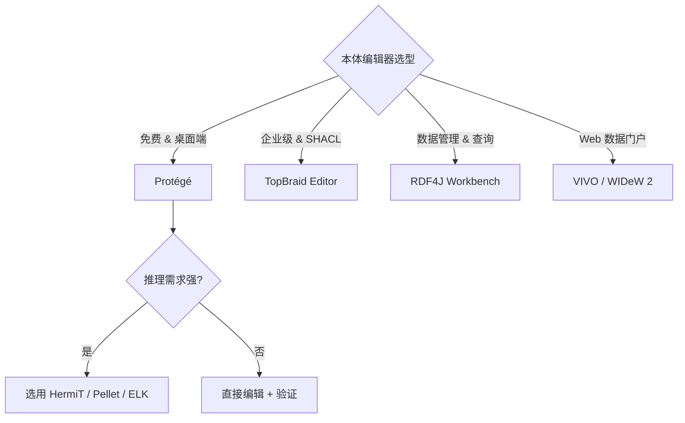

# 21.1 本体编辑器（Ontology Editors）

> **本节要点**：本体编辑器是本体建模者日常使用的核心工具，涵盖从开源 Protégé 到商业级工具 TopBraid Elite 的完整生态系统。掌握不同编辑器的功能定位、插件系统与适用场景，是本体工程师选型与高效工作的第一步。

---

## 1. 什么是本体编辑器？

**本体编辑器（Ontology Editor）** 是一种图形化或编程式工具，用于创建、编辑、验证和维护本体文件（如 RDF/XML、TTL、N-Triples 等格式）。它提供类层次可视化、属性定义、公理写入、推理验证等核心功能，将繁琐的底层序列化（Serialization）细节抽象为友好界面。

| 功能 | 说明 |
|------|------|
| 类层次可视化 | 树状/图谱展示 Class Hierarchy |
| 属性定义 | 对象属性（Object Property）、数据属性（Data Property）配置 |
| 公理写入 | 等价类（Equivalent Class）、不相交（DisjointWith）、基数约束（Cardinality） |
| 推理集成 | 内置推理机（Reasoner）实时检查一致性（Consistency） |
| 导入/导出 | 支持多序列格式（RDF/XML、TTL、N-Triples、JSON-LD） |

---

## 2. Protégé —— 最主流开源本体编辑器

### 2.1 概述

**Protégé** 由斯坦福大学医学院（Stanford Department of Medical Informatics & Biomedical Economics）主导开发，是最广泛使用的开源本体编辑器。自 1987 年问世以来，Protégé 已从专家系统构建框架进化为完整的 OWL 2 / RDF / SKOS 建模平台。

| 项目信息 | 详情 |
|----------|------|
| 开发商 | Stanford University |
| 开源许可 | BSD-3-Clause |
| 语言 | Java（SWING/AWT GUI）+ Python 脚本支持 |
| 格式支持 | RDF/XML、TTL、N-Triples、OWL/XML、JSON-LD |
| 推理集成 | HermiT、Pellet、ELK、RacerPro、FaCT++ |
| 官方网站 | [https://protege.stanford.edu](https://protege.stanford.edu) |

### 2.2 核心功能



**类层次编辑器（Class Hierarchy Editor）**：以树状结构展示类间 `rdfs:subClassOf` 关系，支持拖放调整继承结构。

**实例面板（Instances Panel）**：可视化展示个体（Individual）与其属性值（数据属性与对象属性），支持批量导入 CSV/JSON 数据。

### 2.3 插件系统（Plugin System）

Protégé 通过插件机制扩展核心功能，常用插件包括：

| 插件名称 | 功能 | 安装方式 |
|----------|------|----------|
| **OntoBug** | 自动生成建模错误，用于教学 | Preferences → Plugins |
| **ROBOT Report** | 生成 OWL 本体质量报告 | File → Install New Plugin |
| **Quick Relations** | 快速导航属性范围 | Preferences → Plugins |
| **Semantic Queries** | 使用 SPARQL 查询本体 | Preferences → Plugins |
| **Markdown** | 在 Annotation Properties 中渲染 Markdown | Preferences → Plugins |

**插件开发 API**：Protégé 提供 Java 和 Python 两套 API。

```python
# Python 插件 API 示例：自动为每个新类添加定义注释
from app import get_model

def on_project_switched(project, session):
    ontology = get_model().get_active_ontology()
    for cls in ontology.classes_in_signature():
        if not cls.get_definition(True):
            cls.add_definition(
                f"Auto-generated definition for {cls.iri.name}"
            )
```

### 2.4 适用场景

| 场景 | 推荐理由 |
|------|----------|
| 学术研究与教学 | 完全免费、文档丰富、社区活跃 |
| OWL 2 本体建模 | 完整支持 OWL 2 DL / DL Profile |
| 小/中型本体（<10K 类） | 推理和编辑器交互性能优异 |
| 快速原型设计 | 拖拽式建模 + 实时推理反馈 |

### 2.5 局限性

- 大模型（超 100K 个类）下 UI 交互效率下降
- 不提供原生三元组存储（Triple Store）集成
- 并发协作功能缺失（无 Git 级别的实时协作）

---

## 3. TopBraid Elite / SEDA —— 商业级工具

### 3.1 TopBraid Elite

**TopBraid Elite** 由 LDBC（Linked Data Binary Communication）公司出品，是企业级 RDF/OWL 建模的标杆产品。它集成在 **TopBraid Editor** 中，支持大规模本体管理与 SPARQL 查询。

| 项目信息 | 详情 |
|----------|------|
| 开发商 | LDBC / TopBraid 家族 |
| 许可模式 | 商业许可（付费） |
| 格式支持 | RDF、OWL 2、SKOS、SHACL、ShEx |
| 特色功能 | SHACL 可视化编辑器、数据质量管理、企业集成 |
| 官方网站 | [https://topbraid.com](https://topbraid.com) |

**核心特点**：
- **SHACL 可视化编辑器**：拖拽式 Shape 定义，即时预览约束违反（Violation）报告
- **企业级数据治理**：与数据目录、数据质量管理工具联动
- **大规模本体支持**：可处理百万级实体的知识图谱（Knowledge Graph）

### 3.2 SEDA（Simple Standard Exposure）

**SEDA** 协议（RFC 6842）本身不是一种编辑器，但 **TopBraid Editor** 提供 SEDA 端点支持，允许其他工具通过标准 HTTP API 协作编辑同一本体。这一能力在企业多作者场景中至关重要。

| 特性 | SEDA 支持 |
|------|-----------|
| 并发编辑 | ✅ 基于 HTTP PATCH 的增量更新 |
| 版本控制 | 需配合外部 Git/CI 流水线 |
| 实时协作 | 需配合 WebSocket 同步层 |

### 3.3 适用场景

| 场景 | TopBraid 优势 |
|------|---------------|
| 企业级知识图谱 | 数据治理 + SHACL 校验一体化 |
| 大规模模型 | 性能优化良好，支持分模块编辑 |
| 与数据质量管理联动 | 内置 Data Quality Dashboard |

---

## 4. RDF4J Workbench / Blazegraph Studio

### 4.1 RDF4J Workbench

**RDF4J**（前身 Sesame）是一个荷兰 CWI 与 Vrije Universiteit Amsterdam 开发的 Java RDF 框架。其 **Workbench** 组件提供 Web 界面的三元组编辑与 SPARQL 查询。

| 项目信息 | 详情 |
|----------|------|
| 开发商 | RDF4J Community |
| 开源许可 | EPL-2.0 / MPL-2.0 |
| 核心功能 | RDF 数据存储、SPARQL 端点、API 开发 |
| Web UI | Workbench（数据管理 + 查询） + Explorer |
| 官方网站 | [https://rdf4j.org](https://rdf4j.org) |

**Workbench 核心界面**：
1. **Repository 管理**：创建、配置、备份存储库
2. **数据编辑器**：直接写入/编辑 RDF 三元组（支持 Turtle、N-Triples、RDF/XML）
3. **SPARQL Query**：交互式 SPARQL 1.1 查询编辑器，支持结果可视化与下载
4. **Schema Editor**：可视化定义 RDFS/OWL 分类方案（Classification）

```sparql
# RDF4J Workbench 中可直接执行的示例查询
PREFIX ex: <http://example.org/>
PREFIX rdf: <http://www.w3.org/1999/02/22-rdf-syntax-ns#>

SELECT ?person ?name ?age
WHERE {
  ?person rdf:type ex:Person .
  ?person ex:name ?name .
  ?person ex:age ?age .
  FILTER (?age > 25)
}
ORDER BY DESC(?age)
```

### 4.2 Blazeggraph Studio

**Blazeggraph** 由 SAS 实验室（原 NanoSQL）开发的内存级 RDF/Triple Store，专为**高性能 SPARQL** 和事务性写入设计。

| 项目信息 | 详情 |
|----------|------|
| 开发商 | SAS 前身 NanoSQL |
| 开源许可 | Apache 2.0 |
| 核心特性 | 微秒级 SPARQL 延迟、SPARUL 增量更新、内置 Reasoner |
| 推理支持 | OWL HD（Horizonally Scalable DL）Reasoner |
| 官方网站 | [https://github.com/blazegraph](https://github.com/blazegraph) |

**SPARUL（SPARQL Update + Load）** 是 Blazegraph 特有功能，允许在不停机状态下通过 SPARQL UPDATE 语句修改本体结构：

```sparql
-- 在 Blazeggraph 中增量添加类定义
PREFIX owl: <http://www.w3.org/2002/07/owl#>
PREFIX rdfs: <http://www.w3.org/2000/01/rdf-schema#>

INSERT DATA {
  ex:Vehicle rdfs:subClassOf ex:Entity .
  ex:Car owl:disjointWith ex:Aircraft .
}
```

---

## 5. WIDeW 2 / VIVO —— 特定领域 RDF 编辑平台

### 5.1 WIDeW 2

**WIDeW 2**（Wise Interface for Description log Work with Web）是德国 AIBT 大学开发的学术级 RDF/OWL 编辑环境，侧重于**分布式协作本体制订**和 Web 集成。它允许分布式团队的成员通过浏览器编辑 OWL 本体，并自动同步至中央存储。

### 5.2 VIVO

**VIVO** 是由康奈大学、威斯康星大学等机构联合开发生命科学领域知识图谱平台，内置 RDF 数据模型（基于 ONTOLOGY-IN LIVING（OWL）+ 自定义扩展）。

| 特性 | VIVO 实现 |
|------|-----------|
| 数据模型 | S2S2（Scholars & States Sciences Sciences）本体 |
| 编辑方式 | Web UI 表单 + RDF4J 后端 |
| 核心用途 | 机构学者信息管理、Research Profiles、学术关联 |
| 技术栈 | Java / Tomcat / Apache Solr / Apache RDF4J |
| 官方网站 | [https://vivo.kn](https://vivo.kn) |

VIVO 特别适合学术机构的学者信息（Researcher Profile）、合作网络和出版物管理，它实际上是一个"基于本体的 CMS 系统"——其底层数据模型（VIVO 本体）可以通过 Web 编辑界面修改。

---

## 6. 工具选型决策参考

| 维度 | Protégé | TopBraid | RDF4J / Blazegraph | VIVO |
|------|---------|----------|---------------------|------|
| 成本 | 免费 | 商业付费 | 免费 | 免费 |
| 本体复杂度 | 小/中型 | 大型 | 不适用（面向存储） | 中型 |
| 推理能力 | 内置多种推理机 | 内置推理 | Blazegraph 内置 | 有限 |
| Web 访问 | 需插件 | 天然 Web | 天然 Web | 天然 Web |
| 协作 | 无（单机） | SEDA 协议 | HTTP API | 多用户 Web |
| 主要定位 | 研究/原型 | 企业级 | 存储/查询 | 数据门户 |



---

## 7. 小结

本体编辑器生态从桌面应用（Protégé）到平台服务（RDF4J Workbench）覆盖了从原型设计到大规模生产环境全流程。选择合适工具需考虑**项目规模、团队协作需求、推理需要和技术栈偏好**。下一章将深入探讨**推理机（Reasoner）** ——本体智能分析引擎。