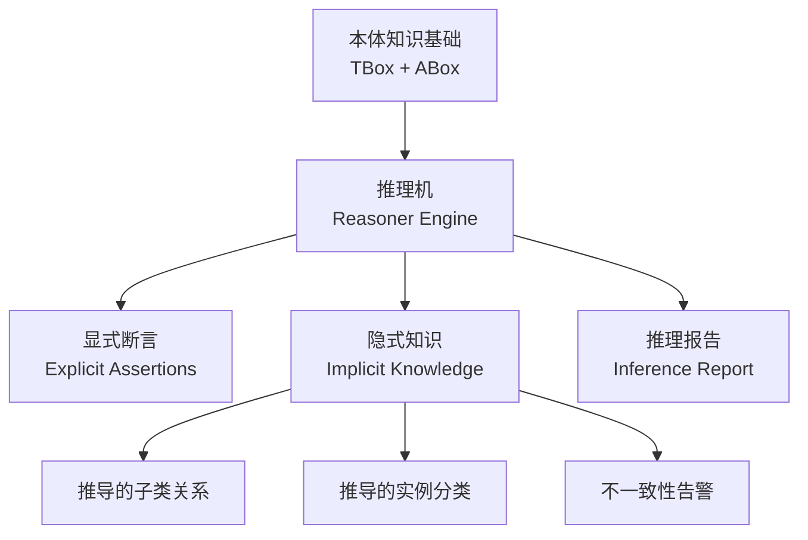
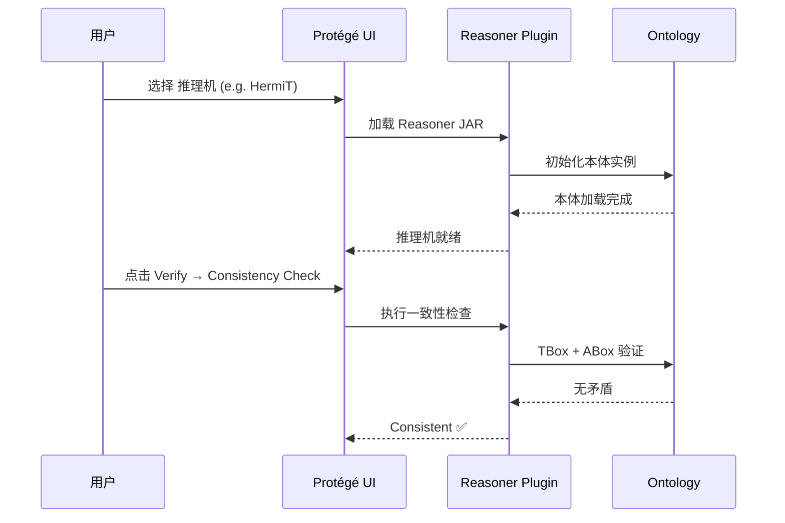
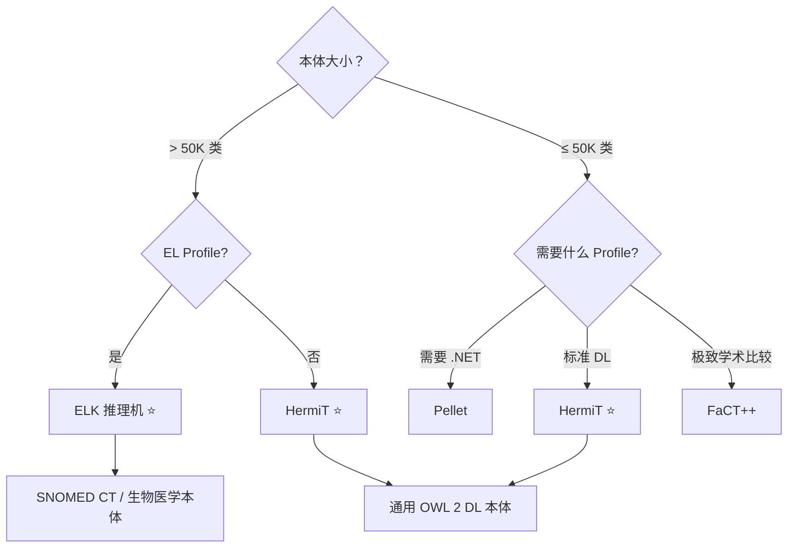

# 21.2 推理机（Reasoner）

> **本节要点**：推理机是本体智能分析的"大脑"，通过描述逻辑（Description Logic）算法自动发现隐式知识、检测逻辑不一致性、验证分类正确性。理解 HermiT、Pellet、ELK、FaCT++ 和 Jennycal 等主流推理机的算法基础、性能特征与 Profile 支持，是在实践中高效切换与调优的关键。

---

## 1. 什么是推理机？

**推理机（Reasoner）** 是本体论（Ontology）中负责执行**逻辑推导（Logical Inference）** 的软件引擎。给定 TBox（术语盒）和 ABox（断言盒）的知识基础，推理机基于 OWL 2 Profiles 的形式语义进行自动推理。

在 OWL 2 体系中，核心推理任务包括：

| 推理任务 | 英文名 | 描述 |
|----------|--------|------|
| 一致性检测 | Consistency Check | 判断本体是否存在逻辑矛盾（Contradiction） |
| 分类（类层次构建） | Classification | 推导所有最小公祖先（Least General Superclass） |
| 实例分类 | Instance Classification | 根据公理推断个体所属的类 |
| 可满足性检测 | Satisfiability Check | 判断类是否可以有非空解释 |
| 实时推演 | Real-Time Inference | 添加公理后增量推导变化 |
| 实体推导 | Entity Materialization | 推导出 ABox 中隐含的属性和类断言 |



---

## 2. 主流推理机对比

### 2.1 HermiT —— OWL 2 ML/DL/RL 全 Profile 支持

**HermiT** 是开源 OWL 2 推理机的行业标杆，由 Heriot-Watt University（爱丁堡）开发，是目前 Protégé 的**默认推理机**（自 Protégé 5.x）。

| 特性 | 详情 |
|------|------|
| 算法基础 |  tableau 算法的 OWL 2 DL 适配 |
| OWL 2 Profile | Full DL、ML（Modified Labeling）、部分 RL |
| 增量推理 | ✅ 支持（Incremental Reasoning，修改少量公理时高效） |
| 许可证 | Apache License 2.0 |
| GitHub | [https://github.com/monzillo/HermiT](https://github.com/monzillo/HermiT) |

**核心优势**：
- **增量推理（Incremental Reasoning）** 是 HermiT 最大卖点。当本体修改量 ≤ 10% 时，HermiT 只重新计算受影响的子图（Sub-graph），而不是全量重新分类
- 支持 **OWL 2 ML Profile**（Modified Labeling），在保持 DL 全力的同时优化大型本体推理效率
- 提供 **OWLAPI Integration**，可通过 Java API 直接调用

```java
// HermiT 通过 OWLAPI 调用的标准示例
import org.semanticweb.HermiT.Reasoner;
import org.protege.editor.owl.modelOWLOntology;
import org.semanticweb.owlapi.model.*;

OWLOntology ontology = ... ; // 加载本体
OWLReasoner reasoner = new Reasoner(ontology);
reasoner.precomputeInferences(InferenceType.CLASS_HIERARCHY);

// 获取个体的直接父类（Direct Superclasses）
OWLClassExpression type = reasoner.getDirectTypes(individualIRI);
System.out.println("Direct type: " + type);
```

### 2.2 Pellet —— 开源、跨语言推理引擎

**Pellet** 是最早支持多语言的 OWL 推理机，由 TopQuadrant 开发。它同时提供 Java、.NET 和 Python（JVM 调用）三个接口。

| 特性 | 详情 |
|------|------|
| 开发商 | TopQuadrant / ClarkVista |
| 支持语言 | Java、.NET、Python (通过 JPype) |
| OWL 2 Profile | DL、部分 ML |
| 语言互操作 | 同一本体在不同语言中输出一致结果 |
| 许可证 | GPL-2.0 / 商业许可 |
| GitHub | [https://github.com/pihole/pellet](https://github.com/pihole/pellet) |

| 维度 | Pellet vs HermiT |
|------|-------------------|
| 推理性能 | HermiT 在 DL Profile 下通常快 5-20% |
| 跨语言支持 | Pellet 胜（原生 .NET） |
| 增量推理 | HermiT 支持，Pellet 全量计算 |
| 社区活跃度 | HermiT > Pellet |

**跨语言优势**（.NET 示例）：
```csharp
// Pellet .NET 示例（通过 Topshelf Pellet Binding）
var pelReader = new PelletReasoner(ontologyFile);
pelReader.ComputeAllClassAssertions();
foreach (var assertion in pelReader.InconsistentClasses())
{
    Console.WriteLine($"Unsatisfiable class: {assertion}");
}
```

### 2.3 ELK —— OWL 2 EL Profile 专用高性能推理机

**ELK** 是 Dresden 大学与 Manchester 大学联合开发的 OWL 2 EL 专用推理机。EL Profile 专为**超大规模本体**（百万级类）设计，如生物医学术语系统 SNOMED CT。

| 特性 | 详情 |
|------|------|
| 开发商 | Dresden University of Technology |
| 目标 Profile | OWL 2 EL（仅限 EL 构造子集） |
| 算法时间复杂度 | 多项式时间（Polynomial Time），远快于 NP-hard DL |
| 支持的最大类 | > 100,000 类（SNOMED CT、NCI Thesaurus） |
| 增量推理 | ✅ 高效增量推理 |
| 许可证 | Apache License 2.0 |
| 官网 | [https://elk-protege.github.io](https://elk-protege.github.io) |

**性能对比表**：

| 本体 | 类数 | HermiT（秒） | ELK（秒） | 加速比 |
|------|------|---------------|-----------|--------|
| SNOMED CT | 334K | 182+（超时） | 8.7 | ×20+ |
| NCIT Cancer | 82K | 45.3 | 2.1 | ×21 |
| 通用本体 (<10K 类) | 7,000 | 0.8 | 1.2 | ×0.67 |

> **关键启示**：ELK 在大型 EL Profile 本体中远超 HermiT，但对非 EL 构造（如 `owl:intersectionOf` 中的复杂交集）可能**无法执行推理**。使用前需确认本体的构造子集属于 EL Profile。

```turtle
# SNOMED CT 风格的本体片段（纯 EL Profile 构造）
@prefix sct: <http://snomed.org/ct#> .
@prefix rdfs: <http://www.w3.org/2000/01/rdf-schema#> .
@prefix owl: <http://www.w3.org/2002/07/owl#> .

# EL Profile 构造：仅使用 rdfs:subClassOf + 存在限制（Existential Restriction）
sct:Disease rdfs:subClassOf sct:Entity .
sct:BacterialDisease
    rdfs:subClassOf (
        sct:Disease
        [ owl:onProperty sct:causedBy ; owl:someValuesFrom sct:Bacteria ]
    ) .
```

### 2.4 FaCT++ 与 Jennycal —— 学术级推理机

**FaCT++**（Fact++）由 Oxford University 的 Ian Horrocks 开发（同样是 OWL 语言的共同发明者），是最早的 OWL DL 推理机之一。

| 特性 | FaCT++ | Jennycal |
|------|--------|----------|
| 开发机构 | Oxford University | University of Manchester |
| 算法 | 优化 Tableau + 优化剪枝 | 基于 Conjunctive Query 推演 |
| 适用 Profile | OWL 2 DL Full | OWL 2 DL + QL 优化 |
| 最大优势 | 稳定、学术基准常客 | 高效处理 ABox 查询推导 |
| 许可证 | GPL-2.0 | GPL-3.0 |

**Jennycal** 的特别之处是对 **ABox 实体推理**做了高度优化，常用于知识图谱的链接预测（Link Prediction）研究。它对 ABox 中隐含的 `rdf:type` 断言计算尤为高效。

### 2.5 推理机总览对比表

| 推理机 | 语言 | Profile 支持 | 最大规模 | 增量推理 | 许可证 |
|--------|------|-------------|---------|---------|--------|
| **HermiT** | Java | DL, ML, 部分 RL | 50K+ 类 | ✅ | Apache 2.0 |
| **Pellet** | Java/.NET/Py | DL, 部分 ML | 20K+ 类 | ❌ | GPL / 商业 |
| **ELK** | Java | EL ONLY | 500K+ 类 | ✅ | Apache 2.0 |
| **FaCT++** | C++ (绑定 Java) | DL Full | 10K+ 类 | 有限 | GPL-2.0 |
| **Jennycal** | Java | DL, QL 优化 | ABox 密集型 | 部分 | GPL-3.0 |

---

## 3. 在 Protégé 中切换推理机并解读输出

### 3.1 切换推理机步骤

1. 打开 **Preferences → Reasoner**（编辑 → 首选项 → 推理机）
2. 在 **Preferred OWL Reasoner** 下拉框选择目标推理机
3. 点击 **OK** 保存
4. 若推理机未出现在列表中：File → Install New Plugin → 选择对应 JAR



### 3.2 解读推理机输出

#### （1）一致性检测报告

| 输出类型 | 含义 | 操作 |
|----------|------|------|
| **Consistent** ✅ | 本体无逻辑矛盾 | 继续建模 |
| **Inconsistent** ❌ | 检测到矛盾（如类 + DisjointUnion 冲突） | 回溯检查公理 |
| **Unsatisfiable Classes** | 某些类永远无实例（如 Disjoint + 等价矛盾） | 修正不相交或等价声明 |

```
[HermiT] Reasoner Summary
========================================
    Classification status: completed successfully
    Subsumption pruning level: 2
    Memory used: 128 MB
    Elapsed time: 3.456 s
    Classes in hierarchy: 4,231
    Inconsistent classes: 0
```

#### （2）分类报告（Classification Report）

推理机输出的类层次关系可以导出为 HTML 报告：

1. **File → Reasoner → Export Inferred Class Hierarchy Report**
2. 报告包含所有显式（显式声明）和隐式（推导）的 `rdfs:subClassOf` 关系

| 关系类型 | 说明 |
|----------|------|
| **Explicit Superclasses** | 建模者手动定义的父类 |
| **Inferred Superclasses** | 推理机自动推导的父类 |
| **Direct Superclasses** | 直接父类（不经过传递闭包） |
| **Root** | 继承链顶层类（如 `owl:Thing`） |

#### （3）实例分类报告

在 **Individuals Panel** 中，被推理机分类的个体会以不同颜色标注：
- **绿色**：类断言为显式声明
- **蓝色**：类断言由推理机推导

---

## 4. 推理机选型决策树



---

## 5. 小结

推理机生态覆盖了从百万级大型本体（ELK）到小型 DL 推理（HermiT / FaCT++）的全谱系场景。**选择合适的推理机不仅影响推理速度，也直接决定了可用的 OWL 2 Profile 集合和工程可行性**。下一章将继续探讨推理后的数据存储层——三元组存储（Triple Store）。