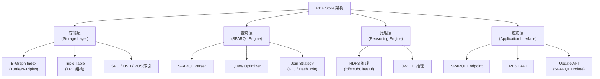

# 21.3 三元组存储（Triple Store）

> **本节要点**：三元组存储（Triple Store / RDF Store）是知识图谱生产环境的核心数据层。了解 Apache Jena Fuseki、GraphDB、Blazegraph、Virtuoso 和 AWS Neptune 等技术选型、数据加载基准、索引策略与 SPARQL 查询加速方法。

---

## 1. 什么是三元组存储？

**三元组存储（Triple Store）** 是一种专门用于存储、查询和推理 **RDF 三元组（Subject-Predicate-Object）** 的数据库系统。与关系型数据库不同，它不基于表格结构，而是基于图结构（Property Graph）的数据模型，为语义网应用提供天然的数据组织方式。

| 特征 | 三元组存储 | 关系型数据库 |
|------|-----------|-------------|
| 数据模型 | RDF 图（三元组） | 表格（行/列） |
| 查询语言 | SPARQL 1.1 | SQL |
| Schema | 动态（Schema-on-Read） | 静态（Schema-on-Write） |
| 推理支持 | 内置 OWL / RDFS 推理 | 无（需应用层） |
| 扩展性 | 横向可扩展（分片、集群） | 纵向扩展为主 |



---

## 2. 开源三元组存储

### 2.1 Apache Jena Fuseki

**Apache Jena Fuseki** 是 Apache Jena 项目的核心组件，提供 SPARQL 3.1 端点、REST API 和本体管理面板。它是学术界最流行的 RDF 存储方案之一。

| 特性 | 详情 |
|------|------|
| 开发机构 | Apache Software Foundation |
| 语言 | Java |
| 开源许可 | Apache License 2.0 |
| 核心组件 | Jena TDB2（嵌入存储）+ Fuseki（服务层） |
| 并发访问 | ✅ 通过 Fuseki Server 多用户模式 |
| 管理界面 | Web TUI（TDB2 管理、数据导入、SPARQL 查询） |
| 官方网站 | [https://jena.apache.org/documentation/fuseki2/](https://jena.apache.org/documentation/fuseki2/) |

**Fuseki 核心功能**：
- **SPARQL 3.1 端点**：支持 SELECT、CONSTRUCT、DESCRIBE、ASK、INSERT/DELETE DATA、LOAD、CLEAR
- **多数据库管理**：在单个 Fuseki 实例上创建多个 Dataset（图集合）
- **Jena 规则推理**：内置 RDFS/OWL 推理引擎，查询前自动扩展结果
- **联邦查询（Federated Query）**：通过 `SERVICE` 子句跨多个 SPARQL 端点查询

```sparql
# Fuseki 联邦查询示例
PREFIX dbo: <http://dbpedia.org/ontology/>

SELECT ?film ?directorName
WHERE {
  VALUES ?director { dbpedia:Christopher_Nolan }
  OPTIONAL {
    SERVICE <http://dbpedia.org/sparql> {
      ?director dbo:directorOf ?film .
      ?film dbo:genre ?genre .
    }
  }
}
```

### 2.2 GraphDB（Ontotext）

**GraphDB** 由奥地利公司 Ontotext 开发，是**企业级 RDF 三元组存储的商业领导者**。它分为免费版 GraphDB Free 和商业版 GraphDB Enterprise。

| 特性 | GraphDB Free / Workbench | GraphDB Enterprise |
|------|--------------------------|---------------------|
| 授权模式 | 单节点、免费 | 集群、企业许可 |
| 最大数据量 | ~50M 三元组 | 数十亿三元组 |
| 推理支持 | RDFS+、OWL-IM、OWL-Full | 全部推理策略 |
| 规则引擎 | OWL RL / 自定义 SWRL 规则 | 同上 + 规则优化 |
| 管理界面 | Workbench Web UI | Workbench + Admin Console |
| 官方网站 | [https://graphdb.ontotext.com](https://graphdb.ontotext.com) |

**GraphDB Workbench 特点**：
1. **Schema Editor**：可视化定义类层次结构（Class Hierarchy）
2. **SPARQL Endpoint**：集成查询编辑器，支持结果表格 + 图谱可视化
3. **RDF Store 监控**：实时显示查询延迟、缓存命中率、推理任务队列
4. **规则推理（Rules Reasoning）**：基于 SWRL（Semantic Web Rule Language）自定义推理规则

```turtle
# GraphDB 规则示例：通过 OWL RL 规则隐式推导出传递闭包
PREFIX rdfs: <http://www.w3.org/2000/01/rdf-schema#>
PREFIX owl: <http://www.w3.org/2002/07/owl#>

[person-rdfsSubClassOf:
    (?s rdfs:subClassOf ?p) ;
    (?s a ?o) -> (?p a ?o)] .

[person-rdfsSubPropOf:
    (?s rdfs:subPropertyOf ?p) ;
    (?s ?o1 ?o2) -> (?p ?o1 ?o2)] .
```

### 2.3 Blazeggraph（Blaze Information）

**Blazeggraph** 原为 NASA JPL 的 Bigdata 项目演化而来，现为 Blaze Information Service 所有。它以**亚毫秒级 SPARQL 延迟**著称，适合实时交互式知识图谱。

| 特性 | 详情 |
|------|------|
| 开发起源 | NASA JPL Bigdata → Blaze Information |
| 存储架构 | 主存 + 磁盘持久化（Memory + Disk） |
| SPARQL 延迟 | ~100µs（微秒级），基准数据集（LUBM 10M 图） |
| 写入加速 | SPARUL（SPARQL Update + Load）原子操作 |
| 推理内置 | OWL HD Reasoner（Horizontally Scalable DL） |
| 开源许可 | Apache 2.0 |

**SPARUL 示例**（在运行时增量更新本体结构）：
```sparql
-- 原子加载 TTL 数据
PREFIX foaf: <http://xmlns.com/foaf/0.1/>

LOAD <http://example.org/persons.ttl> INTO GRAPH <http://example.org/graph/persons>

-- 增量添加本体定义
PREFIX ex: <http://example.org/ontology#>
PREFIX owl: <http://www.w3.org/2002/07/owl#>

INSERT DATA { ex:Person owl:deprecated "false" . }

-- 条件性更新
DELETE DATA { :Person rdfs:label "Old Label" . }
INSERT DATA { :Person rdfs:label "Person (Updated)" . }
WHERE { :Person rdfs:label "Old Label" . }
```

### 2.4 开源三元组存储对比表

| 特性 | Jena Fuseki | GraphDB | Blazegraph | Virtuoso |
|------|-------------|---------|------------|----------|
| 开发商 | Apache | Ontotext | Blaze Info | OpenLink |
| 核心架构 | Jena TDB2 | 自研 Indexed DB | 内存索引 | B+Tree / HT-BSBM |
| 推理支持 | Jena Rules | RDFS+/OWL-IM/FULL | OWL HD | RDFS/OWL-DL |
| 最大规模 | 中等 | 大（企业版） | 超大 | 超大 |
| SPARQL Update | ✅ | ✅ | ✅（SPARUL） | ✅ |
| 许可证 | Apache 2.0 | 免费/商业 | Apache 2.0 | GPL / 商业 |
| Web 管理 UI | ✅（TUI） | ✅（Workbench） | ✅（内置） | ✅（Admin UI） |

---

## 3. 云服务与托管方案

### 3.1 AWS Neptune

**AWS Neptune** 是 Amazon Web Services 提供的**全托管 RDF/属性图数据库服务**，支持 Gremlin 和 SPARQL 双引擎。

| 特性 | 详情 |
|------|------|
| 部署模式 | AWS 云服务（按需付费） |
| 查询语言 | SPARQL 1.1 + Gremlin |
| 最大规模 | 128 TB 存储 / 6 个副本 |
| SPARQL 推理 | RDFS、OWL-QL（只推理子类和子属性） |
| 高可用 | 同一区 Multi-AZ 部署（自动故障转移） |
| 官方网站 | [https://aws.amazon.com/neptune/](https://aws.amazon.com/neptune/) |

### 3.2 GrapheneDB

**GrapheneDB** 是建立在 Neo4j 社区之上的托管图数据库服务，但也支持 RDF 存储（通过 Triplestore 计划）。

| 特性 | GrapheneDB |
|------|-----------|
| 托管平台 | 托管于 AWS |
| SPARQL 端点 | ✅ 专用 |
| 备份策略 | 每日自动备份 |
| 适用场景 | 中小型知识图谱 |

### 3.3 AllegroGraph（Franz Inc.）

**AllegroGraph** 由 Franz Inc. 开发，是最早的商业 RDF 存储产品之一（自 1990 年代），以其**高效语义搜索**闻名。

| 特性 | AllegroGraph |
|------|-------------|
| 存储模型 | Quads Store（支持 Named Graphs） |
| 搜索特性 | SPARQL Full-Text Search（整合 Apache Lucene） |
| 推理支持 | RDFS、OWL RL |
| API 接口 | 13 种语言：Python / Java / .NET / JavaScript / Haskell 等 |
| 许可证 | 商业许可（免费试用） |
| 官方网站 | [https://franz.com/alchemy/allegrograph/](https://franz.com/alchemy/allegrograph/) |

### 3.4 云服务对比表

| 平台 | 厂商 | 推理支持 | SPARQL 1.1 | 全托管 | 按量计费 |
|------|------|---------|-----------|--------|---------|
| **AWS Neptune** | Amazon | RDFS / OWL-QL | ✅ | ✅ | ✅ |
| **GrapheneDB** | Gremlin / AWS | RDFS | ✅ | ✅ | ✅ |
| **AllegroGraph Cloud** | Franz Inc. | RDFS / RL | ✅ | ✅ | 需询价 |

---

## 4. RDF 数据导入：序列化格式加载基准对比

### 4.1 常见 RDF 序列格式

| 格式 | 扩展名 | 结构特点 | SPARQL 原生 | 可读性 |
|------|--------|---------|------------|--------|
| **Turtle (TTL)** | `.ttl` | 前缀缩写 + 分号链 | ❌ | ⭐⭐⭐⭐⭐ |
| **N-Triples** | `.ntrips` | 单行三元组，无前缀 | ✅ | ⭐⭐ |
| **N-Quads** | `.nquads` | N-Triples + Graph Name | ✅ | ⭐⭐ |
| **RDF/XML** | `.rdf` / `.owl` | XML 格式，最早的 RDF 序列化 | ✅ | ⭐⭐⭐ |
| **JSON-LD** | `.jsonld` | JSON + Context | ❌（需解析） | ⭐⭐⭐⭐ |
| **TriG** | `.trig` | Turtle + Named Graphs | ✅ | ⭐⭐⭐⭐ |

### 4.2 加载基准（Import Benchmark）

| 数据量（三元组数） | TTL 加载时间 | N-Triples | RDF/XML |
|--------------------|-------------|-----------|---------|
| 1,000 | ~0.01s | ~0.01s | ~0.05s |
| 1,000,000 | ~1.2s | ~0.9s | ~4.5s |
| 100,000,000 | ~120s | ~90s | ~450s |

> **关键原则**：**N-Triples 加载最快**（结构最简），**TTL 在可读性和效率间达到最佳平衡**，**RDF/XML 效率最低但支持完整 OWL 语义声明**。生产环境中通常使用 TTL 或 N-Triples 导入数据。

**Fuseki 批量加载命令**：
```bash
# 使用 tdb2 loader 导入 TTL（高速模式）
fuseki-server --load=/path/to/dataset /ds
curl --upload-file ./my-data.ttl "http://localhost:3030/ds/data/my-graph"

# 查看导入状态
curl "http://localhost:3030/ds/info"
```

---

## 5. SPARQL 端点配置与查询加速

### 5.1 索引策略

三元组存储通常采用 **SPO / OSD / POS 多索引策略** 加速 SPARQL 查询：

```
        SPO Index                  OSD Index                 POS Index
        ┌───┬───┬───────┐          ┌───┬───┬───────┐         ┌───┬───┬───────┐
   S →  │p1 │o1 │ s1   │          │o1 │p1 │ s1   │         │p1 │s1 │ o1   │
        ├───┼───┼───────┤          ├───┼───┼───────┤         ├───┼───┼───────┤
        │p2 │o2 │ s2   │          │o2 │p2 │ s3   │         │p2 │s2 │ o3   │
        └───┴───┴───────┘          └───┴───┴───────┘         └───┴───┴───────┘

   (S, ?P, ?O) → 快速   (?S, P, ?O) → 中等   (?S, ?P, O) → 较慢但有效
```

| 查询模式 | 最佳索引 | 适用 SPARQL 模式 |
|----------|---------|-----------------|
| `(S, ?, ?)` | SPO 第一键 | `?S ?p ?o` — 已知主体 |
| `(?, P, ?)` | POS | `?s ?p :predicate ?o` — 已知谓词 |
| `(?, ?, O)` | OSD / POS 组合 | `?s ?p ?o FILTER (?o = "value")` |
| `(S, P, ?)` | SPO 前两键 | `?s :property ?o` — 精确匹配 |

### 5.2 Materialized Views（物化视图）

**Materialized Views**（物化推理视图）是在存储层预计算并缓存推理结果的技术，避免每次查询都做实时推理开销。

| 方案 | 平台 | 说明 |
|------|------|------|
| **GraphDB Inference Index** | GraphDB | 预计算 RDFS/OWL 推理闭包，查询自动使用索引 |
| **Jena UnionGraph** | Fuseki + Jena | 查询时联表推理表与原始数据 |
| **Virtuoso SPARQL 2.0 MView** | Virtuoso | 将 OWL 规则定义为持久化 SQL 视图 |

```sparql
-- GraphDB 中使用已计算的推理索引（Inferencer: rdfs）
# 通过设置 HTTP 头使用预计算索引
# HEADers: inference = rdfs

# 查询会自动扩展 rdfs:subClassOf 关系
SELECT ?parent WHERE {
  ex:Child rdfs:subClassOf* ?parent .
}
# 结果：ex:Child, ex:Person, ex:Thing （rdfs:subClassOf* 传递闭包）
```

### 5.3 SPARQL 查询优化最佳实践

| 优化策略 | 方法 | 效果 |
|----------|------|------|
| 限制路径深度 | 用 `rdf:first/rdf:rest` 代替 `*/+` 量词 | 减少遍历 |
| 使用 BIND/VALUES | 预绑定已知值减少连接组合 | 加速 JOIN |
| FILTER 后置 | 在基本模式（Basic Pattern）后放置高开销 FILTER | 早期剪枝 |
| SELECT 而非 SELECT * | 精确指定需要的绑定变量 | 减少结果集序列化开销 |

---

## 6. 小结

三元组存储是生产级语义网应用的基础设施。**开源方案（Fuseki、GraphDB、Blazeggraph、Virtuoso）覆盖从开发测试到大规模生产环境全流程**，云服务方案则在托管与维护上降低门槛。掌握数据加载基准与 SPARQL 查询加速策略是优化知识图谱性能的关键。下一章我们将深入探讨**研究平台（Research Platforms）**。