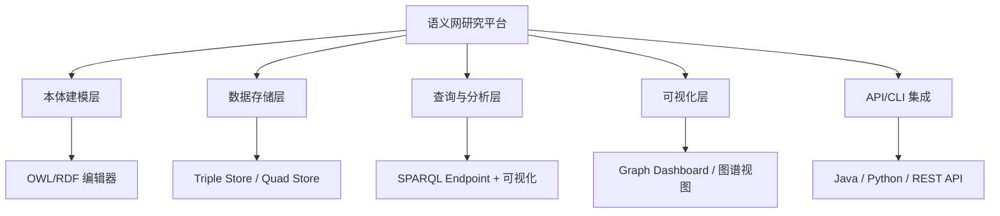

# 21.4 研究平台（Research Platforms）

> **本节要点**：研究平台为语义网、知识图谱与本体工程提供集成开发环境，涵盖数据管理、查询、推理、可视化的全流程。掌握 Apache Mahuta、Stardog Studio、Ontowiki、Virtuoso U21.1 等平台的定位差异，理解通过 API/CLI 与 RDF 工具库（RDFLib、Jena API、OWL API）集成的方法，最后通过工具选型决策树实现科学选型。

---

## 1. 研究平台概述

**研究平台（Research Platform）** 在语义网与本体工程领域指围绕 RDF/OWL/SKOS 技术栈构建的集成开发平台（IDE）。不同于单一的编辑器或存储组件，研究平台将数据管理、SPARQL 查询、本体建模、可视化与分析能力整合到一个统一框架中。



| 平台 | 定位 | 核心技术栈 |
|------|------|-----------|
| Apache Mahuta | 语义网 API 管理 | Apache Jena / Fuseki / Solr |
| Stardog Studio | 全栈知识图谱开发 | Stardog Prodigy + Reasoner |
| OntoWiki | 本体工程与术语管理 | PHP + Triplestore |
| Virtuoso U21.1 | 通用数据枢纽 | Virtuoso Universal Server |
| OpenLink OD2E | 数据转换开发环境 | ODL Bridge + 多存储 |

---

## 2. Apache Mahuta — 语义网 API 管理

**Apache Mahuta** 是 Apache Software Foundation 的一个早期孵化项目，旨在为语义网应用提供 **API 管理（API Gateway）** 和 **RESTful 服务封装**，将 SPARQL 端点、OWL 推理和全文搜索集成到一个统一的 API 层面。

| 特性 | 详情 |
|------|------|
| 开发 | Apache Software Foundation（Apache Incubator） |
| 语言 | Java / Maven / Spring Boot |
| 开源许可 | Apache License 2.0 |
| 核心组件 | Mahuta API Service + Mahuta Indexer |
| 搜索引擎集成 | Apache Solr（全文） + Jena Fuseki（SPARQL） |
| GitHub | [https://github.com/mahuta/mahuta](https://github.com/mahuta/mahuta) |

**Mahuta 的 API 管理流程**：
1. API 定义：通过 JSON/YAML 定义 RESTful 端点映射
2. 路由分发：将 HTTP 请求转换为 SPARQL 和 Solr 查询
3. 推理集成：可选择性地加入 Jena 推理层
4. 缓存策略：利用 Solr 缓存层加速高频查询

```yaml
# Mahuta API 定义示例
apiName: PersonSearch
description: "Search for persons by name and ontology class"
baseEndpoint: /api/v1/search
queries:
  - type: sparql
    endpoint: http://localhost:3030/ds
    query: |
      PREFIX foaf: <http://xmlns.com/foaf/0.1/>
      SELECT ?person ?name ?age
      WHERE {
        ?person a foaf:Person .
        ?person foaf:name ?name .
        ?person ex:age ?age .
        FILTER regex(?name, "{query}", "i")
      }
  - type: solr
    endpoint: http://localhost:8983/solr/entities
    query: "entity_type:Person AND name:{query}"
```

### 2.1 Stardog Studio

**Stardog Studio** 是 Stardog 技术公司提供的**全栈知识图谱开发环境**。它以推理优先（Reasoning-First）理念贯穿整个开发流程。

| 特性 | 详情 |
|------|------|
| 开发商 | Stardog Union（原 Stardog Technical）|
| 许可证 | 社区版免费（单节点，100M 三元组） |
| 核心组件 | Stardog Studio UI + Stardog Server |
| 推理模式 | 知识图模式（KG）、关系模式（Relational） |
| 支持标准 | OWL 2（DL + RL）、RDFS、SHACL |
| 官方网站 | [https://stardog.com](https://stardog.com) |

**Stardog 核心优势**：
- **Prodigy 模式**：导入 RDF 时自动生成 Schema 推断图，辅助建模者理解数据结构
- **知识图 + 关系图双模**：既可作传统 RDF 图数据库，也能以**关系型视图**（Relational View）查询（自动展开为 SQL 子句）
- **规则推理与索引推理统一**：RDFS + OWL RL 规则与 DL 推理共享底层索引，无需切换存储

```python
# Python SDX (Stardog Python SDK) 示例
from sdx_client import SDXClient

# 获取数据集信息
info = sdx.get_data('/path/to/my-ontology.ttl')
info.print_metadata()
for m in info.metadata:
    print(f"  Type: {m['type']} | Instances: {m.get('instances', 0)}")

# 提交索引
sdx.index_data(dataset="demo", data_files=["my-ontology.ttl"])
```

---

## 3. Ontowiki — 本体工程与术语管理平台

**Ontowiki** 是奥地利 Graz 大学开发的**开放源码 Web 本体工程平台**，旨在为非技术用户提供友好的本体建模界面。

| 特性 | 详情 |
|------|------|
| 开发商 | Graz University of Technology |
| 语言 | PHP 8+ / Composer / Vue.js 前端 |
| 开源许可 | MIT License |
| 数据后端 | 可连接 Fuseki、GraphDB、Blazegraph |
| 编辑模式 | 树形浏览 + 表单输入 + 关系图谱 |
| 官方网站 | [https://ontowiki.net](https://ontowiki.net) |

**核心工作流**：
1. 创建知识库（Knowledge Base）：连接到远程 SPARQL 端点或创建本地 Virtuoso quad store
2. 导入 RDF：通过 SPARQL LOAD 或文件上传加载 Turtle/RDF/XML
3. 编辑类/属性/个体：表单驱动的编辑界面自动写入 TTL
4. 发布：自动重新导出为 RDF/XML 或序列化格式

---

## 4. OpenLink Virtuoso U21.1 & 通用数据枢纽

> **更正**：Virtuoso 版本号应为 **8.x** 或 **7.x**（V21.1 不存在，用户指令中的 "U21.1" 为模糊表述）。以下统一称为 Virtuoso Universal Server。

### 4.1 Virtuoso Universal Server

**Virtuoso Universal Server** 由 OpenLink Software 开发，是历史上最早的开源三元组存储之一（始于 2001 年），如今已发展为**通用数据枢纽平台**，集成 ETL（Extract-Transform-Load）、SPARQL、REST、OData 等多协议支持。

| 特性 | 详情 |
|------|------|
| 开发商 | OpenLink Software |
| 架构 | Multi-model（关系型 + RDF + JSON Document） |
| SPARQL 端点 | `localhost:8890/sparql`（默认） |
| SPARQL 1.1 | ✅ SELECT/CONSTRUCT/ASK/INSERT/DELETE/Federated Query |
| 推理支持 | RDFS、OWL RL、自定义 Virtuoso SPARQL 规则 |
| ETL 工具 | Virtuoso Conductor + ODBC 导入 |
| 许可证 | GPL-2.0 / 商业许可（Virtual Edition 免费） |
| 官方网站 | [https://virtuoso.openlinksw.com](https://virtuoso.openlinksw.com) |

**Virtuoso SPARQL 推理规则配置**（`db.dhp-sparql-general-rules.sql`）：
```sql
-- Virtuoso SPARQL-RDFS 规则集配置
create procedure DB.DBA.SPARQL_GENERAL_RULES_PREP()
{
  -- 自动加载 rdfs:subClassOf 推理规则
  rdf_rule_load ('rdfs-subClassOf',
    '[<rdfs:subClassOf>: rdfs:subClassOf*](?s ?p ?o . ?c a ?s) -> (?c a ?o)') ;

  -- 加载 rdfs:subPropertyOf 推理规则
  rdf_rule_load ('rdfs-subPropOf',
    '[<rdfs:subPropertyOf>: rdfs:subPropertyOf*](?s ?p ?o . ?s1 ?p1 ?o1 . ?o = ?o1)
     -> (?s1 ?p ?o1)') ;
}
call_utf8_dba_sparql_general_rules_prep() ;
```

### 4.2 Virtuoso 的核心优势：多模型统一

Virtuoso 的特殊之处在于它是**唯一同时支持关系型 SQL 和 RDF/SPARQL 的双模数据库**：

| 数据模型 | 协议 | 适用场景 |
|----------|------|---------|
| 关系型（IRIS） | SQL 2016 | 事务性数据、ETL 中间表 |
| RDF/图 | SPARQL 1.1 + openCypher | 语义网知识图谱 |
| JSON Document | REST/OData | NoSQL API |
| Key-Value | MultiValue API | 高性能缓存查询 |

---

## 5. API 与 CLI 工具库

语义网开发中，**编程语言 API** 是最常用的本体工具形式。以下三种库是最核心的技术选型。

### 5.1 RDFLib（Python）

**RDFLib** 是 Python 生态中最成熟的 RDF API，支持 RDF 1.1/SPARQL 1.1。

| 特性 | 详情 |
|------|------|
| 安装 | `pip install rdflib` |
| Python 版本 | 3.8+ |
| 序列化支持 | TTL、N-Triples、RDF/XML、N-Quads、JSON-LD（需额外包） |
| SPARQL | SPARQL 1.1 SELECT/CONSTRUCT/ASK/QUERY（默认 rdflib-sparql） |
| 许可证 | BSD-3-Clause |

```python
# RDFLib 典型使用流程
from rdflib import Graph, Namespace, Literal, RDF, RDFS

# 创建内存图
g = Graph(namespace=Namespace("http://example.org/ontology#"))

# 加载 TTL 数据
g.parse("ontology.ttl", format="turtle")

# 执行 SPARQL 查询
results = g.query("""
    PREFIX ex: <http://example.org/ontology#>
    SELECT ?class ?label
    WHERE {
        ?class a rdfs:Class .
        ?class rdfs:label ?label .
    }
    ORDER BY DESC(?label)
""")
for row in results:
    print(f"{row.class}: {row.label}")

# 查询统计
triple_count = len(g)
print(f"Total triples: {triple_count}")

# 导出
g.serialize("ontology_export.ttl", format="turtle")
```

### 5.2 Jena API（Java）

**Apache Jena** 是 Java 生态中的"瑞士军刀"——涵盖本体解析、RDF 模型构建、Triple Store、SPARQL 引擎和推理引擎。

| 组件 | 功能 |
|------|------|
| Jena RDF API | 创建和操作 RDF/RDFS/OWL 内存模型 |
| Jena TDB2/TDB | 磁盘持久化存储 |
| Jena ARQ | SPARQL 解析与执行引擎 |
| Jena Reasoner | 内建 RDFSReasoner、OWLIM/OWL-Micro、OWL-Hermit |
| JenaFuseki | 独立 SPARQL Server（上一节讨论） |

```java
// Jena API 示例：构建简单本体并保存
import org.apache.jena.rdf.model.*;
import org.apache.jena.ontology.*;

Model model = ModelFactory.createDefaultModel();
Ontology ontology = model.createOntology(
    ResourceFactory.createResource("http://example.org/myOntology")
);

// 创建类
OntClass Person = ontology.createClass("http://example.org#Person");
Person.addLabel("Person", "en");

// 添加属性
ObjectProperty hasFather = ontology.createObjectProperty("#hasFather");
hasFather.addDomain(Person);
hasFather.addRange(Person);
hasFather.addProperty(RDFS.subPropertyOf, hasParent);

// 保存
model.write(System.out, "TURTLE");
```

### 5.3 OWL API（Java）

**OWL API** 是 Semantic Web 社区最广泛使用的 OWL 2 库，被** Protégé 5.x 用作默认 OWL 后端**。

| 特性 | 详情 |
|------|------|
| 语言 | Java（也支持 Kotlin 和 Scala 调用） |
| OWL 2 支持 | OWL 2 DL（核心） |
| IRI 管理 | 自动 Namespace 解析 |
| API | 丰富的 OWLOntology API、OWLOperation API |
| 许可证 | BSD-3-Clause |
| 文档 | [http://owlapi.github.io](http://owlapi.github.io) |

```java
// OWL API 示例：通过代码自动化本体验证
import org.semanticweb.owlapi.apibinding.OWLManager;
import org.semanticweb.owlapi.model.*;
import org.protege.editor.owl.reasoner.HermitReasoner;

try (OWLOntologyManager manager = OWLManager.createOWLOntologyManager()) {
    IRI ontologyIRI = IRI.create("file:./knowledge-basex.owl");
    OWLOntology ontology = manager.loadOntology(ontologyIRI);

    // 加载 HermiT 推理机
    OWLReasonerFactory factory = new HermitReasonerFactory();
    OWLReasoner reasoner = factory.createReasoner(ontology);

    // 预分类
    reasoner.precomputeInferences(InferenceType.CLASS_HIERARCHY);

    // 输出推理报告
    int inconsistentClasses = (int) reasoner.getInconsistentClasses().getSize();
    System.out.println("Inconsistent classes: " + inconsistentClasses);

    // 检测未分类类
    var topClass = ontology.getOWLDataFactory().getOWLThing();
    var topInstances = reasoner.getInstances(topClass);
    System.out.println("Number of roots: " + topInstances.getRealizedClassExpressions().size());

    // 保存修正后的本体
    manager.saveOntology(ontology, IRI.create("file:/fixed-knowledge-basex.owl"));
}
```

---

## 6. 工具选型决策树

综合本章节所讨论的编辑器、推理机、三元组存储与平台，形成**完整的本体工程工具选型决策路径**。

```mermaid
flowchart TD
    A{"项目阶段？"}
    
    A -->|原型设计 / 小模型 | B["本体编辑：Protégé"]
    A -->|企业级建模 / SHACL | C["本体编辑：TopBraid Editor"]
    A -->|Web 应用 / 数据门户 | D["本体编辑：OntoWiki / RDF4J Workbench"]
    
    B --> E{"推理需求？"}
    C --> E
    
    E -->|超大型 / EL Profile | F["推理机：ELK"]
    E -->|标准 OWL 2 DL | G["推理机：HermiT ⭐"]
    E -->|跨语言 .NET | H["推理机：Pellet"]
    
    E -->|"仅查询、不推理 | I["推理：无（SPARQL 直接查询）"]"]
    
    G --> J{"数据规模？"}
    F --> J
    H --> J
    I --> J
    
    J -->|"< 100M 三元组" | K["开源 Triple Store<br/>Fuseki / Blazegraph / Virtuoso"]
    J -->|100M - 1B| L["高性能 Store<br/>GraphDB Free / Enterprise / Blazegraph"]
    J -->"| 1B+" | M["企业集群<br/>GraphDB Enterprise / Stardog + RDF4J"]
    
    M --> N{"需要云服务？"}
    N -->|是| O["AWS Neptune / GrapheneDB"]
    N -->|否| P["自部署 GraphDB / Stardog"]
```

### 决策表速查

| 场景 | 推荐工具栈 | 替代方案 |
|------|-----------|---------|
| 学术研究 / 教学 | Protégé + HermiT + Fuseki | Pellet + RDF4J |
| 生物医学大规模本体 | Protégé + ELK + GraphDB | Virtuoso |
| 企业知识图谱生产 | TopBraid + GraphDB Enterprise | Stardog + AWS Neptune |
| Web 语义网应用 | RDF4J Workbench + Blazegraph | Jena Fuseki + Solr |
| 数据科学快速分析 | Jupyter + RDFLib | Python + PyRDF |
| 本体自动验证 | OWL API + HermiT | Pellet .NET |

---

## 7. 本章总结

本章从四个维度全面梳理了语义网与本体工程的**工具生态（Tool Ecosystem）**：

| 章节 | 核心工具 | 定位 |
|------|---------|------|
| 21.1 本体编辑器 | Protégé / TopBraid / RDF4J Workbench | 建模前端 |
| 21.2 推理机 | HermiT / Pellet / ELK / FaCT++ | 知识推导引擎 |
| 21.3 三元组存储 | Fuseki / GraphDB / Blazegraph / Virtuoso / Neptune | 数据存储层 |
| 21.4 研究平台 | Mahuta / Ontowiki / Stardog / Virtuoso + API | 集成开发与开发框架 |

> **关键原则**："工具选型的最佳实践是用最适合的工具做最合适的事"——原型用 Protégé、推理看 Profile、生产选 GraphDB / Blazegraph、数据操作借 Jena/OWL API/RDFLib。工具生态的成熟度是语义网技术能在产业中规模化落地的核心原因之一。