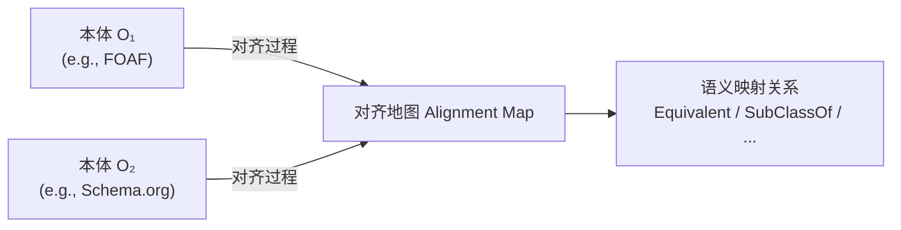
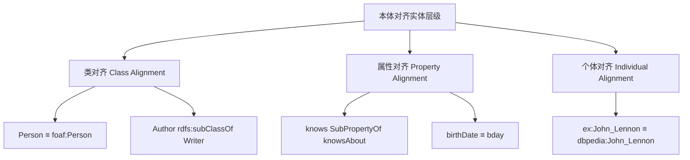
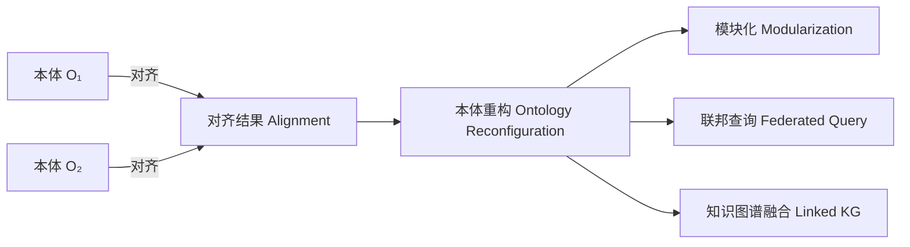

# 22.1 本体对齐概念（Ontology Alignment Concepts）

> **本节要点**：本体对齐（Ontology Alignment）是本体工程中的核心环节，用于在异构本体之间建立语义映射（Semantic Mapping）。理解对齐的形式化表达、对齐要素（实体类型、关系、置信度）、以及对齐与本体重构的关系，是实践对齐任务的理论基础。

---

## 1. 什么是本体对齐？

**本体对齐（Ontology Alignment）** 是指在不同本体之间发现并建立**对应关系（Correspondences）** 的过程。这些对应关系表达了不同本体中的实体（类、属性、个体）在语义上的等价性、子集关系或其他逻辑关联。



**核心目标**：
- **互操作性（Interoperability）**：允许不同数据源使用不同本体的术语但仍能协同工作
- **知识融合（Knowledge Fusion）**：将多个异构知识库合并为统一视角
- **查询扩展（Query Expansion）**：跨本体 SPARQL 查询时自动扩展谓词和类约束

**与相关概念的区分**：

| 概念 | 英文名 | 与对齐的关系 |
|------|--------|-------------|
| 本体对齐 | Ontology Alignment | 核心：建立跨本体语义映射 |
| 本体集成 | Ontology Integration | 将对齐结果合并为单一联合本体 |
| 本体合并 | Ontology Merging | 将对齐本体融合，解决命名冲突 |
| 本体匹配 | Ontology Matching | 常与"对齐"互换使用，侧重自动发现过程 |
| 实体链接 | Entity Linking | 将非结构化文本中的实体链接到知识库中对应实体 |

---

## 2. 对齐的形式化表达

### 2.1 对齐作为对应关系集合

在形式化模型中，**对齐（Alignment）** 被定义为**对应关系（Correspondences）** 的有限集合：

$$A = \{ c_1, c_2, \ldots, c_n \}$$

每个对应关系 $c_i$ 包含以下五元组：

$$c_i = \langle r, e_1, e_2, \text{confidence}, \text{size} \rangle$$

其中：
- $r$：**关系（Relation）**，如 $\equiv$（等价）、$\sqsubset$（子关系）、$\sqsupset$（超关系）
- $e_1$：来自本体 O₁ 的实体（Entity）
- $e_2$：来自本体 O₂ 的实体
- **confidence**：置信度分数，范围 [0, 1]
- **size**：匹配实体的数量（用于基于实例的对齐）

### 2.2 对齐地图格式（Alignment Map Format）

对齐结果通常以 XML 或 RDF 格式存储。**ALIGNED**（Alignment Exchange Interchange Format）是最常用的标准格式。

```xml
<!-- 对齐地图 XML 示例 -->
<alice:alignments xmlns:alice="http://knoweng.org/alice/0.1/">
  <alice:alignment-map>
    <alice:map>
      <alice:cell confidence="0.95">
        <alice:entity1 rdf:resource="http://semanticsweb.org/foaf#name"/>
        <alice:entity2 rdf:resource="http://schema.org/name"/>
        <alice:relation>"=="</alice:relation>
        <alice:entity2 rdf:resource="http://schema.org/name"/>
      </alice:cell>
    </alice:map>
    <alice:map>
      <alice:cell confidence="0.88">
        <alice:entity1 rdf:resource="http://semanticsweb.org/foaf#knows"/>
        <alice:entity2 rdf:resource="http://schema.org/sameAs"/>
        <alice:relation>"SubPropertyOf"</alice:relation>
      </alice:cell>
    </alice:map>
  </alice:alignment-map>
</alice:alignments>
```

---

## 3. 对齐要素详解

### 3.1 实体类型（Entity Types）

对齐可以在本体层次结构的不同层级进行：

| 实体类型 | 英文名 | 描述 | OWL 类引用 |
|----------|--------|------|------------|
| 类 | Class | 概念层面对齐，最常见 | `owl:Class` |
| 对象属性 | Object Property | 关系/属性对齐 | `owl:ObjectProperty` |
| 数据属性 | Data Property | 数据类型属性对齐 | `owl:DatatypeProperty` |
| 个体/实例 | Individual | 实体层面的链接 | `owl:Thing` |
| 命名空间/词汇表 | Namespace/Vocabulary | 跨 Vocabulary 映射 | N/A |



### 3.2 对齐关系类型

| 关系 | OWL 符号 | RDF 符号 | 说明 |
|------|----------|----------|------|
| 等价 | $\equiv$ | `owl:equivalentClass` / `owl:equivalentProperty` | 两个实体语义完全相同 |
| 子集 / 子类 | $\sqsubseteq$ | `rdfs:subClassOf` | 左侧是右侧的子类/子集 |
| 超集 / 超类 | $\sqsupseteq$ | 反向 `rdfs:subClassOf` | 左侧是右侧的超类/超集 |
| 不相交 | $\sqcap = \emptyset$ | `owl:disjointWith` | 两个实体没有共同实例 |
| 子属性 | $\sqsubseteq_{prop}$ | `rdfs:subPropertyOf` | 左侧属性是右侧属性的子集 |
| 超属性 | $\sqsupseteq_{prop}$ | 反向 `rdfs:subPropertyOf` | 左侧属性包含右侧 |
| 近似等价 | $\approx$ | 自定义注释属性 | 语义接近但不完全相同 |

### 3.3 置信度分数（Confidence Score）

置信度表示匹配可靠程度，取值范围 $[0, 1]$。高置信度匹配可用于自动合并，低置信度匹配则需人工审核。

| 置信度范围 | 解释 | 建议操作 |
|------------|------|----------|
| 0.95 - 1.0 | 确定匹配（Certain） | 自动合并，无需人工审核 |
| 0.80 - 0.94 | 高置信度（High） | 优先审核，很可能正确 |
| 0.60 - 0.79 | 中等置信度（Medium） | 建议人工确认 |
| 0.40 - 0.59 | 低置信度（Low） | 需要领域专家验证 |
| 0.00 - 0.39 | 不确定（Uncertain） | 通常忽略或标记为"可能需要" |

**置信度的计算**通常基于以下指标：
- **字符串相似度分数**（String Similarity）：如 Jaro-Winkler 得分
- **结构相似度**（Structural Similarity）：邻居关系重叠度
- **实例重叠度**（Extensional Overlap）：实例扩展交集比例
- **混合打分**（Hybrid Scoring）：多源证据的加权求和或贝叶斯融合

---

## 4. OWL API Alignment API

**OWL API** 提供了 [`Alignment API`](https://api.owlrepo.org/docs/org/owlapi alignment/)，用于以编程方式操作对齐地图。这使得开发者能够在 Java 代码中加载、生成和验证对齐结果。

### 4.1 核心类与方法

| 类 / 接口 | 用途 |
|-----------|------|
| `Alignment` | 对齐地图的容器，包含一组 `AlignmentMapEntry` |
| `AlignmentMapEntry` | 单个对应关系的抽象（包含实体对、关系、置信度） |
| `AlignmentIO` | 对齐文件的读写（支持 ALICE、RDF/XML、KIF 等格式） |
| `AlignmentMetrics` | 计算对齐的精确率（Precision）、召回率（Recall）、F1 分数 |

### 4.2 代码示例

```java
import org.owlrepo.api.alignment.*;

// 加载对齐文件
Alignment alignment = AlignmentIO.loadAlignment(new File("alignment.alice"));

// 遍历所有对应关系
for (AlignmentMapEntry entry : alignment.getEntries()) {
    Entity e1 = entry.getEntity1();
    Entity e2 = entry.getEntity2();
    String relation = entry.getRelation();
    double confidence = entry.getConfidence();
    
    System.out.printf("%s %s %s (conf: %.2f)\n", 
        e1.getIRI().getRemainder(), relation, 
        e2.getIRI().getRemainder(), confidence);
}

// 创建新对齐
Alignment newAlignment = new Alignment();
newAlignment.addEntry(
    EntityFactory.createClassIRI("http://example.org/FOAF#name"),
    "=",
    EntityFactory.createClassIRI("http://example.org/Schema#name"),
    0.95
);
```

---

## 5. OAEI（Ontology Alignment Evaluation Initiative）

**OAEI（本体对齐评估倡议）** 是全球最具影响力的本体对齐基准测试活动，隶属于 SemEval / ESWC 系列会议，为对齐算法提供标准化评估框架。

### 5.1 OAEI 评估track

| Track | 描述 | 难度 |
|-------|------|------|
| **Anatomy Track** | 使用 SNOMED CT 解剖学子本体，固定基准 | 入门级 |
| **OntoCoherence Track** | 在同一本体上测试内部对齐发现 | 中级 |
| **Multimodal Track** | 使用多模态信息（文本、结构、图像）进行对齐 | 中高级 |
| **BioThings Track** | 基于多个生物医学本体进行跨领域对齐 | 高级 |
| **SRMO (Semantic Web Re-use, Mining and Optimization)** | 真实世界规模本体对齐 | 高级 |

### 5.2 OAEI 评估指标

OAEI 使用以下核心指标衡量对齐质量：

$$\text{Precision (P)} = \frac{|M \cap E|}{|M|}$$

$$\text{Recall (R)} = \frac{|M \cap E|}{|E|}$$

$$F_1 = 2 \cdot \frac{P \cdot R}{P + R}$$

其中 $M$ 为算法输出的匹配集合，$E$ 为标准答案（Gold Standard）。

| 指标 | 含义 | 解释 |
|------|------|------|
| **精确率（Precision）** | $P = \frac{|M \cap E|}{|M|}$ | 输出匹配中正确的比例 |
| **召回率（Recall）** | $R = \frac{|M \cap E|}{|E|}$ | 正确匹配中被找出的比例 |
| **F1 分数** | $F_1 = 2 \cdot \frac{P \cdot R}{P + R}$ | 综合精确率与召回率 |

---

## 6. 对齐与本体重构（Ontology Modularization / Reconfiguration）的关系

本体对齐不仅是跨本体的桥梁，也是**本体重构（Ontology Reconfiguration）** 的关键前驱步骤。



### 6.1 本体模块化（Ontology Modularization）

通过对齐，可以将多个小本体连接为联邦或模块化体系。**模块（Module）** 是从本体中提取的子集，在语义上等价于原本体关于特定命名空间的推理封闭。

- **GSM（Greatest Standard Module）**：以特定公理集为核心的最大推理闭包子本体
- **Signature-based Module**：基于签名（Signature）的本体子结构提取
- **对齐驱动模块化（Alignment-Driven Modularization）**：以对齐关系为跨模块链接点，支持跨模块推理

### 6.2 联邦与本体重构

| 重构方式 | 描述 | 对齐的作用 |
|----------|------|-----------|
| **联邦链接（Federated Linking）** | 各本体保持独立，通过对齐进行互操作 | 对齐图作为"联邦网络"路由查询 |
| **本体整合（Integration）** | 将对齐映射转换为 `owl:imports` 和等价断言 | 构建统一命名空间的综合本体 |
| **本体折叠（Contraction）** | 消除冗余类与属性，基于对齐关系合并 | 使用对齐删除重复定义 |
| **本体扩展（Expansion）** | 通过对齐添加新术语，扩展本体表达力 | 从外部本体 import 新概念 |

### 6.3 实际价值

> **实践价值**：在本体工程生命周期中，**不做对齐的本体就像孤岛中的数据**。随着知识图谱规模扩大（如 DBpedia、Wikidata），本体对齐已成为跨域数据互联的基础设施级操作。

---

## 7. 小结

| 本节内容 | 核心要点 |
|----------|---------|
| 本体对齐定义 | 在不同本体间发现语义映射（Semantic Mapping）关系 |
| 形式化表达 | 对齐 = 对应关系集合，每个对应含 $\langle r, e_1, e_2, \text{confidence}, \text{size} \rangle$ |
| 实体与关系类型 | 类 / 属性 / 个体的等价、子类、子属性等关系 |
| OWL API Alignment API | 提供编程式对齐操作接口 |
| OAEI | 标准化对齐基准测试，定义精确率/召回率评估体系 |
| 对齐与本体重构 | 对齐是模块化、联邦、知识融合的前驱步骤 |

---

## 8. 思考与练习

1. **形式化练习**：给定本体 O₁ 包含类 `ex:Author` 和数据属性 `ex:publisher`，本体 O₂ 包含 `schema:Author` 和 `schema:publisher`，请写出一个合法的对齐五元组。

2. **置信度设计**：假设你正在设计一个对齐系统，发现 `foaf:name` 和 `schema:name` 的字符串相似度为 0.92，但结构相似度仅为 0.45。你认为整体置信度应设为多少？请说明理由。

3. **对比分析**：参考 OAEI Anatomy Track 的结果，讨论精确率（Precision）和召回率（Recall）之间的权衡在什么场景下更有意义——是"自动数据集成"还是"专家审核"?

4. **实践题**：使用 OWL API 在 Java 中创建一个简单对齐对象，包含至少 3 个对应关系（类等价、属性子属性、个体匹配）。