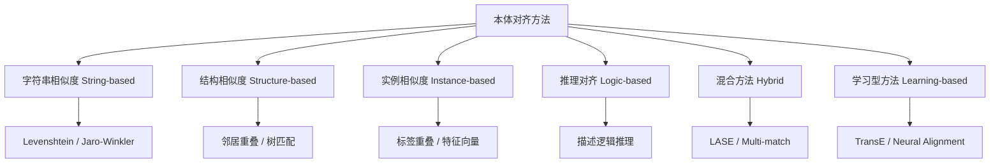
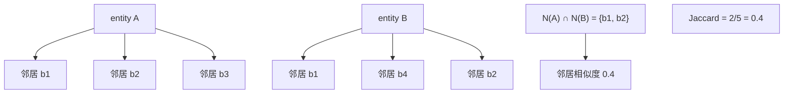
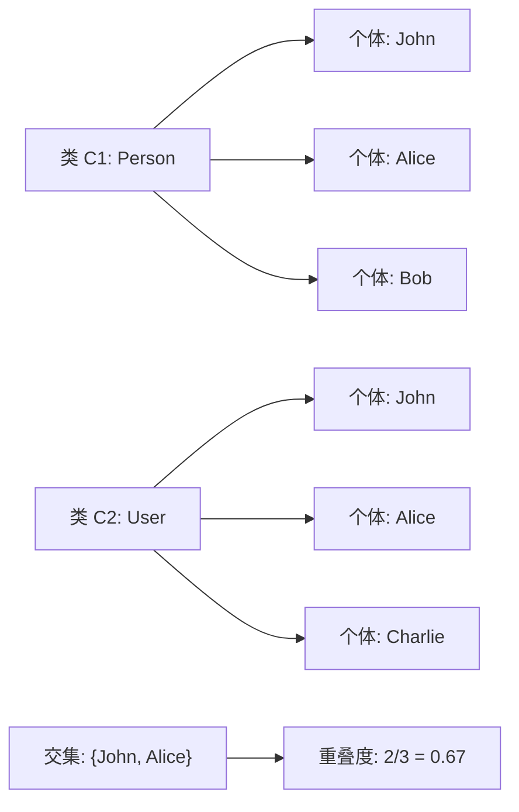
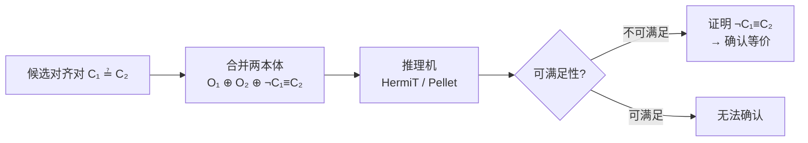
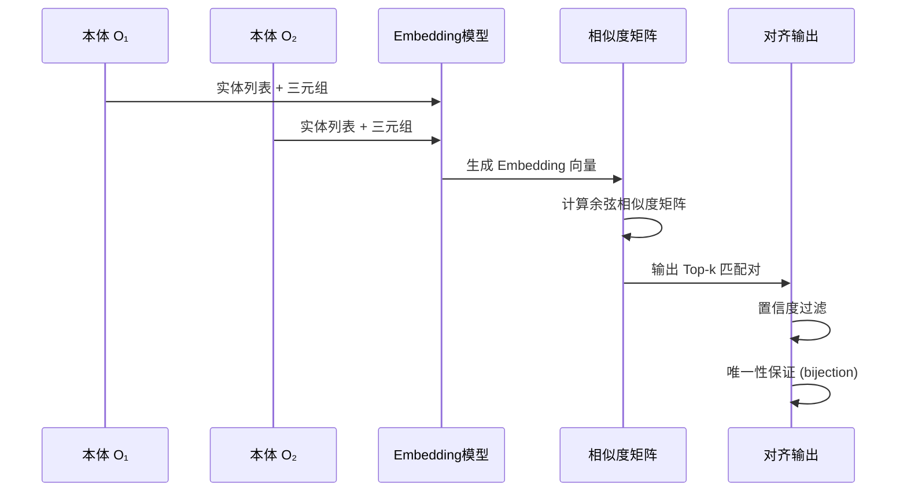
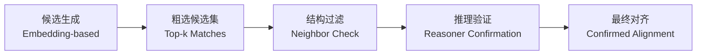

# 22.2 对齐方法（Alignment Methods）

> **本节要点**：本体对齐方法经历了从传统相似度计算到深度学习的演变。理解基于字符串、结构、实例、推理的各色方法及其混合策略，以及新兴的 Embedding-based 学习方法，是在实践中选择合适算法、设计对齐流水线的基础。

---

## 1. 方法分类总览

本体对齐方法可以从两个维度进行分类：

**按匹配粒度维度**：

| 维度 | 类别 | 说明 |
|------|------|------|
| **字符串层** | String-based | 基于标签、别名（alias）的文本相似度计算 |
| **结构层** | Structure-based | 基于本体图结构（邻居、层级关系） |
| **实例层** | Extensional / Instance-based | 基于实体扩展（实例）的重叠与特征匹配 |
| **逻辑层** | Logic-based / Reasoning | 基于描述逻辑推理验证等价关系 |
| **混合层** | Hybrid | 多方法融合加权 |
| **学习型** | Learning-based / ML | 从训练数据中学习匹配规则或表示 |



---

## 2. 基于字符串相似度（String-based Similarity）

**字符串相似度方法**是最基础、最常用的对齐手段，核心思想是：本体实体的标签（Label）、定义（Definition）、别名（Alias）文本越相似，其语义等价的可能性越高。

### 2.1 字符级相似度（Character-level）

| 算法 | 描述 | 公式/说明 |
|------|------|----------|
| **Levenshtein Distance** | 编辑距离：从字符串 A 到 B 的最小编辑次数 | $d_{lev}(s_1, s_2)$ 编辑操作（插入、删除、替换）次数 |
| **Jaro-Winkler** | 对较短字符串前缀加权，适合短标签 | 综合字符匹配 + 前缀奖励 |
| **Dice Coefficient** | 基于 Bigram（二元组）重叠 | $Dice = \frac{2|B_1 \cap B_2|}{|B_1| + |B_2|}$ |
| **Cosine Similarity (Char)** | 字符 n-gram 向量余弦 | 将字符串转换为字符 n-gram 向量后计算余弦 |

```python
# Python 示例：字符串相似度计算
from rapidfuzz import distance, process

# Levenshtein 距离
lev_distance = distance.Levenshtein.distance("Person", "Personne")
# 返回: 2 (1个删除 + 1个插入)

# Jaro-Winkler 相似度
jw_score = distance.JaroWinkler.similarity("Person", "Personne")
# 返回: ~0.89

# Cosine on Char Bigrams
def char_ngram_cosine(s1, s2, n=2):
    def ngrams(s, n):
        return [s[i:i+n] for i in range(len(s)-n+1)]
    ng1, ng2 = set(ngrams(s1.lower(), n)), set(ngrams(s2.lower(), n))
    intersection = ng1 & ng2
    return len(intersection) / max(len(ng1 | ng2), 1)

char_ngram_cosine("Person", "Personne")  # 返回: 约 0.75
```

### 2.2 基于 TF-IDF 的向量空间模型

将本体类/属性的标签集合视为"文档"，使用 **TF-IDF（Term Frequency-Inverse Document Frequency）** 提取词项加权向量，计算余弦相似度。

**TF-IDF 计算流程**：

$$TF(t, d) = \frac{\text{词项 t 在文档 d 中出现的次数}}{\text{文档 d 的总词项数}}$$

$$IDF(t) = \log\left(\frac{N}{|\{d \in D : t \in d\}|}\right)$$

$$\text{Cosine}(s_1, s_2) = \frac{\vec{v}_1 \cdot \vec{v}_2}{\|\vec{v}_1\| \cdot \|\vec{v}_2\|}$$

| 要素 | 说明 |
|------|------|
| **文档 d** | 本体实体的 label、alias、definition 拼接 |
| **词项 t** | 分词后的词元（Token），可做词干提取（Stemming） |
| **N** | 所有本体中实体的总数 |
| **向量维度** | 术语词典大小（去停用词后） |

```java
// Java 示例：使用 OWL API 提取类标签并做 TF-IDF 匹配
List<OWLClass> classes1 = ontology1.classesInSignature().toList();
List<OWLClass> classes2 = ontology2.classesInSignature().toList();

Map<OWLClass, double[]> vectors1 = extractTFIDFVectors(classes1, ontology1);
Map<OWLClass, double[]> vectors2 = extractTFIDFVectors(classes2, ontology2);

for (OWLClass c1 : classes1) {
    for (OWLClass c2 : classes2) {
        double similarity = cosineSimilarity(vectors1.get(c1), vectors2.get(c2));
        if (similarity > 0.8) {
            // 添加对齐候选
            alignment.addEntry(c1, "=", c2, similarity);
        }
    }
}
```

**常见字符串相似度算法对比**：

| 算法 | 优势 | 劣势 | 适用场景 |
|------|------|------|---------|
| Levenshtein | 简单、通用、语言无关 | 对长文本敏感、忽略语义 | 短标签匹配 |
| Jaro-Winkler | 对前缀敏感、适合人名地名 | 不支持 n-gram | 个体名称对齐 |
| Jaccard / Dice | 对 Bigram 集合重叠敏感 | 需要分词 | 标签和定义匹配 |
| Cosine + TF-IDF | 可利用多术语信息 | 需要停用词库和词干提取 | 定义（Definition）长文本匹配 |

---

## 3. 基于结构相似度（Structure-based Similarity）

**结构相似度**利用本体的图拓扑信息（类继承链、属性关系、邻居实体）。核心假设：如果两个实体具有相似的邻居结构和上下文，它们很可能是语义等价的。

### 3.1 邻居节点相似度（Neighbor Similarity）

每个实体 $e$ 有一个邻居集合 $N(e)$，定义为通过对象属性和数据属性连接到 $e$ 的所有实体。

$$Jaccard(N(e_1), N(e_2)) = \frac{|N(e_1) \cap N(e_2)|}{|N(e_1) \cup N(e_2)|}$$



**改进变体**：
- **加权邻居相似度**：给直接属性连接邻居更高权重，间接邻居（二层）较低权重
- **属性类型感知**：考虑属性的语义角色（如 `rdfs:subClassOf` vs `owl:equivalentClass`）
- **标签 + 结构融合**：综合 Jaccard 邻居相似度和字符串相似度

### 3.2 树/图结构匹配（Tree / Graph Matching）

对于本体类层次（Class Hierarchy），可以将其视为一棵或多棵**以 `owl:Thing` 为根的有向树**。

| 方法 | 描述 |
|------|------|
| **Tree Edit Distance (TED)** | 将类层次视为树，计算树编辑距离（删除/插入/替换节点） |
| **Graham Graph Unification** | 对有向无环图（DAG）进行图匹配和归一化 |
| **Subgraph Isomorphism** | 将本体表示为属性-值图，检查子图同构 |

```python
# Python 伪代码：基于结构特征向量的树深度和宽度
def extract_structural_features(owl_class, ontology):
    """
    提取类的结构特征向量
    """
    features = {}
    features['depth'] = calculate_depth_from_root(owl_class, ontology)
    features['num_direct_subclasses'] = len(owl_class.getDirectSubclasses())
    features['num_direct_superclasses'] = len(owl_class.getDirectSuperclasses())
    features['num_object_properties_used'] = len(get_object_properties(owl_class))
    features['num_incoming_edges'] = count_incoming_edges(owl_class, ontology)
    features['num_outgoing_edges'] = count_outgoing_edges(owl_class, ontology)
    return features

def structural_similarity(features1, features2):
    """余弦相似度计算结构特征"""
    vec1 = list(features1.values())
    vec2 = list(features2.values())
    dot = sum(a*b for a, b in zip(vec1, vec2))
    norm1 = sum(a*a for a in vec1) ** 0.5
    norm2 = sum(b*b for b in vec2) ** 0.5
    return dot / (norm1 * norm2 + 1e-8)
```

---

## 4. 基于实例相似度（Instance-based / Extensional Matching）

**扩展匹配法（Extensional Matching）**的核心假设：如果两个类被相同的实例集（或具有相似属性值的实例集）"填充"，则它们语义等价。

### 4.1 实例标签重叠（Label Overlap）

两个类 $C_1$ 和 $C_2$ 的实例集合分别为 $I(C_1)$ 和 $I(C_2)$。

$$Overlap(I(C_1), I(C_2)) = \frac{|I(C_1) \cap I(C_2)|}{\min(|I(C_1)|, |I(C_2)|)}$$

如果两个类的实例高度重叠，它们可能是等价的——尤其适用于同一本体中类的消歧，或跨本体类的对齐。



### 4.2 属性值描述匹配（Attribute Value Description Matching）

利用实例的属性值描述（AVP, Attribute-Value Pair Profile）进行比较。对于类 $C_i$ 的每个实例 $x$，构建属性值对的描述：

$$Profile(x) = \{ \langle p, v \rangle : x \text{ 有属性 } p \text{ 取值 } v \}$$

然后计算两个类实例的**属性值描述相似度矩阵**：

$$Sim(C_1, C_2) = \frac{1}{|I_1| \cdot |I_2|} \sum_{x \in I_1} \sum_{y \in I_2} simProfile(x, y)$$

$$simProfile(x, y) = \frac{|Profile(x) \cap Profile(y)|}{|Profile(x) \cup Profile(y)|}$$

---

## 5. 基于推理的对齐（Logic-based / Reasoning Alignment）

**推理对齐**利用描述逻辑（Description Logic）推理机来验证或推断潜在的对应关系。其核心思想是：如果推理机证明 $O_1$ 中的类 $C_1$ 与 $O_2$ 中的类 $C_2$ 满足 $C_1 \sqsubseteq C_2$ 或 $C_1 \equiv C_2$，则该对应关系是可推断的。

### 5.1 推理验证流程



**推理步骤**：
1. 从候选对齐集中选择一对（如 $C_1 \stackrel{?}{\equiv} C_2$）
2. 将两本体合并，并添加否定断言：$C_1 \sqcap \neg C_2 \neq \emptyset$
3. 运行推理机检查一致性
4. 如果不可满足（Unsatisfiable），说明 $C_1 \equiv C_2$ 必然成立
5. 如果满足，说明当前公理不足以证明等价

### 5.2 推理生成的对齐关系

| 逻辑任务 | 输出 | 对应关系 |
|----------|------|---------|
| **Subsumption Test** | $C_1 \sqsubseteq C_2$ | `SubClassOf` 对 |
| **Equivalence Test** | $C_1 \equiv C_2$ | `EquivalentClass` 对 |
| **Disjointness Test** | $C_1 \sqcap C_2 = \emptyset$ | `DisjointWith` 对 |
| **Inst Test** | $x \in C_1 \Rightarrow x \in C_2$ | `instanceof` 传递 |
| **Property Hierarchy** | $p_1 \sqsubseteq p_2$ | `SubPropertyOf` 对 |

---

## 6. 混合方法（Hybrid Methods）

**混合方法**综合字符串相似度、结构相似度、实例相似度等多维度特征，通过加权或机器学习算法产生最终匹配得分。

### 6.1 Multi-match 策略

**Multi-match** 是最经典的混合对齐框架，通过并行执行多个 Matcher（匹配器），然后融合结果。

| Match 策略 | 描述 |
|------------|------|
| **Concat** | 将不同匹配器的得分直接相加 |
| **Weighted Concat** | 加权求和，不同 match 策略有不同权重 |
| **Max / Min / Average** | 简单汇总不同得分（取最大/最小/平均） |
| **Probabilistic** | 使用贝叶斯公式融合概率分布（置信度） |
| **Learning to Rank** | 训练分类器（SVM、Random Forest）自动学习权重 |

### 6.2 LASE（Logical AND String-based Enhanced）

**LASE** 是基于结构加字符串混合的对齐方法：

$$LASE(C_1, C_2) = \text{stringSimilarity}(C_1, C_2) \times (1 + w_s \cdot \text{structSimilarity}(C_1, C_2))$$

其中 $w_s$ 是结构相似度的权重因子。LASE 的核心思想是：结构相似度**放大**字符串相似度已接近阈值的对——如果结构也相似，则提升整体得分；如果结构不相似，则压低。

---

## 7. 学习型 / 基于嵌入的对齐（Learning-based / Embedding-based Alignment）

近年来，**知识表示学习（Knowledge Representation Learning / Embedding）** 方法被大量应用于本体对齐。核心思想是将本体实体映射到低维连续向量空间（Embedding Space），然后利用向量相似度作为对齐判断标准。

### 7.1 主流 Embedding 方法

| 方法 | 模型类型 | 描述 |
|------|---------|------|
| **TransE** | 平面向量翻译 | $h + l \approx r$，实体和关系表示为向量 |
| **RotatE** | 复数空间旋转 | 在复数空间中使用旋转关系建模对称/反对称关系 |
| **TransH** | 超平面转换 | 关系表示为超平面，实体投影到关系超平面上 |
| **DistMult** | 对角张量分解 | 类似矩阵分解的轻量级模型 |
| **CompGCN** | 图神经网络 GNN | 在图卷积网络中同时学习结构和属性嵌入 |
| **AnyRelation (AnyRL)** | 通用关系建模 | 统一建模所有二元关系类型 |

### 7.2 Embedding 对齐流程



### 7.3 Embedding 对齐的优势与挑战

| 维度 | 优势 | 挑战 |
|------|------|------|
| **表达能力** | 可以捕获隐含的、间接的语义关联 | 过度泛化，误匹配率高 |
| **性能** | 向量化后相似度计算极快，适合大规模本体 | 训练时间可能很长 |
| **数据需求** | 不需要本体公理/结构，只需三元组 | 需要至少少量种子对齐（Seed Alignments）作为监督信号 |
| **可解释性** | 端到端学习，缺乏直观解释 | 难以解释"为什么这两个实体匹配" |

### 7.4 混合 Embedding + 传统方法

当前研究趋势是将 **Embedding 方法**与**传统匹配策略**结合：

- 使用 Embedding 生成大量候选对齐对
- 使用推理方法（如第 5 节所述）对候选进行过滤和验证
- 最终输出经过逻辑校验、高置信度的对齐结果



---

## 8. 方法选型指南

实际项目中应根据以下因素选择对齐方法：

| 场景 | 推荐方法 | 理由 |
|------|----------|------|
| 小本体（< 500 类），无实例数据 | 字符串 + 结构混合 | 无需训练数据，速度快 |
| 大型知识图谱（如 DBpedia ↔ Wikidata） | Embedding + 候选生成 | 适合大规模匹配 |
| 需要逻辑保证的对齐 | 推理验证 + 候选集合 | 确保输出可被 OWL 推理机确认 |
| 有历史标注数据（Gold Standard） | 学习 to Rank / ML | 可以从标注中自学习权重 |
| 跨领域异构本体 | LASE / 混合方法 | 多源信息综合，鲁棒性高 |

---

## 9. 小结

| 方法类别 | 核心思路 | 典型算法 |
|----------|---------|---------|
| 字符串相似度 | 文本标签匹配 | Levenshtein、Jaro-Winkler、TF-IDF Cosine |
| 结构相似度 | 邻居/树/图匹配 | 邻居 Jaccard、树编辑距离、子图同构 |
| 实例相似度 | 扩展匹配、属性值重叠 | 实例集合 Jaccard、AVP Profile |
| 推理对齐 | 描述逻辑推导 | Subsumption Test、Equivalence Proof |
| 混合方法 | 多策略融合 | Multi-match（Concat/Weighted） |
| 学习型方法 | Embedding + 相似度 | TransE、RotatE、CompGCN |

---

## 10. 思考与练习

1. **公式推导练习**：计算字符串 `"MedicalTreatment"` 和 `"Medical Treatment"` 的 Jaro-Winkler 相似度（忽略空格，前缀权重 $p = 0.1$，前缀长度 $l = 4$）。

2. **TF-IDF 实战**：假设有 3 个本体类定义：
   - D₁: "A person who creates and manages a project"
   - D₂: "A person responsible for the success of a project"
   - D₃: "The chemical process of converting raw materials into products"
   
   手动计算 D₁ 和 D₂ 中 term "person" 的 TF-IDF 值。

3. **方法对比分析**：假设你要对齐 SNOMED CT 和 UMLS（两者类数量均为 ~30万），你会选择哪种方法为主？为什么字符串方法不够？说明你的策略。

4. **编程练习**：使用 Python 的 `python-owlalign` 或 `AMQ（Alignment Matching Quality）` 库，编写代码使用 TF-IDF 对两个本体的类名做相似度匹配，输出置信度 > 0.8 的对。