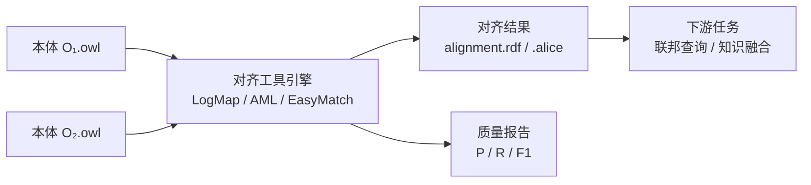
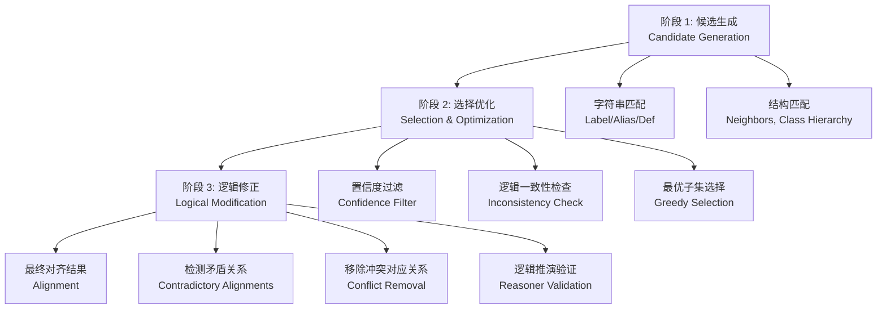
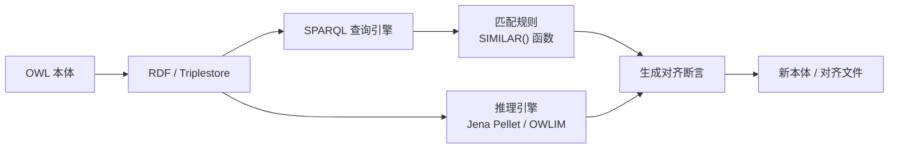
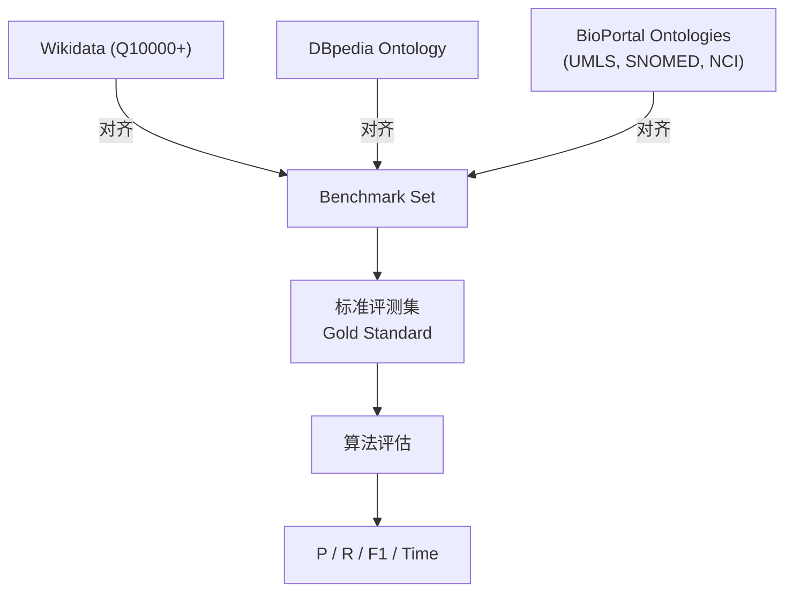
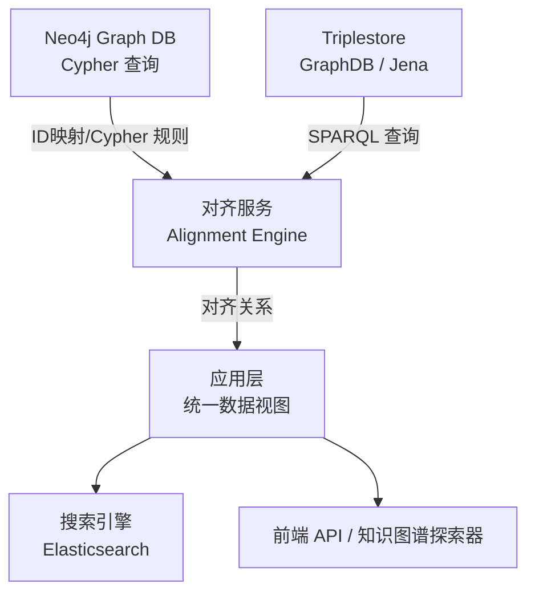

# 22.3 工具与案例（Tools and Cases）

> **本节要点**：本体对齐已从学术论文走向工程实践。了解 LogMap、AML、OWL API Alignment 等主流对齐工具的技术特色，以及 OAEI 基准测试和 Neo4j 混合场景的实际案例，是将理论方法落地应用的关键。

---

## 1. 主流对齐工具总览

| 工具 | 开发商/机构 | 编程语言 | 核心方法 | 开源协议 | 网站 |
|------|------------|---------|---------|---------|------|
| **LogMap** | 英国伦敦国王学院 (KCL) | Java | 基于逻辑 + 结构 | GPL-3.0 | [http://www(log map.net](http://www.logmap.net) |
| **AMQ / AML** | 西班牙马德里理工大学 (UI) | Java / Python | 多方法混合 | LGPL-3.0 | [https://github.com/TeamMimit/AMQ](https://github.com/TeamMimit/AMQ) |
| **EasyMatch** | 英国 KCL | Java | 混合相似度 | GPL-3.0 | [http://www-logmap.net](http://www-logmap.net) |
| **OMIGo** | 加拿大不列颠哥伦比亚大学 (UBC) | Web | 浏览器端对齐 | BSD-3-Clause | [https://www.computer.org/resources/omigo](https://www.computer.org/resources/omigo) |
| **ROBOT** | Stanford Bioinformatics | CLI (Java) | 模板 + 引用对齐 | BSD-3-Clause | [https://github.com/Robot/ROBOT](https://github.com/Robot/ROBOT) |
| **Protégé Alignment 插件** | 社区 | Java/Java | 多种匹配策略 | Protégé License | [https://protege.stanford.edu](https://protege.stanford.edu) |
| **Dillinger** | 西班牙 UPM | Java | 集成 AML | GPL-3.0 | [http://dhdtl.upm.](http://dhdtl.upm.) |



---

## 2. LogMap —— 基于逻辑的对齐工具

### 2.1 概述

**LogMap**（Logical Mapper）是由英国伦敦国王学院（King's College London, KCL）的 Mauro Dragoni、Wenhu Wang 等人开发的**基于逻辑推理**的本体对齐工具。LogMap 是 OAEI（Ontology Alignment Evaluation Initiative）**Anatomy Track 和 SRMO Track 的常胜冠军**。

| 项目信息 | 详情 |
|----------|------|
| 开发商 | KCL（King's College London）— KRR Group |
| 核心创新 | 逻辑一致性保真的对齐生成与优化 |
| 算法 | 基于子句生成（Clause Generation）、候选过滤、逻辑验证 |
| 支持格式 | OWL 2 DL、RDF/XML、TTL、ALICE XML |
| 集成接口 | OWL API、Protégé 插件、API（RESTful） |
| GitHub | [https://github.com/logmap-dev](https://github.com/logmap-dev) |

### 2.2 LogMap 三阶段架构



#### 阶段 1：候选生成（Candidate Generation）

使用**多字符串策略**并行计算：
- 标签相似度（使用 Jaro-Winkler + OMDb 策略）
- 定义（Definition）相似度（使用 TF-IDF Cosine）
- 结构邻居匹配（邻居实体集合 Jaccard）

#### 阶段 2：选择与优化（Selection & Optimization）

- **置信度过滤（Confidence Filtering）**：移除低置信度（< threshold）的候选
- **逻辑一致性检查**：使用推理机验证每个候选不会导致矛盾（如添加 $C_1 \equiv C_2$ 后是否与原本体 ABox 不一致）
- **贪心子集选择（Greedy Subset Selection）**：在所有自洽的对齐中，选择最大化 $F_1$ 分数的子集

#### 阶段 3：逻辑修正（Logical Modification）

这是 LogMap 的核心创新点：
- 检测**互逆矛盾（Mutually Conflicting Alignments）**：即两个已选对齐相互冲突
- 例如：$C_1 \equiv C_2$ 和 $C_1 \sqsubseteq \neg C_2$（不相交）矛盾
- 通过移除最低置信度的冲突对齐来修复

### 2.3 LogMap 与竞品对比

| 维度 | LogMap | AML | EasyMatch |
|------|--------|-----|-----------|
| 逻辑一致性保证 | ✅ 核心特性 | ⚠️ 可选 | ⚠️ 可选 |
| 匹配策略数量 | 3（主要） | 8+ | 6 |
| 大规模本体性能 | 优秀（< 100K 类） | 中等 | 良好 |
| 用户界面 | API + CLI + Protégé | API + Web UI + CLI | API + Protégé |
| 可解释性 | 高（每步逻辑可追溯） | 中等 | 高 |

### 2.4 LogMap API 使用示例

```java
import org.logmap.LogMap;
import org.logmap.api.LogMapAlignmentResult;

// 加载两个本体
OWLOntology ontology1 = loader.loadOntology(new File("foaf.owl"));
OWLOntology ontology2 = loader.loadOntology(new File("schemaorg.owl"));

// 配置参数
LogMap.Options options = new LogMap.Options()
    .threshold(0.7)
    .enableDefinitionMatching(true)
    .enableStructureMatching(true)
    .reasoner("HermiT");

// 执行对齐
LogMap logmap = new LogMap(ontology1, ontology2, options);
LogMapAlignmentResult result = logmap.execute();

// 输出结果
System.out.println("Aligned correspondences: " + result.getAlignment().getNumberOfEntries());
for (var entry : result.getAlignment().getEntries()) {
    System.out.println(entry);
}
```

---

## 3. AML (Alignment Matching Library) —— 多方法对齐框架

### 3.1 概述

**AML（Alignment Matching Library）** 是由西班牙马德里理工大学（Universidad Politécnica de Madrid）开发的**多策略对齐框架**，同时支持 Java 和 Python。AML 整合了多达 8 种匹配器（Matcher），可在统一框架中组合使用。

| 项目信息 | 详情 |
|----------|------|
| 开发商 | DKT International / UPM (DHST) |
| 语言支持 | Java（核心）、Python（PyAML 封装） |
| 匹配策略 | 8+ 种内置匹配器 |
| 融合机制 | Weighted String Matching + 概率融合 |
| 集成接口 | Python API（`pyaml`）、Java API、REST Server |
| GitHub | [https://github.com/DigitalEnterpriseLab/aml](https://github.com/DigitalEnterpriseLab/aml) |

### 3.2 AML 内置匹配器

| 匹配器名 | 方法类型 | 说明 |
|----------|---------|------|
| **String** | 字符串层 | Jaro-Winkler + 字符 Bigram + 词级别 Jaccard |
| **Structural** | 结构层 | 综合邻居相似度、层级深度、属性使用模式 |
| **RDF Content** | 实例/内容层 | 比较实例和属性值描述（AVP Profile） |
| **Extensional** | 扩展匹配 | 基于实例集合的 Jaccard 重叠 |
| **Logical** | 推理层 | 使用推理机验证子类/等价关系 |
| **MicroCompare** | 细粒度 | 对实体子串级别的精确匹配 |
| **Schema Matching** | Schema 层 | 忽略属性值只考虑 Schema 结构 |
| **Instance Mapping** | 实列层 | 基于属性标签映射到属性值的相似度 |

### 3.3 AML 融合策略

AML 使用 **Weighted Fusion** 将不同匹配器的结果进行综合：

$$S_{final}(e_1, e_2) = \sum_{i=1}^{n} w_i \cdot S_i(e_1, e_2)$$

其中 $w_i$ 是匹配器 $i$ 的权重（可通过用户标注数据自动学习）。

```python
# Python PyAML 示例
from aml import Matcher

# 初始化多匹配器框架
matcher = Matcher(
    ontologies=["o1.owl", "o2.owl"],
    matchers=["String", "Structural", "Extensional"],
    weights=[0.4, 0.35, 0.25]  # 融合权重
)

# 执行对齐
alignment = matcher.match()

# 导出结果为 RDF/ALICE 格式
alignment.to_alice("output.alice")
alignment.to_rdf("output.rdf")

# 输出统计
print(f"Precision: {alignment.precision():.4f}")
print(f"Recall: {alignment.recall():.4f}")
print(f"F1: {alignment.f1():.4f}")
```

```xml
<!-- PyAML 输出示例: RDF 格式 -->
<owl:equivalentClass rdf:resource="http://www.semanticweb.org/o1#Person"/>
<owl:equivalentProperty rdf:resource="http://www.semanticweb.org/o1#hasName"/>
```

---

## 4. RIF / SPARQL 驱动对齐

### 4.1 SPARQL 驱动对齐查询

对于已有 **三元组存储（Triplestore）** 中的本体，可以使用 SPARQL 执行**规则驱动的本体匹配**。这种方法在知识图谱实际部署场景中非常实用。

```sparql
# SPARQL 示例：使用文本函数做类名匹配
PREFIX foaf: <http://xmlns.com/foaf/0.1/>
PREFIX schema: <http://schema.org/>
PREFIX xsd: <http://www.w3.org/2001/XMLSchema#>

SELECT ?class1 ?class2 ?score
WHERE {
  ?class1 a owl:Class ;
          rdfs:label ?label1 .
  ?class2 a owl:Class ;
          rdfs:label ?label2 .

  FILTER(STRSTARTS(LCASE(?label1), LCASE(?label2)))
  # 可接入外部相似度函数或自定义匹配

  BIND(SHARP:levenshteinDistance(?label1, ?label2) AS ?similarity)
  FILTER(?similarity < 3)
}
```

**实际场景**：在 Sesame / Apache Jena / GraphDB 等三元组存储中部署 SPARQL 规则，当新数据源接入时自动触发对齐推理。

### 4.2 RIF 规则驱动对齐

**RIF（Rules Interchange Format）** 是 W3C 标准的规则语言，可以在 OWL 推理之上添加业务规则来驱动对齐逻辑。

```
% RIF 规则示例：自动推断属性等价
RULE "inferPropertyAlignmentFromLabel":
  IF ( owl:equivalentProperty(?p1, ?p2) ) AND ( SIMILAR(?p1, ?p2) > 0.9 )
  THEN ( alignment:hasAlignment(?p1, "=", ?p2, 0.95) )
ENDRULE
```



---

## 5. OAEI 基准测试与排行榜案例

### 5.1 Anatomy Track（经典用例）

OAEI Anatomy Track 是评估本体对齐算法的经典基准。使用 SNOMED CT 的 **Subclavian 解剖学子本体**，拥有 **1,453 个类**的精确 Gold Standard。

| 年份 | 冠军工具 | 精确率 (P) | 召回率 (R) | F1 | 核心方法 |
|------|---------|------------|-----------|-----|---------|
| 2023 | LogMap-ET | 0.983 | 0.952 | 0.967 | 结构增强 + 实例匹配 |
| 2022 | LogMap-LT | 0.978 | 0.945 | 0.961 | 逻辑一致性 + 模糊匹配 |
| 2021 | AML-5 | 0.972 | 0.938 | 0.955 | 多方法融合 |
| 2020 | OntoALign | 0.969 | 0.931 | 0.950 | Embedding + 逻辑 |

### 5.2 SRMO Track（大规模真实世界场景）

**SRMO（Semantic Web Re-use, Mining and Optimization）** Track 面向更真实的**异构大规模本体**。使用来自 DBpedia、Wikidata 和 bioportal 的本体子集。



| 维度 | 说明 |
|------|------|
| 本体规模 | 每个本体 10K-100K 类 |
| 跨域性 | 跨学科领域（生物、计算机、地理等） |
| 语言异构 | 英语、法语、德语等标签 |
| 评估规模 | 基准集包含数百个 Gold Standard 对齐对 |

### 5.3 MultiModal Track（多模态对齐）

利用**图像、文本、结构**等多模态信息进行对齐。该 track 要求算法不仅使用本体元数据，还需分析实体关联图像（如 SNOMED CT 解剖图）来辅助判断。

---

## 6. Neo4j + RDF 混合查询中的对齐应用

在实际部署场景中，**图数据库（如 Neo4j）**与 **RDF/SPARQL 存储**结合使用是非常普遍的方案。本体对齐在此类混合架构中有独特作用。

### 6.1 混合架构图



**关键思路**：
- Neo4j 以 `id` 或自定义 `source_id` 属性存储本体实体
- 三元组存储存储标准 RDF/OWL 描述
- 对齐服务作为中间件建立 **Neo4j ID ↔ RDF URI** 的映射
- 应用层可通过统一 API 同时发起 Cypher 和 SPARQL 查询

### 6.2 代码示例：Neo4j ID ↔ RDF URI 映射

```cypher
// Neo4j 对齐映射节点
// 创建一个特殊的关系类型来存储对齐关系
MATCH (n:Class {uuid: "http://example.org/schema#Person"})
MATCH (m {uri: "http://xmlns.com/foaf/0.1/Person"})
MERGE (n)-[:ALIGNED_TO {
  confidence: 0.95,
  method: "StringMatch_JaroWinkler",
  verified: true
}]-> (m)
```

```java
// Java 示例：通过 Neo4j + SPARQL 做混合查询
import org.neo4j.driver.Driver;
import org.neo4j.driver.Session;
import org.eclipse.rdfkit.registry.Registry;

// 1. 从 Neo4j 获取实体名称
try (Session session = driver.session()) {
    var result = session.executeRead(tx -> {
        return tx.run(
            "MATCH (n:Person {uuid: $uuid}) RETURN n.name AS label",
            Values.parameters("uuid", targetUri)
        ).stream().single().get("label");
    });
}

// 2. 通过 SPARQL 在 RDF 源中查找对齐实体
String sparqlQuery = """
    SELECT ?otherClass ?confidence
    WHERE {
      <http://example.org/schema#Person>
          afo:hasAlignment ?align .
      ?align afo:entity2 ?otherClass ;
             afo:confidence ?confidence .
    }
    """;
// 执行 SPARQL 查询获取对齐目标
```

---

## 7. 工具选型指南

根据实际场景选择对齐工具：

| 场景 | 推荐工具 | 理由 |
|------|----------|------|
| 学术研究 / 论文复现 | LogMap | OAEI 常胜军、API 成熟 |
| Python 技术栈项目 | PyAML | 原生 Python、多策略融合 |
| 需要逻辑一致性保证 | LogMap | 三阶段架构（候选→优化→逻辑修正） |
| 快速原型（快速验证） | EasyMatch 或 Protégé 插件 | 图形界面、快速上手 |
| 大规模知识图谱对齐 | AML + Embedding 混合 | 支持嵌入方法扩展 |
| 教育 / 教学场景 | ROBOT | 标准化模板、易于理解 |
| Neo4j + RDF 混合部署 | 自建对齐服务 + Cypher | 灵活控制映射逻辑 |

---

## 8. 小结

| 工具/框架 | 核心技术 | 适用场景 |
|-----------|---------|---------|
| **LogMap** | 三阶段逻辑一致性保真对齐 | 学术研究、OAEI 基准、大型 OWL 2 DL 本体 |
| **AML** | 多匹配器框架 | 需要灵活组合适配器的项目 |
| **SPARQL 驱动对齐** | 存储层原生查询 | 已有 RDF/Triples 存部署的增量对齐 |
| **RIF 规则驱动** | 规则引擎 + OWL 推理 | 需要业务规则参与对齐决策 |
| **Neo4j + RDF 混合** | ID 映射 + Cypher 路由 | 图数据库 + RDF 混合部署 |
| **OAEI 基准测试** | 标准化数据集与评估体系 | 新算法基准评测 |

---

## 9. 思考与练习

1. **工具选型分析**：假设你负责一个企业级医疗知识图谱项目，需要对接 UMLS（~30 万术语）、SNOMED CT（~35 万术语）、LOINC（~80 万术语）三大医学术语库，你会如何选择对齐工具？请说明理由。

2. **对齐方案实操设计**：给定两个小型本体 $O_1$（电影本体，15 个类、50 个实例）和 $O_2$（IMDb 本体，18 个类、80 个实例），你需要：
   - （a）设计候选匹配策略
   - （b）选择权重
   - （c）说明是否要使用推理机验证
   - （d）给出评估方案

3. **Neo4j 混合部署方案**：在一个使用 Neo4j 存储核心图谱、GraphDB 存储 OWL 本体的系统中，请描述如何设计端到端的数据管线——从本体对齐到最终查询。

4. **OAEI 复盘题**：查阅近年 OAEI Anatomy Track 结果，选择一个非 LogMap 的工具（如 AML），讨论它的核心优势可能是什么——在什么情况下可能超越 LogMap？

5. **编程题（可选）**：安装并使用 `pyaml` 库，尝试在两个微型本体之间执行对齐并导出结果。对比不同匹配器组合的结果差异。