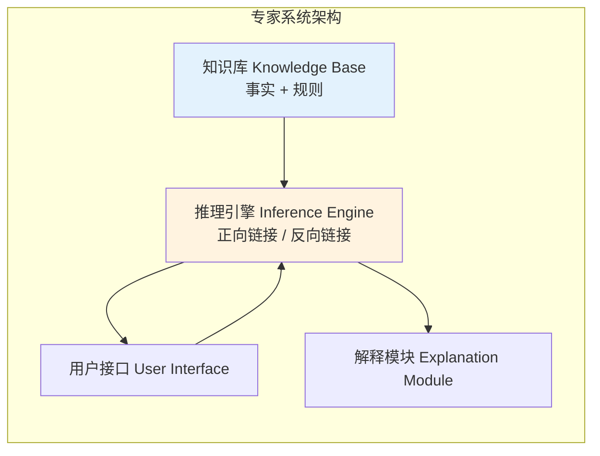
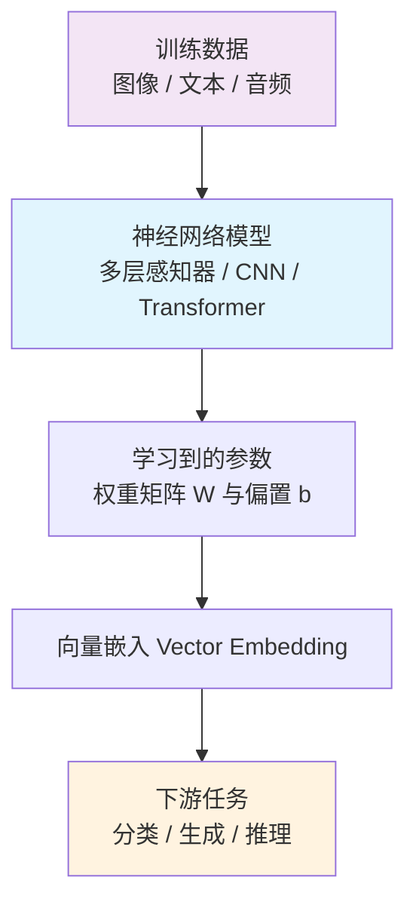
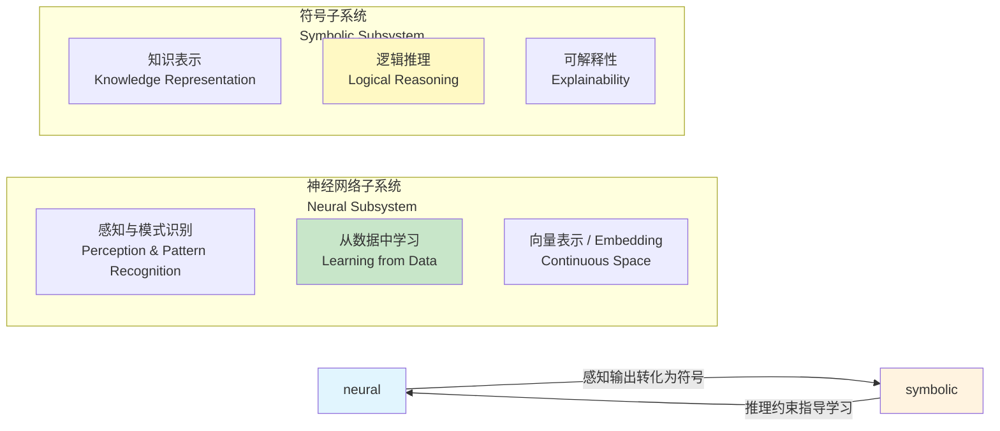

# 23.1 符号与神经网络对比（Symbolic vs. Neural Paradigms）

> **本节要点**：理解符号 AI（Symbolic AI）和神经网络（Neural Network）两大范式的核心差异是进入神经符号人工智能领域的基础。本章将回顾两种范式的历史、基本原理、优势与局限，并通过对比表格和案例说明为何需要神经符号融合（Neuro-Symbolic Integration）。

---

## 1. 符号 AI 范式（Symbolic AI Paradigm）

**符号人工智能**（Symbolic AI），又称"好符号 AI"（Good Old-Fashioned AI, GOFAI），是人工智能早期（1950s–1980s）的主流研究范式。它的核心思想是：**智能源于符号的操作与操纵**。

### 1.1 核心要素

符号 AI 建立在三个基石之上：

| 要素 | 英文名 | 描述 |
|------|--------|------|
| **知识表示** | Knowledge Representation | 使用形式语言（如逻辑、框架、语义网络）对领域知识进行显式编码 |
| **推理引擎** | Reasoning Engine | 基于形式逻辑（如一阶逻辑、描述逻辑）进行演绎或归纳推理 |
| **专家系统** | Expert System | 将领域专家知识编码为"如果-那么"（If-Then）规则，交由推理机执行 |

### 1.2 标志性系统



| 系统名称 | 年份 | 意义 |
|----------|------|------|
| **LISP Machine** | 1970s | 专为符号计算设计的编程语言和硬件平台 |
| **CYRUS** (Winston) | 1975 | 首个使用语义网络（Semantic Network）理解故事的系统 |
| **MYCIN** (Shortliffe) | 1976 | 医疗诊断专家系统，使用 600+ 条规则，推理准确度媲美医生 |
| **XCON (R1)** (DEC) | 1980 | 为 DEC VAX 计算机配置系统，每年节约上千万美元 |
| **PROLOG** (1972) | 1970s | 声明式逻辑编程语言，在欧洲"第五代计算机"项目中被广泛采用 |

### 1.3 知识表示的形式

符号 AI 的关键在于**显式知识编码**。常见形式包括：

**一阶逻辑（First-Order Logic, FOL）**：

```
∀x ∀y (Parent(x, y) → ∃z Child(y, z))
-- 如果 x 是 y 的家长，那么存在 z 使得 y 是 z 的家长
```

**描述逻辑（Description Logic, DL）** —— OWL 2 的逻辑基础：

```
Man ≡ Person ⊓ Male
-- "Man" 类等价于 "Person" 和 "Male" 的交集
```

**产生式规则（Production Rules）**：

```
IF fever = HIGH AND cough = PRESENT AND xray = ABNORMAL
THEN diagnosis = PNEUMONIA AND confidence = 0.85
```

---

## 2. 神经网络 / 深度学习范式（Neural Network / Deep Learning Paradigm）

2006 年 Hinton 等人提出"深度学习"（Deep Learning）概念后，神经网络范式在图像识别、自然语言处理、语音识别等任务上取得了突破性进展。

### 2.1 核心思想

神经网络（Neural Network）范式与符号 AI 的哲学基础完全不同：**智能来自数据驱动的表示学习（Representation Learning）**。



### 2.2 核心架构发展

| 年份 | 架构 | 作者 | 关键突破 |
|------|------|------|----------|
| 1958 | Perceptron | Frank Rosenblatt | 首个可学习的人工神经元 |
| 1986 | Backpropagation + MLP | Rumelhart et al. | 多层网络的梯度反向传播算法 |
| 1998 | LeNet (CNN) | LeCun | 卷积神经网络，应用于手写数字识别 |
| 2012 | AlexNet (CNN) | Krizhevsky et al. | ImageNet 竞赛突破，开启深度学习浪潮 |
| 2014 | GAN | Ian Goodfellow | 生成对抗网络，开创生成式 AI |
| 2017 | Transformer | Vaswani et al. | 注意力机制（Attention Is All You Need） |
| 2018 | BERT | Devlin et al. | 双向语言模型的预训练-微调范式 |
| 2020 | GPT-3 | OpenAI | 1750 亿参数的生成式大语言模型 |

### 2.3 深度学习的核心优势

| 维度 | 描述 | 示例 |
|------|------|------|
| **模式识别** | 能从海量数据中学习复杂的非线性映射 | ImageNet 分类错误率降至 3.5% |
| **端到端学习** | 无需手工特征工程设计 | 直接由像素输出分类结果 |
| **表示学习** | 自动学习特征层次结构 | 浅层学习到边缘纹理、深层学习到低语义概念 |
| **泛化能力** | 在未见数据上表现出良好的推理能力 | Transformer 模型的零样本迁移（Zero-shot）能力 |

---

## 3. 符号 AI 与神经网络对比（Comparison）

以下表格系统地对比了两个范式的核心特征：

| 对比维度 | 符号 AI（Symbolic AI） | 神经网络 / 深度学习（Neural/Deep Learning） |
|----------|----------------------|------------------------------------------|
| **知识表示** | 显式符号、逻辑公式、规则 | 隐式分布式表示（Distributed Representation） |
| **推理方式** | 演绎推理（Deductive）、形式化证明 | 模式匹配、统计推断（Statistical Inference） |
| **数据需求** | 低（可从小数据甚至零数据开始） | 高（需要数百万至数十亿样本） |
| **可解释性** | 高（推理过程可追踪、可解释） | 低（"黑箱"，难以解释中间层决策逻辑） |
| **泛化能力** | 规则级别的泛化（Rule-based Generalization） | 数据驱动的泛化（Data-driven Generalization） |
| **不确定性处理** | 需要扩展（如模糊逻辑、贝叶斯网络） | 原生支持（概率输出、Dropout 等） |
| **鲁棒性** | 对输入噪声不敏感，但对符号错误零容忍 | 易受对抗样本（Adversarial Examples）攻击 |
| **学习能力** | 需要人工编码知识（Knowledge Engineering） | 自主从数据中学习（Learning from Data） |
| **推理透明性** | 可给出完整的推理链（Reasoning Chain） | 难以提供可理解的推理过程 |
| **计算效率** | 逻辑推理计算复杂度可能指数增长 | 大规模并行计算效率高（GPU/TPU 加速） |
| **适用任务** | 定理证明、知识推理、规则引擎、合规检查 | 图像分类、NLP、语音识别、推荐系统 |

### 3.1 经典案例对比：图像识别

**符号 AI 方法**：
```python
# 伪代码：手工设计的规则识别"猫"
def is_animal(image):
    features = extract_edge_patterns(image)  # 人工设计的边缘特征
    if has_four_legs(features) and has_tail(features) and has_pointed_ears(features):
        if has_whiskers(features) and has_meowing_sound(get_audio(image)):
            return "cat"
    return "unknown"
```

**深度学习方法（CNN）**：
```python
# PyTorch 风格伪代码：学习到的分层特征
import torch.nn as nn

class CatDetector(nn.Module):
    def __init__(self):
        super().__init__()
        self.features = nn.Sequential(
            nn.Conv2d(3, 64, 3),    # 低层：学习边缘、纹理
            nn.Conv2d(64, 128, 3),  # 中层：学习形状部件
            nn.AdaptiveAvgPool2d(1),# 高层：学习完整语义
        )
        self.classifier = nn.Linear(128, 1)
    
    def forward(self, x):
        return torch.sigmoid(self.classifier(self.features(x).flatten(1)))
```

---

## 4. 为什么需要神经符号 AI？（Motivation for Neuro-Symbolic AI）

通过上述对比，可以清晰看到：

- **符号 AI 的局限**：依赖手工知识工程，难以扩展到大规模、不确定性强的领域，无法直接处理原始感知数据（图像、语音、自然语言）。这就是 **"符号接地问题"（Symbol Grounding Problem）**——符号系统不知道"猫"这个符号对应的真实世界感知是什么。
- **神经网络的局限**：缺乏显式推理能力，容易受到对抗攻击，推理过程不透明，难以进行复杂的逻辑演绎。此外，LLM 会产生"**幻觉**"（Hallucination），即生成与事实不符的内容。

**神经符号 AI**（Neuro-Symbolic AI，简称 Neuro-Symbolic 或 NS）的核心理念是：**结合符号 AI 的可解释逻辑推理和神经网络的感知与模式识别优势，构建既"懂感知"又"会推理"的智能系统。**



---

## 5. 历史脉络（Historical Timeline）

神经符号 AI 并非新兴概念——它的发展历程贯穿了整个 AI 研究史：

| 年代 | 里程碑 | 贡献者 / 事件 | 意义 |
|------|--------|--------------|------|
| **1950** | 图灵测试（Turing Test） | Alan Turing | 奠定 AI 哲学的思维基础 |
| **1956** | 达特茅斯会议（Dartmouth Summer Project） | John McCarthy, Marvin Minsky 等 | "AI" 一词正式诞生，符号 AI 成为主流 |
| **1959** | Minsky 的论文 "Steps towards an Artificial Intelligence" | Marvin Minsky | 阐述了构建具有知识、语言、创造力的 AI 系统的愿景 |
| **1970s–80s** | 专家系统黄金时代 | MYCIN, XCON 等 | 符号 AI 在工业中大规模成功，但也埋下了"AI 之冬"的种子 |
| **1986** | 反向传播算法复兴 | Rumelhart, Hinton, Williams | 神经网络范式复兴 |
| **1995** | Connectionist Symbolic Integration | Galland | 早期明确提出"连接主义 + 符号"融合思路 |
| **2006** | 深度学习浪潮 | Hinton 等 | 神经网络在感知任务上大幅超越符号方法 |
| **2017** | "Deep Math" 项目 | Microsoft Research | 用强化学习辅助数学定理证明，开启新的神经符号研究方向 |
| **2017** | TensorLog（Roth & Wang） | Wen tau Yih 等 | 将一阶逻辑嵌入深度学习框架 |
| **2018** | "Neuro-Symbolic AI" 一词被广泛使用 | ARTIQ（Advanced Real-Time Qualifications）报告 | 成为独立的活跃研究领域 |
| **2019** | DeepProbLog（Kauxu et al.） | F. Demoen 等 | 将概率逻辑编程 DeepProbLog 引入 |
| **2021** | Google 的 GopherCites + KG | Google Research | 在知识密集型 NLP 任务上结合预训练模型与知识图谱 |
| **2022** | AlphaCode / AlphaFold 2 | DeepMind (Demis Hassabis) | AlphaFold 结合神经网络（EvoFormer）和符号约束（几何、物理规律）解决蛋白质折叠问题，是神经符号范式的标志性成果 |
| **2023** | "NNAI 路线图"（AAAI 报告） | Carla Garcia 等 | 发布神经-神经AI（Neuro-N symbolic AI）的标准化路线图 |
| **2023** | LLM + KG 热潮 | 大量 Research | 结合大语言模型与知识图谱的推理和 RAG 方法成为 NLP 社区最热的研究方向 |

### 5.1 关键观点

> 符号接地问题（Symbol Grounding Problem）由 Stevan Harnad 在 1990 年的论文 "The Symbol Grounding Problem" 中首次正式提出。其核心问题是：符号系统中的符号如何获得与真实世界的关联？如果仅有符号间的语法操纵（Syntactic Manipulation）而无语义联系（Semantic Connection），系统就无法"理解"它所操作的符号。神经网络被视为解决符号接地问题的一种途径——通过从感知数据中学习符号的分布式表示，符号被"接地"到真实感知空间中。

---

## 6. 总结（Summary）

| 要点 | 说明 |
|------|------|
| 符号 AI 核心 | 知识表示 + 逻辑推理 + 规则引擎 |
| 神经网络核心 | 数据驱动 + 表示学习 + 模式识别 |
| 符号 AI 优势 | 可解释性、精确推理、低数据需求 |
| 神经网络优势 | 感知能力、泛化能力、端到端学习 |
| 融合动机 | 优势互补：解决各自的局限——符号接地问题、LLM 幻觉、推理不透明 |