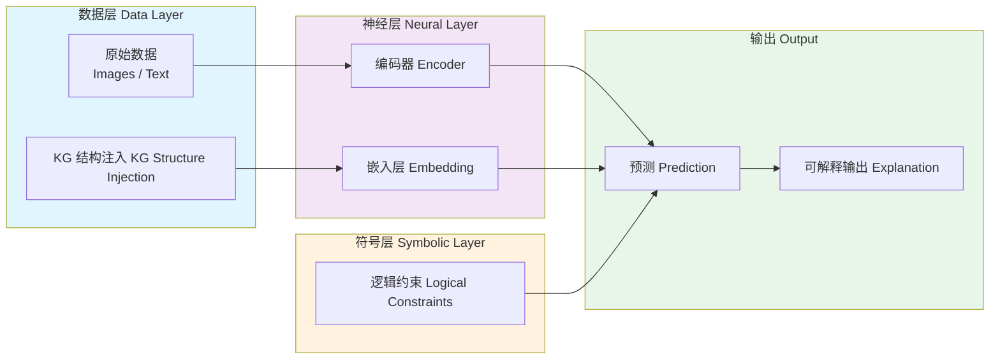
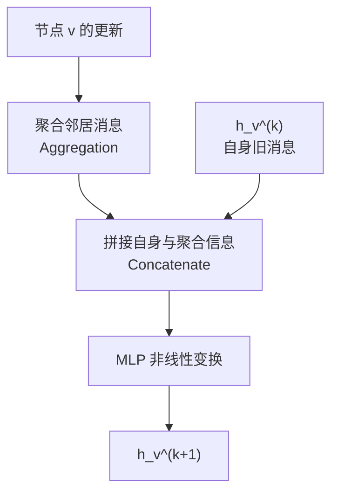
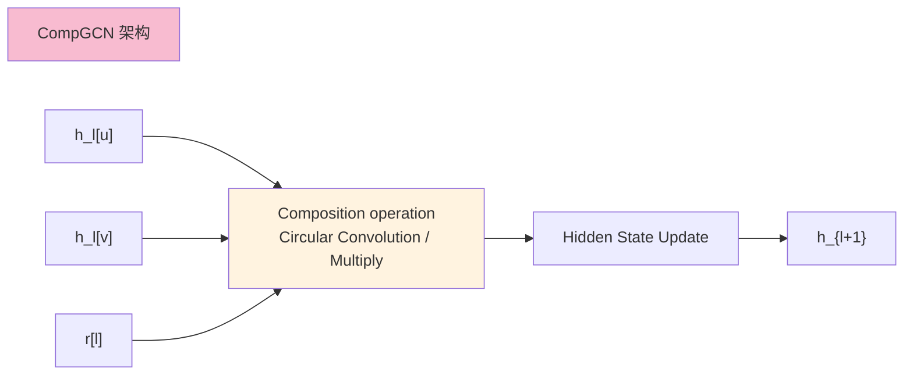
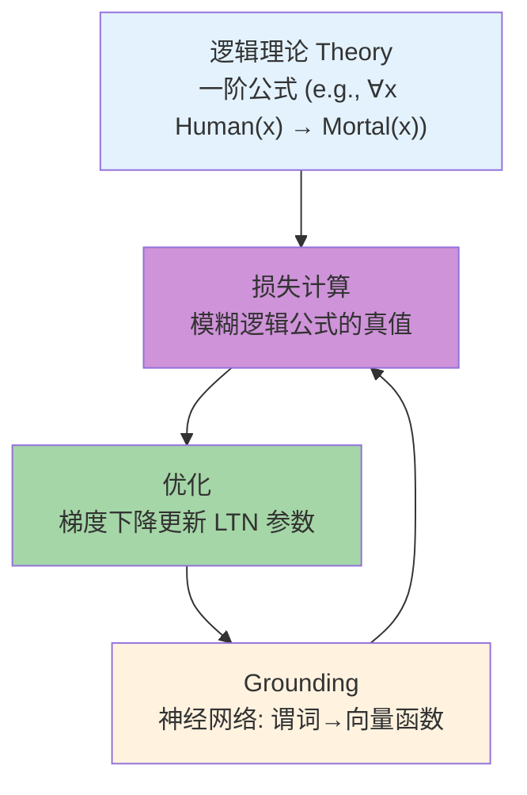
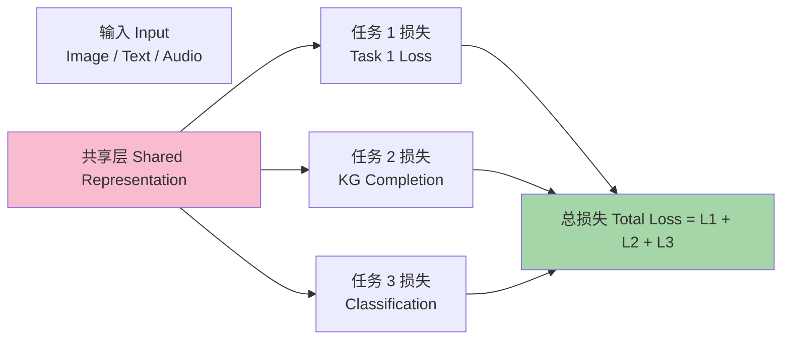
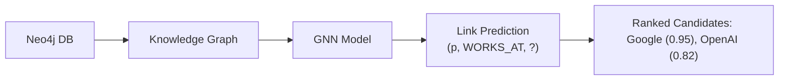

# 23.3 神经符号集成（Neuro-Symbolic Integration）

> **本节要点**：神经符号集成（Neuro-Symbolic Integration）是实现两种 AI 范式深度融合的关键。本章将介绍深度学习与知识图谱的集成架构、图神经网络（GNN）与 KG 的结合、神经定理证明器、逻辑张量网络（LTN）、概率神经符号系统（DeepProbLog）以及知识注入深度学习的主要方法。

---

## 1. 深度学习 + 知识图谱的集成架构

神经符号集成的核心目标是：在深度学习的感知和学习能力之上**引入知识图谱的结构化先验知识**，以增强模型的推理能力和可解释性。



### 1.1 集成层次分类

根据知识注入的深度，可分为三个层次：

| 层次 | 英文名 | 描述 |
|------|--------|------|
| **输入层注入** | Input-level Injection | 将 KG 嵌入直接作为输入特征的一部分 |
| **模型层注入** | Model-level Injection | 在网络架构中引入 KG 结构（如图卷积） |
| **输出层注入** | Output-level Injection | 在输出端通过损失函数或后处理施加符号约束 |

---

## 2. 图神经网络与知识图谱（GNN + KG）

**图神经网络**（Graph Neural Networks, GNN）是与知识图谱结合最紧密的神经符号集成技术。

### 2.1 什么是图神经网络

GNN 是一类直接在图结构上操作的神经网络，通过**消息传递**（Message Passing）机制聚合邻居节点信息。

**核心消息传递公式**：



**消息传递 GNN 的形式化**：

$$e_{u,v}^{(k)} = \text{COMBINE}^{(k)}(h_u^{(k)}, h_v^{(k)}, e_{u,v}^{(k)})$$

$$h_v^{(k+1)} = \text{REaggregate}^{(k)} \left( h_v^{(k)}, \sum_{u \in \mathcal{N}(v)} e_{u,v}^{(k)} \right)$$

$$\hat{y} = \text{READOUT} \left( \{ h_v^{(K)} \mid \forall v \in G \} \right)$$

### 2.2 TransR/GNN（Knowledge Graph Convolutional Networks）

**Knowledge Graph Convolutional Networks (KG-CNN)**：

```python
# PyTorch Geometric (PyG) 风格伪代码：KG 上的 GCN
import torch.nn.functional as F
from torch_geometric.nn import GCNConv

class KGConv(nn.Module):
    def __init__(self, input_dim, hidden_dim):
        super().__init__()
        # 为不同类型关系创建不同的卷积层
        self.convs = nn.ModuleList([
            GCNConv(input_dim, hidden_dim)
            for _ in range(num_relations)
        ])
    
    def forward(self, edge_index, edge_type, x):
        out = x
        for r in range(num_relations):
            mask = (edge_type == r)
            r_edge_index = edge_index[:, mask]
            out = self.convs[r](out, r_edge_index)
        return F.relu(out)
```

### 2.3 GraphSAGE 与 KG

**GraphSAGE**（Sampling and Aggregating Neighbors for Graph Embedding）是一种能够处理**大图**的 GNN 变体。它通过**采样**邻居而非使用全图进行聚合，使得模型可以推理未见节点（Inductive Learning），这对于 KG 的动态更新非常有用。

### 2.4 GAT（Graph Attention Network）

**GAT**（Graph Attention Network）通过**注意力机制**为不同邻居节点分配不同权重：

$$\alpha_{ij} = \frac{\exp\left(\text{LeakyReLU}(a^T [Wh_i \parallel Wh_j])\right)}{\sum_{k \in \mathcal{N}_i} \exp\left(\text{LeakyReLU}(a^T [Wh_i \parallel Wh_k])\right)}$$

其中 $\alpha_{ij}$ 是节点 $j$ 对节点 $i$ 的注意力权重。在 KG 场景中，GAT 可以自动学习不同**关系类型**的重要性。

### 2.5 CompGCN（Compositional GNN）

CompGCN（Vashishth et al., 2020）将 KGE 操作（如循环卷积）融入 GNN 架构：



---

## 3. 神经定理证明器（Neural Theorem Provers）

神经定理证明器（Neural Theorem Provers）将神经网络集成到符号定理证明过程中，学习如何选择和应用推理规则。

### 3.1 Neural LP（Neural Logic Programming）

Neural LP（Yang et al., 2017）学习**可微分的逻辑规则**。其核心是使用平移操作来模拟逻辑蕴含：

```
对于规则：R1(h,t) ← R2(h, h) ∧ R3(y, t)
打分：h + R2 + R3 ≈ t
即：R ≈ R2 ⊗ R3 （平移或哈达玛积）
```

### 3.2 DeepProbLog（概率神经符号系统）

[DeepProbLog](https://arxiv.org/abs/1802.08835) 将深度学习嵌入到[概率逻辑编程](https://problog.sourceforge.net/)框架中。

**DeepProbLog** = Deep Learning + ProbLog = **Declarative ProbLog**

形式化：
```prolog
- 0.8::fe male(mike) . -- Mike 是男性的概率为 0.8
- 0.9::parent(x,y) :- father(x,y) . -- 如果 x 是 y 的父亲，则 x 是 y 的 parent，概率 0.9
- 0.75::parent(mike, james) .      -- Mike 是 James 的 parent，概率 0.75
```

DeepProbLog 可以将神经网络的预测（如图像识别结果）作为逻辑规则的事实输入，执行**概率推理**。

### 3.3 Datalog 嵌入

Datalog 是一阶逻辑的决策子集，适用于数据库规则推理。**Datalog 嵌入**（Datalog Embedding）将 Datalog 规则编码为可微分的向量操作。

---

## 4. 逻辑张量网络（Logic Tensor Networks, LTN）

**逻辑张量网络**（Logic Tensor Networks, LTN）（Padghano et al., 2019）是一种基于**模糊一阶逻辑**（Fuzzy First-Order Logic）的神经符号集成方法。

### 4.1 核心思想

LTN 将一阶逻辑的谓词映射为神经网络（计算模糊真值 $[0,1]$），而逻辑连接词（$\forall, \exists, \land, \rightarrow$ 等）也映射为连续的 $t$-范数（t-norms）。

### 4.2 运算映射

| 逻辑运算符 | 数学运算 | LTN 实现 |
|-----------|---------|----------|
| 合取 $\phi \land \psi$ | 最小/乘积 t-norm | $\min(F_\phi, F_\psi)$ 或 $F_\phi \times F_\psi$ |
| 析取 $\phi \lor \psi$ | 最大/代数和 | $\max(F_\phi, F_\psi)$ 或 $\min(F_\phi + F_\psi, 1)$ |
| 蕴含 $\phi \rightarrow \psi$ | 逻辑蕴含 | $\max(1 - F_\phi, F_\psi)$ |
| 全称量词 $\forall x \phi$ | 下确界 → 平均值 | $\frac{1}{|X|}\sum_{x \in X} F_\phi(x)$ |
| 存在量词 $\exists x \phi$ | 上确界 → 最大值/平均值 | $\max_x F_\phi(x)$ 或 $\sum$ |

### 4.3 LTN 工作流程



**LTN 示例：在 KG 中嵌入"所有人都会死"的公理**：

```
理论：∀x (Human(x) → Mortal(x))

Grounding:
- H(x) = NeuralNet(Human(x))     -- 判断 x 是否为人类
- M(x) = NeuralNet(Mortal(x))    -- 判断 x 是否会死

Grounding of individuals:
- H(Einstein) = 0.95
- H(Curien)  = 0.90

Grounding of formula (∀x: f(x)):
- Grounding of (Human(x) → Mortal(x)) for x=Einstein:
  = max(1 - H(Einstein), M(Einstein))
  = max(1 - 0.95, M(Einstein))
  = max(0.05, M(Einstein))

- 我们希望这个公式被"尽可能满足" → 最大化真值
- 损失 = 1 - max(0.05, M(Einstein)) → 最小化
```

---

## 5. 知识注入深度学习（Knowledge Injected Deep Learning）

### 5.1 通过正则化注入知识

**知识引导的正则化**（Knowledge-guided Regularization）：在损失函数中添加基于知识图谱的惩罚项。

$$L_{total} = L_{task} + \lambda L_{KG}$$

其中 $L_{KG}$ 通常使用 KGE 打分函数计算，惩罚模型中与 KG 三元组不一致的预测。

### 5.2 多任务学习（Multi-task Learning）



### 5.3 输入/结构嵌入

| 方法 | 描述 |
|------|------|
| **KG 嵌入直接拼接** | 将实体嵌入向量 $e$ 与文本 / 图像特征 $v$ 拼接：$\text{concat}(v, e)$ |
| **KG 增强的注意力** | 在 Transformer 的自注意力机制中引入 KG 结构关系矩阵 |
| **知识嵌入到嵌入层** | 在 word / item embedding 层初始化时注入 KG 嵌入信息 |
| **Graph-Augmented Transformers** | 在 Transformer 层中嵌入图卷积操作（如 Graph-BERT） |

### 5.4 Neo4J 上的示例

在 Neo4J 图数据库中构建一个知识图谱，并通过 GNN 推理进行链接预测：

```
MATCH (p:Person)-[:WORKS_AT]->(c:Company)
WHERE p.name = 'John'
RETURN c.name
```



---

## 6. 总结（Summary）

| 要点 | 说明 |
|------|------|
| GNN + KG | KgCNN（知识图谱上运行 GNN）、GraphSAGE（采样邻居）、GAT（注意力机制）、CompGCN（组合操作融入 GNN） |
| 神经定理证明器 | Neural LP 学习可微分规则、DeepProbLog 概率神经符号系统 |
| LTN | 基于模糊一阶逻辑的集成，谓词 → 神经网络，连接词 → t-norm |
| 知识注入 | 正则化、多任务学习、输入/结构嵌入 |
| 优势 | 引入先验知识、增强推理和可解释性、处理稀疏数据 |
| 局限 | 训练复杂度高，理论保障不足 |