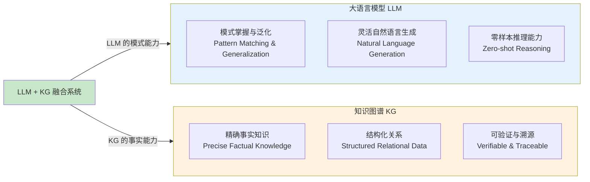
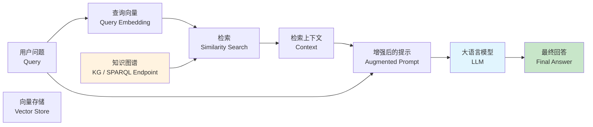
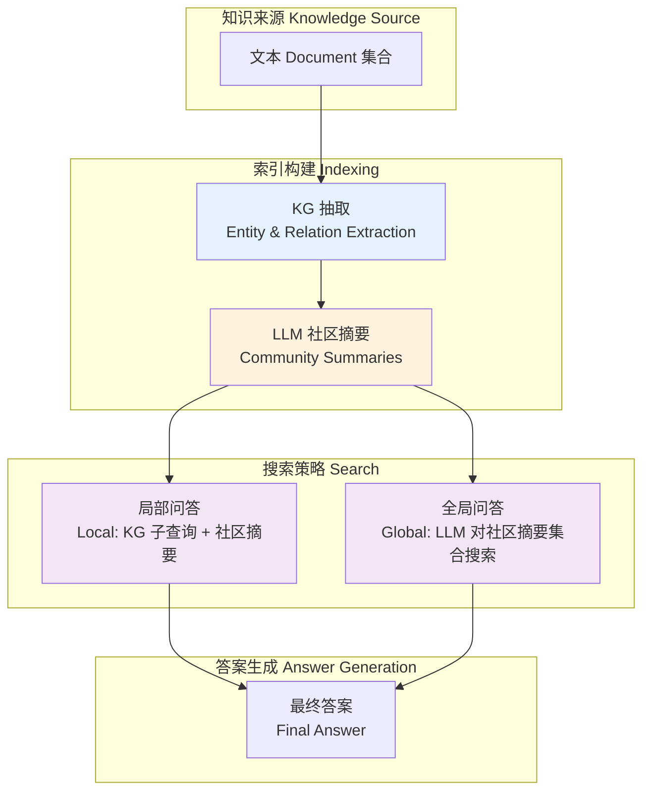
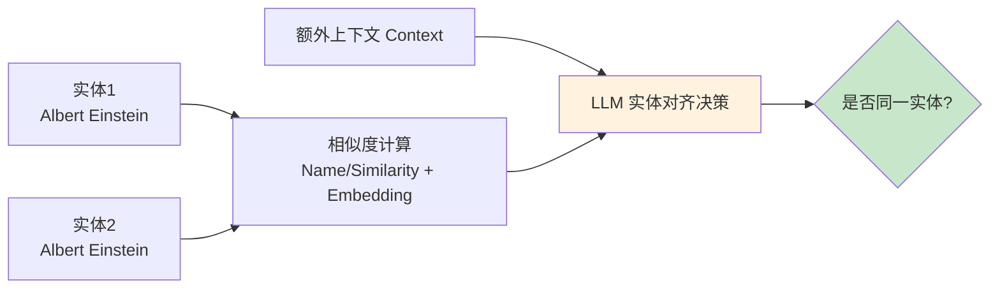
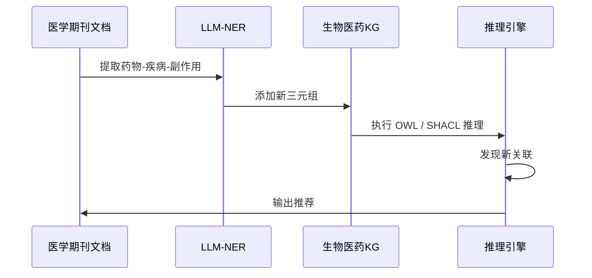

# 23.4 LLM 与大语言模型 + 知识图谱（LLMs and Knowledge Graphs）

> **本节要点**：大语言模型（Large Language Models, LLMs）的兴起为知识图谱（Knowledge Graphs, KGs）带来了新的融合机会。本章将探讨 LLMs 与 KG 的互补性、RAG（检索增强生成）、GraphRAG、KG 辅助 LLM 微调、以及 LLM 辅助构建 KG 的前沿研究和应用案例。

---

## 1. LLMs 与 KG 的结合动机

大语言模型（如 GPT-4、LLaMA、Qwen、Claude）在 2023 年后成为 AI 领域的核心力量，但也暴露出固有的局限性。KG 可以为 LLM 提供结构化的、可验证的先验知识。

### 1.1 LLMs 的局限性

| 局限性 | 描述 | 示例 |
|--------|------|------|
| **幻觉**（Hallucination） | LLM 生成看似合理但与实际不符的事实 | "埃隆·马斯克于 1969 年出生"（实际是 1971 年） |
| **知识更新**（Knowledge Out-of-date） | 预训练完成后模型知识不再更新 | 模型不知道 2024 年后发生的新闻 |
| **推理深度有限** | LLM 缺乏严格的逻辑推理和链式推理能力 | 复杂多步推理容易出错 |
| **可解释性差** | 无法展示生成内容的来源和推理链 | "模型说"但无法溯源 |
| **知识冗余与噪声** | 训练中吸收了海量噪声数据 | 生成内容包含矛盾和不准确信息 |

### 1.2 KGs 与 LLMs 的互补



**互补关系总结表**：

| 维度 | LLM（语言模型主导） | KG（图谱主导） | 融合后 |
|------|---------------------|---------------|--------|
| **知识容量** | 巨大且连续（参数化存储） | 有限且离散（符号存储） | 动态知识容量 |
| **知识更新** | 重训练成本高（微调/全量） | 低（添加新三元组） | KG 实时更新 |
| **推理能力** | 模式识别（相似性推理） | 逻辑演绎（精确推理） | 模式+逻辑 |
| **可解释性** | 低（黑箱生成） | 高（链式溯源） | RAG 可溯源 |
| **生成灵活性** | 极高（创造性） | 低（受限事实） | 灵活且有约束 |

---

## 2. RAG（Retrieval-Augmented Generation）

**检索增强生成**（Retrieval-Augmented Generation, RAG）是 LLMs 与 KG 结合的最直接方式。其核心思想：在 LLM 回答问题或生成内容之前，先从外部知识库（如 KG）中检索相关事实作为上下文。

### 2.1 标准 RAG 架构



**标准 RAG 的伪代码**：

```python
def rag_with_kg(query, llm, kg_store, vector_store, top_k=3):
    # Step 1: 检索 KG 中的相关事实和子图
    query_embedding = embed_query(query)
    context = vector_store.similarity_search(query_embedding, k=top_k)
    
    # 也可以通过 SPARQL 查询获取直接相关事实
    kg_facts = kg_store.sparql_query(
        f"""
        SELECT ?subject ?predicate ?object
        WHERE {{
            ?subject rdfs:label "{query}"@en ;
                     ?predicate ?object .
        }}
        """
    )
    
    # Step 2: 构建增强提示
    augmented_prompt = f"""
    以下是从知识图谱中检索到的事实：
    {kg_facts}
    
    问题: {query}
    请基于上述事实回答:
    """
    
    # Step 3: LLM 生成回答
    response = llm.generate(augmented_prompt)
    return response
```

---

## 3. 图谱增强生成（GraphRAG、NeuralRAG 等）

### 3.1 GraphRAG（微软 2024 年开源方案）

**GraphRAG** 是由微软研究院提出（Microsoft, 2024），它使用图数据库中的社区发现与文本摘要结合 LLM 进行全局检索增强生成。



**GraphRAG 的两个检索模式**：

| 检索模式 | 描述 | 适用场景 |
|----------|------|----------|
| **局部问答（Local Question Answering）** | 基于 KG 子图 + 实体社区摘要回答 | "马斯克是谁？"——涉及个别实体的问题 |
| **全局问答（Global Question Answering）** | 对完整 KG 中的社区结构进行 LLM 级搜索 | "Tesla 和 SpaceX 之间的关系？"——需要跨社区综合分析 |

### 3.2 NeuralRAG（神经 RAG 变体）

NeuralRAG（Jiang et al., 2023）将 RAG 与可学习模块结合，引入**重排序**（Re-ranking）、**知识图增强解码**（KG-Augmented Decoding）等组件。

```python
# NeuralRAG 伪代码
def NeuralRAG(query, corpus, kg, llm):
    # 1. 初步检索
    candidates = initial_retrieval(query, corpus)
    
    # 2. 基于 KG 增强重排序
    kg_sim = compute_kg_similarity(query, candidates, kg)
    reranked = re_rank(candidates, scores=kg_sim)
    
    # 3. KG 引导的注意力机制
    with kg_aware_attention(query, reranked_context, kg):
        response = llm.generate(query, reranked_context)
    
    return response
```

### 3.3 RAG vs GraphRAG 对比

| 维度 | RAG（标准） | GraphRAG |
|------|-------------|----------|
| 知识结构 | 文档分块 + 向量索引 | 图结构 + 社区发现 |
| 检索粒度 | 相似片段（Chunks） | 实体 / 社区（Communities） |
| 跨文档推理 | 差（局限于单块或组合后） | 好（通过图的连通性） |
| 全局洞察 | 不支持 | 支持（全局搜索） |
| 性能开销 | 较低 | 较高（社区发现计算） |

---

## 4. KG 辅助 LLM 微调（KG-Augmented LLM Fine-Tuning）

### 4.1 知识注入微调方法

除了 RAG 的推理期（Inference-time）方法外，KG 也可以通过**微调**（Fine-tuning）阶段注入 LLM 参数中。

| 方法类别 | 描述 | 代表工作 |
|----------|------|----------|
| **KG 增强的预训练**（KG-Enhanced Pretraining） | 在预训练阶段引入 KG 三元组作为额外的语言模型任务 | Knowledge GPT（KG-Pretraining）、PERT |
| **指令微调注入**（Instruction Tuning with KG） | 构造知识问答数据用于 SFT 指令微调 | KILT, DialCare |
| **LoRA/Adapter 注入** | 在 LoRA 或 Adapter 层注入 KG 嵌入 | LoRA 参数适配，低秩矩阵 |

```python
# LoRA 方式注入 KG 知识（伪代码）
from peft import LoraConfig, get_peft_model

# 加载 base model（比如 70B LLaMA 模型）
model = LlamaForCausalLM.from_pretrained("meta-llama/Llama-2-70b")

# 配置 LoRA
lora_config = LoraConfig(
    r=16,           # LoRA 秩（低秩矩阵的维度）
    lora_alpha=32,  # 缩放因子
    target_modules=["q_proj", "v_proj"],
    lora_dropout=0.1,
)

# 注入 LoRA 参数
model = get_peft_model(model, lora_config)

# 训练数据格式：从 KG 生成的问答对
# Question: "谁发明了微积分？"
# Answer: "莱布尼茨（Leibniz）与牛顿（Newton）各自独立发明", kg_fact="(leibniz, co_developer_of, calculus)"
```

### 4.2 KG 知识蒸馏到 LLM（Knowledge Distillation）

KG 中的逻辑规则和结构知识可以通过**蒸馏**方式教授给较小的语言模型：

$$L_{distill} = L_{task} + \lambda L_{KG} = L_{task} + \lambda \sum_{(h,r,t)} \max(0, \gamma - \text{scoring}(h, r, t))$$

---

## 5. LLM 辅助构建 KG（LLM-Augmented KG Construction）

除了 KG 为 LLM 服务外，LLM 也可以反过来用于辅助 KG 的构建和维护——这是一个"双循环"关系。

### 5.1 从非结构化文本到三元组（Open Information Extraction）

传统的三元组抽取依赖于信息抽取（Information Extraction, IE）系统。LLMs 可以实现**零样本的 KG 构建**：

```python
# 用 LLM 抽取三元组（提示工程示例）
def extract_kg_triplets(text, kg_ontology):
    prompt = f"""
你是一个本体构建专家。从以下文本中提取三元组，
格式为 (实体1, 关系, 实体2)，所有关系都必须是:
{kg_ontology.relations}

文本:
""" + text + """

请以 JSON 格式返回三元组列表。
"""
    
    response = llm.generate(prompt)
    triplets = parse_json_response(response)
    return triplets

# 示例调用
text = "埃隆·马斯克是 Tesla、SpaceX 和 Neuralink 的创始人，出生於南非。"
triplets = extract_kg_triplets(text, pizza_ontology)
# 输出:
# [{"head": "埃隆·马斯克", "rel": "创始人", "tail": "Tesla"},
#  {"head": "埃隆·马斯克", "rel": "创始人", "tail": "SpaceX"},
#  {"head": "埃隆·马斯克", "rel": "出生地", "tail": "南非"}]
```

### 5.2 LLM 辅助本体构建

LLMs 可以用于**本体设计**的辅助，例如建议类的命名、关系的范围（Domain/Range）、类的等价/不相交约束等。

```
用户输入：帮我构建一个医疗本体的分类层级。

LLM 生成建议：
Class: Disease
  SubClassOf: inherits_from Disease_or_Disorder
  SubClassOf: has_symptom some Symptom
  
Property: has_disease_severity
  Range: diseaseSeverity:severity_level
  Domain: ClinicalCase

Property: treats
  Domain: Medication
  Range: Disease
  InverseOf: is_treated_by
```

### 5.3 实体对齐（Entity Alignment）

实体对齐是知识图谱融合中的核心难题——如何判断两个不同数据源中的实体是否为同一对象？LLMs 可以在这里提供**语义级别的实体对齐辅助**：



---

## 6. 案例研究（Case Studies）

### 6.1 Google Socratic

Google 的 **Socratic** 系统（Nakad et al., 2021）结合了 3 亿参数的预训练模型和来自 [Freebase（约 5000 万实体）和 [知识图谱。Socratic 使用一种**注意力机制**来将 LLM 生成的答案与 KG 事实对齐，在数学、科学等知识密集型任务上显著优于纯 LLM。

### 6.2 生物医药：MedMention + KG

在生物医药领域，**MedMention**（Hripcsak & Rothschild, 2005）与知识图谱的结合作用巨大。通过结合文献提取（LLM-based NER/IE）与 KG（UniProt、DrugBank），可以实现：

- **药物-疾病知识图谱**：自动从 PubMed 论文中提取三元组（药物-治疗-疾病、药物-副作用等）
- **临床试验匹配**：结合患者知识图谱与 LLM 生成精准匹配



### 6.3 生物医学 KG + LLM

目前，生物医学领域的"KG-Enhanced LLM"正在成为科研热潮：

| 系统名称 | 数据集 | 效果 |
|----------|--------|------|
| **BioGPT** + KG | BioBERT / BioK | 生物医学文本生成的知识连贯性显著提高 |
| **DGL-KeG** | Drug-Drug Interaction (DDI) | KG 增强 LLM 预测药物间相互作用 |
| **G-Retriever** | OpenKG | 在 GNN + KG 嵌入的基础上再注入 LLM，性能大幅提升 |

---

## 7. 总结（Summary）

| 要点 | 说明 |
|------|------|
| 动机 | LLM 的幻觉、过时、不可解释 → KG 提供结构化事实；KG 容量有限、难以发现新关系 → LLM 提供推理与泛化能力 |
| RAG | 推理前检索 KG 事实作为上下文，是应用最广的融合方式 |
| GraphRAG | 微软 2024 年开源方案：基于 KG 社区结构的分级 RAG，支持全局/局部查询 |
| 微调注入 | KG 知识在预训练/指令微调阶段注入 LLM 参数 |
| LLM 辅助 KG 构建 | LLM 可帮助抽取三元组、构建本体、执行实体对齐 |
| 案例 | Google Socratic、MedMention+KG、生物医学 KG+LLM |
| 未来方向 | "双循环"融合系统：KG 增强 LLM ↔ LLM 辅助 KG 构建，形成知识创造的闭环 |