## 课程概览

本课程是一套面向零基础学习者的系统性本体工程教材，深入讲解 W3C 语义网标准体系。内容从哲学基础出发，逐步深入到实际建模，涵盖理论知识、工具操作与实践练习，帮助读者循序渐进地掌握本体工程的核心知识与实践技能。

### 📐 知识体系地图

```mermaid
graph LR
    A[模块一：理论基石<br/>哲学 · 概念 · 本体类型] --> B[模块二：RDF 数据模型<br/>三元组 · 资源 · 命名空间]
    B --> C[模块三：RDFS & SKOS<br/>分类 · 词汇 · 层次]
    C --> D[模块四：OWL 2 核心<br/>描述逻辑 · 公理 · 约束]
    D --> E[模块五：推理与验证<br/>SPARQL 查询 · SHACL · 推理]
    E --> F[模块六：工程方法<br/>生命周期 · 方法论 · 质量]
    F --> G[模块七：应用生态<br/>顶层本体 · 场景 · 工具]
    G --> H[模块八：专家进阶<br/>本体对齐 · 神经符号 AI]

    style A fill:#e3f2fd,color:#000
    style B fill:#e8f5e9,color:#000
    style C fill:#fff3e0,color:#000
    style D fill:#f3e5f5,color:#000
    style E fill:#e0f2f1,color:#000
    style F fill:#fce4ec,color:#000
    style G fill:#fff8e1,color:#000
    style H fill:#efebe9,color:#000
```

### 📊 课程统计

| 指标 | 数值 |
|------|------|
| 核心章节 | 23 章 |
| 实战附录 | 7 个 |
| 涵盖标准 | W3C RDF 1.1 / OWL 2 / SPARQL 1.1 / SHACL |
| 实践工具 | Protégé, Jena, Zazuko |

---

## 课程结构

本课程共 **8 大模块**、23 章核心内容 + 7 个实用附录。

### 🔹 模块一：理论与哲学基础

本模块奠定本体工程的思想根基，理解"什么是知识"和"如何对世界进行分类"。

| 章节 | 主题 | 内容概要 |
|:----:|------|----------|
| 第 1 章 | [什么是本体](/ch01-what-is-ontology/01-overview) | 本体定义、与数据库/术语表的差异、应用领域 |
| 第 2 章 | [哲学渊源与概念化](/ch02-philosophy-conceptualization/01-philosophical-roots) | 从亚里士多德分类到现代概念化方法 |
| 第 3 章 | [核心概念](/ch03-core-concepts/01-elements) | 类、实例、属性、公理四大基本元素 |

### 🔹 模块二：RDF 数据模型

RDF（Resource Description Framework）是语义网的数据基石。本模块系统讲解如何描述和建模知识。

| 章节 | 主题 | 内容概要 |
|:----:|------|----------|
| 第 4 章 | [RDF 数据模型](/ch04-rdf-data-model/01-rdf-introduction) | 三元组模型、图结构、W3C 标准模型 |
| 第 5 章 | [RDF 语法格式](/ch05-rdf-syntax/01-serialization-overview) | Turtle、N-Triples、JSON-LD 序列化对比与校验 |

### 🔹 模块三：RDFS 与 SKOS

在 RDF 基础上构建层次和词汇体系。

| 章节 | 主题 | 内容概要 |
|:----:|------|----------|
| 第 6 章 | [RDFS 核心概念](/ch06-rdfs-core/01-rdf-vocabulary) | 类层次 (`rdfs:subClassOf`)、属性域与范围 |
| 第 7 章 | [SKOS 词汇构造](/ch07-skos-vocabulary/01-skos-introduction) | 概念体系、标签管理、主题词表实践 |

### 🔹 模块四：OWL 2 核心

OWL 2 是最强大的语义网本体语言。本模块深入其逻辑基础和建模技巧。

| 章节 | 主题 | 内容概要 |
|:----:|------|----------|
| 第 8 章 | [OWL 2 概述](/ch08-owl2-overview/01-why-owl2) | 描述逻辑、OWL 概要、OWA 与 CWA |
| 第 9 章 | [Protégé 入门](/ch09-protoge-intro/01-protoge-introduction) | 工具安装、本体创建与基础建模实践 |
| 第 10 章 | [OWL 2 类建模](/ch10-owl2-class-modeling/01-class-expressions) | 类表达式、等价/不相交、推理 |
| 第 11 章 | [OWL 2 属性公理](/ch11-owl2-property-axioms/01-object-data-properties) | 对象属性、数据属性、传递/逆属性 |
| 第 12 章 | [OWL 2 数据约束](/ch12-owl2-data-constraints/01-cardinality-constraints) | 基数约束、值域、数据类型限制 |

### 🔹 模块五：推理与验证

学习如何使用查询语言和验证机制提取及确保知识质量。

| 章节 | 主题 | 内容概要 |
|:----:|------|----------|
| 第 13 章 | [SPARQL 查询语言](/ch13-sparql-query/01-sparql-introduction) | 基本图模式、高级查询与数据集 |
| 第 14 章 | [SHACL 约束验证](/ch14-shacl-validation/01-shacl-introduction) | 形状定义、复杂约束条件 |
| 第 15 章 | [OWL 推理与一致性](/ch15-reasoning-consistency/01-reasoning-basics) | 推理机制、一致性检查、分类器工具 |

### 🔹 模块六：本体工程方法

关注本体开发的工程化方法论和质量保障。

| 章节 | 主题 | 内容概要 |
|:----:|------|----------|
| 第 16 章 | [本体开发生命周期](/ch16-development-lifecycle/01-lifecycle-phases) | 需求→概念化→形式化→评估→维护 |
| 第 17 章 | [主流方法论](/ch17-methodologies-comparison/01-methontology) | METHONTOLOGY, NeOn, Agile 比较 |
| 第 18 章 | [本体质量评估](/ch18-quality-assessment/01-evaluation-dimensions) | 评估维度、Ontometrics、自动化工具 |

### 🔹 模块七：应用与工具生态

了解本体在实际领域中的应用实践以及工具全景。

| 章节 | 主题 | 内容概要 |
|:----:|------|----------|
| 第 19 章 | [主流本体赏析](/ch19-mainstream-ontologies/01-upper-ontologies) | BFO, CYC, SAREF, FIBO 等经典本体 |
| 第 20 章 | [典型应用场景](/ch20-application-scenarios/01-biomedicine) | 生物医学、搜索引擎、企业管理 |
| 第 21 章 | [工具生态全景](/ch21-tool-ecosystem/01-editors) | 编辑器、推理器、三元组数据库 |

### 🔹 模块八（选学）：专家进阶

深入学习本体对齐、融合及神经符号 AI 前沿话题。

| 章节 | 主题 | 内容概要 |
|:----:|------|----------|
| 第 22 章 | [本体对齐与融合](/ch22-ontology-alignment/01-concepts) | 概念映射、融合算法与案例实践 |
| 第 23 章 | [神经符号融合与 AI](/ch23-neuro-symbolic-ai/01-symbolic-Neuro-comparison) | 知识图谱嵌入、LLM 增强推理 |

---

## 附录资源

| 附录 | 内容 | 链接 |
|------|------|------|
| 附录 A | [OWL 2 属性速查表](/appendix-a-owl2-reference/) | 常用公理速查 |
| 附录 B | [Protégé 常用快捷键](/appendix-b-protoge-shortcuts/) | 提效操作汇总 |
| 附录 C | [常用本体仓库与资源](/appendix-c-repositories/) | Linked Open Vocabularies |
| 附录 D | [RDF/XML 与 Turtle 语法对照](/appendix-d-rdf-syntax-comparison/) | 序列化差异比较 |
| 附录 E | [Pizza Ontology 教程指引](/appendix-e-pizza-tutorial/) | OWL 学习经典案例 |
| 附录 F | [Protégé 教程资源索引](/appendix-f-protege-resources/) | 官方与社区学习指南 |
| 附录 G | [术语中英对照表](/appendix-g-glossary/) | 专业术语索引 |

---

## 学习与使用建议

### 🎯 推荐学习路径

| 学习者类型 | 推荐顺序 |
|:----------|----------|
| **完整系统学习** | 模块一 → 二 → 三 → 四 → 五 → 六 |
| **快速上手建模** | 模块二 → 四(Ch8~Ch12) → 配套 Protégé 实践 |
| **查询与分析** | 模块五 (SPARQL + SHACL) |
| **进阶研究** | 模块七 → 模块八（选学） |

> **模块八为进阶选学内容**，可在完成核心模块后选修。附录部分可作为日常学习的查阅手册。

### 💻 实践建议

- 学习 **OWL 2** 与 **Protégé** 相关内容时，建议配合本地操作演练。
- 在理解 **RDF** 语法后，推荐使用 [Zazuko IDE](https://ide.zazuko.com/) 在线编写和验证 Turtle / JSON-LD 数据。
- 探索 **SPARQL** 时，可直接连接 [DBpedia SPARQL Endpoint](https://dbpedia.org/sparql) 进行实战练习。

---

## 前置知识

学习本课程教材，建议具备以下基础知识：

- 计算机网络基础（理解 URL/IRI 在 Web 中的角色）
- 数据库基本概念（关系模型有助于对比理解 RDF 图模型）
- XML 基础（有助于理解 RDF/XML 格式）
- 编程基础（有助于理解本体的实际应用集成）

