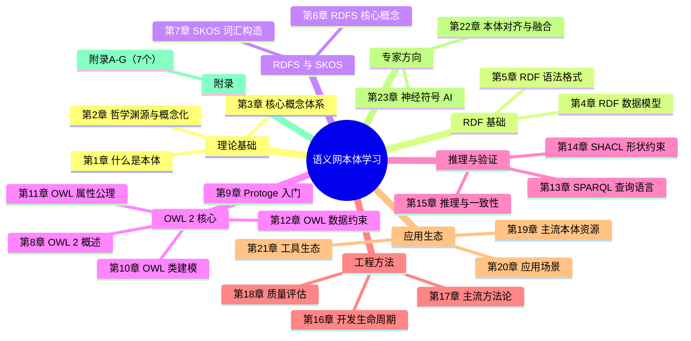

# 语义网与本体工程 — 从零学习计划（新结构版）

> **结构说明：** 本教材不再使用"模块"分组，改为按章节平铺设计。每个章节拆分为 3-5 篇独立文章，存放在 `docs/chXX-章节名称/` 文件夹下。

## 📁 新文件目录结构

```
docs/
├── index.md                                    # 首页
├── sitemap.md                                  # 站点地图
├── ch01-what-is-ontology/                      # 第1章：什么是本体
│   ├── 01-overview.md                          # 概述：从知识库到本体
│   ├── 02-definition.md                        # 核心定义与组成要素
│   ├── 03-ontology-vs.md                       # 本体 vs 数据库 vs 词汇表
│   └── 04-applications.md                      # 应用场景与案例
├── ch02-philosophy-conceptualization/          # 第2章：哲学渊源与概念化
│   ├── 01-philosophical-roots.md               # 哲学根源：从亚里士多德到语义网
│   ├── 02-conceptualization.md                 # 概念化理论与认知科学
│   └── 03-exercises.md                         # 实践练习
├── ch03-core-concepts/                         # 第3章：核心概念体系
│   ├── 01-elements.md                          # 核心组成要素详解
│   ├── 02-ontology-types.md                    # 本体类型层次（上层/领域/任务）
│   └── 03-comparison-exercise.md               # 分类法与本体的对比练习
├── ch04-rdf-data-model/                        # 第4章：RDF 数据模型
│   ├── 01-rdf-introduction.md                  # RDF 简介：What is RDF？
│   ├── 02-resources-statements.md              # 资源、谓词与三元组图
│   ├── 03-rdf11-standard.md                    # W3C RDF 1.1 标准与空白节点
│   └── 04-practice-editor.md                   # 工具实践：在线 RDF 编辑器
├── ch05-rdf-syntax/                            # 第5章：RDF 语法格式
│   ├── 01-serialization-overview.md            # 序列化格式概览
│   ├── 02-turtle-syntax.md                     # Turtle 语法详解
│   ├── 03-n-quads-jsonld.md                    # N-Quads 与 JSON-LD
│   └── 04-validation-exercise.md               # 练习与验证
├── ch06-rdfs-core/                             # 第6章：RDFS 核心
│   ├── 01-rdf-vocabulary.md                    # RDF 词汇表简介
│   ├── 02-subclass-subproperty.md              # 类层级与属性层级
│   ├── 03-domain-range.md                      # domain 与 range
│   └── 04-rdfs-limits.md                       # RDFS 的表达能力局限
├── ch07-skos-vocabulary/                       # 第7章：SKOS 词汇构造
│   ├── 01-skos-introduction.md                 # SKOS 简介与基本概念
│   ├── 02-concept-schemes.md                   # Concept Scheme 与 Concept
│   ├── 03-labels-relations.md                  # 标签体系与关系
│   └── 04-exercise-topic-thesaurus.md          # 综合练习：学科主题词表
├── ch08-owl2-overview/                         # 第8章：OWL 2 概览
│   ├── 01-why-owl2.md                          # 为什么需要 OWL：RDFS 的不足
│   ├── 02-owl2-profiles.md                     # OWL Profiles（EL/QL/RL/DL）
│   ├── 03-description-logic.md                 # 描述逻辑与 OWL 的对应
│   ├── 04-owa-cwa-tbox-abox.md                 # OWA vs CWA、TBox 与 ABox
│   └── 05-owl2-new-features.md                 # OWL 2 新特性
├── ch09-protoge-intro/                         # 第9章：Protégé 入门
│   ├── 01-protoge-introduction.md              # Protégé 简介与界面概览
│   ├── 02-installation-creation.md             # 安装与创建新本体
│   ├── 03-classes-properties.md                # 添加类与属性
│   └── 04-exercise-movie-ontology.html         # 练习：电影本体
├── ch10-owl2-class-modeling/                   # 第10章：OWL 类建模
│   ├── 01-class-expressions.md                 # 类表达式基础
│   ├── 02-equivalent-disjoint.md               # 等价类与不相交性
│   ├── 03-set-operations.md                    # 交集、并集、补集
│   ├── 04-protoge-exercise.md                  # Protégé 类表达式练习
│   └── 05-reasoning-class-person.html          # 案例：人物关系本体
├── ch11-owl2-property-axioms/                  # 第11章：OWL 属性公理
│   ├── 01-object-data-properties.md            # 对象属性与数据属性
│   ├── 02-property-features.md                 # 属性特征（传递/对称/函数性）
│   ├── 03-property-hierarchy-chain.md          # 属性层级与属性链
│   └── 04-exercise-property-axioms.md          # 练习：属性特征与链公理
├── ch12-owl2-data-constraints/                 # 第12章：OWL 数据约束
│   ├── 01-cardinality-constraints.md           # 基数约束（min/max/exact）
│   ├── 02-value-constraints.md                 # 值约束（someValuesFrom/allValuesFrom）
│   ├── 03-datatype-constraints.md              # 数据类型约束
│   └── 04-comprehensive-exercise.html          # 综合练习：完善人物本体
├── ch13-sparql-query/                          # 第13章：SPARQL 查询语言
│   ├── 01-sparql-introduction.md               # SPARQL 简介与查询类型
│   ├── 02-basic-graph-patterns.md              # 基本图模式
│   ├── 03-advanced-features.html               # 高级特性（FILTER/OPTIONAL/UNION）
│   └── 04-practice-dbpedia-sesame.md           # 练习：DBpedia 与 GraphDB
├── ch14-shacl-validation/                      # 第14章：SHACL 形状约束语言
│   ├── 01-shacl-introduction.md                # SHACL 简介与核心概念
│   ├── 02-shape-definition.html                # 形状、节点与约束定义
│   ├── 03-complex-rules.md                     # 复杂验证规则
│   └── 04-protoge-jena-exercise.md             # 练习：SHACL 验证
├── ch15-reasoning-consistency/                 # 第15章：推理与一致性检查
│   ├── 01-reasoning-basics.md                  # 本体推理基础
│   ├── 02-reasoner-tools.html                  # 推理器工具（HermiT/Pellet/ELK）
│   ├── 03-inference-tasks.html                 # 主要推理任务
│   └── 04-protoge-reasoner-exercise.html       # 练习：Protégé 推理器
├── ch16-development-lifecycle/                 # 第16章：本体开发生命周期
│   ├── 01-lifecycle-phases.md                  # 开发生命周期阶段分解
│   ├── 02-tools-deliverables.html              # 工具链与典型产出物
│   └── 03-practice-bookstore-ontology.html     # 练习：书店本体需求分析
├── ch17-methodologies-comparison/              # 第17章：主流方法论
│   ├── 01-methontology.md                      # METHONTOLOGY 方法论
│   ├── 02-neon-methodology.html                # NeOn 方法论
│   ├── 03-agile-ontology-modeling.html         # 敏捷本体工程
│   └── 04-comparison-table.html                # 综合对比
├── ch18-quality-assessment/                    # 第18章：质量评估标准
│   ├── 01-evaluation-dimensions.html           # 评估维度矩阵
│   ├── 02-automation-tools.html                # 自动化评估工具
│   └── 03-practice-ontometrics.html            # 练习：OntoMetrics 分析
├── ch19-mainstream-ontologies/                 # 第19章：主流本体资源
│   ├── 01-upper-ontologies.md                  # 顶层本体（BFO/DOLCE/SUMO）
│   ├── 02-mid-level-ontologies.html            # 中层面本体（CCO/IOF/COB）
│   └── 03-domain-ontologies.html               # 领域本体（SNOMED/FIBO/Schema.org）
├── ch20-application-scenarios/                 # 第20章：应用场景
│   ├── 01-biomedicine.html                     # 生物医学领域应用
│   ├── 02-search-qa.html                       # 智能搜索与问答
│   ├── 03-enterprise-management.html           # 企业知识管理
│   └── 04-kg-vs-ontology.html                  # 本体与知识图谱的关系
├── ch21-tool-ecosystem/                        # 第21章：工具生态全景
│   ├── 01-editors.html                         # 本体编辑器（Protégé/WebProtégé/TopBraid）
│   ├── 02-reasoners.html                       # 推理引擎（HermiT/Pellet/ELK）
│   ├── 03-triplestores.html                    # 三元组数据库（GraphDB/Jena/Virtuoso）
│   └── 04-research-platforms.html              # 学术资源平台（OBO/BioPortal/LOV）
├── ch22-ontology-alignment/                    # 第22章：本体对齐与融合
│   ├── 01-concepts.md                          # 本体对齐与融合的概念
│   ├── 02-alignment-methods.html               # 技术方法（Embedding/启发式/学习）
│   └── 03-tools-cases.html                     # 工具与案例
├── ch23-neuro-symbolic-ai/                     # 第23章：神经符号 AI
│   ├── 01-symbolic-Neuro-comparison.html       # 符号推理与神经学习对比
│   ├── 02-kg-embeddings.html                   # 知识图谱嵌入（TransE/RotatE/CompGCN）
│   ├── 03-neurosymbolic-integration.html       # 神经符号集成架构
│   └── 04-llm-kg.html                          # LLM + 知识图谱
├── appendix-a-owl2-reference/                  # 附录 A：OWL 2 属性速查表
│   └── index.md
├── appendix-b-protege-shortcuts/               # 附录 B：Protégé 快捷键
│   └── index.md
├── appendix-c-repositories/                    # 附录 C：本体仓库与资源
│   └── index.md
├── appendix-d-rdf-syntax-comparison/           # 附录 D：RDF 语法对照
│   └── index.md
├── appendix-e-pizza-tutorial/                  # 附录 E：Pizza 教程指引
│   └── index.md
├── appendix-f-protege-resources/               # 附录 F：Protégé 教程资源
│   └── index.md
└── appendix-g-glossary/                        # 附录 G：术语中英对照表
    └── index.md
```

---

## 📚 核心参考资料（保持不变）

| 参考资料 | 说明 | 应用位置 |
|----------|------|----------|
| **[A. Gómez-Pérez《Ontology Engineering》](https://www.sciencedirect.com/book/9780128023070/ontology-engineering)** | 系统工程方法权威，涵盖本体生命周期管理、发现、评估与复用 | 第16-18章 |
| **Stanford CS520: Knowledge Graphs** | 知识图谱前沿课程，涵盖表示学习、关系抽取、图谱推理 | 第22-23章 |
| **[W3C Semantic Web Standards](https://www.w3.org/standards/semanticweb/)** | RDF 1.1、RDFS、OWL 2、SPARQL、SHACL 官方规范 | 全教材 |
| **[awesome-ontologies](https://github.com/NCOR-Organization/awesome-ontologies)** | 本体资源聚合列表（OBO Foundry、BioPortal等） | 第19-20章 |
| **Stanford Protégé Wiki** | Protégé 教程与OWL API文档 | 第9-12章 |
| **W3C Pizza Ontology Tutorial** | 经典本体教学案例：披萨本体 | 第10、16章、附录E |

---

## 学习路径图



---

## 详细章节目录（新结构版）

### 第1章 什么是本体？（4 篇）

#### 第1篇 `01-overview.md` — 概述：从知识库到本体
- 从知识库到本体：为什么我们需要本体
- 本体的核心组成预览：类、属性、实例、公理
- 本体的应用场景一览

#### 第2篇 `02-definition.md` — 核心定义与组成
- Gruber 的本体定义解析
- 本体的学术定义与实际意义
- 核心定义：类、属性、实例、关系、公理、规则

#### 第3篇 `03-ontology-vs.md` — 本体 vs 其他表示
- 本体 vs 数据库 vs 词汇表 vs 分类法
- 为什么形式化是本体的本质特征

#### 第4篇 `04-applications.md` — 应用场景与案例
- 真实领域案例分析（医疗/SNOMED CT）
- 知识图谱中的本体角色

---

### 第2章 哲学渊源与概念化理论（3 篇）

#### 第1篇 `01-philosophical-roots.md` — 哲学根源
- 本体论（哲学）：研究"存在"的本质
- 实体、属性、关系的形而上学问题
- 从亚里士多德分类到现代语义网

#### 第2篇 `02-conceptualization.md` — 概念化理论
- 概念化（Conceptualization）：对现实世界的抽象简化
- 人类认知如何构建树状分类体系
- 概念组合与语义网络

#### 第3篇 `03-exercises.md` — 实践练习
- 绘制领域概念的思维导图
- 将自然语言描述转化为结构化概念表

---

### 第3章 核心概念体系（3 篇）

#### 第1篇 `01-elements.md` — 核心组成要素
| 要素 | 英文 | 说明 | 示例 |
|------|------|------|------|
| **类/概念** | Class/Concept | 抽象类别 | Person, Disease |
| **实例** | Individual | 具体对象 | 爱因斯坦, 新冠 |
| **属性** | Property | 特征描述 | hasAge, hasSymptom |
| **关系** | Relation | 语义关联 | isA, partOf, causes |

#### 第2篇 `02-ontology-types.md` — 本体类型层次
- 上层本体（Upper Ontology）：BFO、DOLCE、SUMO
- 领域本体（Domain Ontology）：Gene Ontology、SNOMED CT
- 任务本体（Task Ontology）：诊断流程、工作流建模

#### 第3篇 `03-comparison-exercise.md` — 分类法 vs 本体练习
- 用 RDFS 分别建模"学科分类表"与"学科关系本体"
- 分类法与本体对比分析

---

### 第4章 RDF 数据模型（4 篇）

#### 第1篇 `01-rdf-introduction.md` — RDF 简介
- What is RDF？
- RDF 的发展历程与 W3C 标准化

#### 第2篇 `02-resources-statements.md` — 资源与三元组图
- 资源（Resource）与谓词（Predicate）
- 三元组（Triple）与 RDF 图概念

#### 第3篇 `03-rdf11-standard.md` — W3C 标准详解
- RDF 1.1 标准规范解读
- 空白节点（Blank Node）的用法
- RDF 容差与重新命名（Renaming）

#### 第4篇 `04-practice-editor.md` — 工具实践
- 使用在线 RDF 编辑器创建三元组
- 可视化 RDF 图工具推荐

---

### 第5章 RDF 语法格式（4 篇）

#### 第1篇 `01-serialization-overview.md` — 序列化格式概览
- XML、N-Triples、Turtle、JSON-LD 概览
- 为什么 Turtle 成为了事实标准
- PREFIX 与命名空间概念

#### 第2篇 `02-turtle-syntax.md` — Turtle 语法详解
- Turtle 语法规则详解
- Turtle 最佳实践

#### 第3篇 `03-n-quads-jsonld.md` — N-Quads 与 JSON-LD
- N-Quads 与四元组（RDF 数据集）
- JSON-LD 的结构与用途

#### 第4篇 `04-validation-exercise.md` — 练习与验证
- 用三种格式书写同一知识
- 使用 RDF Validator 验证文档

---

### 第6章 RDFS 核心（4 篇）

#### 第1篇 `01-rdf-vocabulary.md` — RDF 词汇表简介
- RDF 词汇表概念
- rdfs:class 与 rdfs:Instance

#### 第2篇 `02-subclass-subproperty.md` — 层级关系
- rdfs:subClassOf 与 rdfs:subPropertyOf
- 层级继承原理

#### 第3篇 `03-domain-range.md` — 定义域与值域
- rdfs:domain 与 rdfs:range
- 实际应用与约束

#### 第4篇 `04-rdfs-limits.md` — RDFS 局限性
- RDFS 的表达能力局限
- RDFS 能做什么：推理规则

---

### 第7章 SKOS 词汇构造（4 篇）

#### 第1篇 `01-skos-introduction.md` — SKOS 简介
- SKOS（Simple Knowledge Organization System）简介
- 设计目标与适用场景

#### 第2篇 `02-concept-schemes.md` — 概念与体系
- Concept Schema、Concept Scheme、Concept
- 基本概念建模

#### 第3篇 `03-labels-relations.md` — 标签与关系
- prefLabel、altLabel、hiddenLabel
- related、broader、narrower

#### 第4篇 `04-exercise-topic-thesaurus.md` — 学科词表练习
- 创建 SKOS 主题词表
- 构建学科分类体系

---

### 第8章 OWL 2 概览（5 篇）

#### 第1篇 `01-why-owl2.md` — 为什么需要 OWL
- RDF/RDFS 的不足
- OWL 带来的表达能力提升

#### 第2篇 `02-owl2-profiles.md` — OWL Profiles
- OWL EL、OWL QL、OWL RL、OWL DL
- Profiles 选择：表达能力 vs 计算效率

#### 第3篇 `03-description-logic.md` — 描述逻辑
- 描述逻辑（Description Logic）概念
- 与 OWL 的对应关系

#### 第4篇 `04-owa-cwa-tbox-abox.md` — 假设与分箱
- 开世界假设（OWA）vs 闭世界假设（CWA）
- TBox（术语盒）与 ABox（断言盒）分离

#### 第5篇 `05-owl2-new-features.md` — OWL 2 新特性
- OWL 2 相较于 OWL 1 的新特性
- 性能改进与扩展

---

### 第9章 Protégé 入门（4 篇）

#### 第1篇 `01-protoge-introduction.md` — Protégé 简介
- Protégé 背景：斯坦福大学和 SLIPCYRE 开发
- 图形界面概览

#### 第2篇 `02-installation-creation.md` — 安装与创建
- 下载安装 Protégé（含 JRE 要求）
- 创建新本体：URI 设置与语言选择

#### 第3篇 `03-classes-properties.md` — 类与属性操作
- 添加类、对象属性、数据属性
- 设置类层次结构与属性特征

#### 第4篇 `04-exercise-movie-ontology.md` — 电影本体练习
- 创建包含类（电影、演员、导演）的完整本体
- 添加类层次和属性约束

---

### 第10章 OWL 类建模（5 篇）

#### 第1篇 `01-class-expressions.md` — 类表达式基础
- Class Expression 概念
- 复合类构建

#### 第2篇 `02-equivalent-disjoint.md` — 等价与不相交
- owl:equivalentClass（等价类）
- owl:disjointWith（不相交性）

#### 第3篇 `03-set-operations.md` — 集合操作
- owl:intersectionOf、owl:unionOf、owl:complementOf
- 实际应用示例

#### 第4篇 `04-protoge-exercise.md` — Protégé 练习
- 在 Protégé 中使用类表达式
- 定义不相交的类集合

#### 第5篇 `05-reasoning-class-person.md` — 人物关系案例
- 综合案例：构建"人物关系"本体
- 包含类层次与不相交断言

---

### 第11章 OWL 属性公理（4 篇）

#### 第1篇 `01-object-data-properties.md` — 对象属性与数据属性
- 对象属性（Object Property）概念
- 数据属性（Data Property）概念

#### 第2篇 `02-property-features.md` — 属性特征
- Transitive、Symmetric、Inverse、Functional、InverseFunctional
- 属性特征的推理含义

#### 第3篇 `03-property-hierarchy-chain.md` — 属性层级与链
- owl:subPropertyOf
- owl:propertyChainAxiom（属性链）

#### 第4篇 `04-exercise-property-axioms.md` — 属性公理练习
- 在 Protégé 中设置属性特征
- 创建属性链公理

---

### 第12章 OWL 数据约束（4 篇）

#### 第1篇 `01-cardinality-constraints.md` — 基数约束
- owl:minCardinality、owl:maxCardinality、owl:exactCardinality
- 基数约束的推理含义

#### 第2篇 `02-value-constraints.md` — 值约束
- owl:hasValue、owl:someValuesFrom、owl:allValuesFrom
- owl:hasSelf

#### 第3篇 `03-datatype-constraints.md` — 数据类型约束
- 正则表达式限制
- 范围限制

#### 第4篇 `04-comprehensive-exercise.md` — 综合练习
- 完善"人物关系"本体
- 添加所有约束并验证一致性

---

### 第13章 SPARQL 查询语言（4 篇）

#### 第1篇 `01-sparql-introduction.md` — SPARQL 简介
- 为什么需要图查询语言
- SELECT、CONSTRUCT、DESCRIBE、ASK 四种查询类型

#### 第2篇 `02-basic-graph-patterns.md` — 基本图模式
- Basic Graph Pattern 概念
- 模式匹配基础

#### 第3篇 `03-advanced-features.md` — 高级特性
- FILTER、OPTIONAL、UNION、VALUES
- 聚合函数：COUNT、SUM、AVG
- SPARQL Update

#### 第4篇 `04-practice-dbpedia-sesame.md` — 工具实践
- 使用 DBpedia SPARQL 端点
- 本地三元组数据库查询

---

### 第14章 SHACL 形状约束语言（4 篇）

#### 第1篇 `01-shacl-introduction.md` — SHACL 简介
- 验证 RDF 图是否符合预期结构
- SHACL 的历史演变

#### 第2篇 `02-shape-definition.md` — 形状定义
- Shapes、Nodes、Clauses 三要素
- sh:node、sh:property、sh:qualifiedCardinality

#### 第3篇 `03-complex-rules.md` — 复杂规则
- sh:pattern、sh:and、sh:or
- 错误报告与消息定制

#### 第4篇 `04-protoge-jena-exercise.md` — 工具实践
- 为电影本体编写 SHACL 验证形状
- 使用 Apache Jena 运行验证

---

### 第15章 推理与一致性检查（4 篇）

#### 第1篇 `01-reasoning-basics.md` — 推理基础
- 什么是本体推理
- 为什么 OWL 本体需要 Reasoner

#### 第2篇 `02-reasoner-tools.md` — 推理器工具
- HermiT、Pellet、ELK 推理器对比
- 推理器安装与配置

#### 第3篇 `03-inference-tasks.md` — 推理任务
- Satisfiability、Consistency、Classification、Instantiation
- 推理任务详解

#### 第4篇 `04-protoge-reasoner-exercise.md` — Protégé 推理练习
- 安装和配置 Reasoner 插件
- 运行推理检查本体一致性
- 检测并修复逻辑矛盾

---

### 第16章 本体开发生命周期（3 篇）

#### 第1篇 `01-lifecycle-phases.md` — 生命周期阶段
- 需求分析、领域调研、概念建模
- 形式化编码、评估验证、发布维护

#### 第2篇 `02-tools-deliverables.md` — 工具与产出
- 各阶段的典型产出物
- 工具链推荐（Protégé、HermiT、Jena）

#### 第3篇 `03-practice-bookstore-ontology.md` — 书店本体案例
- 为"在线书店"场景撰写本体需求文档
- 迷你本体开发实践

---

### 第17章 主流方法论（4 篇）

#### 第1篇 `01-methontology.md` — METHONTOLOGY
- METHONTOLOGY 全生命周期
- 适用于大型本体工程的系统化流程

#### 第2篇 `02-neon-methodology.md` — NeOn 方法论
- NeOn 核心：复用现有本体和网络协作
- Buildings Blocks 网络检索

#### 第3篇 `03-agile-ontology-modeling.md` — 敏捷本体
- 敏捷迭代开发流程
- 快速原型、Sprint 冲刺

#### 第4篇 `04-comparison-table.md` — 方法论对比
| 方法论 | 核心优势 | 局限性 | 适用规模 |
|--------|---------|--------|---------|
| METHONTOLOGY | 全面、规范 | 流程沉重 | 大型/超大型 |
| NeOn | 高效复用 | 依赖网络资源质量 | 中型 |
| Agile | 灵活、快速 | 缺乏严格规范 | 小型/探索性 |

---

### 第18章 质量评估标准（3 篇）

#### 第1篇 `01-evaluation-dimensions.md` — 评估维度
| 维度 | 检查项 | 验证方式 |
|------|-------|---------|
| 语法正确性 | 符合 W3C 规范 | Protégé 验证器 |
| 逻辑一致性 | 无矛盾公理 | HermiT 一致性检查 |
| 领域覆盖度 | 关键概念完整 | 专家审查 |
| 可复用性 | 模块化设计 | 人工审计 |
| 可维护性 | 版本控制清晰 | Git |

#### 第2篇 `02-automation-tools.md` — 自动化工具
- OntoMetrics：结构指标计算
- OntoBench：推理性能基准测试
- OEO（Ontology Evaluation Ontology）

#### 第3篇 `03-practice-ontometrics.md` — 质量评估练习
- 对 Pizza Ontology 运行 OntoMetrics
- 撰写质量评估报告

---

### 第19章 主流本体资源（3 篇）

#### 第1篇 `01-upper-ontologies.md` — 顶层本体
- BFO（Basic Formal Ontology）
- DOLCE、SUMO

#### 第2篇 `02-mid-level-ontologies.md` — 中层面本体
- CCO（Common Core Ontologies）
- IOF、COB

#### 第3篇 `03-domain-ontologies.md` — 领域本体
- SNOMED CT、ICD-11、FIBO
- ENVO、FOAF、Schema.org

---

### 第20章 应用场景（4 篇）

#### 第1篇 `01-biomedicine.md` — 生物医学
- 疾病分类与基因功能（Gene Ontology）
- 临床试验数据标准化

#### 第2篇 `02-search-qa.md` — 智能搜索
- 语义理解：超越关键词匹配
- 知识卡片与问答系统

#### 第3篇 `03-enterprise-management.md` — 企业知识管理
- 数据集成：异构系统语义对齐
- 智能客服与合规审计

#### 第4篇 `04-kg-vs-ontology.md` — KG 与本体关系
- "知识图谱是图结构的知识库，本体是其语义骨架"
- 知识图谱 = 本体 + 数据 + 推理

---

### 第21章 工具生态全景（4 篇）

#### 第1篇 `01-editors.md` — 本体编辑器
| 工具 | 类型 | 特点 |
|------|------|------|
| Protégé | 桌面 | 开源、插件丰富 |
| WebProtégé | 网页 | 协作编辑 |
| TopBraid Composer | 商业 | 企业级 |

#### 第2篇 `02-reasoners.md` — 推理引擎
- HermiT、Pellet、ELK
- Apache Jena 推理器

#### 第3篇 `03-triplestores.md` — 三元组数据库
| 工具 | 开源 | 特点 |
|------|------|------|
| GraphDB | 开源+商业 | 推理型 |
| Apache Jena | 是 | 框架 |
| Virtuoso | 是 | 高性能 |
| Blazegraph | 是 | 亚毫秒级 |

#### 第4篇 `04-research-platforms.md` — 学术平台
- OBO Foundry、BioPortal、LOV、Schema.org

---

### 第22章 本体对齐与融合（3 篇）

#### 第1篇 `01-concepts.md` — 概念
- 本体对齐与融合的概念
- 大规模知识图谱工程挑战

#### 第2篇 `02-alignment-methods.md` — 对齐方法
- 基于嵌入的对齐（TransE、RotatE）
- 基于字符串/结构的启发式对齐

#### 第3篇 `03-tools-cases.md` — 工具与案例
- CatMax、Snorset-Fever 工具
- 跨语言多模态 KG 对齐案例

---

### 第23章 神经符号 AI（4 篇）

#### 第1篇 `01-symbolic-Neuro-comparison.md` — 符号 vs 神经
- 符号推理 vs 神经学习的对比
- 互补优势分析

#### 第2篇 `02-kg-embeddings.md` — 知识图谱嵌入
- TransE、RotatE、CompGCN
- 链接预测的训练与评估

#### 第3篇 `03-neurosymbolic-integration.md` — 集成架构
- Nite、DeepProbLog、NeuroLang
- 结合 OWL 逻辑与神经网络

#### 第4篇 `04-llm-kg.md` — LLM + KG
- 知识增强的语言模型
- 基于本体与 GNN 的药物发现案例

---

## 附录（7 个，各为独立页面）

| 附录 | 内容 | 文件路径 |
|------|------|---------|
| A | OWL 2 属性速查表 | `docs/appendix-a-owl2-reference/index.md` |
| B | Protégé 常用快捷键 | `docs/appendix-b-protege-shortcuts/index.md` |
| C | 常用本体仓库与资源 | `docs/appendix-c-repositories/index.md` |
| D | RDF/XML 与 Turtle 语法对照 | `docs/appendix-d-rdf-syntax-comparison/index.md` |
| E | Pizza Ontology 教程指引 | `docs/appendix-e-pizza-tutorial/index.md` |
| F | Protégé 教程资源索引 | `docs/appendix-f-protege-resources/index.md` |
| G | 术语中英对照表 | `docs/appendix-g-glossary/index.md` |

---

## 📊 学习时间规划（保持不变）

每章约 **8-12 小时** 学习时间估算（含阅读、练习、综合项目），完整学习需 **160-240 小时**。

### 推荐学习节奏

| 阶段 | 章节范围 | 预计学时 | 建议周期 |
|------|---------|----------|---------|
| 🟢 **入门阶段** | 第1-3章 | 25 | 2-3周 |
| 🔵 **基础阶段** | 第4-7章 | 30 | 3-4周 |
| 🟡 **核心阶段** | 第8-12章 | 55 | 5-7周 |
| 🟠 **进阶阶段** | 第13-15章 | 30 | 3-4周 |
| 🟣 **工程阶段** | 第16-18章 | 25 | 2-3周 |
| 🔴 **应用阶段** | 第19-21章 | 25 | 2-3周 |
| ⚫ **专家阶段**（选学） | 第22-23章 | 20 | 2周 |

---

## 💡 核心认知要点（全书贯穿）

1. **本体 ≠ 分类法**：本体包含逻辑约束和推理能力，不只是层次分类
2. **形式化是关键**：只有用逻辑语言明确定义，才能实现机器可理解
3. **复用优于重建**：优先采用上层本体和领域标准，避免"本体孤岛"
4. **工程与理论并重**：好的本体需要领域知识 + 逻辑素养 + 工程实践
5. **持续演进**：本体是"活的"，需随领域发展迭代更新
6. **推理 > 存储**：知识的价值不仅在于"存在"，更在于可被"发现"
